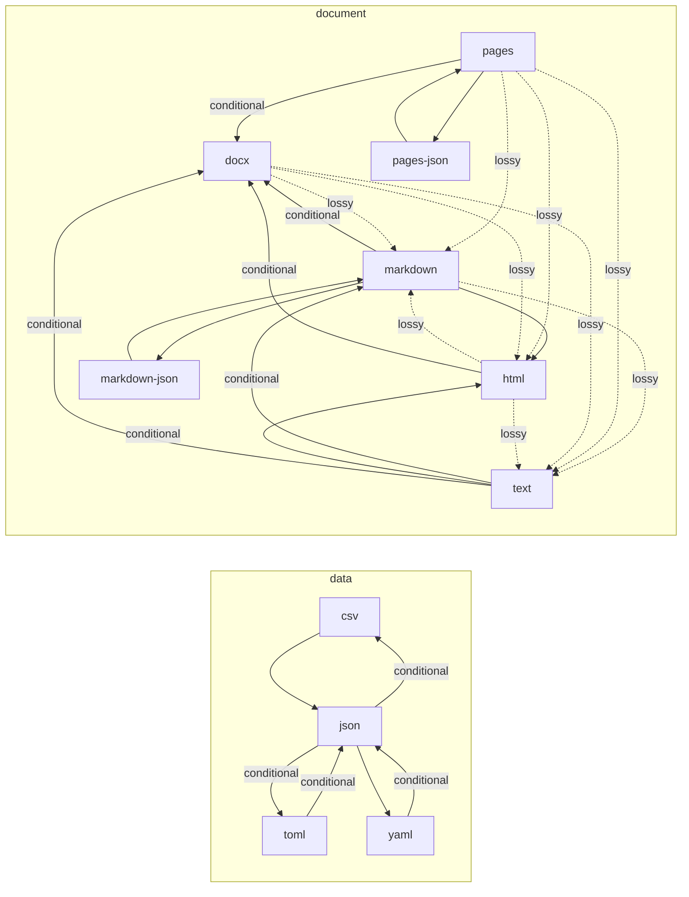

# Formats and Conversion Paths

Generated by `sublime paths --markdown`. Do not edit by hand. CI fails if this file is stale.

## Formats

| Category | Id | Name | Extensions | Produced by | Consumed by |
|---|---|---|---|---|---|
| data | csv | Comma-Separated Values | csv | json-to-csv | csv-to-json |
| data | json | JSON | json | csv-to-json, toml-to-json, yaml-to-json | json-to-csv, json-to-toml, json-to-yaml |
| data | toml | TOML | toml | json-to-toml | toml-to-json |
| data | yaml | YAML | yaml, yml | json-to-yaml | yaml-to-json |
| document | docx | Word document | docx | pages-to-docx, markdown-to-docx, html-to-docx, text-to-docx | docx-to-markdown, docx-to-html, docx-to-text |
| document | html | HTML | html, htm | markdown-to-html, pages-to-html, docx-to-html, text-to-html | html-to-markdown, html-to-text, html-to-docx |
| document | markdown | Markdown | md, markdown | markdown-json-to-markdown, pages-to-markdown, docx-to-markdown, html-to-markdown, text-to-markdown | markdown-to-html, markdown-to-text, markdown-to-json, markdown-to-docx |
| document | markdown-json | Markdown events as JSON |  | markdown-to-json | markdown-json-to-markdown |
| document | pages | Apple Pages | pages | json-to-pages | pages-to-json, pages-to-docx, pages-to-markdown, pages-to-html, pages-to-text |
| document | pages-json | Apple Pages package as JSON |  | pages-to-json | json-to-pages |
| document | text | Plain text | txt | markdown-to-text, pages-to-text, docx-to-text, html-to-text | text-to-markdown, text-to-html, text-to-docx |

## Converters

| Name | From | To | Tier | Fidelity | Notes |
|---|---|---|---|---|---|
| csv-to-json | csv | json | native | lossless |  |
| json-to-csv | json | csv | native | conditional | nested values are written as JSON text, non-string scalars are written as their JSON text, null becomes an empty cell, and objects with differing key sets get empty cells for missing keys |
| markdown-to-html | markdown | html | native | lossless |  |
| markdown-to-text | markdown | text | native | lossy | markup, raw HTML, and image sources are dropped |
| markdown-to-json | markdown | markdown-json | native | lossless |  |
| markdown-json-to-markdown | markdown-json | markdown | native | lossless |  |
| pages-to-json | pages | pages-json | native | lossless |  |
| json-to-pages | pages-json | pages | native | lossless |  |
| pages-to-docx | pages | docx | native | conditional | lossless for text, styles, lists, links, footnotes, and tables; shapes and charts are dropped |
| pages-to-markdown | pages | markdown | native | lossy | page layout, headers and footers, fonts, sizes, and colors are dropped; text boxes follow the body |
| pages-to-html | pages | html | native | lossy | page layout, headers and footers, fonts, sizes, and colors are dropped; text boxes follow the body |
| pages-to-text | pages | text | native | lossy | formatting, images, page layout, headers and footers are dropped; text boxes follow the body |
| docx-to-markdown | docx | markdown | native | lossy | page layout, headers and footers, fonts, sizes, and colors are dropped; text boxes follow the body |
| docx-to-html | docx | html | native | lossy | page layout, headers and footers, fonts, sizes, and colors are dropped; text boxes follow the body |
| docx-to-text | docx | text | native | lossy | formatting, images, page layout, headers and footers are dropped; text boxes follow the body |
| markdown-to-docx | markdown | docx | native | conditional | lossless for headings, paragraphs, lists, quotes, code, tables, links, footnotes, and images given as data URIs; raw HTML is dropped, other images become links, and loose lists come out tight |
| html-to-markdown | html | markdown | native | lossy | scripts, styles, forms, and layout are dropped; elements without a Markdown form keep their text |
| html-to-text | html | text | native | lossy | markup, scripts, styles, and image sources are dropped |
| html-to-docx | html | docx | native | conditional | lossless for headings, paragraphs, lists, quotes, code, tables, links, footnotes, and images given as data URIs; scripts, styles, forms, and layout are dropped, and other images become links |
| text-to-markdown | text | markdown | native | conditional | paragraphs are runs of lines separated by blank lines; text that looks like Markdown is escaped so it reads as written |
| text-to-html | text | html | native | conditional | paragraphs are runs of lines separated by blank lines; the text itself is kept exactly |
| text-to-docx | text | docx | native | conditional | paragraphs are runs of lines separated by blank lines; line breaks inside a paragraph become spaces |
| toml-to-json | toml | json | native | conditional | dates, times, infinities, and NaN become strings |
| json-to-toml | json | toml | native | conditional | the root must be an object; nulls are dropped; integers beyond 64 bits become floats |
| yaml-to-json | yaml | json | native | conditional | anchors are expanded, tags outside the core schema are dropped, keys become strings, infinities and NaN become strings, a multi-document stream becomes an array |
| json-to-yaml | json | yaml | native | lossless |  |

## Paths

| From | To | Fidelity | Path | Notes |
|---|---|---|---|---|
| csv | json | lossless | csv-to-json |  |
| csv | toml | conditional | csv-to-json -> json-to-toml | the root must be an object; nulls are dropped; integers beyond 64 bits become floats |
| csv | yaml | lossless | csv-to-json -> json-to-yaml |  |
| docx | html | lossy | docx-to-html | page layout, headers and footers, fonts, sizes, and colors are dropped; text boxes follow the body |
| docx | markdown | lossy | docx-to-markdown | page layout, headers and footers, fonts, sizes, and colors are dropped; text boxes follow the body |
| docx | markdown-json | lossy | docx-to-markdown -> markdown-to-json | page layout, headers and footers, fonts, sizes, and colors are dropped; text boxes follow the body |
| docx | text | lossy | docx-to-text | formatting, images, page layout, headers and footers are dropped; text boxes follow the body |
| html | docx | conditional | html-to-docx | lossless for headings, paragraphs, lists, quotes, code, tables, links, footnotes, and images given as data URIs; scripts, styles, forms, and layout are dropped, and other images become links |
| html | markdown | lossy | html-to-markdown | scripts, styles, forms, and layout are dropped; elements without a Markdown form keep their text |
| html | markdown-json | lossy | html-to-markdown -> markdown-to-json | scripts, styles, forms, and layout are dropped; elements without a Markdown form keep their text |
| html | text | lossy | html-to-text | markup, scripts, styles, and image sources are dropped |
| json | csv | conditional | json-to-csv | nested values are written as JSON text, non-string scalars are written as their JSON text, null becomes an empty cell, and objects with differing key sets get empty cells for missing keys |
| json | toml | conditional | json-to-toml | the root must be an object; nulls are dropped; integers beyond 64 bits become floats |
| json | yaml | lossless | json-to-yaml |  |
| markdown | docx | conditional | markdown-to-docx | lossless for headings, paragraphs, lists, quotes, code, tables, links, footnotes, and images given as data URIs; raw HTML is dropped, other images become links, and loose lists come out tight |
| markdown | html | lossless | markdown-to-html |  |
| markdown | markdown-json | lossless | markdown-to-json |  |
| markdown | text | lossy | markdown-to-text | markup, raw HTML, and image sources are dropped |
| markdown-json | docx | conditional | markdown-json-to-markdown -> markdown-to-docx | lossless for headings, paragraphs, lists, quotes, code, tables, links, footnotes, and images given as data URIs; raw HTML is dropped, other images become links, and loose lists come out tight |
| markdown-json | html | lossless | markdown-json-to-markdown -> markdown-to-html |  |
| markdown-json | markdown | lossless | markdown-json-to-markdown |  |
| markdown-json | text | lossy | markdown-json-to-markdown -> markdown-to-text | markup, raw HTML, and image sources are dropped |
| pages | docx | conditional | pages-to-docx | lossless for text, styles, lists, links, footnotes, and tables; shapes and charts are dropped |
| pages | html | lossy | pages-to-html | page layout, headers and footers, fonts, sizes, and colors are dropped; text boxes follow the body |
| pages | markdown | lossy | pages-to-markdown | page layout, headers and footers, fonts, sizes, and colors are dropped; text boxes follow the body |
| pages | markdown-json | lossy | pages-to-markdown -> markdown-to-json | page layout, headers and footers, fonts, sizes, and colors are dropped; text boxes follow the body |
| pages | pages-json | lossless | pages-to-json |  |
| pages | text | lossy | pages-to-text | formatting, images, page layout, headers and footers are dropped; text boxes follow the body |
| pages-json | docx | conditional | json-to-pages -> pages-to-docx | lossless for text, styles, lists, links, footnotes, and tables; shapes and charts are dropped |
| pages-json | html | lossy | json-to-pages -> pages-to-html | page layout, headers and footers, fonts, sizes, and colors are dropped; text boxes follow the body |
| pages-json | markdown | lossy | json-to-pages -> pages-to-markdown | page layout, headers and footers, fonts, sizes, and colors are dropped; text boxes follow the body |
| pages-json | markdown-json | lossy | json-to-pages -> pages-to-markdown -> markdown-to-json | page layout, headers and footers, fonts, sizes, and colors are dropped; text boxes follow the body |
| pages-json | pages | lossless | json-to-pages |  |
| pages-json | text | lossy | json-to-pages -> pages-to-text | formatting, images, page layout, headers and footers are dropped; text boxes follow the body |
| text | docx | conditional | text-to-docx | paragraphs are runs of lines separated by blank lines; line breaks inside a paragraph become spaces |
| text | html | conditional | text-to-html | paragraphs are runs of lines separated by blank lines; the text itself is kept exactly |
| text | markdown | conditional | text-to-markdown | paragraphs are runs of lines separated by blank lines; text that looks like Markdown is escaped so it reads as written |
| text | markdown-json | conditional | text-to-markdown -> markdown-to-json | paragraphs are runs of lines separated by blank lines; text that looks like Markdown is escaped so it reads as written |
| toml | csv | conditional | toml-to-json -> json-to-csv | dates, times, infinities, and NaN become strings; nested values are written as JSON text, non-string scalars are written as their JSON text, null becomes an empty cell, and objects with differing key sets get empty cells for missing keys |
| toml | json | conditional | toml-to-json | dates, times, infinities, and NaN become strings |
| toml | yaml | conditional | toml-to-json -> json-to-yaml | dates, times, infinities, and NaN become strings |
| yaml | csv | conditional | yaml-to-json -> json-to-csv | anchors are expanded, tags outside the core schema are dropped, keys become strings, infinities and NaN become strings, a multi-document stream becomes an array; nested values are written as JSON text, non-string scalars are written as their JSON text, null becomes an empty cell, and objects with differing key sets get empty cells for missing keys |
| yaml | json | conditional | yaml-to-json | anchors are expanded, tags outside the core schema are dropped, keys become strings, infinities and NaN become strings, a multi-document stream becomes an array |
| yaml | toml | conditional | yaml-to-json -> json-to-toml | anchors are expanded, tags outside the core schema are dropped, keys become strings, infinities and NaN become strings, a multi-document stream becomes an array; the root must be an object; nulls are dropped; integers beyond 64 bits become floats |

## Map

One arrow per converter: solid for lossless, labeled for conditional, dotted for lossy. Longer paths chain them.

