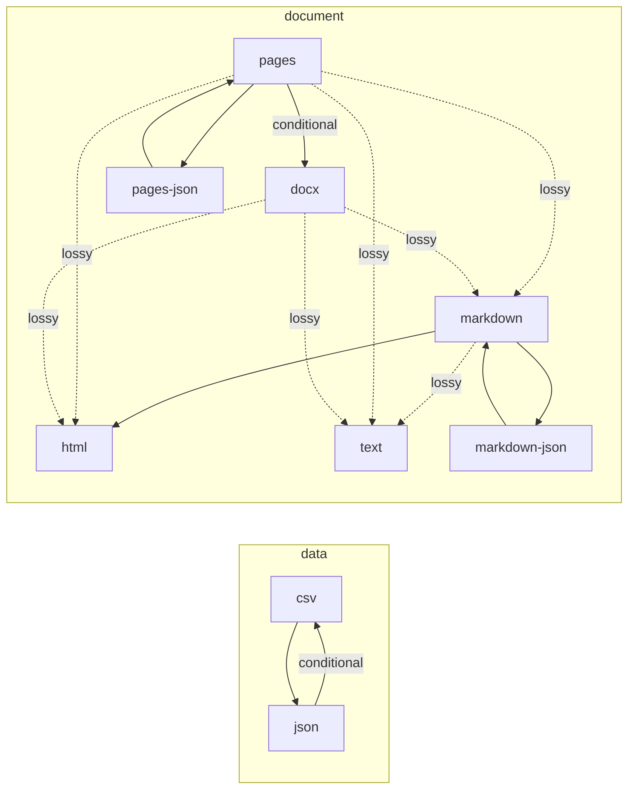

# Formats and Conversion Paths

Generated by `sublime paths --markdown`. Do not edit by hand. CI fails if this file is stale.

## Formats

| Category | Id | Name | Extensions | Produced by | Consumed by |
|---|---|---|---|---|---|
| data | csv | Comma-Separated Values | csv | json-to-csv | csv-to-json |
| data | json | JSON | json | csv-to-json | json-to-csv |
| document | docx | Word document | docx | pages-to-docx | docx-to-markdown, docx-to-html, docx-to-text |
| document | html | HTML | html, htm | markdown-to-html, pages-to-html, docx-to-html | - |
| document | markdown | Markdown | md, markdown | markdown-json-to-markdown, pages-to-markdown, docx-to-markdown | markdown-to-html, markdown-to-text, markdown-to-json |
| document | markdown-json | Markdown events as JSON |  | markdown-to-json | markdown-json-to-markdown |
| document | pages | Apple Pages | pages | json-to-pages | pages-to-json, pages-to-docx, pages-to-markdown, pages-to-html, pages-to-text |
| document | pages-json | Apple Pages package as JSON |  | pages-to-json | json-to-pages |
| document | text | Plain text | txt | markdown-to-text, pages-to-text, docx-to-text | - |

## Converters

| Name | From | To | Tier | Fidelity | Notes |
|---|---|---|---|---|---|
| csv-to-json | csv | json | native | lossless |  |
| json-to-csv | json | csv | native | conditional | nested values are written as JSON text, non-string scalars are written as their JSON text, null becomes an empty cell, and objects with differing key sets get empty cells for missing keys |
| markdown-to-html | markdown | html | native | lossless |  |
| markdown-to-text | markdown | text | native | lossy | markup, raw HTML, and image sources are dropped |
| markdown-to-json | markdown | markdown-json | native | lossless |  |
| markdown-json-to-markdown | markdown-json | markdown | native | lossless |  |
| pages-to-json | pages | pages-json | native | lossless |  |
| json-to-pages | pages-json | pages | native | lossless |  |
| pages-to-docx | pages | docx | native | conditional | lossless for text, styles, lists, links, footnotes, and tables; shapes and charts are dropped |
| pages-to-markdown | pages | markdown | native | lossy | page layout, headers and footers, fonts, sizes, and colors are dropped; text boxes follow the body |
| pages-to-html | pages | html | native | lossy | page layout, headers and footers, fonts, sizes, and colors are dropped; text boxes follow the body |
| pages-to-text | pages | text | native | lossy | formatting, images, page layout, headers and footers are dropped; text boxes follow the body |
| docx-to-markdown | docx | markdown | native | lossy | page layout, headers and footers, fonts, sizes, and colors are dropped; text boxes follow the body |
| docx-to-html | docx | html | native | lossy | page layout, headers and footers, fonts, sizes, and colors are dropped; text boxes follow the body |
| docx-to-text | docx | text | native | lossy | formatting, images, page layout, headers and footers are dropped; text boxes follow the body |

## Paths

| From | To | Fidelity | Path | Notes |
|---|---|---|---|---|
| csv | json | lossless | csv-to-json |  |
| docx | html | lossy | docx-to-html | page layout, headers and footers, fonts, sizes, and colors are dropped; text boxes follow the body |
| docx | markdown | lossy | docx-to-markdown | page layout, headers and footers, fonts, sizes, and colors are dropped; text boxes follow the body |
| docx | markdown-json | lossy | docx-to-markdown -> markdown-to-json | page layout, headers and footers, fonts, sizes, and colors are dropped; text boxes follow the body |
| docx | text | lossy | docx-to-text | formatting, images, page layout, headers and footers are dropped; text boxes follow the body |
| json | csv | conditional | json-to-csv | nested values are written as JSON text, non-string scalars are written as their JSON text, null becomes an empty cell, and objects with differing key sets get empty cells for missing keys |
| markdown | html | lossless | markdown-to-html |  |
| markdown | markdown-json | lossless | markdown-to-json |  |
| markdown | text | lossy | markdown-to-text | markup, raw HTML, and image sources are dropped |
| markdown-json | html | lossless | markdown-json-to-markdown -> markdown-to-html |  |
| markdown-json | markdown | lossless | markdown-json-to-markdown |  |
| markdown-json | text | lossy | markdown-json-to-markdown -> markdown-to-text | markup, raw HTML, and image sources are dropped |
| pages | docx | conditional | pages-to-docx | lossless for text, styles, lists, links, footnotes, and tables; shapes and charts are dropped |
| pages | html | lossy | pages-to-html | page layout, headers and footers, fonts, sizes, and colors are dropped; text boxes follow the body |
| pages | markdown | lossy | pages-to-markdown | page layout, headers and footers, fonts, sizes, and colors are dropped; text boxes follow the body |
| pages | markdown-json | lossy | pages-to-markdown -> markdown-to-json | page layout, headers and footers, fonts, sizes, and colors are dropped; text boxes follow the body |
| pages | pages-json | lossless | pages-to-json |  |
| pages | text | lossy | pages-to-text | formatting, images, page layout, headers and footers are dropped; text boxes follow the body |
| pages-json | docx | conditional | json-to-pages -> pages-to-docx | lossless for text, styles, lists, links, footnotes, and tables; shapes and charts are dropped |
| pages-json | html | lossy | json-to-pages -> pages-to-html | page layout, headers and footers, fonts, sizes, and colors are dropped; text boxes follow the body |
| pages-json | markdown | lossy | json-to-pages -> pages-to-markdown | page layout, headers and footers, fonts, sizes, and colors are dropped; text boxes follow the body |
| pages-json | markdown-json | lossy | json-to-pages -> pages-to-markdown -> markdown-to-json | page layout, headers and footers, fonts, sizes, and colors are dropped; text boxes follow the body |
| pages-json | pages | lossless | json-to-pages |  |
| pages-json | text | lossy | json-to-pages -> pages-to-text | formatting, images, page layout, headers and footers are dropped; text boxes follow the body |

## Map

One arrow per converter: solid for lossless, labeled for conditional, dotted for lossy. Longer paths chain them.

