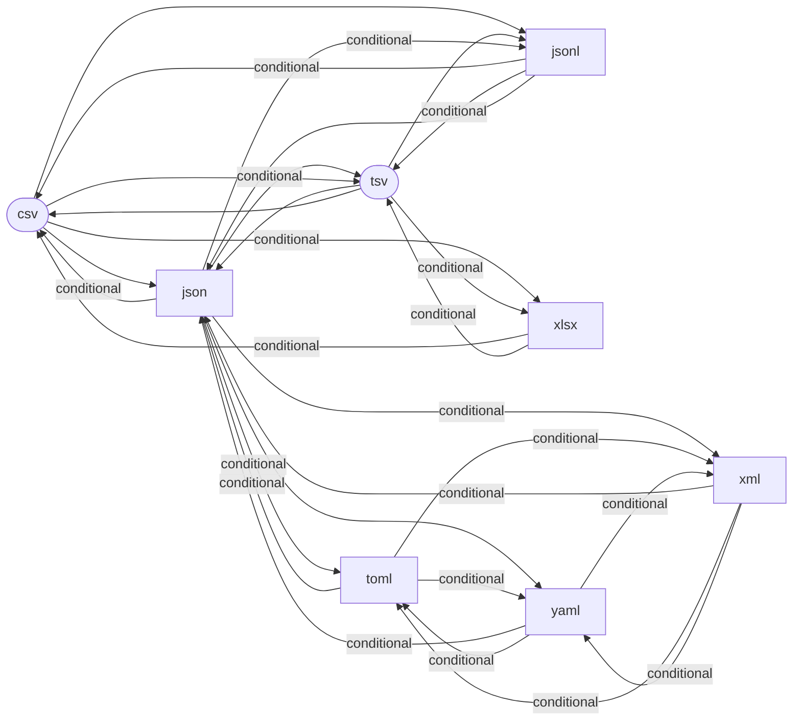
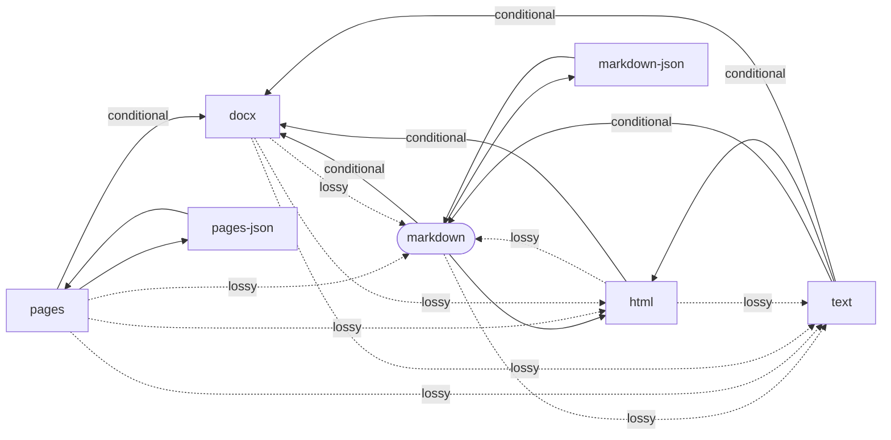
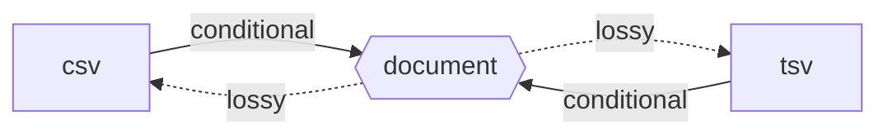

# Formats and Conversion Paths

Generated by `sublime paths --markdown`. Do not edit by hand. CI fails if this file is stale.

## Formats

| Category | Id | Name | Extensions | Produced by | Consumed by |
|---|---|---|---|---|---|
| data | csv | Comma-Separated Values | csv | json-to-csv, jsonl-to-csv, tsv-to-csv, xlsx-to-csv, markdown-to-csv | csv-to-json, csv-to-jsonl, csv-to-tsv, csv-to-xlsx, csv-to-markdown |
| data | json | JSON | json | csv-to-json, toml-to-json, yaml-to-json, xml-to-json, tsv-to-json, jsonl-to-json | json-to-csv, json-to-toml, json-to-yaml, json-to-xml, json-to-tsv, json-to-jsonl |
| data | jsonl | JSON Lines | jsonl, ndjson | csv-to-jsonl, tsv-to-jsonl, json-to-jsonl | jsonl-to-csv, jsonl-to-tsv, jsonl-to-json |
| data | toml | TOML | toml | json-to-toml, yaml-to-toml, xml-to-toml | toml-to-json, toml-to-yaml, toml-to-xml |
| data | tsv | Tab-Separated Values | tsv, tab | json-to-tsv, jsonl-to-tsv, csv-to-tsv, xlsx-to-tsv, markdown-to-tsv | tsv-to-json, tsv-to-jsonl, tsv-to-csv, tsv-to-xlsx, tsv-to-markdown |
| data | xlsx | Excel Workbook | xlsx | csv-to-xlsx, tsv-to-xlsx | xlsx-to-csv, xlsx-to-tsv |
| data | xml | XML | xml | json-to-xml, toml-to-xml, yaml-to-xml | xml-to-json, xml-to-toml, xml-to-yaml |
| data | yaml | YAML | yaml, yml | json-to-yaml, toml-to-yaml, xml-to-yaml | yaml-to-json, yaml-to-toml, yaml-to-xml |
| document | docx | Word document | docx | pages-to-docx, markdown-to-docx, html-to-docx, text-to-docx | docx-to-markdown, docx-to-html, docx-to-text |
| document | html | HTML | html, htm | markdown-to-html, pages-to-html, docx-to-html, text-to-html | html-to-markdown, html-to-text, html-to-docx |
| document | markdown | Markdown | md, markdown | markdown-json-to-markdown, pages-to-markdown, docx-to-markdown, html-to-markdown, text-to-markdown, csv-to-markdown, tsv-to-markdown | markdown-to-html, markdown-to-text, markdown-to-json, markdown-to-docx, markdown-to-csv, markdown-to-tsv |
| document | markdown-json | Markdown events as JSON |  | markdown-to-json | markdown-json-to-markdown |
| document | pages | Apple Pages | pages | json-to-pages | pages-to-json, pages-to-docx, pages-to-markdown, pages-to-html, pages-to-text |
| document | pages-json | Apple Pages package as JSON |  | pages-to-json | json-to-pages |
| document | text | Plain text | txt | markdown-to-text, pages-to-text, docx-to-text, html-to-text | text-to-markdown, text-to-html, text-to-docx |

## Converters

| Name | From | To | Tier | Fidelity | Notes |
|---|---|---|---|---|---|
| csv-to-json | csv | json | native | lossless |  |
| json-to-csv | json | csv | native | conditional | nested values are written as JSON text, non-string scalars are written as their JSON text, null becomes an empty cell, and objects with differing key sets get empty cells for missing keys |
| markdown-to-html | markdown | html | native | lossless |  |
| markdown-to-text | markdown | text | native | lossy | markup, raw HTML, and image sources are dropped |
| markdown-to-json | markdown | markdown-json | native | lossless |  |
| markdown-json-to-markdown | markdown-json | markdown | native | lossless |  |
| pages-to-json | pages | pages-json | native | lossless |  |
| json-to-pages | pages-json | pages | native | lossless |  |
| pages-to-docx | pages | docx | native | conditional | lossless for text, styles, lists, links, footnotes, and tables; shapes and charts are dropped |
| pages-to-markdown | pages | markdown | native | lossy | page layout, headers and footers, fonts, sizes, and colors are dropped; text boxes follow the body |
| pages-to-html | pages | html | native | lossy | page layout, headers and footers, fonts, sizes, and colors are dropped; text boxes follow the body |
| pages-to-text | pages | text | native | lossy | formatting, images, page layout, headers and footers are dropped; text boxes follow the body |
| docx-to-markdown | docx | markdown | native | lossy | page layout, headers and footers, fonts, sizes, and colors are dropped; text boxes follow the body |
| docx-to-html | docx | html | native | lossy | page layout, headers and footers, fonts, sizes, and colors are dropped; text boxes follow the body |
| docx-to-text | docx | text | native | lossy | formatting, images, page layout, headers and footers are dropped; text boxes follow the body |
| markdown-to-docx | markdown | docx | native | conditional | lossless for headings, paragraphs, lists, quotes, code, tables, links, footnotes, and images given as data URIs; raw HTML is dropped, other images become links, and loose lists come out tight |
| html-to-markdown | html | markdown | native | lossy | scripts, styles, forms, and layout are dropped; elements without a Markdown form keep their text |
| html-to-text | html | text | native | lossy | markup, scripts, styles, and image sources are dropped |
| html-to-docx | html | docx | native | conditional | lossless for headings, paragraphs, lists, quotes, code, tables, links, footnotes, and images given as data URIs; scripts, styles, forms, and layout are dropped, and other images become links |
| text-to-markdown | text | markdown | native | conditional | paragraphs are runs of lines separated by blank lines; text that looks like Markdown is escaped so it reads as written |
| text-to-html | text | html | native | conditional | paragraphs are runs of lines separated by blank lines; the text itself is kept exactly |
| text-to-docx | text | docx | native | conditional | paragraphs are runs of lines separated by blank lines; line breaks inside a paragraph become spaces |
| toml-to-json | toml | json | native | conditional | dates, times, infinities, and NaN become strings |
| json-to-toml | json | toml | native | conditional | the root must be an object; nulls are dropped; integers beyond 64 bits become floats |
| yaml-to-json | yaml | json | native | conditional | anchors are expanded, tags outside the core schema are dropped, keys become strings, infinities and NaN become strings, a multi-document stream becomes an array |
| json-to-yaml | json | yaml | native | lossless |  |
| xml-to-json | xml | json | native | conditional | attributes become @-keys, text #text, repeated elements arrays, every value a string; comments, processing instructions, the doctype, and the order of text against elements in mixed content are dropped |
| json-to-xml | json | xml | native | conditional | @-keys become attributes, #text the text, arrays repeated elements; the root object must have one member, otherwise it is wrapped in <root>; numbers, booleans, and nulls become text |
| toml-to-yaml | toml | yaml | native | conditional | dates and times become strings |
| yaml-to-toml | yaml | toml | native | conditional | anchors are expanded, tags outside the core schema are dropped, keys become strings; the document must be a mapping and nulls are dropped |
| toml-to-xml | toml | xml | native | conditional | a document without one root member is wrapped in <root>, and numbers, booleans, and dates become text |
| xml-to-toml | xml | toml | native | conditional | attributes become @-keys, text #text, repeated elements arrays, every value a string; comments, processing instructions, the doctype, and mixed-content order are dropped; empty elements are dropped |
| yaml-to-xml | yaml | xml | native | conditional | anchors are expanded, tags outside the core schema are dropped, keys become strings; a document without one root member is wrapped in <root>, and numbers, booleans, and nulls become text |
| xml-to-yaml | xml | yaml | native | conditional | attributes become @-keys, text #text, repeated elements arrays, every value a string; comments, processing instructions, the doctype, and the order of text against elements in mixed content are dropped |
| tsv-to-json | tsv | json | native | lossless |  |
| csv-to-jsonl | csv | jsonl | native | lossless |  |
| tsv-to-jsonl | tsv | jsonl | native | lossless |  |
| json-to-tsv | json | tsv | native | conditional | nested values are written as JSON text, non-string scalars are written as their JSON text, null becomes an empty cell, and objects with differing key sets get empty cells for missing keys |
| jsonl-to-csv | jsonl | csv | native | conditional | nested values are written as JSON text, non-string scalars are written as their JSON text, null becomes an empty cell, and objects with differing key sets get empty cells for missing keys |
| jsonl-to-tsv | jsonl | tsv | native | conditional | nested values are written as JSON text, non-string scalars are written as their JSON text, null becomes an empty cell, and objects with differing key sets get empty cells for missing keys |
| csv-to-tsv | csv | tsv | native | lossless |  |
| tsv-to-csv | tsv | csv | native | lossless |  |
| jsonl-to-json | jsonl | json | native | lossless |  |
| json-to-jsonl | json | jsonl | native | conditional | an array becomes one line per element; any other root becomes one line |
| xlsx-to-csv | xlsx | csv | native | conditional | one sheet (the first, or --sheet); numbers as stored, dates as ISO 8601, booleans as TRUE and FALSE, formulas as their last value; formatting is dropped |
| xlsx-to-tsv | xlsx | tsv | native | conditional | one sheet (the first, or --sheet); numbers as stored, dates as ISO 8601, booleans as TRUE and FALSE, formulas as their last value; formatting is dropped |
| csv-to-xlsx | csv | xlsx | native | conditional | cells that are plain decimals of up to fifteen digits become numbers, everything else stays text; one sheet named Sheet1 |
| tsv-to-xlsx | tsv | xlsx | native | conditional | cells that are plain decimals of up to fifteen digits become numbers, everything else stays text; one sheet named Sheet1 |
| csv-to-markdown | csv | markdown | native | conditional | one table with the first row as the header; rows are padded or cut to the header's width and line breaks inside cells become spaces |
| tsv-to-markdown | tsv | markdown | native | conditional | one table with the first row as the header; rows are padded or cut to the header's width and line breaks inside cells become spaces |
| markdown-to-csv | markdown | csv | native | lossy | only the document's first table, its inline formatting flattened to text; everything else in the document is dropped |
| markdown-to-tsv | markdown | tsv | native | lossy | only the document's first table, its inline formatting flattened to text; everything else in the document is dropped |

## Paths

| From | To | Fidelity | Path | Notes |
|---|---|---|---|---|
| csv | docx | conditional | csv-to-markdown -> markdown-to-docx | one table with the first row as the header; rows are padded or cut to the header's width and line breaks inside cells become spaces; lossless for headings, paragraphs, lists, quotes, code, tables, links, footnotes, and images given as data URIs; raw HTML is dropped, other images become links, and loose lists come out tight |
| csv | html | conditional | csv-to-markdown -> markdown-to-html | one table with the first row as the header; rows are padded or cut to the header's width and line breaks inside cells become spaces |
| csv | json | lossless | csv-to-json |  |
| csv | jsonl | lossless | csv-to-jsonl |  |
| csv | markdown | conditional | csv-to-markdown | one table with the first row as the header; rows are padded or cut to the header's width and line breaks inside cells become spaces |
| csv | markdown-json | conditional | csv-to-markdown -> markdown-to-json | one table with the first row as the header; rows are padded or cut to the header's width and line breaks inside cells become spaces |
| csv | text | lossy | csv-to-markdown -> markdown-to-text | one table with the first row as the header; rows are padded or cut to the header's width and line breaks inside cells become spaces; markup, raw HTML, and image sources are dropped |
| csv | toml | conditional | csv-to-json -> json-to-toml | the root must be an object; nulls are dropped; integers beyond 64 bits become floats |
| csv | tsv | lossless | csv-to-tsv |  |
| csv | xlsx | conditional | csv-to-xlsx | cells that are plain decimals of up to fifteen digits become numbers, everything else stays text; one sheet named Sheet1 |
| csv | xml | conditional | csv-to-json -> json-to-xml | @-keys become attributes, #text the text, arrays repeated elements; the root object must have one member, otherwise it is wrapped in <root>; numbers, booleans, and nulls become text |
| csv | yaml | lossless | csv-to-json -> json-to-yaml |  |
| docx | csv | lossy | docx-to-markdown -> markdown-to-csv | page layout, headers and footers, fonts, sizes, and colors are dropped; text boxes follow the body; only the document's first table, its inline formatting flattened to text; everything else in the document is dropped |
| docx | html | lossy | docx-to-html | page layout, headers and footers, fonts, sizes, and colors are dropped; text boxes follow the body |
| docx | json | lossy | docx-to-markdown -> markdown-to-csv -> csv-to-json | page layout, headers and footers, fonts, sizes, and colors are dropped; text boxes follow the body; only the document's first table, its inline formatting flattened to text; everything else in the document is dropped |
| docx | jsonl | lossy | docx-to-markdown -> markdown-to-csv -> csv-to-jsonl | page layout, headers and footers, fonts, sizes, and colors are dropped; text boxes follow the body; only the document's first table, its inline formatting flattened to text; everything else in the document is dropped |
| docx | markdown | lossy | docx-to-markdown | page layout, headers and footers, fonts, sizes, and colors are dropped; text boxes follow the body |
| docx | markdown-json | lossy | docx-to-markdown -> markdown-to-json | page layout, headers and footers, fonts, sizes, and colors are dropped; text boxes follow the body |
| docx | text | lossy | docx-to-text | formatting, images, page layout, headers and footers are dropped; text boxes follow the body |
| docx | toml | lossy | docx-to-markdown -> markdown-to-csv -> csv-to-json -> json-to-toml | page layout, headers and footers, fonts, sizes, and colors are dropped; text boxes follow the body; only the document's first table, its inline formatting flattened to text; everything else in the document is dropped; the root must be an object; nulls are dropped; integers beyond 64 bits become floats |
| docx | tsv | lossy | docx-to-markdown -> markdown-to-tsv | page layout, headers and footers, fonts, sizes, and colors are dropped; text boxes follow the body; only the document's first table, its inline formatting flattened to text; everything else in the document is dropped |
| docx | xlsx | lossy | docx-to-markdown -> markdown-to-csv -> csv-to-xlsx | page layout, headers and footers, fonts, sizes, and colors are dropped; text boxes follow the body; only the document's first table, its inline formatting flattened to text; everything else in the document is dropped; cells that are plain decimals of up to fifteen digits become numbers, everything else stays text; one sheet named Sheet1 |
| docx | xml | lossy | docx-to-markdown -> markdown-to-csv -> csv-to-json -> json-to-xml | page layout, headers and footers, fonts, sizes, and colors are dropped; text boxes follow the body; only the document's first table, its inline formatting flattened to text; everything else in the document is dropped; @-keys become attributes, #text the text, arrays repeated elements; the root object must have one member, otherwise it is wrapped in <root>; numbers, booleans, and nulls become text |
| docx | yaml | lossy | docx-to-markdown -> markdown-to-csv -> csv-to-json -> json-to-yaml | page layout, headers and footers, fonts, sizes, and colors are dropped; text boxes follow the body; only the document's first table, its inline formatting flattened to text; everything else in the document is dropped |
| html | csv | lossy | html-to-markdown -> markdown-to-csv | scripts, styles, forms, and layout are dropped; elements without a Markdown form keep their text; only the document's first table, its inline formatting flattened to text; everything else in the document is dropped |
| html | docx | conditional | html-to-docx | lossless for headings, paragraphs, lists, quotes, code, tables, links, footnotes, and images given as data URIs; scripts, styles, forms, and layout are dropped, and other images become links |
| html | json | lossy | html-to-markdown -> markdown-to-csv -> csv-to-json | scripts, styles, forms, and layout are dropped; elements without a Markdown form keep their text; only the document's first table, its inline formatting flattened to text; everything else in the document is dropped |
| html | jsonl | lossy | html-to-markdown -> markdown-to-csv -> csv-to-jsonl | scripts, styles, forms, and layout are dropped; elements without a Markdown form keep their text; only the document's first table, its inline formatting flattened to text; everything else in the document is dropped |
| html | markdown | lossy | html-to-markdown | scripts, styles, forms, and layout are dropped; elements without a Markdown form keep their text |
| html | markdown-json | lossy | html-to-markdown -> markdown-to-json | scripts, styles, forms, and layout are dropped; elements without a Markdown form keep their text |
| html | text | lossy | html-to-text | markup, scripts, styles, and image sources are dropped |
| html | toml | lossy | html-to-markdown -> markdown-to-csv -> csv-to-json -> json-to-toml | scripts, styles, forms, and layout are dropped; elements without a Markdown form keep their text; only the document's first table, its inline formatting flattened to text; everything else in the document is dropped; the root must be an object; nulls are dropped; integers beyond 64 bits become floats |
| html | tsv | lossy | html-to-markdown -> markdown-to-tsv | scripts, styles, forms, and layout are dropped; elements without a Markdown form keep their text; only the document's first table, its inline formatting flattened to text; everything else in the document is dropped |
| html | xlsx | lossy | html-to-markdown -> markdown-to-csv -> csv-to-xlsx | scripts, styles, forms, and layout are dropped; elements without a Markdown form keep their text; only the document's first table, its inline formatting flattened to text; everything else in the document is dropped; cells that are plain decimals of up to fifteen digits become numbers, everything else stays text; one sheet named Sheet1 |
| html | xml | lossy | html-to-markdown -> markdown-to-csv -> csv-to-json -> json-to-xml | scripts, styles, forms, and layout are dropped; elements without a Markdown form keep their text; only the document's first table, its inline formatting flattened to text; everything else in the document is dropped; @-keys become attributes, #text the text, arrays repeated elements; the root object must have one member, otherwise it is wrapped in <root>; numbers, booleans, and nulls become text |
| html | yaml | lossy | html-to-markdown -> markdown-to-csv -> csv-to-json -> json-to-yaml | scripts, styles, forms, and layout are dropped; elements without a Markdown form keep their text; only the document's first table, its inline formatting flattened to text; everything else in the document is dropped |
| json | csv | conditional | json-to-csv | nested values are written as JSON text, non-string scalars are written as their JSON text, null becomes an empty cell, and objects with differing key sets get empty cells for missing keys |
| json | docx | conditional | json-to-csv -> csv-to-markdown -> markdown-to-docx | nested values are written as JSON text, non-string scalars are written as their JSON text, null becomes an empty cell, and objects with differing key sets get empty cells for missing keys; one table with the first row as the header; rows are padded or cut to the header's width and line breaks inside cells become spaces; lossless for headings, paragraphs, lists, quotes, code, tables, links, footnotes, and images given as data URIs; raw HTML is dropped, other images become links, and loose lists come out tight |
| json | html | conditional | json-to-csv -> csv-to-markdown -> markdown-to-html | nested values are written as JSON text, non-string scalars are written as their JSON text, null becomes an empty cell, and objects with differing key sets get empty cells for missing keys; one table with the first row as the header; rows are padded or cut to the header's width and line breaks inside cells become spaces |
| json | jsonl | conditional | json-to-jsonl | an array becomes one line per element; any other root becomes one line |
| json | markdown | conditional | json-to-csv -> csv-to-markdown | nested values are written as JSON text, non-string scalars are written as their JSON text, null becomes an empty cell, and objects with differing key sets get empty cells for missing keys; one table with the first row as the header; rows are padded or cut to the header's width and line breaks inside cells become spaces |
| json | markdown-json | conditional | json-to-csv -> csv-to-markdown -> markdown-to-json | nested values are written as JSON text, non-string scalars are written as their JSON text, null becomes an empty cell, and objects with differing key sets get empty cells for missing keys; one table with the first row as the header; rows are padded or cut to the header's width and line breaks inside cells become spaces |
| json | text | lossy | json-to-csv -> csv-to-markdown -> markdown-to-text | nested values are written as JSON text, non-string scalars are written as their JSON text, null becomes an empty cell, and objects with differing key sets get empty cells for missing keys; one table with the first row as the header; rows are padded or cut to the header's width and line breaks inside cells become spaces; markup, raw HTML, and image sources are dropped |
| json | toml | conditional | json-to-toml | the root must be an object; nulls are dropped; integers beyond 64 bits become floats |
| json | tsv | conditional | json-to-tsv | nested values are written as JSON text, non-string scalars are written as their JSON text, null becomes an empty cell, and objects with differing key sets get empty cells for missing keys |
| json | xlsx | conditional | json-to-csv -> csv-to-xlsx | nested values are written as JSON text, non-string scalars are written as their JSON text, null becomes an empty cell, and objects with differing key sets get empty cells for missing keys; cells that are plain decimals of up to fifteen digits become numbers, everything else stays text; one sheet named Sheet1 |
| json | xml | conditional | json-to-xml | @-keys become attributes, #text the text, arrays repeated elements; the root object must have one member, otherwise it is wrapped in <root>; numbers, booleans, and nulls become text |
| json | yaml | lossless | json-to-yaml |  |
| jsonl | csv | conditional | jsonl-to-csv | nested values are written as JSON text, non-string scalars are written as their JSON text, null becomes an empty cell, and objects with differing key sets get empty cells for missing keys |
| jsonl | docx | conditional | jsonl-to-csv -> csv-to-markdown -> markdown-to-docx | nested values are written as JSON text, non-string scalars are written as their JSON text, null becomes an empty cell, and objects with differing key sets get empty cells for missing keys; one table with the first row as the header; rows are padded or cut to the header's width and line breaks inside cells become spaces; lossless for headings, paragraphs, lists, quotes, code, tables, links, footnotes, and images given as data URIs; raw HTML is dropped, other images become links, and loose lists come out tight |
| jsonl | html | conditional | jsonl-to-csv -> csv-to-markdown -> markdown-to-html | nested values are written as JSON text, non-string scalars are written as their JSON text, null becomes an empty cell, and objects with differing key sets get empty cells for missing keys; one table with the first row as the header; rows are padded or cut to the header's width and line breaks inside cells become spaces |
| jsonl | json | lossless | jsonl-to-json |  |
| jsonl | markdown | conditional | jsonl-to-csv -> csv-to-markdown | nested values are written as JSON text, non-string scalars are written as their JSON text, null becomes an empty cell, and objects with differing key sets get empty cells for missing keys; one table with the first row as the header; rows are padded or cut to the header's width and line breaks inside cells become spaces |
| jsonl | markdown-json | conditional | jsonl-to-csv -> csv-to-markdown -> markdown-to-json | nested values are written as JSON text, non-string scalars are written as their JSON text, null becomes an empty cell, and objects with differing key sets get empty cells for missing keys; one table with the first row as the header; rows are padded or cut to the header's width and line breaks inside cells become spaces |
| jsonl | text | lossy | jsonl-to-csv -> csv-to-markdown -> markdown-to-text | nested values are written as JSON text, non-string scalars are written as their JSON text, null becomes an empty cell, and objects with differing key sets get empty cells for missing keys; one table with the first row as the header; rows are padded or cut to the header's width and line breaks inside cells become spaces; markup, raw HTML, and image sources are dropped |
| jsonl | toml | conditional | jsonl-to-json -> json-to-toml | the root must be an object; nulls are dropped; integers beyond 64 bits become floats |
| jsonl | tsv | conditional | jsonl-to-tsv | nested values are written as JSON text, non-string scalars are written as their JSON text, null becomes an empty cell, and objects with differing key sets get empty cells for missing keys |
| jsonl | xlsx | conditional | jsonl-to-csv -> csv-to-xlsx | nested values are written as JSON text, non-string scalars are written as their JSON text, null becomes an empty cell, and objects with differing key sets get empty cells for missing keys; cells that are plain decimals of up to fifteen digits become numbers, everything else stays text; one sheet named Sheet1 |
| jsonl | xml | conditional | jsonl-to-json -> json-to-xml | @-keys become attributes, #text the text, arrays repeated elements; the root object must have one member, otherwise it is wrapped in <root>; numbers, booleans, and nulls become text |
| jsonl | yaml | lossless | jsonl-to-json -> json-to-yaml |  |
| markdown | csv | lossy | markdown-to-csv | only the document's first table, its inline formatting flattened to text; everything else in the document is dropped |
| markdown | docx | conditional | markdown-to-docx | lossless for headings, paragraphs, lists, quotes, code, tables, links, footnotes, and images given as data URIs; raw HTML is dropped, other images become links, and loose lists come out tight |
| markdown | html | lossless | markdown-to-html |  |
| markdown | json | lossy | markdown-to-csv -> csv-to-json | only the document's first table, its inline formatting flattened to text; everything else in the document is dropped |
| markdown | jsonl | lossy | markdown-to-csv -> csv-to-jsonl | only the document's first table, its inline formatting flattened to text; everything else in the document is dropped |
| markdown | markdown-json | lossless | markdown-to-json |  |
| markdown | text | lossy | markdown-to-text | markup, raw HTML, and image sources are dropped |
| markdown | toml | lossy | markdown-to-csv -> csv-to-json -> json-to-toml | only the document's first table, its inline formatting flattened to text; everything else in the document is dropped; the root must be an object; nulls are dropped; integers beyond 64 bits become floats |
| markdown | tsv | lossy | markdown-to-tsv | only the document's first table, its inline formatting flattened to text; everything else in the document is dropped |
| markdown | xlsx | lossy | markdown-to-csv -> csv-to-xlsx | only the document's first table, its inline formatting flattened to text; everything else in the document is dropped; cells that are plain decimals of up to fifteen digits become numbers, everything else stays text; one sheet named Sheet1 |
| markdown | xml | lossy | markdown-to-csv -> csv-to-json -> json-to-xml | only the document's first table, its inline formatting flattened to text; everything else in the document is dropped; @-keys become attributes, #text the text, arrays repeated elements; the root object must have one member, otherwise it is wrapped in <root>; numbers, booleans, and nulls become text |
| markdown | yaml | lossy | markdown-to-csv -> csv-to-json -> json-to-yaml | only the document's first table, its inline formatting flattened to text; everything else in the document is dropped |
| markdown-json | csv | lossy | markdown-json-to-markdown -> markdown-to-csv | only the document's first table, its inline formatting flattened to text; everything else in the document is dropped |
| markdown-json | docx | conditional | markdown-json-to-markdown -> markdown-to-docx | lossless for headings, paragraphs, lists, quotes, code, tables, links, footnotes, and images given as data URIs; raw HTML is dropped, other images become links, and loose lists come out tight |
| markdown-json | html | lossless | markdown-json-to-markdown -> markdown-to-html |  |
| markdown-json | json | lossy | markdown-json-to-markdown -> markdown-to-csv -> csv-to-json | only the document's first table, its inline formatting flattened to text; everything else in the document is dropped |
| markdown-json | jsonl | lossy | markdown-json-to-markdown -> markdown-to-csv -> csv-to-jsonl | only the document's first table, its inline formatting flattened to text; everything else in the document is dropped |
| markdown-json | markdown | lossless | markdown-json-to-markdown |  |
| markdown-json | text | lossy | markdown-json-to-markdown -> markdown-to-text | markup, raw HTML, and image sources are dropped |
| markdown-json | toml | lossy | markdown-json-to-markdown -> markdown-to-csv -> csv-to-json -> json-to-toml | only the document's first table, its inline formatting flattened to text; everything else in the document is dropped; the root must be an object; nulls are dropped; integers beyond 64 bits become floats |
| markdown-json | tsv | lossy | markdown-json-to-markdown -> markdown-to-tsv | only the document's first table, its inline formatting flattened to text; everything else in the document is dropped |
| markdown-json | xlsx | lossy | markdown-json-to-markdown -> markdown-to-csv -> csv-to-xlsx | only the document's first table, its inline formatting flattened to text; everything else in the document is dropped; cells that are plain decimals of up to fifteen digits become numbers, everything else stays text; one sheet named Sheet1 |
| markdown-json | xml | lossy | markdown-json-to-markdown -> markdown-to-csv -> csv-to-json -> json-to-xml | only the document's first table, its inline formatting flattened to text; everything else in the document is dropped; @-keys become attributes, #text the text, arrays repeated elements; the root object must have one member, otherwise it is wrapped in <root>; numbers, booleans, and nulls become text |
| markdown-json | yaml | lossy | markdown-json-to-markdown -> markdown-to-csv -> csv-to-json -> json-to-yaml | only the document's first table, its inline formatting flattened to text; everything else in the document is dropped |
| pages | csv | lossy | pages-to-markdown -> markdown-to-csv | page layout, headers and footers, fonts, sizes, and colors are dropped; text boxes follow the body; only the document's first table, its inline formatting flattened to text; everything else in the document is dropped |
| pages | docx | conditional | pages-to-docx | lossless for text, styles, lists, links, footnotes, and tables; shapes and charts are dropped |
| pages | html | lossy | pages-to-html | page layout, headers and footers, fonts, sizes, and colors are dropped; text boxes follow the body |
| pages | json | lossy | pages-to-markdown -> markdown-to-csv -> csv-to-json | page layout, headers and footers, fonts, sizes, and colors are dropped; text boxes follow the body; only the document's first table, its inline formatting flattened to text; everything else in the document is dropped |
| pages | jsonl | lossy | pages-to-markdown -> markdown-to-csv -> csv-to-jsonl | page layout, headers and footers, fonts, sizes, and colors are dropped; text boxes follow the body; only the document's first table, its inline formatting flattened to text; everything else in the document is dropped |
| pages | markdown | lossy | pages-to-markdown | page layout, headers and footers, fonts, sizes, and colors are dropped; text boxes follow the body |
| pages | markdown-json | lossy | pages-to-markdown -> markdown-to-json | page layout, headers and footers, fonts, sizes, and colors are dropped; text boxes follow the body |
| pages | pages-json | lossless | pages-to-json |  |
| pages | text | lossy | pages-to-text | formatting, images, page layout, headers and footers are dropped; text boxes follow the body |
| pages | toml | lossy | pages-to-markdown -> markdown-to-csv -> csv-to-json -> json-to-toml | page layout, headers and footers, fonts, sizes, and colors are dropped; text boxes follow the body; only the document's first table, its inline formatting flattened to text; everything else in the document is dropped; the root must be an object; nulls are dropped; integers beyond 64 bits become floats |
| pages | tsv | lossy | pages-to-markdown -> markdown-to-tsv | page layout, headers and footers, fonts, sizes, and colors are dropped; text boxes follow the body; only the document's first table, its inline formatting flattened to text; everything else in the document is dropped |
| pages | xlsx | lossy | pages-to-markdown -> markdown-to-csv -> csv-to-xlsx | page layout, headers and footers, fonts, sizes, and colors are dropped; text boxes follow the body; only the document's first table, its inline formatting flattened to text; everything else in the document is dropped; cells that are plain decimals of up to fifteen digits become numbers, everything else stays text; one sheet named Sheet1 |
| pages | xml | lossy | pages-to-markdown -> markdown-to-csv -> csv-to-json -> json-to-xml | page layout, headers and footers, fonts, sizes, and colors are dropped; text boxes follow the body; only the document's first table, its inline formatting flattened to text; everything else in the document is dropped; @-keys become attributes, #text the text, arrays repeated elements; the root object must have one member, otherwise it is wrapped in <root>; numbers, booleans, and nulls become text |
| pages | yaml | lossy | pages-to-markdown -> markdown-to-csv -> csv-to-json -> json-to-yaml | page layout, headers and footers, fonts, sizes, and colors are dropped; text boxes follow the body; only the document's first table, its inline formatting flattened to text; everything else in the document is dropped |
| pages-json | csv | lossy | json-to-pages -> pages-to-markdown -> markdown-to-csv | page layout, headers and footers, fonts, sizes, and colors are dropped; text boxes follow the body; only the document's first table, its inline formatting flattened to text; everything else in the document is dropped |
| pages-json | docx | conditional | json-to-pages -> pages-to-docx | lossless for text, styles, lists, links, footnotes, and tables; shapes and charts are dropped |
| pages-json | html | lossy | json-to-pages -> pages-to-html | page layout, headers and footers, fonts, sizes, and colors are dropped; text boxes follow the body |
| pages-json | json | lossy | json-to-pages -> pages-to-markdown -> markdown-to-csv -> csv-to-json | page layout, headers and footers, fonts, sizes, and colors are dropped; text boxes follow the body; only the document's first table, its inline formatting flattened to text; everything else in the document is dropped |
| pages-json | jsonl | lossy | json-to-pages -> pages-to-markdown -> markdown-to-csv -> csv-to-jsonl | page layout, headers and footers, fonts, sizes, and colors are dropped; text boxes follow the body; only the document's first table, its inline formatting flattened to text; everything else in the document is dropped |
| pages-json | markdown | lossy | json-to-pages -> pages-to-markdown | page layout, headers and footers, fonts, sizes, and colors are dropped; text boxes follow the body |
| pages-json | markdown-json | lossy | json-to-pages -> pages-to-markdown -> markdown-to-json | page layout, headers and footers, fonts, sizes, and colors are dropped; text boxes follow the body |
| pages-json | pages | lossless | json-to-pages |  |
| pages-json | text | lossy | json-to-pages -> pages-to-text | formatting, images, page layout, headers and footers are dropped; text boxes follow the body |
| pages-json | toml | lossy | json-to-pages -> pages-to-markdown -> markdown-to-csv -> csv-to-json -> json-to-toml | page layout, headers and footers, fonts, sizes, and colors are dropped; text boxes follow the body; only the document's first table, its inline formatting flattened to text; everything else in the document is dropped; the root must be an object; nulls are dropped; integers beyond 64 bits become floats |
| pages-json | tsv | lossy | json-to-pages -> pages-to-markdown -> markdown-to-tsv | page layout, headers and footers, fonts, sizes, and colors are dropped; text boxes follow the body; only the document's first table, its inline formatting flattened to text; everything else in the document is dropped |
| pages-json | xlsx | lossy | json-to-pages -> pages-to-markdown -> markdown-to-csv -> csv-to-xlsx | page layout, headers and footers, fonts, sizes, and colors are dropped; text boxes follow the body; only the document's first table, its inline formatting flattened to text; everything else in the document is dropped; cells that are plain decimals of up to fifteen digits become numbers, everything else stays text; one sheet named Sheet1 |
| pages-json | xml | lossy | json-to-pages -> pages-to-markdown -> markdown-to-csv -> csv-to-json -> json-to-xml | page layout, headers and footers, fonts, sizes, and colors are dropped; text boxes follow the body; only the document's first table, its inline formatting flattened to text; everything else in the document is dropped; @-keys become attributes, #text the text, arrays repeated elements; the root object must have one member, otherwise it is wrapped in <root>; numbers, booleans, and nulls become text |
| pages-json | yaml | lossy | json-to-pages -> pages-to-markdown -> markdown-to-csv -> csv-to-json -> json-to-yaml | page layout, headers and footers, fonts, sizes, and colors are dropped; text boxes follow the body; only the document's first table, its inline formatting flattened to text; everything else in the document is dropped |
| text | csv | lossy | text-to-markdown -> markdown-to-csv | paragraphs are runs of lines separated by blank lines; text that looks like Markdown is escaped so it reads as written; only the document's first table, its inline formatting flattened to text; everything else in the document is dropped |
| text | docx | conditional | text-to-docx | paragraphs are runs of lines separated by blank lines; line breaks inside a paragraph become spaces |
| text | html | conditional | text-to-html | paragraphs are runs of lines separated by blank lines; the text itself is kept exactly |
| text | json | lossy | text-to-markdown -> markdown-to-csv -> csv-to-json | paragraphs are runs of lines separated by blank lines; text that looks like Markdown is escaped so it reads as written; only the document's first table, its inline formatting flattened to text; everything else in the document is dropped |
| text | jsonl | lossy | text-to-markdown -> markdown-to-csv -> csv-to-jsonl | paragraphs are runs of lines separated by blank lines; text that looks like Markdown is escaped so it reads as written; only the document's first table, its inline formatting flattened to text; everything else in the document is dropped |
| text | markdown | conditional | text-to-markdown | paragraphs are runs of lines separated by blank lines; text that looks like Markdown is escaped so it reads as written |
| text | markdown-json | conditional | text-to-markdown -> markdown-to-json | paragraphs are runs of lines separated by blank lines; text that looks like Markdown is escaped so it reads as written |
| text | toml | lossy | text-to-markdown -> markdown-to-csv -> csv-to-json -> json-to-toml | paragraphs are runs of lines separated by blank lines; text that looks like Markdown is escaped so it reads as written; only the document's first table, its inline formatting flattened to text; everything else in the document is dropped; the root must be an object; nulls are dropped; integers beyond 64 bits become floats |
| text | tsv | lossy | text-to-markdown -> markdown-to-tsv | paragraphs are runs of lines separated by blank lines; text that looks like Markdown is escaped so it reads as written; only the document's first table, its inline formatting flattened to text; everything else in the document is dropped |
| text | xlsx | lossy | text-to-markdown -> markdown-to-csv -> csv-to-xlsx | paragraphs are runs of lines separated by blank lines; text that looks like Markdown is escaped so it reads as written; only the document's first table, its inline formatting flattened to text; everything else in the document is dropped; cells that are plain decimals of up to fifteen digits become numbers, everything else stays text; one sheet named Sheet1 |
| text | xml | lossy | text-to-markdown -> markdown-to-csv -> csv-to-json -> json-to-xml | paragraphs are runs of lines separated by blank lines; text that looks like Markdown is escaped so it reads as written; only the document's first table, its inline formatting flattened to text; everything else in the document is dropped; @-keys become attributes, #text the text, arrays repeated elements; the root object must have one member, otherwise it is wrapped in <root>; numbers, booleans, and nulls become text |
| text | yaml | lossy | text-to-markdown -> markdown-to-csv -> csv-to-json -> json-to-yaml | paragraphs are runs of lines separated by blank lines; text that looks like Markdown is escaped so it reads as written; only the document's first table, its inline formatting flattened to text; everything else in the document is dropped |
| toml | csv | conditional | toml-to-json -> json-to-csv | dates, times, infinities, and NaN become strings; nested values are written as JSON text, non-string scalars are written as their JSON text, null becomes an empty cell, and objects with differing key sets get empty cells for missing keys |
| toml | docx | conditional | toml-to-json -> json-to-csv -> csv-to-markdown -> markdown-to-docx | dates, times, infinities, and NaN become strings; nested values are written as JSON text, non-string scalars are written as their JSON text, null becomes an empty cell, and objects with differing key sets get empty cells for missing keys; one table with the first row as the header; rows are padded or cut to the header's width and line breaks inside cells become spaces; lossless for headings, paragraphs, lists, quotes, code, tables, links, footnotes, and images given as data URIs; raw HTML is dropped, other images become links, and loose lists come out tight |
| toml | html | conditional | toml-to-json -> json-to-csv -> csv-to-markdown -> markdown-to-html | dates, times, infinities, and NaN become strings; nested values are written as JSON text, non-string scalars are written as their JSON text, null becomes an empty cell, and objects with differing key sets get empty cells for missing keys; one table with the first row as the header; rows are padded or cut to the header's width and line breaks inside cells become spaces |
| toml | json | conditional | toml-to-json | dates, times, infinities, and NaN become strings |
| toml | jsonl | conditional | toml-to-json -> json-to-jsonl | dates, times, infinities, and NaN become strings; an array becomes one line per element; any other root becomes one line |
| toml | markdown | conditional | toml-to-json -> json-to-csv -> csv-to-markdown | dates, times, infinities, and NaN become strings; nested values are written as JSON text, non-string scalars are written as their JSON text, null becomes an empty cell, and objects with differing key sets get empty cells for missing keys; one table with the first row as the header; rows are padded or cut to the header's width and line breaks inside cells become spaces |
| toml | markdown-json | conditional | toml-to-json -> json-to-csv -> csv-to-markdown -> markdown-to-json | dates, times, infinities, and NaN become strings; nested values are written as JSON text, non-string scalars are written as their JSON text, null becomes an empty cell, and objects with differing key sets get empty cells for missing keys; one table with the first row as the header; rows are padded or cut to the header's width and line breaks inside cells become spaces |
| toml | text | lossy | toml-to-json -> json-to-csv -> csv-to-markdown -> markdown-to-text | dates, times, infinities, and NaN become strings; nested values are written as JSON text, non-string scalars are written as their JSON text, null becomes an empty cell, and objects with differing key sets get empty cells for missing keys; one table with the first row as the header; rows are padded or cut to the header's width and line breaks inside cells become spaces; markup, raw HTML, and image sources are dropped |
| toml | tsv | conditional | toml-to-json -> json-to-tsv | dates, times, infinities, and NaN become strings; nested values are written as JSON text, non-string scalars are written as their JSON text, null becomes an empty cell, and objects with differing key sets get empty cells for missing keys |
| toml | xlsx | conditional | toml-to-json -> json-to-csv -> csv-to-xlsx | dates, times, infinities, and NaN become strings; nested values are written as JSON text, non-string scalars are written as their JSON text, null becomes an empty cell, and objects with differing key sets get empty cells for missing keys; cells that are plain decimals of up to fifteen digits become numbers, everything else stays text; one sheet named Sheet1 |
| toml | xml | conditional | toml-to-xml | a document without one root member is wrapped in <root>, and numbers, booleans, and dates become text |
| toml | yaml | conditional | toml-to-yaml | dates and times become strings |
| tsv | csv | lossless | tsv-to-csv |  |
| tsv | docx | conditional | tsv-to-markdown -> markdown-to-docx | one table with the first row as the header; rows are padded or cut to the header's width and line breaks inside cells become spaces; lossless for headings, paragraphs, lists, quotes, code, tables, links, footnotes, and images given as data URIs; raw HTML is dropped, other images become links, and loose lists come out tight |
| tsv | html | conditional | tsv-to-markdown -> markdown-to-html | one table with the first row as the header; rows are padded or cut to the header's width and line breaks inside cells become spaces |
| tsv | json | lossless | tsv-to-json |  |
| tsv | jsonl | lossless | tsv-to-jsonl |  |
| tsv | markdown | conditional | tsv-to-markdown | one table with the first row as the header; rows are padded or cut to the header's width and line breaks inside cells become spaces |
| tsv | markdown-json | conditional | tsv-to-markdown -> markdown-to-json | one table with the first row as the header; rows are padded or cut to the header's width and line breaks inside cells become spaces |
| tsv | text | lossy | tsv-to-markdown -> markdown-to-text | one table with the first row as the header; rows are padded or cut to the header's width and line breaks inside cells become spaces; markup, raw HTML, and image sources are dropped |
| tsv | toml | conditional | tsv-to-json -> json-to-toml | the root must be an object; nulls are dropped; integers beyond 64 bits become floats |
| tsv | xlsx | conditional | tsv-to-xlsx | cells that are plain decimals of up to fifteen digits become numbers, everything else stays text; one sheet named Sheet1 |
| tsv | xml | conditional | tsv-to-json -> json-to-xml | @-keys become attributes, #text the text, arrays repeated elements; the root object must have one member, otherwise it is wrapped in <root>; numbers, booleans, and nulls become text |
| tsv | yaml | lossless | tsv-to-json -> json-to-yaml |  |
| xlsx | csv | conditional | xlsx-to-csv | one sheet (the first, or --sheet); numbers as stored, dates as ISO 8601, booleans as TRUE and FALSE, formulas as their last value; formatting is dropped |
| xlsx | docx | conditional | xlsx-to-csv -> csv-to-markdown -> markdown-to-docx | one sheet (the first, or --sheet); numbers as stored, dates as ISO 8601, booleans as TRUE and FALSE, formulas as their last value; formatting is dropped; one table with the first row as the header; rows are padded or cut to the header's width and line breaks inside cells become spaces; lossless for headings, paragraphs, lists, quotes, code, tables, links, footnotes, and images given as data URIs; raw HTML is dropped, other images become links, and loose lists come out tight |
| xlsx | html | conditional | xlsx-to-csv -> csv-to-markdown -> markdown-to-html | one sheet (the first, or --sheet); numbers as stored, dates as ISO 8601, booleans as TRUE and FALSE, formulas as their last value; formatting is dropped; one table with the first row as the header; rows are padded or cut to the header's width and line breaks inside cells become spaces |
| xlsx | json | conditional | xlsx-to-csv -> csv-to-json | one sheet (the first, or --sheet); numbers as stored, dates as ISO 8601, booleans as TRUE and FALSE, formulas as their last value; formatting is dropped |
| xlsx | jsonl | conditional | xlsx-to-csv -> csv-to-jsonl | one sheet (the first, or --sheet); numbers as stored, dates as ISO 8601, booleans as TRUE and FALSE, formulas as their last value; formatting is dropped |
| xlsx | markdown | conditional | xlsx-to-csv -> csv-to-markdown | one sheet (the first, or --sheet); numbers as stored, dates as ISO 8601, booleans as TRUE and FALSE, formulas as their last value; formatting is dropped; one table with the first row as the header; rows are padded or cut to the header's width and line breaks inside cells become spaces |
| xlsx | markdown-json | conditional | xlsx-to-csv -> csv-to-markdown -> markdown-to-json | one sheet (the first, or --sheet); numbers as stored, dates as ISO 8601, booleans as TRUE and FALSE, formulas as their last value; formatting is dropped; one table with the first row as the header; rows are padded or cut to the header's width and line breaks inside cells become spaces |
| xlsx | text | lossy | xlsx-to-csv -> csv-to-markdown -> markdown-to-text | one sheet (the first, or --sheet); numbers as stored, dates as ISO 8601, booleans as TRUE and FALSE, formulas as their last value; formatting is dropped; one table with the first row as the header; rows are padded or cut to the header's width and line breaks inside cells become spaces; markup, raw HTML, and image sources are dropped |
| xlsx | toml | conditional | xlsx-to-csv -> csv-to-json -> json-to-toml | one sheet (the first, or --sheet); numbers as stored, dates as ISO 8601, booleans as TRUE and FALSE, formulas as their last value; formatting is dropped; the root must be an object; nulls are dropped; integers beyond 64 bits become floats |
| xlsx | tsv | conditional | xlsx-to-tsv | one sheet (the first, or --sheet); numbers as stored, dates as ISO 8601, booleans as TRUE and FALSE, formulas as their last value; formatting is dropped |
| xlsx | xml | conditional | xlsx-to-csv -> csv-to-json -> json-to-xml | one sheet (the first, or --sheet); numbers as stored, dates as ISO 8601, booleans as TRUE and FALSE, formulas as their last value; formatting is dropped; @-keys become attributes, #text the text, arrays repeated elements; the root object must have one member, otherwise it is wrapped in <root>; numbers, booleans, and nulls become text |
| xlsx | yaml | conditional | xlsx-to-csv -> csv-to-json -> json-to-yaml | one sheet (the first, or --sheet); numbers as stored, dates as ISO 8601, booleans as TRUE and FALSE, formulas as their last value; formatting is dropped |
| xml | csv | conditional | xml-to-json -> json-to-csv | attributes become @-keys, text #text, repeated elements arrays, every value a string; comments, processing instructions, the doctype, and the order of text against elements in mixed content are dropped; nested values are written as JSON text, non-string scalars are written as their JSON text, null becomes an empty cell, and objects with differing key sets get empty cells for missing keys |
| xml | docx | conditional | xml-to-json -> json-to-csv -> csv-to-markdown -> markdown-to-docx | attributes become @-keys, text #text, repeated elements arrays, every value a string; comments, processing instructions, the doctype, and the order of text against elements in mixed content are dropped; nested values are written as JSON text, non-string scalars are written as their JSON text, null becomes an empty cell, and objects with differing key sets get empty cells for missing keys; one table with the first row as the header; rows are padded or cut to the header's width and line breaks inside cells become spaces; lossless for headings, paragraphs, lists, quotes, code, tables, links, footnotes, and images given as data URIs; raw HTML is dropped, other images become links, and loose lists come out tight |
| xml | html | conditional | xml-to-json -> json-to-csv -> csv-to-markdown -> markdown-to-html | attributes become @-keys, text #text, repeated elements arrays, every value a string; comments, processing instructions, the doctype, and the order of text against elements in mixed content are dropped; nested values are written as JSON text, non-string scalars are written as their JSON text, null becomes an empty cell, and objects with differing key sets get empty cells for missing keys; one table with the first row as the header; rows are padded or cut to the header's width and line breaks inside cells become spaces |
| xml | json | conditional | xml-to-json | attributes become @-keys, text #text, repeated elements arrays, every value a string; comments, processing instructions, the doctype, and the order of text against elements in mixed content are dropped |
| xml | jsonl | conditional | xml-to-json -> json-to-jsonl | attributes become @-keys, text #text, repeated elements arrays, every value a string; comments, processing instructions, the doctype, and the order of text against elements in mixed content are dropped; an array becomes one line per element; any other root becomes one line |
| xml | markdown | conditional | xml-to-json -> json-to-csv -> csv-to-markdown | attributes become @-keys, text #text, repeated elements arrays, every value a string; comments, processing instructions, the doctype, and the order of text against elements in mixed content are dropped; nested values are written as JSON text, non-string scalars are written as their JSON text, null becomes an empty cell, and objects with differing key sets get empty cells for missing keys; one table with the first row as the header; rows are padded or cut to the header's width and line breaks inside cells become spaces |
| xml | markdown-json | conditional | xml-to-json -> json-to-csv -> csv-to-markdown -> markdown-to-json | attributes become @-keys, text #text, repeated elements arrays, every value a string; comments, processing instructions, the doctype, and the order of text against elements in mixed content are dropped; nested values are written as JSON text, non-string scalars are written as their JSON text, null becomes an empty cell, and objects with differing key sets get empty cells for missing keys; one table with the first row as the header; rows are padded or cut to the header's width and line breaks inside cells become spaces |
| xml | text | lossy | xml-to-json -> json-to-csv -> csv-to-markdown -> markdown-to-text | attributes become @-keys, text #text, repeated elements arrays, every value a string; comments, processing instructions, the doctype, and the order of text against elements in mixed content are dropped; nested values are written as JSON text, non-string scalars are written as their JSON text, null becomes an empty cell, and objects with differing key sets get empty cells for missing keys; one table with the first row as the header; rows are padded or cut to the header's width and line breaks inside cells become spaces; markup, raw HTML, and image sources are dropped |
| xml | toml | conditional | xml-to-toml | attributes become @-keys, text #text, repeated elements arrays, every value a string; comments, processing instructions, the doctype, and mixed-content order are dropped; empty elements are dropped |
| xml | tsv | conditional | xml-to-json -> json-to-tsv | attributes become @-keys, text #text, repeated elements arrays, every value a string; comments, processing instructions, the doctype, and the order of text against elements in mixed content are dropped; nested values are written as JSON text, non-string scalars are written as their JSON text, null becomes an empty cell, and objects with differing key sets get empty cells for missing keys |
| xml | xlsx | conditional | xml-to-json -> json-to-csv -> csv-to-xlsx | attributes become @-keys, text #text, repeated elements arrays, every value a string; comments, processing instructions, the doctype, and the order of text against elements in mixed content are dropped; nested values are written as JSON text, non-string scalars are written as their JSON text, null becomes an empty cell, and objects with differing key sets get empty cells for missing keys; cells that are plain decimals of up to fifteen digits become numbers, everything else stays text; one sheet named Sheet1 |
| xml | yaml | conditional | xml-to-yaml | attributes become @-keys, text #text, repeated elements arrays, every value a string; comments, processing instructions, the doctype, and the order of text against elements in mixed content are dropped |
| yaml | csv | conditional | yaml-to-json -> json-to-csv | anchors are expanded, tags outside the core schema are dropped, keys become strings, infinities and NaN become strings, a multi-document stream becomes an array; nested values are written as JSON text, non-string scalars are written as their JSON text, null becomes an empty cell, and objects with differing key sets get empty cells for missing keys |
| yaml | docx | conditional | yaml-to-json -> json-to-csv -> csv-to-markdown -> markdown-to-docx | anchors are expanded, tags outside the core schema are dropped, keys become strings, infinities and NaN become strings, a multi-document stream becomes an array; nested values are written as JSON text, non-string scalars are written as their JSON text, null becomes an empty cell, and objects with differing key sets get empty cells for missing keys; one table with the first row as the header; rows are padded or cut to the header's width and line breaks inside cells become spaces; lossless for headings, paragraphs, lists, quotes, code, tables, links, footnotes, and images given as data URIs; raw HTML is dropped, other images become links, and loose lists come out tight |
| yaml | html | conditional | yaml-to-json -> json-to-csv -> csv-to-markdown -> markdown-to-html | anchors are expanded, tags outside the core schema are dropped, keys become strings, infinities and NaN become strings, a multi-document stream becomes an array; nested values are written as JSON text, non-string scalars are written as their JSON text, null becomes an empty cell, and objects with differing key sets get empty cells for missing keys; one table with the first row as the header; rows are padded or cut to the header's width and line breaks inside cells become spaces |
| yaml | json | conditional | yaml-to-json | anchors are expanded, tags outside the core schema are dropped, keys become strings, infinities and NaN become strings, a multi-document stream becomes an array |
| yaml | jsonl | conditional | yaml-to-json -> json-to-jsonl | anchors are expanded, tags outside the core schema are dropped, keys become strings, infinities and NaN become strings, a multi-document stream becomes an array; an array becomes one line per element; any other root becomes one line |
| yaml | markdown | conditional | yaml-to-json -> json-to-csv -> csv-to-markdown | anchors are expanded, tags outside the core schema are dropped, keys become strings, infinities and NaN become strings, a multi-document stream becomes an array; nested values are written as JSON text, non-string scalars are written as their JSON text, null becomes an empty cell, and objects with differing key sets get empty cells for missing keys; one table with the first row as the header; rows are padded or cut to the header's width and line breaks inside cells become spaces |
| yaml | markdown-json | conditional | yaml-to-json -> json-to-csv -> csv-to-markdown -> markdown-to-json | anchors are expanded, tags outside the core schema are dropped, keys become strings, infinities and NaN become strings, a multi-document stream becomes an array; nested values are written as JSON text, non-string scalars are written as their JSON text, null becomes an empty cell, and objects with differing key sets get empty cells for missing keys; one table with the first row as the header; rows are padded or cut to the header's width and line breaks inside cells become spaces |
| yaml | text | lossy | yaml-to-json -> json-to-csv -> csv-to-markdown -> markdown-to-text | anchors are expanded, tags outside the core schema are dropped, keys become strings, infinities and NaN become strings, a multi-document stream becomes an array; nested values are written as JSON text, non-string scalars are written as their JSON text, null becomes an empty cell, and objects with differing key sets get empty cells for missing keys; one table with the first row as the header; rows are padded or cut to the header's width and line breaks inside cells become spaces; markup, raw HTML, and image sources are dropped |
| yaml | toml | conditional | yaml-to-toml | anchors are expanded, tags outside the core schema are dropped, keys become strings; the document must be a mapping and nulls are dropped |
| yaml | tsv | conditional | yaml-to-json -> json-to-tsv | anchors are expanded, tags outside the core schema are dropped, keys become strings, infinities and NaN become strings, a multi-document stream becomes an array; nested values are written as JSON text, non-string scalars are written as their JSON text, null becomes an empty cell, and objects with differing key sets get empty cells for missing keys |
| yaml | xlsx | conditional | yaml-to-json -> json-to-csv -> csv-to-xlsx | anchors are expanded, tags outside the core schema are dropped, keys become strings, infinities and NaN become strings, a multi-document stream becomes an array; nested values are written as JSON text, non-string scalars are written as their JSON text, null becomes an empty cell, and objects with differing key sets get empty cells for missing keys; cells that are plain decimals of up to fifteen digits become numbers, everything else stays text; one sheet named Sheet1 |
| yaml | xml | conditional | yaml-to-xml | anchors are expanded, tags outside the core schema are dropped, keys become strings; a document without one root member is wrapped in <root>, and numbers, booleans, and nulls become text |

## Map

One graph per category and one for the crossings between them. One arrow per converter: solid for lossless, labeled for conditional, dotted for lossy; longer paths chain them. A stadium-shaped format has a converter into another category.

### data

### document

### Between categories

A format's converter into another category opens every path that category already has, so the other side is drawn as the category itself.

