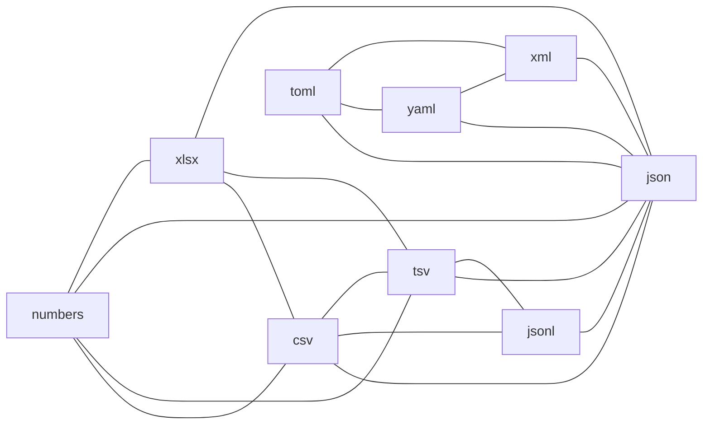
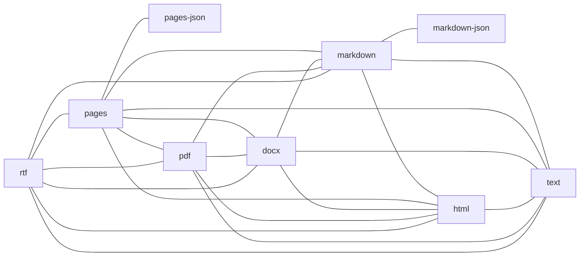
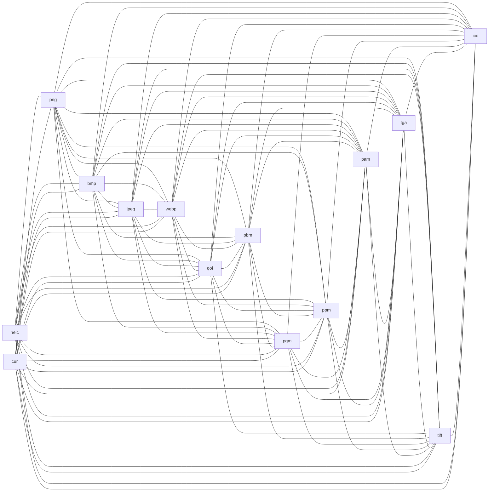
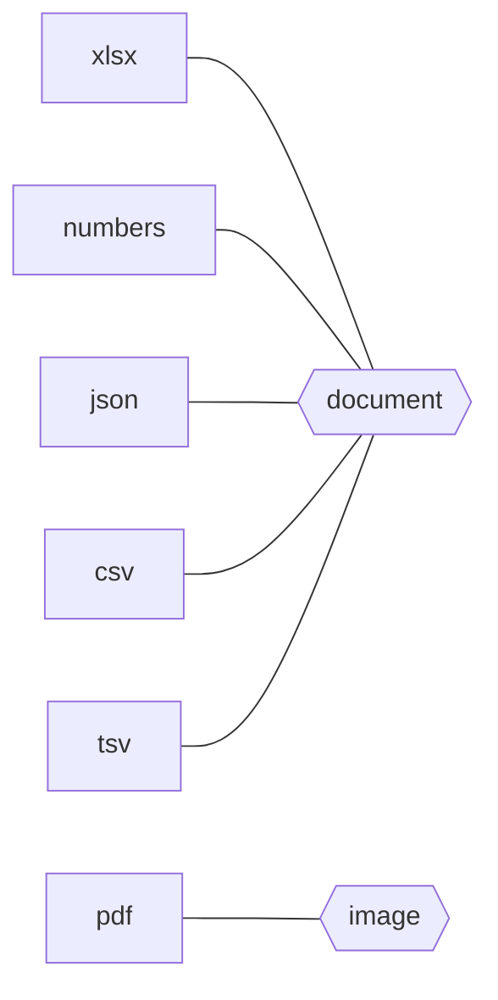

# Formats and Conversion Paths

Generated by `sublime paths --markdown`. Do not edit by hand. CI fails if this file is stale.

## Map

One graph per category and one for the crossings between them. A line joins two formats with a direct converter between them, in either direction. The grid under each graph gives every pair (rows from, columns to):  lossless,  conditional,  lossy, with the number of steps (1 is a direct converter), blank for no path. The Paths table below has each path and what it loses.

### data

```mermaid
graph LR
  csv --- json
  toml --- json
  yaml --- json
  xml --- json
  toml --- yaml
  toml --- xml
  yaml --- xml
  tsv --- json
  csv --- jsonl
  tsv --- jsonl
  csv --- tsv
  jsonl --- json
  xlsx --- csv
  xlsx --- tsv
  xlsx --- json
  numbers --- csv
  numbers --- tsv
  numbers --- json
  numbers --- xlsx
```

| from \ to | csv | json | jsonl | numbers | toml | tsv | xlsx | xml | yaml |
|---|:-:|:-:|:-:|:-:|:-:|:-:|:-:|:-:|:-:|
| **csv** | · |  1 |  1 |  1 |  2 |  1 |  1 |  2 |  2 |
| **json** |  1 | · |  1 |  1 |  1 |  1 |  1 |  1 |  1 |
| **jsonl** |  1 |  1 | · |  2 |  2 |  1 |  2 |  2 |  2 |
| **numbers** |  1 |  1 |  2 | · |  2 |  1 |  1 |  2 |  2 |
| **toml** |  2 |  1 |  2 |  2 | · |  2 |  2 |  1 |  1 |
| **tsv** |  1 |  1 |  1 |  1 |  2 | · |  1 |  2 |  2 |
| **xlsx** |  1 |  1 |  2 |  1 |  2 |  1 | · |  2 |  2 |
| **xml** |  2 |  1 |  2 |  2 |  1 |  2 |  2 | · |  1 |
| **yaml** |  2 |  1 |  2 |  2 |  1 |  2 |  2 |  1 | · |

### document

```mermaid
graph LR
  markdown_json["markdown-json"]
  pages_json["pages-json"]
  markdown --- html
  markdown --- text
  markdown --- markdown_json
  pages --- pages_json
  pages --- docx
  pages --- markdown
  pages --- html
  pages --- text
  docx --- markdown
  docx --- html
  docx --- text
  html --- text
  pdf --- text
  pdf --- markdown
  pdf --- html
  pdf --- docx
  pages --- pdf
  rtf --- pdf
  rtf --- docx
  rtf --- pages
  rtf --- markdown
  rtf --- html
  rtf --- text
```

| from \ to | docx | html | markdown | markdown-json | pages | pages-json | pdf | rtf | text |
|---|:-:|:-:|:-:|:-:|:-:|:-:|:-:|:-:|:-:|
| **docx** | · |  1 |  1 |  2 |  1 |  2 |  1 |  1 |  1 |
| **html** |  1 | · |  1 |  2 |  1 |  2 |  1 |  1 |  1 |
| **markdown** |  1 |  1 | · |  1 |  1 |  2 |  1 |  1 |  1 |
| **markdown-json** |  2 |  2 |  1 | · |  2 |  3 |  2 |  2 |  2 |
| **pages** |  1 |  1 |  1 |  2 | · |  1 |  1 |  1 |  1 |
| **pages-json** |  2 |  2 |  2 |  3 |  1 | · |  2 |  2 |  2 |
| **pdf** |  1 |  1 |  1 |  2 |  2 |  3 | · |  2 |  1 |
| **rtf** |  1 |  1 |  1 |  2 |  1 |  2 |  1 | · |  1 |
| **text** |  1 |  1 |  1 |  2 |  1 |  2 |  1 |  1 | · |

### image

```mermaid
graph LR
  png --- bmp
  png --- jpeg
  png --- webp
  png --- qoi
  png --- pbm
  png --- pgm
  png --- ppm
  png --- pam
  png --- tga
  png --- tiff
  png --- ico
  bmp --- jpeg
  bmp --- webp
  bmp --- qoi
  bmp --- pbm
  bmp --- pgm
  bmp --- ppm
  bmp --- pam
  bmp --- tga
  bmp --- tiff
  bmp --- ico
  jpeg --- webp
  jpeg --- qoi
  jpeg --- pbm
  jpeg --- pgm
  jpeg --- ppm
  jpeg --- pam
  jpeg --- tga
  jpeg --- tiff
  jpeg --- ico
  webp --- qoi
  webp --- pbm
  webp --- pgm
  webp --- ppm
  webp --- pam
  webp --- tga
  webp --- tiff
  webp --- ico
  qoi --- pbm
  qoi --- pgm
  qoi --- ppm
  qoi --- pam
  qoi --- tga
  qoi --- tiff
  qoi --- ico
  pbm --- pgm
  pbm --- ppm
  pbm --- pam
  pbm --- tga
  pbm --- tiff
  pbm --- ico
  pgm --- ppm
  pgm --- pam
  pgm --- tga
  pgm --- tiff
  pgm --- ico
  ppm --- pam
  ppm --- tga
  ppm --- tiff
  ppm --- ico
  pam --- tga
  pam --- tiff
  pam --- ico
  tga --- tiff
  tga --- ico
  tiff --- ico
  heic --- png
  heic --- bmp
  heic --- jpeg
  heic --- webp
  heic --- qoi
  heic --- pbm
  heic --- pgm
  heic --- ppm
  heic --- pam
  heic --- tga
  heic --- tiff
  heic --- ico
  cur --- png
  cur --- bmp
  cur --- jpeg
  cur --- webp
  cur --- qoi
  cur --- pbm
  cur --- pgm
  cur --- ppm
  cur --- pam
  cur --- tga
  cur --- tiff
  cur --- ico
```

| from \ to | bmp | cur | heic | ico | jpeg | pam | pbm | pgm | png | ppm | qoi | tga | tiff | webp |
|---|:-:|:-:|:-:|:-:|:-:|:-:|:-:|:-:|:-:|:-:|:-:|:-:|:-:|:-:|
| **bmp** | · |  |  |  1 |  1 |  1 |  1 |  1 |  1 |  1 |  1 |  1 |  1 |  1 |
| **cur** |  1 | · |  |  1 |  1 |  1 |  1 |  1 |  1 |  1 |  1 |  1 |  1 |  1 |
| **heic** |  1 |  | · |  1 |  1 |  1 |  1 |  1 |  1 |  1 |  1 |  1 |  1 |  1 |
| **ico** |  1 |  |  | · |  1 |  1 |  1 |  1 |  1 |  1 |  1 |  1 |  1 |  1 |
| **jpeg** |  1 |  |  |  1 | · |  1 |  1 |  1 |  1 |  1 |  1 |  1 |  1 |  1 |
| **pam** |  1 |  |  |  1 |  1 | · |  1 |  1 |  1 |  1 |  1 |  1 |  1 |  1 |
| **pbm** |  1 |  |  |  1 |  1 |  1 | · |  1 |  1 |  1 |  1 |  1 |  1 |  1 |
| **pgm** |  1 |  |  |  1 |  1 |  1 |  1 | · |  1 |  1 |  1 |  1 |  1 |  1 |
| **png** |  1 |  |  |  1 |  1 |  1 |  1 |  1 | · |  1 |  1 |  1 |  1 |  1 |
| **ppm** |  1 |  |  |  1 |  1 |  1 |  1 |  1 |  1 | · |  1 |  1 |  1 |  1 |
| **qoi** |  1 |  |  |  1 |  1 |  1 |  1 |  1 |  1 |  1 | · |  1 |  1 |  1 |
| **tga** |  1 |  |  |  1 |  1 |  1 |  1 |  1 |  1 |  1 |  1 | · |  1 |  1 |
| **tiff** |  1 |  |  |  1 |  1 |  1 |  1 |  1 |  1 |  1 |  1 |  1 | · |  1 |
| **webp** |  1 |  |  |  1 |  1 |  1 |  1 |  1 |  1 |  1 |  1 |  1 |  1 | · |

### Between categories

A format's converter into another category opens every path that category already has, so the other side is drawn as the category itself.

```mermaid
graph LR
  xlsx --- document{{document}}
  numbers --- document{{document}}
  json --- document{{document}}
  csv --- document{{document}}
  tsv --- document{{document}}
  pdf --- image{{image}}
```

## Formats

### data formats

| Id | Name | Extensions | Produced by | Consumed by |
|---|---|---|---|---|
| csv | Comma-Separated Values | csv | json-to-csv, jsonl-to-csv, tsv-to-csv, xlsx-to-csv, numbers-to-csv, markdown-to-csv | csv-to-json, csv-to-jsonl, csv-to-tsv, csv-to-numbers, csv-to-xlsx, csv-to-markdown |
| json | JSON | json | csv-to-json, toml-to-json, yaml-to-json, xml-to-json, tsv-to-json, jsonl-to-json, xlsx-to-json, numbers-to-json, markdown-tables-to-json | json-to-csv, json-to-toml, json-to-yaml, json-to-xml, json-to-tsv, json-to-jsonl, json-to-numbers, json-to-xlsx, json-to-markdown |
| jsonl | JSON Lines | jsonl, ndjson | csv-to-jsonl, tsv-to-jsonl, json-to-jsonl | jsonl-to-csv, jsonl-to-tsv, jsonl-to-json |
| numbers | Apple Numbers | numbers | csv-to-numbers, tsv-to-numbers, xlsx-to-numbers, json-to-numbers, markdown-to-numbers | numbers-to-csv, numbers-to-tsv, numbers-to-json, numbers-to-markdown, numbers-to-xlsx |
| toml | TOML | toml | json-to-toml, yaml-to-toml, xml-to-toml | toml-to-json, toml-to-yaml, toml-to-xml |
| tsv | Tab-Separated Values | tsv, tab | json-to-tsv, jsonl-to-tsv, csv-to-tsv, xlsx-to-tsv, numbers-to-tsv, markdown-to-tsv | tsv-to-json, tsv-to-jsonl, tsv-to-csv, tsv-to-numbers, tsv-to-xlsx, tsv-to-markdown |
| xlsx | Excel Workbook | xlsx | numbers-to-xlsx, markdown-to-xlsx, json-to-xlsx, csv-to-xlsx, tsv-to-xlsx | xlsx-to-csv, xlsx-to-tsv, xlsx-to-json, xlsx-to-markdown, xlsx-to-numbers |
| xml | XML | xml | json-to-xml, toml-to-xml, yaml-to-xml | xml-to-json, xml-to-toml, xml-to-yaml |
| yaml | YAML | yaml, yml | json-to-yaml, toml-to-yaml, xml-to-yaml | yaml-to-json, yaml-to-toml, yaml-to-xml |

### document formats

| Id | Name | Extensions | Produced by | Consumed by |
|---|---|---|---|---|
| docx | Word document | docx | pages-to-docx, markdown-to-docx, html-to-docx, text-to-docx, pdf-to-docx, rtf-to-docx | docx-to-markdown, docx-to-html, docx-to-text, docx-to-pages, docx-to-pdf, docx-to-rtf |
| html | HTML | html, htm | markdown-to-html, pages-to-html, docx-to-html, text-to-html, pdf-to-html, rtf-to-html | html-to-pages, html-to-markdown, html-to-text, html-to-docx, html-to-pdf, html-to-rtf |
| markdown | Markdown | md, markdown | markdown-json-to-markdown, pages-to-markdown, docx-to-markdown, html-to-markdown, text-to-markdown, pdf-to-markdown, rtf-to-markdown, xlsx-to-markdown, numbers-to-markdown, json-to-markdown, csv-to-markdown, tsv-to-markdown | markdown-to-html, markdown-to-text, markdown-to-json, markdown-to-docx, markdown-to-pages, markdown-to-pdf, markdown-to-rtf, markdown-to-numbers, markdown-to-xlsx, markdown-tables-to-json, markdown-to-csv, markdown-to-tsv |
| markdown-json | Markdown events as JSON |  | markdown-to-json | markdown-json-to-markdown |
| pages | Apple Pages | pages | json-to-pages, markdown-to-pages, text-to-pages, html-to-pages, docx-to-pages, rtf-to-pages | pages-to-json, pages-to-docx, pages-to-markdown, pages-to-html, pages-to-text, pages-to-pdf, pages-to-rtf |
| pages-json | Apple Pages package as JSON |  | pages-to-json | json-to-pages |
| pdf | PDF document | pdf | markdown-to-pdf, html-to-pdf, text-to-pdf, docx-to-pdf, pages-to-pdf, rtf-to-pdf, png-to-pdf, bmp-to-pdf, jpeg-to-pdf, webp-to-pdf, qoi-to-pdf, pbm-to-pdf, pgm-to-pdf, ppm-to-pdf, pam-to-pdf, tga-to-pdf, tiff-to-pdf, ico-to-pdf, heic-to-pdf, cur-to-pdf | pdf-to-text, pdf-to-markdown, pdf-to-html, pdf-to-docx, pdf-to-png, pdf-to-bmp, pdf-to-jpeg, pdf-to-webp, pdf-to-qoi, pdf-to-pbm, pdf-to-pgm, pdf-to-ppm, pdf-to-pam, pdf-to-tga, pdf-to-tiff, pdf-to-ico |
| rtf | Rich Text Format | rtf | docx-to-rtf, pages-to-rtf, markdown-to-rtf, html-to-rtf, text-to-rtf | rtf-to-pdf, rtf-to-docx, rtf-to-pages, rtf-to-markdown, rtf-to-html, rtf-to-text |
| text | Plain text | txt | markdown-to-text, pages-to-text, docx-to-text, html-to-text, pdf-to-text, rtf-to-text | text-to-pages, text-to-markdown, text-to-html, text-to-docx, text-to-pdf, text-to-rtf |

### image formats

| Id | Name | Extensions | Produced by | Consumed by |
|---|---|---|---|---|
| bmp | Windows bitmap | bmp, dib | png-to-bmp, jpeg-to-bmp, webp-to-bmp, qoi-to-bmp, pbm-to-bmp, pgm-to-bmp, ppm-to-bmp, pam-to-bmp, tga-to-bmp, tiff-to-bmp, ico-to-bmp, pdf-to-bmp, heic-to-bmp, cur-to-bmp | bmp-to-png, bmp-to-jpeg, bmp-to-webp, bmp-to-qoi, bmp-to-pbm, bmp-to-pgm, bmp-to-ppm, bmp-to-pam, bmp-to-tga, bmp-to-tiff, bmp-to-ico, bmp-to-pdf |
| cur | Windows cursor | cur | - | cur-to-png, cur-to-bmp, cur-to-jpeg, cur-to-webp, cur-to-qoi, cur-to-pbm, cur-to-pgm, cur-to-ppm, cur-to-pam, cur-to-tga, cur-to-tiff, cur-to-ico, cur-to-pdf |
| heic | HEIC image | heic, heif, hif | - | heic-to-png, heic-to-bmp, heic-to-jpeg, heic-to-webp, heic-to-qoi, heic-to-pbm, heic-to-pgm, heic-to-ppm, heic-to-pam, heic-to-tga, heic-to-tiff, heic-to-ico, heic-to-pdf |
| ico | Windows icon | ico | png-to-ico, bmp-to-ico, jpeg-to-ico, webp-to-ico, qoi-to-ico, pbm-to-ico, pgm-to-ico, ppm-to-ico, pam-to-ico, tga-to-ico, tiff-to-ico, pdf-to-ico, heic-to-ico, cur-to-ico | ico-to-png, ico-to-bmp, ico-to-jpeg, ico-to-webp, ico-to-qoi, ico-to-pbm, ico-to-pgm, ico-to-ppm, ico-to-pam, ico-to-tga, ico-to-tiff, ico-to-pdf |
| jpeg | JPEG image | jpg, jpeg, jpe | png-to-jpeg, bmp-to-jpeg, webp-to-jpeg, qoi-to-jpeg, pbm-to-jpeg, pgm-to-jpeg, ppm-to-jpeg, pam-to-jpeg, tga-to-jpeg, tiff-to-jpeg, ico-to-jpeg, pdf-to-jpeg, heic-to-jpeg, cur-to-jpeg | jpeg-to-png, jpeg-to-bmp, jpeg-to-webp, jpeg-to-qoi, jpeg-to-pbm, jpeg-to-pgm, jpeg-to-ppm, jpeg-to-pam, jpeg-to-tga, jpeg-to-tiff, jpeg-to-ico, jpeg-to-pdf |
| pam | Netpbm arbitrary map (PAM) | pam | png-to-pam, bmp-to-pam, jpeg-to-pam, webp-to-pam, qoi-to-pam, pbm-to-pam, pgm-to-pam, ppm-to-pam, tga-to-pam, tiff-to-pam, ico-to-pam, pdf-to-pam, heic-to-pam, cur-to-pam | pam-to-png, pam-to-bmp, pam-to-jpeg, pam-to-webp, pam-to-qoi, pam-to-pbm, pam-to-pgm, pam-to-ppm, pam-to-tga, pam-to-tiff, pam-to-ico, pam-to-pdf |
| pbm | Netpbm bitmap (PBM) | pbm | png-to-pbm, bmp-to-pbm, jpeg-to-pbm, webp-to-pbm, qoi-to-pbm, pgm-to-pbm, ppm-to-pbm, pam-to-pbm, tga-to-pbm, tiff-to-pbm, ico-to-pbm, pdf-to-pbm, heic-to-pbm, cur-to-pbm | pbm-to-png, pbm-to-bmp, pbm-to-jpeg, pbm-to-webp, pbm-to-qoi, pbm-to-pgm, pbm-to-ppm, pbm-to-pam, pbm-to-tga, pbm-to-tiff, pbm-to-ico, pbm-to-pdf |
| pgm | Netpbm graymap (PGM) | pgm | png-to-pgm, bmp-to-pgm, jpeg-to-pgm, webp-to-pgm, qoi-to-pgm, pbm-to-pgm, ppm-to-pgm, pam-to-pgm, tga-to-pgm, tiff-to-pgm, ico-to-pgm, pdf-to-pgm, heic-to-pgm, cur-to-pgm | pgm-to-png, pgm-to-bmp, pgm-to-jpeg, pgm-to-webp, pgm-to-qoi, pgm-to-pbm, pgm-to-ppm, pgm-to-pam, pgm-to-tga, pgm-to-tiff, pgm-to-ico, pgm-to-pdf |
| png | PNG image | png | bmp-to-png, jpeg-to-png, webp-to-png, qoi-to-png, pbm-to-png, pgm-to-png, ppm-to-png, pam-to-png, tga-to-png, tiff-to-png, ico-to-png, pdf-to-png, heic-to-png, cur-to-png | png-to-bmp, png-to-jpeg, png-to-webp, png-to-qoi, png-to-pbm, png-to-pgm, png-to-ppm, png-to-pam, png-to-tga, png-to-tiff, png-to-ico, png-to-pdf |
| ppm | Netpbm pixmap (PPM) | ppm, pnm | png-to-ppm, bmp-to-ppm, jpeg-to-ppm, webp-to-ppm, qoi-to-ppm, pbm-to-ppm, pgm-to-ppm, pam-to-ppm, tga-to-ppm, tiff-to-ppm, ico-to-ppm, pdf-to-ppm, heic-to-ppm, cur-to-ppm | ppm-to-png, ppm-to-bmp, ppm-to-jpeg, ppm-to-webp, ppm-to-qoi, ppm-to-pbm, ppm-to-pgm, ppm-to-pam, ppm-to-tga, ppm-to-tiff, ppm-to-ico, ppm-to-pdf |
| qoi | QOI image | qoi | png-to-qoi, bmp-to-qoi, jpeg-to-qoi, webp-to-qoi, pbm-to-qoi, pgm-to-qoi, ppm-to-qoi, pam-to-qoi, tga-to-qoi, tiff-to-qoi, ico-to-qoi, pdf-to-qoi, heic-to-qoi, cur-to-qoi | qoi-to-png, qoi-to-bmp, qoi-to-jpeg, qoi-to-webp, qoi-to-pbm, qoi-to-pgm, qoi-to-ppm, qoi-to-pam, qoi-to-tga, qoi-to-tiff, qoi-to-ico, qoi-to-pdf |
| tga | Truevision TGA image | tga, icb, vda, vst | png-to-tga, bmp-to-tga, jpeg-to-tga, webp-to-tga, qoi-to-tga, pbm-to-tga, pgm-to-tga, ppm-to-tga, pam-to-tga, tiff-to-tga, ico-to-tga, pdf-to-tga, heic-to-tga, cur-to-tga | tga-to-png, tga-to-bmp, tga-to-jpeg, tga-to-webp, tga-to-qoi, tga-to-pbm, tga-to-pgm, tga-to-ppm, tga-to-pam, tga-to-tiff, tga-to-ico, tga-to-pdf |
| tiff | TIFF image | tif, tiff | png-to-tiff, bmp-to-tiff, jpeg-to-tiff, webp-to-tiff, qoi-to-tiff, pbm-to-tiff, pgm-to-tiff, ppm-to-tiff, pam-to-tiff, tga-to-tiff, ico-to-tiff, pdf-to-tiff, heic-to-tiff, cur-to-tiff | tiff-to-png, tiff-to-bmp, tiff-to-jpeg, tiff-to-webp, tiff-to-qoi, tiff-to-pbm, tiff-to-pgm, tiff-to-ppm, tiff-to-pam, tiff-to-tga, tiff-to-ico, tiff-to-pdf |
| webp | WebP image | webp | png-to-webp, bmp-to-webp, jpeg-to-webp, qoi-to-webp, pbm-to-webp, pgm-to-webp, ppm-to-webp, pam-to-webp, tga-to-webp, tiff-to-webp, ico-to-webp, pdf-to-webp, heic-to-webp, cur-to-webp | webp-to-png, webp-to-bmp, webp-to-jpeg, webp-to-qoi, webp-to-pbm, webp-to-pgm, webp-to-ppm, webp-to-pam, webp-to-tga, webp-to-tiff, webp-to-ico, webp-to-pdf |

## Converters

| Name | From | To | Tier | Fidelity | Notes |
|---|---|---|---|---|---|
| csv-to-json | csv | json | native | lossless |  |
| json-to-csv | json | csv | native | conditional | nested values are written as JSON text, non-string scalars are written as their JSON text, null becomes an empty cell, and objects with differing key sets get empty cells for missing keys |
| markdown-to-html | markdown | html | native | lossless |  |
| markdown-to-text | markdown | text | native | lossy | markup, raw HTML, and image sources are dropped |
| markdown-to-json | markdown | markdown-json | native | lossless |  |
| markdown-json-to-markdown | markdown-json | markdown | native | lossless |  |
| pages-to-json | pages | pages-json | native | lossless |  |
| json-to-pages | pages-json | pages | native | lossless |  |
| pages-to-docx | pages | docx | native | conditional | text, named styles, lists (with their indents and numbering), links, footnotes, comments and reply threads (author, date, text, and range), tracked insertions and deletions, headers and footers, section columns and column breaks, tab stops, and paragraph borders carry over; tables keep merges, fills, borders, and cell alignment, including tables placed on the page; shapes, lines, and text boxes keep their outline, fill, stroke, and text wrap, moving with their paragraph when anchored in the text or sitting in its line, behind the text where Pages draws them there, with their arrowheads; empty paragraphs keep the size of their mark; charts become native Word charts with their data; drawings on page templates return to their header or footer; the page colour becomes the Word page colour; images keep their place |
| pages-to-markdown | pages | markdown | native | lossy | page layout, headers and footers, fonts, sizes, and colors are dropped; text boxes follow the body |
| pages-to-html | pages | html | native | lossy | page layout, headers and footers, fonts, sizes, and colors are dropped; text boxes follow the body |
| pages-to-text | pages | text | native | lossy | formatting, images, page layout, headers and footers are dropped; text boxes follow the body |
| docx-to-markdown | docx | markdown | native | lossy | page layout, headers and footers, fonts, sizes, and colors are dropped; text boxes follow the body |
| docx-to-html | docx | html | native | lossy | page layout, headers and footers, fonts, sizes, and colors are dropped; text boxes follow the body |
| docx-to-text | docx | text | native | lossy | formatting, images, page layout, headers and footers are dropped; text boxes follow the body |
| markdown-to-docx | markdown | docx | native | conditional | lossless for headings, paragraphs, lists, quotes, code, tables, links, footnotes, and images given as data URIs; raw HTML is dropped, other images become links, and loose lists come out tight |
| markdown-to-pages | markdown | pages | native | lossy | paragraphs, headings, bulleted and numbered lists, and tables reach Pages with its named styles, bold and italic runs reuse its character styles, and links become clickable hyperlinks; images are not yet written |
| text-to-pages | text | pages | native | lossy | paragraphs reach Pages as body text; text carries no other structure |
| html-to-pages | html | pages | native | lossy | paragraphs, headings, bulleted and numbered lists, and tables reach Pages with its named styles, bold and italic runs reuse its character styles, and links become clickable hyperlinks; images are not yet written |
| docx-to-pages | docx | pages | native | lossy | paragraphs, headings, bulleted and numbered lists, page size and margins, section columns (equal or of their own widths), page, column, and line breaks, and paragraph alignment, spacing, and indents reach Pages with its named styles; a run's bold, italic, colour, size, font (theme fonts included), underline, strikethrough, super- and subscript, caps, highlight, and raised or lowered text carry over (hidden text stays hidden); horizontal rules, page breaks before paragraphs, page numbering restarts, and legacy (VML) pictures and embedded objects' previews come through; any number of tables keep merged cells, shading, borders, cell margins, vertical alignment, and per-run formatting, with their lists as Pages lists (numbered ones keeping their running count across cells); nested tables flatten to tab-separated lines; headers and footers (first-page and odd/even variants, live page numbers) are native; links become clickable hyperlinks; footnotes and endnotes become Pages footnotes; comments and their reply threads keep their author, date, text, and range (overlapping ones too, and those on headers or cells are kept on the table or the body's start); tracked insertions and deletions stay tracked changes, with their authors and dates; inline images are placed with their bytes and size; shapes and text boxes (each one of a group) are drawn in place from Word's common presets with their fill and outline (those in the text line stay in it, those placed from a paragraph move with the text, and each keeps its text wrap, drawings behind the text stay behind it, arrowheads are drawn, and see-through fills are blended over the page); empty paragraphs keep the height of their paragraph mark; a document without headers or footers turns them off; drawings in headers and footers repeat on the pages of their variant; placement by page share, alignment, and relative size is honoured; the page colour fills the pages; framed paragraphs (page numbers beside a footer's text, positioned frames in the body) keep their place; pictures offered as PDF or metafile with a PNG fallback use the PNG; consecutive and trailing page breaks keep their pages; form checkboxes become box characters; charts become a table of their data and line arrowheads are not drawn |
| html-to-markdown | html | markdown | native | lossy | scripts, styles, forms, and layout are dropped; elements without a Markdown form keep their text |
| html-to-text | html | text | native | lossy | markup, scripts, styles, and image sources are dropped |
| html-to-docx | html | docx | native | conditional | lossless for headings, paragraphs, lists, quotes, code, tables, links, footnotes, and images given as data URIs; scripts, styles, forms, and layout are dropped, and other images become links |
| text-to-markdown | text | markdown | native | conditional | paragraphs are runs of lines separated by blank lines; text that looks like Markdown is escaped so it reads as written |
| text-to-html | text | html | native | conditional | paragraphs are runs of lines separated by blank lines; the text itself is kept exactly |
| text-to-docx | text | docx | native | conditional | paragraphs are runs of lines separated by blank lines; line breaks inside a paragraph become spaces |
| pdf-to-text | pdf | text | native | lossy | fonts, layout, images, and drawings are dropped; reading order is the order the page draws its text in; text in pages that are pictures (scans) is not read |
| pdf-to-markdown | pdf | markdown | native | lossy | headings are read from type size and weight and list items from their markers; fonts, layout, tables, images, and drawings are dropped; reading order is the order the page draws its text in; text in pages that are pictures (scans) is not read |
| pdf-to-html | pdf | html | native | lossy | headings are read from type size and weight and list items from their markers; fonts, layout, tables, images, and drawings are dropped; reading order is the order the page draws its text in; text in pages that are pictures (scans) is not read |
| pdf-to-docx | pdf | docx | native | lossy | headings are read from type size and weight and list items from their markers; fonts, layout, tables, images, and drawings are dropped; reading order is the order the page draws its text in; text in pages that are pictures (scans) is not read |
| markdown-to-pdf | markdown | pdf | native | conditional | set on Letter pages in Helvetica and Courier, with fonts installed on this machine (subset and embedded) for other scripts; images set as blocks at their size, scaled to the page (JPEG embedded unchanged), and shown by their alt text when not found (web addresses are not fetched), not readable (GIF), or in a table; raw HTML is dropped, and characters no installed font covers become ? |
| html-to-pdf | html | pdf | native | conditional | set on Letter pages in Helvetica and Courier, with fonts installed on this machine (subset and embedded) for other scripts; images set as blocks at their size, scaled to the page (JPEG embedded unchanged), and shown by their alt text when not found (web addresses are not fetched), not readable (GIF), or in a table; raw HTML is dropped, and characters no installed font covers become ? |
| text-to-pdf | text | pdf | native | conditional | set on Letter pages in Helvetica and Courier, with fonts installed on this machine (subset and embedded) for other scripts; images set as blocks at their size, scaled to the page (JPEG embedded unchanged), and shown by their alt text when not found (web addresses are not fetched), not readable (GIF), or in a table; raw HTML is dropped, and characters no installed font covers become ? |
| docx-to-pdf | docx | pdf | native | conditional | set on Letter pages in Helvetica and Courier, with fonts installed on this machine (subset and embedded) for other scripts; images set as blocks at their size, scaled to the page (JPEG embedded unchanged), and shown by their alt text when not found (web addresses are not fetched), not readable (GIF), or in a table; raw HTML is dropped, and characters no installed font covers become ? |
| pages-to-pdf | pages | pdf | native | conditional | set on Letter pages in Helvetica and Courier, with fonts installed on this machine (subset and embedded) for other scripts; images set as blocks at their size, scaled to the page (JPEG embedded unchanged), and shown by their alt text when not found (web addresses are not fetched), not readable (GIF), or in a table; raw HTML is dropped, and characters no installed font covers become ? |
| rtf-to-pdf | rtf | pdf | native | conditional | set on Letter pages in Helvetica and Courier, with fonts installed on this machine (subset and embedded) for other scripts; images set as blocks at their size, scaled to the page (JPEG embedded unchanged), and shown by their alt text when not found (web addresses are not fetched), not readable (GIF), or in a table; raw HTML is dropped, and characters no installed font covers become ? |
| rtf-to-docx | rtf | docx | native | lossy | paragraphs, named styles, run and paragraph formatting, lists, tables (merged cells, borders, shading, nesting), sections with page setup, columns, headers, and footers, links, page-number fields, footnotes, comments, tracked changes, pictures (PNG, JPEG, EMF, WMF, bitmaps), text boxes, and the page colour carry over; other fields keep their shown text, drawn shapes without text, OLE objects (their picture is kept), and text in double-byte code pages without Unicode escapes are not carried |
| rtf-to-pages | rtf | pages | native | lossy | paragraphs, named styles, run and paragraph formatting, lists, tables (merged cells, borders, shading, nesting), sections with page setup, columns, headers, and footers, links, page-number fields, footnotes, comments, tracked changes, pictures (PNG, JPEG, EMF, WMF, bitmaps), text boxes, and the page colour carry over; other fields keep their shown text, drawn shapes without text, OLE objects (their picture is kept), and text in double-byte code pages without Unicode escapes are not carried |
| rtf-to-markdown | rtf | markdown | native | lossy | headings, paragraphs, emphasis, lists, tables, links, footnotes, and images by name carry over; fonts, sizes, colours, alignment, page setup, headers and footers, comments, and tracked changes (insertions kept, deletions dropped) do not |
| rtf-to-html | rtf | html | native | lossy | headings, paragraphs, emphasis, lists, tables, links, footnotes, and images by name carry over; fonts, sizes, colours, alignment, page setup, headers and footers, comments, and tracked changes (insertions kept, deletions dropped) do not |
| rtf-to-text | rtf | text | native | lossy | the text of paragraphs, lists, tables, and footnotes; all formatting, pictures, and comments are dropped |
| docx-to-rtf | docx | rtf | native | lossy | paragraphs, named styles, run and paragraph formatting, lists (restarts and start numbers kept), tables (merged cells, borders, shading, nesting), sections with page setup, columns, headers, and footers, links, page-number fields, footnotes, comments with their replies, tracked changes, pictures (PNG, JPEG, EMF, WMF, BMP), text boxes, and the page colour carry over; charts, equations (their text is kept), and pictures in other formats do not |
| pages-to-rtf | pages | rtf | native | lossy | paragraphs, named styles, run and paragraph formatting, lists, tables, sections, headers and footers, links, footnotes, comments, tracked changes, pictures, text boxes, and the page colour carry over; charts and pictures in formats RTF cannot hold do not |
| markdown-to-rtf | markdown | rtf | native | lossy | headings, paragraphs, emphasis, lists, tables, links, footnotes, and code carry over as RTF formatting; images are kept only when the source holds their bytes |
| html-to-rtf | html | rtf | native | lossy | headings, paragraphs, emphasis, lists, tables, links, footnotes, and code carry over as RTF formatting; images are kept only when the source holds their bytes |
| text-to-rtf | text | rtf | native | lossy | headings, paragraphs, emphasis, lists, tables, links, footnotes, and code carry over as RTF formatting; images are kept only when the source holds their bytes |
| toml-to-json | toml | json | native | conditional | dates, times, infinities, and NaN become strings |
| json-to-toml | json | toml | native | conditional | the root must be an object; nulls are dropped; integers beyond 64 bits become floats |
| yaml-to-json | yaml | json | native | conditional | anchors are expanded, tags outside the core schema are dropped, keys become strings, infinities and NaN become strings, a multi-document stream becomes an array |
| json-to-yaml | json | yaml | native | lossless |  |
| xml-to-json | xml | json | native | conditional | attributes become @-keys, text #text, repeated elements arrays, every value a string; comments, processing instructions, the doctype, and the order of text against elements in mixed content are dropped |
| json-to-xml | json | xml | native | conditional | @-keys become attributes, #text the text, arrays repeated elements; the root object must have one member, otherwise it is wrapped in &lt;root&gt;; numbers, booleans, and nulls become text |
| toml-to-yaml | toml | yaml | native | conditional | dates and times become strings |
| yaml-to-toml | yaml | toml | native | conditional | anchors are expanded, tags outside the core schema are dropped, keys become strings; the document must be a mapping and nulls are dropped |
| toml-to-xml | toml | xml | native | conditional | a document without one root member is wrapped in &lt;root&gt;, and numbers, booleans, and dates become text |
| xml-to-toml | xml | toml | native | conditional | attributes become @-keys, text #text, repeated elements arrays, every value a string; comments, processing instructions, the doctype, and mixed-content order are dropped; empty elements are dropped |
| yaml-to-xml | yaml | xml | native | conditional | anchors are expanded, tags outside the core schema are dropped, keys become strings; a document without one root member is wrapped in &lt;root&gt;, and numbers, booleans, and nulls become text |
| xml-to-yaml | xml | yaml | native | conditional | attributes become @-keys, text #text, repeated elements arrays, every value a string; comments, processing instructions, the doctype, and the order of text against elements in mixed content are dropped |
| tsv-to-json | tsv | json | native | lossless |  |
| csv-to-jsonl | csv | jsonl | native | lossless |  |
| tsv-to-jsonl | tsv | jsonl | native | lossless |  |
| json-to-tsv | json | tsv | native | conditional | nested values are written as JSON text, non-string scalars are written as their JSON text, null becomes an empty cell, and objects with differing key sets get empty cells for missing keys |
| jsonl-to-csv | jsonl | csv | native | conditional | nested values are written as JSON text, non-string scalars are written as their JSON text, null becomes an empty cell, and objects with differing key sets get empty cells for missing keys |
| jsonl-to-tsv | jsonl | tsv | native | conditional | nested values are written as JSON text, non-string scalars are written as their JSON text, null becomes an empty cell, and objects with differing key sets get empty cells for missing keys |
| csv-to-tsv | csv | tsv | native | lossless |  |
| tsv-to-csv | tsv | csv | native | lossless |  |
| jsonl-to-json | jsonl | json | native | lossless |  |
| json-to-jsonl | json | jsonl | native | conditional | an array becomes one line per element; any other root becomes one line |
| xlsx-to-csv | xlsx | csv | native | conditional | each sheet its own file (or the one --sheet picks); numbers as stored, dates as ISO 8601, booleans as TRUE and FALSE, formulas as their last value; formatting is dropped |
| xlsx-to-tsv | xlsx | tsv | native | conditional | each sheet its own file (or the one --sheet picks); numbers as stored, dates as ISO 8601, booleans as TRUE and FALSE, formulas as their last value; formatting is dropped |
| xlsx-to-json | xlsx | json | native | conditional | one sheet as an array of objects keyed by its header row, several as an object of such arrays keyed by sheet name (or the one --sheet picks); every value as text: numbers as stored, dates as ISO 8601, booleans as TRUE and FALSE, formulas as their last value; formatting is dropped |
| xlsx-to-markdown | xlsx | markdown | native | conditional | each sheet a table under a heading of its name (one sheet, a table alone), the first row as the header; every value as text, rows padded or cut to the header's width, line breaks inside cells as spaces; formatting is dropped |
| numbers-to-csv | numbers | csv | native | conditional | each table its own file (or the one --sheet picks), named after its sheet; cells as Numbers shows them, merged-over cells empty; formatting, formulas, charts, and pictures are dropped |
| numbers-to-tsv | numbers | tsv | native | conditional | each table its own file (or the one --sheet picks), named after its sheet; cells as Numbers shows them, merged-over cells empty; formatting, formulas, charts, and pictures are dropped |
| numbers-to-json | numbers | json | native | conditional | one table as an array of objects keyed by its header row, several as an object of such arrays keyed by table name (or the one --sheet picks); cells as Numbers shows them, as text; formatting, formulas, charts, and pictures are dropped |
| numbers-to-markdown | numbers | markdown | native | conditional | each table under a heading of its name (one table, the table alone), the first row as the header; cells as Numbers shows them, line breaks inside cells as spaces; formatting, formulas, charts, and pictures are dropped |
| numbers-to-xlsx | numbers | xlsx | native | conditional | each table a worksheet (or the one --sheet picks); numbers, dates, and booleans as cells of their type, everything else as text; merged cells kept; formatting, formulas, charts, and pictures are dropped |
| csv-to-numbers | csv | numbers | native | conditional | a sheet per worksheet (delimited rows one sheet, JSON a sheet per table), each one table with its first row the header; plain decimals become numbers, ISO 8601 dates and dates with times dates, TRUE and FALSE booleans, everything else text; a workbook's number and date formats where Numbers has the same (decimals, currency, percent, scientific, fraction, date patterns) and its merged cells; Numbers' default table style otherwise |
| tsv-to-numbers | tsv | numbers | native | conditional | a sheet per worksheet (delimited rows one sheet, JSON a sheet per table), each one table with its first row the header; plain decimals become numbers, ISO 8601 dates and dates with times dates, TRUE and FALSE booleans, everything else text; a workbook's number and date formats where Numbers has the same (decimals, currency, percent, scientific, fraction, date patterns) and its merged cells; Numbers' default table style otherwise |
| xlsx-to-numbers | xlsx | numbers | native | conditional | a sheet per worksheet (delimited rows one sheet, JSON a sheet per table), each one table with its first row the header; plain decimals become numbers, ISO 8601 dates and dates with times dates, TRUE and FALSE booleans, everything else text; a workbook's number and date formats where Numbers has the same (decimals, currency, percent, scientific, fraction, date patterns) and its merged cells; Numbers' default table style otherwise |
| json-to-numbers | json | numbers | native | conditional | a sheet per worksheet (delimited rows one sheet, JSON a sheet per table), each one table with its first row the header; plain decimals become numbers, ISO 8601 dates and dates with times dates, TRUE and FALSE booleans, everything else text; a workbook's number and date formats where Numbers has the same (decimals, currency, percent, scientific, fraction, date patterns) and its merged cells; Numbers' default table style otherwise |
| markdown-to-numbers | markdown | numbers | native | lossy | the document's tables as tables of one sheet, each named after the heading before it, its first row the header; plain decimals become numbers, ISO 8601 dates and dates with times dates, TRUE and FALSE booleans, everything else text; everything but the tables is dropped |
| markdown-to-xlsx | markdown | xlsx | native | lossy | each of the document's tables a sheet, named after the heading before it, inline formatting flattened to text, decimals as numbers, ISO dates as dates, and TRUE and FALSE as booleans; everything else in the document is dropped |
| json-to-xlsx | json | xlsx | native | conditional | an array of objects as one sheet, an object of such arrays as a sheet per member; keys become the header row, nested values JSON text, decimals numbers, ISO date strings dates (JSON true and false stay text: a workbook boolean reads back as TRUE), and objects with differing key sets get empty cells for missing keys |
| markdown-tables-to-json | markdown | json | native | lossy | the document's tables only: one as an array of objects keyed by its header, several as an object of such arrays keyed by the heading before each; inline formatting is flattened to text and everything else in the document is dropped |
| json-to-markdown | json | markdown | native | conditional | an array of objects as one table, an object of such arrays as a table under a heading per member; keys become the header row, nested values JSON text, and line breaks inside cells spaces |
| csv-to-xlsx | csv | xlsx | native | conditional | plain decimals of up to fifteen digits become numbers, ISO 8601 dates, dates and times, and times become dates shown in the same form, TRUE and FALSE become booleans, everything else stays text; one sheet named Sheet1 |
| tsv-to-xlsx | tsv | xlsx | native | conditional | plain decimals of up to fifteen digits become numbers, ISO 8601 dates, dates and times, and times become dates shown in the same form, TRUE and FALSE become booleans, everything else stays text; one sheet named Sheet1 |
| csv-to-markdown | csv | markdown | native | conditional | one table with the first row as the header; rows are padded or cut to the header's width and line breaks inside cells become spaces |
| tsv-to-markdown | tsv | markdown | native | conditional | one table with the first row as the header; rows are padded or cut to the header's width and line breaks inside cells become spaces |
| markdown-to-csv | markdown | csv | native | lossy | each of the document's tables its own file, named after the heading before it, inline formatting flattened to text; everything else in the document is dropped |
| markdown-to-tsv | markdown | tsv | native | lossy | each of the document's tables its own file, named after the heading before it, inline formatting flattened to text; everything else in the document is dropped |
| png-to-bmp | png | bmp | native | conditional | 16-bit samples stay 16-bit into PNG, TIFF, and Netpbm and become 8-bit elsewhere (and from interlaced files); metadata (gamma, color profile, text) is dropped |
| png-to-jpeg | png | jpeg | native | lossy | 16-bit samples stay 16-bit into PNG, TIFF, and Netpbm and become 8-bit elsewhere (and from interlaced files); metadata (gamma, color profile, text) is dropped; JPEG is lossy: the image is re-encoded at the quality given (85 by default, 4:2:0 chroma below 90) and alpha is flattened onto white |
| png-to-webp | png | webp | native | conditional | 16-bit samples stay 16-bit into PNG, TIFF, and Netpbm and become 8-bit elsewhere (and from interlaced files); metadata (gamma, color profile, text) is dropped |
| png-to-qoi | png | qoi | native | conditional | 16-bit samples stay 16-bit into PNG, TIFF, and Netpbm and become 8-bit elsewhere (and from interlaced files); metadata (gamma, color profile, text) is dropped |
| png-to-pbm | png | pbm | native | lossy | 16-bit samples stay 16-bit into PNG, TIFF, and Netpbm and become 8-bit elsewhere (and from interlaced files); metadata (gamma, color profile, text) is dropped; black and white: color becomes luma, alpha is flattened onto white, and gray below half is black |
| png-to-pgm | png | pgm | native | conditional | 16-bit samples stay 16-bit into PNG, TIFF, and Netpbm and become 8-bit elsewhere (and from interlaced files); metadata (gamma, color profile, text) is dropped; color becomes luma and alpha is flattened onto white |
| png-to-ppm | png | ppm | native | conditional | 16-bit samples stay 16-bit into PNG, TIFF, and Netpbm and become 8-bit elsewhere (and from interlaced files); metadata (gamma, color profile, text) is dropped; alpha is flattened onto white |
| png-to-pam | png | pam | native | conditional | 16-bit samples stay 16-bit into PNG, TIFF, and Netpbm and become 8-bit elsewhere (and from interlaced files); metadata (gamma, color profile, text) is dropped |
| png-to-tga | png | tga | native | conditional | 16-bit samples stay 16-bit into PNG, TIFF, and Netpbm and become 8-bit elsewhere (and from interlaced files); metadata (gamma, color profile, text) is dropped |
| png-to-tiff | png | tiff | native | conditional | 16-bit samples stay 16-bit into PNG, TIFF, and Netpbm and become 8-bit elsewhere (and from interlaced files); metadata (gamma, color profile, text) is dropped |
| png-to-ico | png | ico | native | conditional | 16-bit samples stay 16-bit into PNG, TIFF, and Netpbm and become 8-bit elsewhere (and from interlaced files); metadata (gamma, color profile, text) is dropped; the image is the icon's largest size (scaled down to 256 pixels if larger), with the standard smaller sizes added, scaled by area averaging |
| png-to-pdf | png | pdf | native | conditional | 16-bit samples stay 16-bit into PNG, TIFF, and Netpbm and become 8-bit elsewhere (and from interlaced files); metadata (gamma, color profile, text) is dropped |
| bmp-to-png | bmp | png | native | lossless |  |
| bmp-to-jpeg | bmp | jpeg | native | lossy | JPEG is lossy: the image is re-encoded at the quality given (85 by default, 4:2:0 chroma below 90) and alpha is flattened onto white |
| bmp-to-webp | bmp | webp | native | lossless |  |
| bmp-to-qoi | bmp | qoi | native | lossless |  |
| bmp-to-pbm | bmp | pbm | native | lossy | black and white: color becomes luma, alpha is flattened onto white, and gray below half is black |
| bmp-to-pgm | bmp | pgm | native | conditional | color becomes luma and alpha is flattened onto white |
| bmp-to-ppm | bmp | ppm | native | conditional | alpha is flattened onto white |
| bmp-to-pam | bmp | pam | native | lossless |  |
| bmp-to-tga | bmp | tga | native | lossless |  |
| bmp-to-tiff | bmp | tiff | native | lossless |  |
| bmp-to-ico | bmp | ico | native | conditional | the image is the icon's largest size (scaled down to 256 pixels if larger), with the standard smaller sizes added, scaled by area averaging |
| bmp-to-pdf | bmp | pdf | native | lossless |  |
| jpeg-to-png | jpeg | png | native | conditional | pixels as decoded, turned upright by their Exif orientation; the color profile and Exif are carried into PNG and JPEG and dropped elsewhere, as are XMP and comments |
| jpeg-to-bmp | jpeg | bmp | native | conditional | pixels as decoded, turned upright by their Exif orientation; the color profile and Exif are carried into PNG and JPEG and dropped elsewhere, as are XMP and comments |
| jpeg-to-webp | jpeg | webp | native | conditional | pixels as decoded, turned upright by their Exif orientation; the color profile and Exif are carried into PNG and JPEG and dropped elsewhere, as are XMP and comments |
| jpeg-to-qoi | jpeg | qoi | native | conditional | pixels as decoded, turned upright by their Exif orientation; the color profile and Exif are carried into PNG and JPEG and dropped elsewhere, as are XMP and comments |
| jpeg-to-pbm | jpeg | pbm | native | lossy | pixels as decoded, turned upright by their Exif orientation; the color profile and Exif are carried into PNG and JPEG and dropped elsewhere, as are XMP and comments; black and white: color becomes luma, alpha is flattened onto white, and gray below half is black |
| jpeg-to-pgm | jpeg | pgm | native | conditional | pixels as decoded, turned upright by their Exif orientation; the color profile and Exif are carried into PNG and JPEG and dropped elsewhere, as are XMP and comments; color becomes luma and alpha is flattened onto white |
| jpeg-to-ppm | jpeg | ppm | native | conditional | pixels as decoded, turned upright by their Exif orientation; the color profile and Exif are carried into PNG and JPEG and dropped elsewhere, as are XMP and comments; alpha is flattened onto white |
| jpeg-to-pam | jpeg | pam | native | conditional | pixels as decoded, turned upright by their Exif orientation; the color profile and Exif are carried into PNG and JPEG and dropped elsewhere, as are XMP and comments |
| jpeg-to-tga | jpeg | tga | native | conditional | pixels as decoded, turned upright by their Exif orientation; the color profile and Exif are carried into PNG and JPEG and dropped elsewhere, as are XMP and comments |
| jpeg-to-tiff | jpeg | tiff | native | conditional | pixels as decoded, turned upright by their Exif orientation; the color profile and Exif are carried into PNG and JPEG and dropped elsewhere, as are XMP and comments |
| jpeg-to-ico | jpeg | ico | native | conditional | pixels as decoded, turned upright by their Exif orientation; the color profile and Exif are carried into PNG and JPEG and dropped elsewhere, as are XMP and comments; the image is the icon's largest size (scaled down to 256 pixels if larger), with the standard smaller sizes added, scaled by area averaging |
| jpeg-to-pdf | jpeg | pdf | native | lossless |  |
| webp-to-png | webp | png | native | conditional | pixels as decoded (a lossy WebP decodes exactly as libwebp does); an animation keeps its first frame; metadata (ICC, Exif, XMP) is dropped |
| webp-to-bmp | webp | bmp | native | conditional | pixels as decoded (a lossy WebP decodes exactly as libwebp does); an animation keeps its first frame; metadata (ICC, Exif, XMP) is dropped |
| webp-to-jpeg | webp | jpeg | native | lossy | pixels as decoded (a lossy WebP decodes exactly as libwebp does); an animation keeps its first frame; metadata (ICC, Exif, XMP) is dropped; JPEG is lossy: the image is re-encoded at the quality given (85 by default, 4:2:0 chroma below 90) and alpha is flattened onto white |
| webp-to-qoi | webp | qoi | native | conditional | pixels as decoded (a lossy WebP decodes exactly as libwebp does); an animation keeps its first frame; metadata (ICC, Exif, XMP) is dropped |
| webp-to-pbm | webp | pbm | native | lossy | pixels as decoded (a lossy WebP decodes exactly as libwebp does); an animation keeps its first frame; metadata (ICC, Exif, XMP) is dropped; black and white: color becomes luma, alpha is flattened onto white, and gray below half is black |
| webp-to-pgm | webp | pgm | native | conditional | pixels as decoded (a lossy WebP decodes exactly as libwebp does); an animation keeps its first frame; metadata (ICC, Exif, XMP) is dropped; color becomes luma and alpha is flattened onto white |
| webp-to-ppm | webp | ppm | native | conditional | pixels as decoded (a lossy WebP decodes exactly as libwebp does); an animation keeps its first frame; metadata (ICC, Exif, XMP) is dropped; alpha is flattened onto white |
| webp-to-pam | webp | pam | native | conditional | pixels as decoded (a lossy WebP decodes exactly as libwebp does); an animation keeps its first frame; metadata (ICC, Exif, XMP) is dropped |
| webp-to-tga | webp | tga | native | conditional | pixels as decoded (a lossy WebP decodes exactly as libwebp does); an animation keeps its first frame; metadata (ICC, Exif, XMP) is dropped |
| webp-to-tiff | webp | tiff | native | conditional | pixels as decoded (a lossy WebP decodes exactly as libwebp does); an animation keeps its first frame; metadata (ICC, Exif, XMP) is dropped |
| webp-to-ico | webp | ico | native | conditional | pixels as decoded (a lossy WebP decodes exactly as libwebp does); an animation keeps its first frame; metadata (ICC, Exif, XMP) is dropped; the image is the icon's largest size (scaled down to 256 pixels if larger), with the standard smaller sizes added, scaled by area averaging |
| webp-to-pdf | webp | pdf | native | conditional | pixels as decoded (a lossy WebP decodes exactly as libwebp does); an animation keeps its first frame; metadata (ICC, Exif, XMP) is dropped |
| qoi-to-png | qoi | png | native | lossless |  |
| qoi-to-bmp | qoi | bmp | native | lossless |  |
| qoi-to-jpeg | qoi | jpeg | native | lossy | JPEG is lossy: the image is re-encoded at the quality given (85 by default, 4:2:0 chroma below 90) and alpha is flattened onto white |
| qoi-to-webp | qoi | webp | native | lossless |  |
| qoi-to-pbm | qoi | pbm | native | lossy | black and white: color becomes luma, alpha is flattened onto white, and gray below half is black |
| qoi-to-pgm | qoi | pgm | native | conditional | color becomes luma and alpha is flattened onto white |
| qoi-to-ppm | qoi | ppm | native | conditional | alpha is flattened onto white |
| qoi-to-pam | qoi | pam | native | lossless |  |
| qoi-to-tga | qoi | tga | native | lossless |  |
| qoi-to-tiff | qoi | tiff | native | lossless |  |
| qoi-to-ico | qoi | ico | native | conditional | the image is the icon's largest size (scaled down to 256 pixels if larger), with the standard smaller sizes added, scaled by area averaging |
| qoi-to-pdf | qoi | pdf | native | lossless |  |
| pbm-to-png | pbm | png | native | lossless |  |
| pbm-to-bmp | pbm | bmp | native | lossless |  |
| pbm-to-jpeg | pbm | jpeg | native | lossy | JPEG is lossy: the image is re-encoded at the quality given (85 by default, 4:2:0 chroma below 90) and alpha is flattened onto white |
| pbm-to-webp | pbm | webp | native | lossless |  |
| pbm-to-qoi | pbm | qoi | native | lossless |  |
| pbm-to-pgm | pbm | pgm | native | conditional | color becomes luma and alpha is flattened onto white |
| pbm-to-ppm | pbm | ppm | native | conditional | alpha is flattened onto white |
| pbm-to-pam | pbm | pam | native | lossless |  |
| pbm-to-tga | pbm | tga | native | lossless |  |
| pbm-to-tiff | pbm | tiff | native | lossless |  |
| pbm-to-ico | pbm | ico | native | conditional | the image is the icon's largest size (scaled down to 256 pixels if larger), with the standard smaller sizes added, scaled by area averaging |
| pbm-to-pdf | pbm | pdf | native | lossless |  |
| pgm-to-png | pgm | png | native | conditional | samples wider than 8 bits (maxval over 255) are scaled to 16 bits into PNG, TIFF, and Netpbm and to 8 bits elsewhere |
| pgm-to-bmp | pgm | bmp | native | conditional | samples wider than 8 bits (maxval over 255) are scaled to 16 bits into PNG, TIFF, and Netpbm and to 8 bits elsewhere |
| pgm-to-jpeg | pgm | jpeg | native | lossy | samples wider than 8 bits (maxval over 255) are scaled to 16 bits into PNG, TIFF, and Netpbm and to 8 bits elsewhere; JPEG is lossy: the image is re-encoded at the quality given (85 by default, 4:2:0 chroma below 90) and alpha is flattened onto white |
| pgm-to-webp | pgm | webp | native | conditional | samples wider than 8 bits (maxval over 255) are scaled to 16 bits into PNG, TIFF, and Netpbm and to 8 bits elsewhere |
| pgm-to-qoi | pgm | qoi | native | conditional | samples wider than 8 bits (maxval over 255) are scaled to 16 bits into PNG, TIFF, and Netpbm and to 8 bits elsewhere |
| pgm-to-pbm | pgm | pbm | native | lossy | samples wider than 8 bits (maxval over 255) are scaled to 16 bits into PNG, TIFF, and Netpbm and to 8 bits elsewhere; black and white: color becomes luma, alpha is flattened onto white, and gray below half is black |
| pgm-to-ppm | pgm | ppm | native | conditional | samples wider than 8 bits (maxval over 255) are scaled to 16 bits into PNG, TIFF, and Netpbm and to 8 bits elsewhere; alpha is flattened onto white |
| pgm-to-pam | pgm | pam | native | conditional | samples wider than 8 bits (maxval over 255) are scaled to 16 bits into PNG, TIFF, and Netpbm and to 8 bits elsewhere |
| pgm-to-tga | pgm | tga | native | conditional | samples wider than 8 bits (maxval over 255) are scaled to 16 bits into PNG, TIFF, and Netpbm and to 8 bits elsewhere |
| pgm-to-tiff | pgm | tiff | native | conditional | samples wider than 8 bits (maxval over 255) are scaled to 16 bits into PNG, TIFF, and Netpbm and to 8 bits elsewhere |
| pgm-to-ico | pgm | ico | native | conditional | samples wider than 8 bits (maxval over 255) are scaled to 16 bits into PNG, TIFF, and Netpbm and to 8 bits elsewhere; the image is the icon's largest size (scaled down to 256 pixels if larger), with the standard smaller sizes added, scaled by area averaging |
| pgm-to-pdf | pgm | pdf | native | conditional | samples wider than 8 bits (maxval over 255) are scaled to 16 bits into PNG, TIFF, and Netpbm and to 8 bits elsewhere |
| ppm-to-png | ppm | png | native | conditional | samples wider than 8 bits (maxval over 255) are scaled to 16 bits into PNG, TIFF, and Netpbm and to 8 bits elsewhere |
| ppm-to-bmp | ppm | bmp | native | conditional | samples wider than 8 bits (maxval over 255) are scaled to 16 bits into PNG, TIFF, and Netpbm and to 8 bits elsewhere |
| ppm-to-jpeg | ppm | jpeg | native | lossy | samples wider than 8 bits (maxval over 255) are scaled to 16 bits into PNG, TIFF, and Netpbm and to 8 bits elsewhere; JPEG is lossy: the image is re-encoded at the quality given (85 by default, 4:2:0 chroma below 90) and alpha is flattened onto white |
| ppm-to-webp | ppm | webp | native | conditional | samples wider than 8 bits (maxval over 255) are scaled to 16 bits into PNG, TIFF, and Netpbm and to 8 bits elsewhere |
| ppm-to-qoi | ppm | qoi | native | conditional | samples wider than 8 bits (maxval over 255) are scaled to 16 bits into PNG, TIFF, and Netpbm and to 8 bits elsewhere |
| ppm-to-pbm | ppm | pbm | native | lossy | samples wider than 8 bits (maxval over 255) are scaled to 16 bits into PNG, TIFF, and Netpbm and to 8 bits elsewhere; black and white: color becomes luma, alpha is flattened onto white, and gray below half is black |
| ppm-to-pgm | ppm | pgm | native | conditional | samples wider than 8 bits (maxval over 255) are scaled to 16 bits into PNG, TIFF, and Netpbm and to 8 bits elsewhere; color becomes luma and alpha is flattened onto white |
| ppm-to-pam | ppm | pam | native | conditional | samples wider than 8 bits (maxval over 255) are scaled to 16 bits into PNG, TIFF, and Netpbm and to 8 bits elsewhere |
| ppm-to-tga | ppm | tga | native | conditional | samples wider than 8 bits (maxval over 255) are scaled to 16 bits into PNG, TIFF, and Netpbm and to 8 bits elsewhere |
| ppm-to-tiff | ppm | tiff | native | conditional | samples wider than 8 bits (maxval over 255) are scaled to 16 bits into PNG, TIFF, and Netpbm and to 8 bits elsewhere |
| ppm-to-ico | ppm | ico | native | conditional | samples wider than 8 bits (maxval over 255) are scaled to 16 bits into PNG, TIFF, and Netpbm and to 8 bits elsewhere; the image is the icon's largest size (scaled down to 256 pixels if larger), with the standard smaller sizes added, scaled by area averaging |
| ppm-to-pdf | ppm | pdf | native | conditional | samples wider than 8 bits (maxval over 255) are scaled to 16 bits into PNG, TIFF, and Netpbm and to 8 bits elsewhere |
| pam-to-png | pam | png | native | conditional | samples wider than 8 bits (maxval over 255) are scaled to 16 bits into PNG, TIFF, and Netpbm and to 8 bits elsewhere |
| pam-to-bmp | pam | bmp | native | conditional | samples wider than 8 bits (maxval over 255) are scaled to 16 bits into PNG, TIFF, and Netpbm and to 8 bits elsewhere |
| pam-to-jpeg | pam | jpeg | native | lossy | samples wider than 8 bits (maxval over 255) are scaled to 16 bits into PNG, TIFF, and Netpbm and to 8 bits elsewhere; JPEG is lossy: the image is re-encoded at the quality given (85 by default, 4:2:0 chroma below 90) and alpha is flattened onto white |
| pam-to-webp | pam | webp | native | conditional | samples wider than 8 bits (maxval over 255) are scaled to 16 bits into PNG, TIFF, and Netpbm and to 8 bits elsewhere |
| pam-to-qoi | pam | qoi | native | conditional | samples wider than 8 bits (maxval over 255) are scaled to 16 bits into PNG, TIFF, and Netpbm and to 8 bits elsewhere |
| pam-to-pbm | pam | pbm | native | lossy | samples wider than 8 bits (maxval over 255) are scaled to 16 bits into PNG, TIFF, and Netpbm and to 8 bits elsewhere; black and white: color becomes luma, alpha is flattened onto white, and gray below half is black |
| pam-to-pgm | pam | pgm | native | conditional | samples wider than 8 bits (maxval over 255) are scaled to 16 bits into PNG, TIFF, and Netpbm and to 8 bits elsewhere; color becomes luma and alpha is flattened onto white |
| pam-to-ppm | pam | ppm | native | conditional | samples wider than 8 bits (maxval over 255) are scaled to 16 bits into PNG, TIFF, and Netpbm and to 8 bits elsewhere; alpha is flattened onto white |
| pam-to-tga | pam | tga | native | conditional | samples wider than 8 bits (maxval over 255) are scaled to 16 bits into PNG, TIFF, and Netpbm and to 8 bits elsewhere |
| pam-to-tiff | pam | tiff | native | conditional | samples wider than 8 bits (maxval over 255) are scaled to 16 bits into PNG, TIFF, and Netpbm and to 8 bits elsewhere |
| pam-to-ico | pam | ico | native | conditional | samples wider than 8 bits (maxval over 255) are scaled to 16 bits into PNG, TIFF, and Netpbm and to 8 bits elsewhere; the image is the icon's largest size (scaled down to 256 pixels if larger), with the standard smaller sizes added, scaled by area averaging |
| pam-to-pdf | pam | pdf | native | conditional | samples wider than 8 bits (maxval over 255) are scaled to 16 bits into PNG, TIFF, and Netpbm and to 8 bits elsewhere |
| tga-to-png | tga | png | native | conditional | the ID field and any TGA 2.0 extension area (thumbnail, author, dates) are dropped |
| tga-to-bmp | tga | bmp | native | conditional | the ID field and any TGA 2.0 extension area (thumbnail, author, dates) are dropped |
| tga-to-jpeg | tga | jpeg | native | lossy | the ID field and any TGA 2.0 extension area (thumbnail, author, dates) are dropped; JPEG is lossy: the image is re-encoded at the quality given (85 by default, 4:2:0 chroma below 90) and alpha is flattened onto white |
| tga-to-webp | tga | webp | native | conditional | the ID field and any TGA 2.0 extension area (thumbnail, author, dates) are dropped |
| tga-to-qoi | tga | qoi | native | conditional | the ID field and any TGA 2.0 extension area (thumbnail, author, dates) are dropped |
| tga-to-pbm | tga | pbm | native | lossy | the ID field and any TGA 2.0 extension area (thumbnail, author, dates) are dropped; black and white: color becomes luma, alpha is flattened onto white, and gray below half is black |
| tga-to-pgm | tga | pgm | native | conditional | the ID field and any TGA 2.0 extension area (thumbnail, author, dates) are dropped; color becomes luma and alpha is flattened onto white |
| tga-to-ppm | tga | ppm | native | conditional | the ID field and any TGA 2.0 extension area (thumbnail, author, dates) are dropped; alpha is flattened onto white |
| tga-to-pam | tga | pam | native | conditional | the ID field and any TGA 2.0 extension area (thumbnail, author, dates) are dropped |
| tga-to-tiff | tga | tiff | native | conditional | the ID field and any TGA 2.0 extension area (thumbnail, author, dates) are dropped |
| tga-to-ico | tga | ico | native | conditional | the ID field and any TGA 2.0 extension area (thumbnail, author, dates) are dropped; the image is the icon's largest size (scaled down to 256 pixels if larger), with the standard smaller sizes added, scaled by area averaging |
| tga-to-pdf | tga | pdf | native | conditional | the ID field and any TGA 2.0 extension area (thumbnail, author, dates) are dropped |
| tiff-to-png | tiff | png | native | conditional | the first page is read; 16-bit gray and RGB stay 16-bit into PNG, TIFF, and Netpbm and become 8-bit elsewhere; CMYK becomes RGB, and metadata (resolution, EXIF, ICC, XMP) is dropped |
| tiff-to-bmp | tiff | bmp | native | conditional | the first page is read; 16-bit gray and RGB stay 16-bit into PNG, TIFF, and Netpbm and become 8-bit elsewhere; CMYK becomes RGB, and metadata (resolution, EXIF, ICC, XMP) is dropped |
| tiff-to-jpeg | tiff | jpeg | native | lossy | the first page is read; 16-bit gray and RGB stay 16-bit into PNG, TIFF, and Netpbm and become 8-bit elsewhere; CMYK becomes RGB, and metadata (resolution, EXIF, ICC, XMP) is dropped; JPEG is lossy: the image is re-encoded at the quality given (85 by default, 4:2:0 chroma below 90) and alpha is flattened onto white |
| tiff-to-webp | tiff | webp | native | conditional | the first page is read; 16-bit gray and RGB stay 16-bit into PNG, TIFF, and Netpbm and become 8-bit elsewhere; CMYK becomes RGB, and metadata (resolution, EXIF, ICC, XMP) is dropped |
| tiff-to-qoi | tiff | qoi | native | conditional | the first page is read; 16-bit gray and RGB stay 16-bit into PNG, TIFF, and Netpbm and become 8-bit elsewhere; CMYK becomes RGB, and metadata (resolution, EXIF, ICC, XMP) is dropped |
| tiff-to-pbm | tiff | pbm | native | lossy | the first page is read; 16-bit gray and RGB stay 16-bit into PNG, TIFF, and Netpbm and become 8-bit elsewhere; CMYK becomes RGB, and metadata (resolution, EXIF, ICC, XMP) is dropped; black and white: color becomes luma, alpha is flattened onto white, and gray below half is black |
| tiff-to-pgm | tiff | pgm | native | conditional | the first page is read; 16-bit gray and RGB stay 16-bit into PNG, TIFF, and Netpbm and become 8-bit elsewhere; CMYK becomes RGB, and metadata (resolution, EXIF, ICC, XMP) is dropped; color becomes luma and alpha is flattened onto white |
| tiff-to-ppm | tiff | ppm | native | conditional | the first page is read; 16-bit gray and RGB stay 16-bit into PNG, TIFF, and Netpbm and become 8-bit elsewhere; CMYK becomes RGB, and metadata (resolution, EXIF, ICC, XMP) is dropped; alpha is flattened onto white |
| tiff-to-pam | tiff | pam | native | conditional | the first page is read; 16-bit gray and RGB stay 16-bit into PNG, TIFF, and Netpbm and become 8-bit elsewhere; CMYK becomes RGB, and metadata (resolution, EXIF, ICC, XMP) is dropped |
| tiff-to-tga | tiff | tga | native | conditional | the first page is read; 16-bit gray and RGB stay 16-bit into PNG, TIFF, and Netpbm and become 8-bit elsewhere; CMYK becomes RGB, and metadata (resolution, EXIF, ICC, XMP) is dropped |
| tiff-to-ico | tiff | ico | native | conditional | the first page is read; 16-bit gray and RGB stay 16-bit into PNG, TIFF, and Netpbm and become 8-bit elsewhere; CMYK becomes RGB, and metadata (resolution, EXIF, ICC, XMP) is dropped; the image is the icon's largest size (scaled down to 256 pixels if larger), with the standard smaller sizes added, scaled by area averaging |
| tiff-to-pdf | tiff | pdf | native | conditional | the first page is read; 16-bit gray and RGB stay 16-bit into PNG, TIFF, and Netpbm and become 8-bit elsewhere; CMYK becomes RGB, and metadata (resolution, EXIF, ICC, XMP) is dropped |
| ico-to-png | ico | png | native | conditional | the largest image is read and the icon's other sizes are dropped |
| ico-to-bmp | ico | bmp | native | conditional | the largest image is read and the icon's other sizes are dropped |
| ico-to-jpeg | ico | jpeg | native | lossy | the largest image is read and the icon's other sizes are dropped; JPEG is lossy: the image is re-encoded at the quality given (85 by default, 4:2:0 chroma below 90) and alpha is flattened onto white |
| ico-to-webp | ico | webp | native | conditional | the largest image is read and the icon's other sizes are dropped |
| ico-to-qoi | ico | qoi | native | conditional | the largest image is read and the icon's other sizes are dropped |
| ico-to-pbm | ico | pbm | native | lossy | the largest image is read and the icon's other sizes are dropped; black and white: color becomes luma, alpha is flattened onto white, and gray below half is black |
| ico-to-pgm | ico | pgm | native | conditional | the largest image is read and the icon's other sizes are dropped; color becomes luma and alpha is flattened onto white |
| ico-to-ppm | ico | ppm | native | conditional | the largest image is read and the icon's other sizes are dropped; alpha is flattened onto white |
| ico-to-pam | ico | pam | native | conditional | the largest image is read and the icon's other sizes are dropped |
| ico-to-tga | ico | tga | native | conditional | the largest image is read and the icon's other sizes are dropped |
| ico-to-tiff | ico | tiff | native | conditional | the largest image is read and the icon's other sizes are dropped |
| ico-to-pdf | ico | pdf | native | conditional | the largest image is read and the icon's other sizes are dropped |
| pdf-to-png | pdf | png | native | conditional | the chosen page's largest image is read (--page, the first by default); a page's vector content is not rendered, and other pages and images are dropped |
| pdf-to-bmp | pdf | bmp | native | conditional | the chosen page's largest image is read (--page, the first by default); a page's vector content is not rendered, and other pages and images are dropped |
| pdf-to-jpeg | pdf | jpeg | native | lossy | the chosen page's largest image is read (--page, the first by default); a page's vector content is not rendered, and other pages and images are dropped; JPEG is lossy: the image is re-encoded at the quality given (85 by default, 4:2:0 chroma below 90) and alpha is flattened onto white |
| pdf-to-webp | pdf | webp | native | conditional | the chosen page's largest image is read (--page, the first by default); a page's vector content is not rendered, and other pages and images are dropped |
| pdf-to-qoi | pdf | qoi | native | conditional | the chosen page's largest image is read (--page, the first by default); a page's vector content is not rendered, and other pages and images are dropped |
| pdf-to-pbm | pdf | pbm | native | lossy | the chosen page's largest image is read (--page, the first by default); a page's vector content is not rendered, and other pages and images are dropped; black and white: color becomes luma, alpha is flattened onto white, and gray below half is black |
| pdf-to-pgm | pdf | pgm | native | conditional | the chosen page's largest image is read (--page, the first by default); a page's vector content is not rendered, and other pages and images are dropped; color becomes luma and alpha is flattened onto white |
| pdf-to-ppm | pdf | ppm | native | conditional | the chosen page's largest image is read (--page, the first by default); a page's vector content is not rendered, and other pages and images are dropped; alpha is flattened onto white |
| pdf-to-pam | pdf | pam | native | conditional | the chosen page's largest image is read (--page, the first by default); a page's vector content is not rendered, and other pages and images are dropped |
| pdf-to-tga | pdf | tga | native | conditional | the chosen page's largest image is read (--page, the first by default); a page's vector content is not rendered, and other pages and images are dropped |
| pdf-to-tiff | pdf | tiff | native | conditional | the chosen page's largest image is read (--page, the first by default); a page's vector content is not rendered, and other pages and images are dropped |
| pdf-to-ico | pdf | ico | native | conditional | the chosen page's largest image is read (--page, the first by default); a page's vector content is not rendered, and other pages and images are dropped; the image is the icon's largest size (scaled down to 256 pixels if larger), with the standard smaller sizes added, scaled by area averaging |
| heic-to-png | heic | png | native | conditional | the primary image is read with its crop, rotation, mirroring, and alpha applied; 10-bit samples become 16-bit in PNG, TIFF, and Netpbm and 8-bit elsewhere; the color profile and Exif are carried into PNG and JPEG and dropped elsewhere |
| heic-to-bmp | heic | bmp | native | conditional | the primary image is read with its crop, rotation, mirroring, and alpha applied; 10-bit samples become 16-bit in PNG, TIFF, and Netpbm and 8-bit elsewhere; the color profile and Exif are carried into PNG and JPEG and dropped elsewhere |
| heic-to-jpeg | heic | jpeg | native | lossy | the primary image is read with its crop, rotation, mirroring, and alpha applied; 10-bit samples become 16-bit in PNG, TIFF, and Netpbm and 8-bit elsewhere; the color profile and Exif are carried into PNG and JPEG and dropped elsewhere; JPEG is lossy: the image is re-encoded at the quality given (85 by default, 4:2:0 chroma below 90) and alpha is flattened onto white |
| heic-to-webp | heic | webp | native | conditional | the primary image is read with its crop, rotation, mirroring, and alpha applied; 10-bit samples become 16-bit in PNG, TIFF, and Netpbm and 8-bit elsewhere; the color profile and Exif are carried into PNG and JPEG and dropped elsewhere |
| heic-to-qoi | heic | qoi | native | conditional | the primary image is read with its crop, rotation, mirroring, and alpha applied; 10-bit samples become 16-bit in PNG, TIFF, and Netpbm and 8-bit elsewhere; the color profile and Exif are carried into PNG and JPEG and dropped elsewhere |
| heic-to-pbm | heic | pbm | native | lossy | the primary image is read with its crop, rotation, mirroring, and alpha applied; 10-bit samples become 16-bit in PNG, TIFF, and Netpbm and 8-bit elsewhere; the color profile and Exif are carried into PNG and JPEG and dropped elsewhere; black and white: color becomes luma, alpha is flattened onto white, and gray below half is black |
| heic-to-pgm | heic | pgm | native | conditional | the primary image is read with its crop, rotation, mirroring, and alpha applied; 10-bit samples become 16-bit in PNG, TIFF, and Netpbm and 8-bit elsewhere; the color profile and Exif are carried into PNG and JPEG and dropped elsewhere; color becomes luma and alpha is flattened onto white |
| heic-to-ppm | heic | ppm | native | conditional | the primary image is read with its crop, rotation, mirroring, and alpha applied; 10-bit samples become 16-bit in PNG, TIFF, and Netpbm and 8-bit elsewhere; the color profile and Exif are carried into PNG and JPEG and dropped elsewhere; alpha is flattened onto white |
| heic-to-pam | heic | pam | native | conditional | the primary image is read with its crop, rotation, mirroring, and alpha applied; 10-bit samples become 16-bit in PNG, TIFF, and Netpbm and 8-bit elsewhere; the color profile and Exif are carried into PNG and JPEG and dropped elsewhere |
| heic-to-tga | heic | tga | native | conditional | the primary image is read with its crop, rotation, mirroring, and alpha applied; 10-bit samples become 16-bit in PNG, TIFF, and Netpbm and 8-bit elsewhere; the color profile and Exif are carried into PNG and JPEG and dropped elsewhere |
| heic-to-tiff | heic | tiff | native | conditional | the primary image is read with its crop, rotation, mirroring, and alpha applied; 10-bit samples become 16-bit in PNG, TIFF, and Netpbm and 8-bit elsewhere; the color profile and Exif are carried into PNG and JPEG and dropped elsewhere |
| heic-to-ico | heic | ico | native | conditional | the primary image is read with its crop, rotation, mirroring, and alpha applied; 10-bit samples become 16-bit in PNG, TIFF, and Netpbm and 8-bit elsewhere; the color profile and Exif are carried into PNG and JPEG and dropped elsewhere; the image is the icon's largest size (scaled down to 256 pixels if larger), with the standard smaller sizes added, scaled by area averaging |
| heic-to-pdf | heic | pdf | native | conditional | the primary image is read with its crop, rotation, mirroring, and alpha applied; 10-bit samples become 16-bit in PNG, TIFF, and Netpbm and 8-bit elsewhere; the color profile and Exif are carried into PNG and JPEG and dropped elsewhere |
| cur-to-png | cur | png | native | conditional | the largest image is read; the cursor's other sizes and its hotspot are dropped |
| cur-to-bmp | cur | bmp | native | conditional | the largest image is read; the cursor's other sizes and its hotspot are dropped |
| cur-to-jpeg | cur | jpeg | native | lossy | the largest image is read; the cursor's other sizes and its hotspot are dropped; JPEG is lossy: the image is re-encoded at the quality given (85 by default, 4:2:0 chroma below 90) and alpha is flattened onto white |
| cur-to-webp | cur | webp | native | conditional | the largest image is read; the cursor's other sizes and its hotspot are dropped |
| cur-to-qoi | cur | qoi | native | conditional | the largest image is read; the cursor's other sizes and its hotspot are dropped |
| cur-to-pbm | cur | pbm | native | lossy | the largest image is read; the cursor's other sizes and its hotspot are dropped; black and white: color becomes luma, alpha is flattened onto white, and gray below half is black |
| cur-to-pgm | cur | pgm | native | conditional | the largest image is read; the cursor's other sizes and its hotspot are dropped; color becomes luma and alpha is flattened onto white |
| cur-to-ppm | cur | ppm | native | conditional | the largest image is read; the cursor's other sizes and its hotspot are dropped; alpha is flattened onto white |
| cur-to-pam | cur | pam | native | conditional | the largest image is read; the cursor's other sizes and its hotspot are dropped |
| cur-to-tga | cur | tga | native | conditional | the largest image is read; the cursor's other sizes and its hotspot are dropped |
| cur-to-tiff | cur | tiff | native | conditional | the largest image is read; the cursor's other sizes and its hotspot are dropped |
| cur-to-ico | cur | ico | native | conditional | the largest image is read; the cursor's other sizes and its hotspot are dropped; the image is the icon's largest size (scaled down to 256 pixels if larger), with the standard smaller sizes added, scaled by area averaging |
| cur-to-pdf | cur | pdf | native | conditional | the largest image is read; the cursor's other sizes and its hotspot are dropped |

## Paths

| From | To | Fidelity | Path | Notes |
|---|---|---|---|---|
| bmp | csv | lossy | bmp-to-pdf -> pdf-to-markdown -> markdown-to-csv | headings are read from type size and weight and list items from their markers; fonts, layout, tables, images, and drawings are dropped; reading order is the order the page draws its text in; text in pages that are pictures (scans) is not read; each of the document's tables its own file, named after the heading before it, inline formatting flattened to text; everything else in the document is dropped |
| bmp | docx | lossy | bmp-to-pdf -> pdf-to-docx | headings are read from type size and weight and list items from their markers; fonts, layout, tables, images, and drawings are dropped; reading order is the order the page draws its text in; text in pages that are pictures (scans) is not read |
| bmp | html | lossy | bmp-to-pdf -> pdf-to-html | headings are read from type size and weight and list items from their markers; fonts, layout, tables, images, and drawings are dropped; reading order is the order the page draws its text in; text in pages that are pictures (scans) is not read |
| bmp | ico | conditional | bmp-to-ico | the image is the icon's largest size (scaled down to 256 pixels if larger), with the standard smaller sizes added, scaled by area averaging |
| bmp | jpeg | lossy | bmp-to-jpeg | JPEG is lossy: the image is re-encoded at the quality given (85 by default, 4:2:0 chroma below 90) and alpha is flattened onto white |
| bmp | json | lossy | bmp-to-pdf -> pdf-to-markdown -> markdown-tables-to-json | headings are read from type size and weight and list items from their markers; fonts, layout, tables, images, and drawings are dropped; reading order is the order the page draws its text in; text in pages that are pictures (scans) is not read; the document's tables only: one as an array of objects keyed by its header, several as an object of such arrays keyed by the heading before each; inline formatting is flattened to text and everything else in the document is dropped |
| bmp | jsonl | lossy | bmp-to-pdf -> pdf-to-markdown -> markdown-to-csv -> csv-to-jsonl | headings are read from type size and weight and list items from their markers; fonts, layout, tables, images, and drawings are dropped; reading order is the order the page draws its text in; text in pages that are pictures (scans) is not read; each of the document's tables its own file, named after the heading before it, inline formatting flattened to text; everything else in the document is dropped |
| bmp | markdown | lossy | bmp-to-pdf -> pdf-to-markdown | headings are read from type size and weight and list items from their markers; fonts, layout, tables, images, and drawings are dropped; reading order is the order the page draws its text in; text in pages that are pictures (scans) is not read |
| bmp | markdown-json | lossy | bmp-to-pdf -> pdf-to-markdown -> markdown-to-json | headings are read from type size and weight and list items from their markers; fonts, layout, tables, images, and drawings are dropped; reading order is the order the page draws its text in; text in pages that are pictures (scans) is not read |
| bmp | numbers | lossy | bmp-to-pdf -> pdf-to-markdown -> markdown-to-numbers | headings are read from type size and weight and list items from their markers; fonts, layout, tables, images, and drawings are dropped; reading order is the order the page draws its text in; text in pages that are pictures (scans) is not read; the document's tables as tables of one sheet, each named after the heading before it, its first row the header; plain decimals become numbers, ISO 8601 dates and dates with times dates, TRUE and FALSE booleans, everything else text; everything but the tables is dropped |
| bmp | pages | lossy | bmp-to-pdf -> pdf-to-docx -> docx-to-pages | headings are read from type size and weight and list items from their markers; fonts, layout, tables, images, and drawings are dropped; reading order is the order the page draws its text in; text in pages that are pictures (scans) is not read; paragraphs, headings, bulleted and numbered lists, page size and margins, section columns (equal or of their own widths), page, column, and line breaks, and paragraph alignment, spacing, and indents reach Pages with its named styles; a run's bold, italic, colour, size, font (theme fonts included), underline, strikethrough, super- and subscript, caps, highlight, and raised or lowered text carry over (hidden text stays hidden); horizontal rules, page breaks before paragraphs, page numbering restarts, and legacy (VML) pictures and embedded objects' previews come through; any number of tables keep merged cells, shading, borders, cell margins, vertical alignment, and per-run formatting, with their lists as Pages lists (numbered ones keeping their running count across cells); nested tables flatten to tab-separated lines; headers and footers (first-page and odd/even variants, live page numbers) are native; links become clickable hyperlinks; footnotes and endnotes become Pages footnotes; comments and their reply threads keep their author, date, text, and range (overlapping ones too, and those on headers or cells are kept on the table or the body's start); tracked insertions and deletions stay tracked changes, with their authors and dates; inline images are placed with their bytes and size; shapes and text boxes (each one of a group) are drawn in place from Word's common presets with their fill and outline (those in the text line stay in it, those placed from a paragraph move with the text, and each keeps its text wrap, drawings behind the text stay behind it, arrowheads are drawn, and see-through fills are blended over the page); empty paragraphs keep the height of their paragraph mark; a document without headers or footers turns them off; drawings in headers and footers repeat on the pages of their variant; placement by page share, alignment, and relative size is honoured; the page colour fills the pages; framed paragraphs (page numbers beside a footer's text, positioned frames in the body) keep their place; pictures offered as PDF or metafile with a PNG fallback use the PNG; consecutive and trailing page breaks keep their pages; form checkboxes become box characters; charts become a table of their data and line arrowheads are not drawn |
| bmp | pages-json | lossy | bmp-to-pdf -> pdf-to-docx -> docx-to-pages -> pages-to-json | headings are read from type size and weight and list items from their markers; fonts, layout, tables, images, and drawings are dropped; reading order is the order the page draws its text in; text in pages that are pictures (scans) is not read; paragraphs, headings, bulleted and numbered lists, page size and margins, section columns (equal or of their own widths), page, column, and line breaks, and paragraph alignment, spacing, and indents reach Pages with its named styles; a run's bold, italic, colour, size, font (theme fonts included), underline, strikethrough, super- and subscript, caps, highlight, and raised or lowered text carry over (hidden text stays hidden); horizontal rules, page breaks before paragraphs, page numbering restarts, and legacy (VML) pictures and embedded objects' previews come through; any number of tables keep merged cells, shading, borders, cell margins, vertical alignment, and per-run formatting, with their lists as Pages lists (numbered ones keeping their running count across cells); nested tables flatten to tab-separated lines; headers and footers (first-page and odd/even variants, live page numbers) are native; links become clickable hyperlinks; footnotes and endnotes become Pages footnotes; comments and their reply threads keep their author, date, text, and range (overlapping ones too, and those on headers or cells are kept on the table or the body's start); tracked insertions and deletions stay tracked changes, with their authors and dates; inline images are placed with their bytes and size; shapes and text boxes (each one of a group) are drawn in place from Word's common presets with their fill and outline (those in the text line stay in it, those placed from a paragraph move with the text, and each keeps its text wrap, drawings behind the text stay behind it, arrowheads are drawn, and see-through fills are blended over the page); empty paragraphs keep the height of their paragraph mark; a document without headers or footers turns them off; drawings in headers and footers repeat on the pages of their variant; placement by page share, alignment, and relative size is honoured; the page colour fills the pages; framed paragraphs (page numbers beside a footer's text, positioned frames in the body) keep their place; pictures offered as PDF or metafile with a PNG fallback use the PNG; consecutive and trailing page breaks keep their pages; form checkboxes become box characters; charts become a table of their data and line arrowheads are not drawn |
| bmp | pam | lossless | bmp-to-pam |  |
| bmp | pbm | lossy | bmp-to-pbm | black and white: color becomes luma, alpha is flattened onto white, and gray below half is black |
| bmp | pdf | lossless | bmp-to-pdf |  |
| bmp | pgm | conditional | bmp-to-pgm | color becomes luma and alpha is flattened onto white |
| bmp | png | lossless | bmp-to-png |  |
| bmp | ppm | conditional | bmp-to-ppm | alpha is flattened onto white |
| bmp | qoi | lossless | bmp-to-qoi |  |
| bmp | rtf | lossy | bmp-to-pdf -> pdf-to-docx -> docx-to-rtf | headings are read from type size and weight and list items from their markers; fonts, layout, tables, images, and drawings are dropped; reading order is the order the page draws its text in; text in pages that are pictures (scans) is not read; paragraphs, named styles, run and paragraph formatting, lists (restarts and start numbers kept), tables (merged cells, borders, shading, nesting), sections with page setup, columns, headers, and footers, links, page-number fields, footnotes, comments with their replies, tracked changes, pictures (PNG, JPEG, EMF, WMF, BMP), text boxes, and the page colour carry over; charts, equations (their text is kept), and pictures in other formats do not |
| bmp | text | lossy | bmp-to-pdf -> pdf-to-text | fonts, layout, images, and drawings are dropped; reading order is the order the page draws its text in; text in pages that are pictures (scans) is not read |
| bmp | tga | lossless | bmp-to-tga |  |
| bmp | tiff | lossless | bmp-to-tiff |  |
| bmp | toml | lossy | bmp-to-pdf -> pdf-to-markdown -> markdown-tables-to-json -> json-to-toml | headings are read from type size and weight and list items from their markers; fonts, layout, tables, images, and drawings are dropped; reading order is the order the page draws its text in; text in pages that are pictures (scans) is not read; the document's tables only: one as an array of objects keyed by its header, several as an object of such arrays keyed by the heading before each; inline formatting is flattened to text and everything else in the document is dropped; the root must be an object; nulls are dropped; integers beyond 64 bits become floats |
| bmp | tsv | lossy | bmp-to-pdf -> pdf-to-markdown -> markdown-to-tsv | headings are read from type size and weight and list items from their markers; fonts, layout, tables, images, and drawings are dropped; reading order is the order the page draws its text in; text in pages that are pictures (scans) is not read; each of the document's tables its own file, named after the heading before it, inline formatting flattened to text; everything else in the document is dropped |
| bmp | webp | lossless | bmp-to-webp |  |
| bmp | xlsx | lossy | bmp-to-pdf -> pdf-to-markdown -> markdown-to-xlsx | headings are read from type size and weight and list items from their markers; fonts, layout, tables, images, and drawings are dropped; reading order is the order the page draws its text in; text in pages that are pictures (scans) is not read; each of the document's tables a sheet, named after the heading before it, inline formatting flattened to text, decimals as numbers, ISO dates as dates, and TRUE and FALSE as booleans; everything else in the document is dropped |
| bmp | xml | lossy | bmp-to-pdf -> pdf-to-markdown -> markdown-tables-to-json -> json-to-xml | headings are read from type size and weight and list items from their markers; fonts, layout, tables, images, and drawings are dropped; reading order is the order the page draws its text in; text in pages that are pictures (scans) is not read; the document's tables only: one as an array of objects keyed by its header, several as an object of such arrays keyed by the heading before each; inline formatting is flattened to text and everything else in the document is dropped; @-keys become attributes, #text the text, arrays repeated elements; the root object must have one member, otherwise it is wrapped in &lt;root&gt;; numbers, booleans, and nulls become text |
| bmp | yaml | lossy | bmp-to-pdf -> pdf-to-markdown -> markdown-tables-to-json -> json-to-yaml | headings are read from type size and weight and list items from their markers; fonts, layout, tables, images, and drawings are dropped; reading order is the order the page draws its text in; text in pages that are pictures (scans) is not read; the document's tables only: one as an array of objects keyed by its header, several as an object of such arrays keyed by the heading before each; inline formatting is flattened to text and everything else in the document is dropped |
| csv | bmp | conditional | csv-to-markdown -> markdown-to-pdf -> pdf-to-bmp | one table with the first row as the header; rows are padded or cut to the header's width and line breaks inside cells become spaces; set on Letter pages in Helvetica and Courier, with fonts installed on this machine (subset and embedded) for other scripts; images set as blocks at their size, scaled to the page (JPEG embedded unchanged), and shown by their alt text when not found (web addresses are not fetched), not readable (GIF), or in a table; raw HTML is dropped, and characters no installed font covers become ?; the chosen page's largest image is read (--page, the first by default); a page's vector content is not rendered, and other pages and images are dropped |
| csv | docx | conditional | csv-to-markdown -> markdown-to-docx | one table with the first row as the header; rows are padded or cut to the header's width and line breaks inside cells become spaces; lossless for headings, paragraphs, lists, quotes, code, tables, links, footnotes, and images given as data URIs; raw HTML is dropped, other images become links, and loose lists come out tight |
| csv | html | conditional | csv-to-markdown -> markdown-to-html | one table with the first row as the header; rows are padded or cut to the header's width and line breaks inside cells become spaces |
| csv | ico | conditional | csv-to-markdown -> markdown-to-pdf -> pdf-to-ico | one table with the first row as the header; rows are padded or cut to the header's width and line breaks inside cells become spaces; set on Letter pages in Helvetica and Courier, with fonts installed on this machine (subset and embedded) for other scripts; images set as blocks at their size, scaled to the page (JPEG embedded unchanged), and shown by their alt text when not found (web addresses are not fetched), not readable (GIF), or in a table; raw HTML is dropped, and characters no installed font covers become ?; the chosen page's largest image is read (--page, the first by default); a page's vector content is not rendered, and other pages and images are dropped; the image is the icon's largest size (scaled down to 256 pixels if larger), with the standard smaller sizes added, scaled by area averaging |
| csv | jpeg | lossy | csv-to-markdown -> markdown-to-pdf -> pdf-to-jpeg | one table with the first row as the header; rows are padded or cut to the header's width and line breaks inside cells become spaces; set on Letter pages in Helvetica and Courier, with fonts installed on this machine (subset and embedded) for other scripts; images set as blocks at their size, scaled to the page (JPEG embedded unchanged), and shown by their alt text when not found (web addresses are not fetched), not readable (GIF), or in a table; raw HTML is dropped, and characters no installed font covers become ?; the chosen page's largest image is read (--page, the first by default); a page's vector content is not rendered, and other pages and images are dropped; JPEG is lossy: the image is re-encoded at the quality given (85 by default, 4:2:0 chroma below 90) and alpha is flattened onto white |
| csv | json | lossless | csv-to-json |  |
| csv | jsonl | lossless | csv-to-jsonl |  |
| csv | markdown | conditional | csv-to-markdown | one table with the first row as the header; rows are padded or cut to the header's width and line breaks inside cells become spaces |
| csv | markdown-json | conditional | csv-to-markdown -> markdown-to-json | one table with the first row as the header; rows are padded or cut to the header's width and line breaks inside cells become spaces |
| csv | numbers | conditional | csv-to-numbers | a sheet per worksheet (delimited rows one sheet, JSON a sheet per table), each one table with its first row the header; plain decimals become numbers, ISO 8601 dates and dates with times dates, TRUE and FALSE booleans, everything else text; a workbook's number and date formats where Numbers has the same (decimals, currency, percent, scientific, fraction, date patterns) and its merged cells; Numbers' default table style otherwise |
| csv | pages | lossy | csv-to-markdown -> markdown-to-pages | one table with the first row as the header; rows are padded or cut to the header's width and line breaks inside cells become spaces; paragraphs, headings, bulleted and numbered lists, and tables reach Pages with its named styles, bold and italic runs reuse its character styles, and links become clickable hyperlinks; images are not yet written |
| csv | pages-json | lossy | csv-to-markdown -> markdown-to-pages -> pages-to-json | one table with the first row as the header; rows are padded or cut to the header's width and line breaks inside cells become spaces; paragraphs, headings, bulleted and numbered lists, and tables reach Pages with its named styles, bold and italic runs reuse its character styles, and links become clickable hyperlinks; images are not yet written |
| csv | pam | conditional | csv-to-markdown -> markdown-to-pdf -> pdf-to-pam | one table with the first row as the header; rows are padded or cut to the header's width and line breaks inside cells become spaces; set on Letter pages in Helvetica and Courier, with fonts installed on this machine (subset and embedded) for other scripts; images set as blocks at their size, scaled to the page (JPEG embedded unchanged), and shown by their alt text when not found (web addresses are not fetched), not readable (GIF), or in a table; raw HTML is dropped, and characters no installed font covers become ?; the chosen page's largest image is read (--page, the first by default); a page's vector content is not rendered, and other pages and images are dropped |
| csv | pbm | lossy | csv-to-markdown -> markdown-to-pdf -> pdf-to-pbm | one table with the first row as the header; rows are padded or cut to the header's width and line breaks inside cells become spaces; set on Letter pages in Helvetica and Courier, with fonts installed on this machine (subset and embedded) for other scripts; images set as blocks at their size, scaled to the page (JPEG embedded unchanged), and shown by their alt text when not found (web addresses are not fetched), not readable (GIF), or in a table; raw HTML is dropped, and characters no installed font covers become ?; the chosen page's largest image is read (--page, the first by default); a page's vector content is not rendered, and other pages and images are dropped; black and white: color becomes luma, alpha is flattened onto white, and gray below half is black |
| csv | pdf | conditional | csv-to-markdown -> markdown-to-pdf | one table with the first row as the header; rows are padded or cut to the header's width and line breaks inside cells become spaces; set on Letter pages in Helvetica and Courier, with fonts installed on this machine (subset and embedded) for other scripts; images set as blocks at their size, scaled to the page (JPEG embedded unchanged), and shown by their alt text when not found (web addresses are not fetched), not readable (GIF), or in a table; raw HTML is dropped, and characters no installed font covers become ? |
| csv | pgm | conditional | csv-to-markdown -> markdown-to-pdf -> pdf-to-pgm | one table with the first row as the header; rows are padded or cut to the header's width and line breaks inside cells become spaces; set on Letter pages in Helvetica and Courier, with fonts installed on this machine (subset and embedded) for other scripts; images set as blocks at their size, scaled to the page (JPEG embedded unchanged), and shown by their alt text when not found (web addresses are not fetched), not readable (GIF), or in a table; raw HTML is dropped, and characters no installed font covers become ?; the chosen page's largest image is read (--page, the first by default); a page's vector content is not rendered, and other pages and images are dropped; color becomes luma and alpha is flattened onto white |
| csv | png | conditional | csv-to-markdown -> markdown-to-pdf -> pdf-to-png | one table with the first row as the header; rows are padded or cut to the header's width and line breaks inside cells become spaces; set on Letter pages in Helvetica and Courier, with fonts installed on this machine (subset and embedded) for other scripts; images set as blocks at their size, scaled to the page (JPEG embedded unchanged), and shown by their alt text when not found (web addresses are not fetched), not readable (GIF), or in a table; raw HTML is dropped, and characters no installed font covers become ?; the chosen page's largest image is read (--page, the first by default); a page's vector content is not rendered, and other pages and images are dropped |
| csv | ppm | conditional | csv-to-markdown -> markdown-to-pdf -> pdf-to-ppm | one table with the first row as the header; rows are padded or cut to the header's width and line breaks inside cells become spaces; set on Letter pages in Helvetica and Courier, with fonts installed on this machine (subset and embedded) for other scripts; images set as blocks at their size, scaled to the page (JPEG embedded unchanged), and shown by their alt text when not found (web addresses are not fetched), not readable (GIF), or in a table; raw HTML is dropped, and characters no installed font covers become ?; the chosen page's largest image is read (--page, the first by default); a page's vector content is not rendered, and other pages and images are dropped; alpha is flattened onto white |
| csv | qoi | conditional | csv-to-markdown -> markdown-to-pdf -> pdf-to-qoi | one table with the first row as the header; rows are padded or cut to the header's width and line breaks inside cells become spaces; set on Letter pages in Helvetica and Courier, with fonts installed on this machine (subset and embedded) for other scripts; images set as blocks at their size, scaled to the page (JPEG embedded unchanged), and shown by their alt text when not found (web addresses are not fetched), not readable (GIF), or in a table; raw HTML is dropped, and characters no installed font covers become ?; the chosen page's largest image is read (--page, the first by default); a page's vector content is not rendered, and other pages and images are dropped |
| csv | rtf | lossy | csv-to-markdown -> markdown-to-rtf | one table with the first row as the header; rows are padded or cut to the header's width and line breaks inside cells become spaces; headings, paragraphs, emphasis, lists, tables, links, footnotes, and code carry over as RTF formatting; images are kept only when the source holds their bytes |
| csv | text | lossy | csv-to-markdown -> markdown-to-text | one table with the first row as the header; rows are padded or cut to the header's width and line breaks inside cells become spaces; markup, raw HTML, and image sources are dropped |
| csv | tga | conditional | csv-to-markdown -> markdown-to-pdf -> pdf-to-tga | one table with the first row as the header; rows are padded or cut to the header's width and line breaks inside cells become spaces; set on Letter pages in Helvetica and Courier, with fonts installed on this machine (subset and embedded) for other scripts; images set as blocks at their size, scaled to the page (JPEG embedded unchanged), and shown by their alt text when not found (web addresses are not fetched), not readable (GIF), or in a table; raw HTML is dropped, and characters no installed font covers become ?; the chosen page's largest image is read (--page, the first by default); a page's vector content is not rendered, and other pages and images are dropped |
| csv | tiff | conditional | csv-to-markdown -> markdown-to-pdf -> pdf-to-tiff | one table with the first row as the header; rows are padded or cut to the header's width and line breaks inside cells become spaces; set on Letter pages in Helvetica and Courier, with fonts installed on this machine (subset and embedded) for other scripts; images set as blocks at their size, scaled to the page (JPEG embedded unchanged), and shown by their alt text when not found (web addresses are not fetched), not readable (GIF), or in a table; raw HTML is dropped, and characters no installed font covers become ?; the chosen page's largest image is read (--page, the first by default); a page's vector content is not rendered, and other pages and images are dropped |
| csv | toml | conditional | csv-to-json -> json-to-toml | the root must be an object; nulls are dropped; integers beyond 64 bits become floats |
| csv | tsv | lossless | csv-to-tsv |  |
| csv | webp | conditional | csv-to-markdown -> markdown-to-pdf -> pdf-to-webp | one table with the first row as the header; rows are padded or cut to the header's width and line breaks inside cells become spaces; set on Letter pages in Helvetica and Courier, with fonts installed on this machine (subset and embedded) for other scripts; images set as blocks at their size, scaled to the page (JPEG embedded unchanged), and shown by their alt text when not found (web addresses are not fetched), not readable (GIF), or in a table; raw HTML is dropped, and characters no installed font covers become ?; the chosen page's largest image is read (--page, the first by default); a page's vector content is not rendered, and other pages and images are dropped |
| csv | xlsx | conditional | csv-to-xlsx | plain decimals of up to fifteen digits become numbers, ISO 8601 dates, dates and times, and times become dates shown in the same form, TRUE and FALSE become booleans, everything else stays text; one sheet named Sheet1 |
| csv | xml | conditional | csv-to-json -> json-to-xml | @-keys become attributes, #text the text, arrays repeated elements; the root object must have one member, otherwise it is wrapped in &lt;root&gt;; numbers, booleans, and nulls become text |
| csv | yaml | lossless | csv-to-json -> json-to-yaml |  |
| cur | bmp | conditional | cur-to-bmp | the largest image is read; the cursor's other sizes and its hotspot are dropped |
| cur | csv | lossy | cur-to-pdf -> pdf-to-markdown -> markdown-to-csv | the largest image is read; the cursor's other sizes and its hotspot are dropped; headings are read from type size and weight and list items from their markers; fonts, layout, tables, images, and drawings are dropped; reading order is the order the page draws its text in; text in pages that are pictures (scans) is not read; each of the document's tables its own file, named after the heading before it, inline formatting flattened to text; everything else in the document is dropped |
| cur | docx | lossy | cur-to-pdf -> pdf-to-docx | the largest image is read; the cursor's other sizes and its hotspot are dropped; headings are read from type size and weight and list items from their markers; fonts, layout, tables, images, and drawings are dropped; reading order is the order the page draws its text in; text in pages that are pictures (scans) is not read |
| cur | html | lossy | cur-to-pdf -> pdf-to-html | the largest image is read; the cursor's other sizes and its hotspot are dropped; headings are read from type size and weight and list items from their markers; fonts, layout, tables, images, and drawings are dropped; reading order is the order the page draws its text in; text in pages that are pictures (scans) is not read |
| cur | ico | conditional | cur-to-ico | the largest image is read; the cursor's other sizes and its hotspot are dropped; the image is the icon's largest size (scaled down to 256 pixels if larger), with the standard smaller sizes added, scaled by area averaging |
| cur | jpeg | lossy | cur-to-jpeg | the largest image is read; the cursor's other sizes and its hotspot are dropped; JPEG is lossy: the image is re-encoded at the quality given (85 by default, 4:2:0 chroma below 90) and alpha is flattened onto white |
| cur | json | lossy | cur-to-pdf -> pdf-to-markdown -> markdown-tables-to-json | the largest image is read; the cursor's other sizes and its hotspot are dropped; headings are read from type size and weight and list items from their markers; fonts, layout, tables, images, and drawings are dropped; reading order is the order the page draws its text in; text in pages that are pictures (scans) is not read; the document's tables only: one as an array of objects keyed by its header, several as an object of such arrays keyed by the heading before each; inline formatting is flattened to text and everything else in the document is dropped |
| cur | jsonl | lossy | cur-to-pdf -> pdf-to-markdown -> markdown-to-csv -> csv-to-jsonl | the largest image is read; the cursor's other sizes and its hotspot are dropped; headings are read from type size and weight and list items from their markers; fonts, layout, tables, images, and drawings are dropped; reading order is the order the page draws its text in; text in pages that are pictures (scans) is not read; each of the document's tables its own file, named after the heading before it, inline formatting flattened to text; everything else in the document is dropped |
| cur | markdown | lossy | cur-to-pdf -> pdf-to-markdown | the largest image is read; the cursor's other sizes and its hotspot are dropped; headings are read from type size and weight and list items from their markers; fonts, layout, tables, images, and drawings are dropped; reading order is the order the page draws its text in; text in pages that are pictures (scans) is not read |
| cur | markdown-json | lossy | cur-to-pdf -> pdf-to-markdown -> markdown-to-json | the largest image is read; the cursor's other sizes and its hotspot are dropped; headings are read from type size and weight and list items from their markers; fonts, layout, tables, images, and drawings are dropped; reading order is the order the page draws its text in; text in pages that are pictures (scans) is not read |
| cur | numbers | lossy | cur-to-pdf -> pdf-to-markdown -> markdown-to-numbers | the largest image is read; the cursor's other sizes and its hotspot are dropped; headings are read from type size and weight and list items from their markers; fonts, layout, tables, images, and drawings are dropped; reading order is the order the page draws its text in; text in pages that are pictures (scans) is not read; the document's tables as tables of one sheet, each named after the heading before it, its first row the header; plain decimals become numbers, ISO 8601 dates and dates with times dates, TRUE and FALSE booleans, everything else text; everything but the tables is dropped |
| cur | pages | lossy | cur-to-pdf -> pdf-to-docx -> docx-to-pages | the largest image is read; the cursor's other sizes and its hotspot are dropped; headings are read from type size and weight and list items from their markers; fonts, layout, tables, images, and drawings are dropped; reading order is the order the page draws its text in; text in pages that are pictures (scans) is not read; paragraphs, headings, bulleted and numbered lists, page size and margins, section columns (equal or of their own widths), page, column, and line breaks, and paragraph alignment, spacing, and indents reach Pages with its named styles; a run's bold, italic, colour, size, font (theme fonts included), underline, strikethrough, super- and subscript, caps, highlight, and raised or lowered text carry over (hidden text stays hidden); horizontal rules, page breaks before paragraphs, page numbering restarts, and legacy (VML) pictures and embedded objects' previews come through; any number of tables keep merged cells, shading, borders, cell margins, vertical alignment, and per-run formatting, with their lists as Pages lists (numbered ones keeping their running count across cells); nested tables flatten to tab-separated lines; headers and footers (first-page and odd/even variants, live page numbers) are native; links become clickable hyperlinks; footnotes and endnotes become Pages footnotes; comments and their reply threads keep their author, date, text, and range (overlapping ones too, and those on headers or cells are kept on the table or the body's start); tracked insertions and deletions stay tracked changes, with their authors and dates; inline images are placed with their bytes and size; shapes and text boxes (each one of a group) are drawn in place from Word's common presets with their fill and outline (those in the text line stay in it, those placed from a paragraph move with the text, and each keeps its text wrap, drawings behind the text stay behind it, arrowheads are drawn, and see-through fills are blended over the page); empty paragraphs keep the height of their paragraph mark; a document without headers or footers turns them off; drawings in headers and footers repeat on the pages of their variant; placement by page share, alignment, and relative size is honoured; the page colour fills the pages; framed paragraphs (page numbers beside a footer's text, positioned frames in the body) keep their place; pictures offered as PDF or metafile with a PNG fallback use the PNG; consecutive and trailing page breaks keep their pages; form checkboxes become box characters; charts become a table of their data and line arrowheads are not drawn |
| cur | pages-json | lossy | cur-to-pdf -> pdf-to-docx -> docx-to-pages -> pages-to-json | the largest image is read; the cursor's other sizes and its hotspot are dropped; headings are read from type size and weight and list items from their markers; fonts, layout, tables, images, and drawings are dropped; reading order is the order the page draws its text in; text in pages that are pictures (scans) is not read; paragraphs, headings, bulleted and numbered lists, page size and margins, section columns (equal or of their own widths), page, column, and line breaks, and paragraph alignment, spacing, and indents reach Pages with its named styles; a run's bold, italic, colour, size, font (theme fonts included), underline, strikethrough, super- and subscript, caps, highlight, and raised or lowered text carry over (hidden text stays hidden); horizontal rules, page breaks before paragraphs, page numbering restarts, and legacy (VML) pictures and embedded objects' previews come through; any number of tables keep merged cells, shading, borders, cell margins, vertical alignment, and per-run formatting, with their lists as Pages lists (numbered ones keeping their running count across cells); nested tables flatten to tab-separated lines; headers and footers (first-page and odd/even variants, live page numbers) are native; links become clickable hyperlinks; footnotes and endnotes become Pages footnotes; comments and their reply threads keep their author, date, text, and range (overlapping ones too, and those on headers or cells are kept on the table or the body's start); tracked insertions and deletions stay tracked changes, with their authors and dates; inline images are placed with their bytes and size; shapes and text boxes (each one of a group) are drawn in place from Word's common presets with their fill and outline (those in the text line stay in it, those placed from a paragraph move with the text, and each keeps its text wrap, drawings behind the text stay behind it, arrowheads are drawn, and see-through fills are blended over the page); empty paragraphs keep the height of their paragraph mark; a document without headers or footers turns them off; drawings in headers and footers repeat on the pages of their variant; placement by page share, alignment, and relative size is honoured; the page colour fills the pages; framed paragraphs (page numbers beside a footer's text, positioned frames in the body) keep their place; pictures offered as PDF or metafile with a PNG fallback use the PNG; consecutive and trailing page breaks keep their pages; form checkboxes become box characters; charts become a table of their data and line arrowheads are not drawn |
| cur | pam | conditional | cur-to-pam | the largest image is read; the cursor's other sizes and its hotspot are dropped |
| cur | pbm | lossy | cur-to-pbm | the largest image is read; the cursor's other sizes and its hotspot are dropped; black and white: color becomes luma, alpha is flattened onto white, and gray below half is black |
| cur | pdf | conditional | cur-to-pdf | the largest image is read; the cursor's other sizes and its hotspot are dropped |
| cur | pgm | conditional | cur-to-pgm | the largest image is read; the cursor's other sizes and its hotspot are dropped; color becomes luma and alpha is flattened onto white |
| cur | png | conditional | cur-to-png | the largest image is read; the cursor's other sizes and its hotspot are dropped |
| cur | ppm | conditional | cur-to-ppm | the largest image is read; the cursor's other sizes and its hotspot are dropped; alpha is flattened onto white |
| cur | qoi | conditional | cur-to-qoi | the largest image is read; the cursor's other sizes and its hotspot are dropped |
| cur | rtf | lossy | cur-to-pdf -> pdf-to-docx -> docx-to-rtf | the largest image is read; the cursor's other sizes and its hotspot are dropped; headings are read from type size and weight and list items from their markers; fonts, layout, tables, images, and drawings are dropped; reading order is the order the page draws its text in; text in pages that are pictures (scans) is not read; paragraphs, named styles, run and paragraph formatting, lists (restarts and start numbers kept), tables (merged cells, borders, shading, nesting), sections with page setup, columns, headers, and footers, links, page-number fields, footnotes, comments with their replies, tracked changes, pictures (PNG, JPEG, EMF, WMF, BMP), text boxes, and the page colour carry over; charts, equations (their text is kept), and pictures in other formats do not |
| cur | text | lossy | cur-to-pdf -> pdf-to-text | the largest image is read; the cursor's other sizes and its hotspot are dropped; fonts, layout, images, and drawings are dropped; reading order is the order the page draws its text in; text in pages that are pictures (scans) is not read |
| cur | tga | conditional | cur-to-tga | the largest image is read; the cursor's other sizes and its hotspot are dropped |
| cur | tiff | conditional | cur-to-tiff | the largest image is read; the cursor's other sizes and its hotspot are dropped |
| cur | toml | lossy | cur-to-pdf -> pdf-to-markdown -> markdown-tables-to-json -> json-to-toml | the largest image is read; the cursor's other sizes and its hotspot are dropped; headings are read from type size and weight and list items from their markers; fonts, layout, tables, images, and drawings are dropped; reading order is the order the page draws its text in; text in pages that are pictures (scans) is not read; the document's tables only: one as an array of objects keyed by its header, several as an object of such arrays keyed by the heading before each; inline formatting is flattened to text and everything else in the document is dropped; the root must be an object; nulls are dropped; integers beyond 64 bits become floats |
| cur | tsv | lossy | cur-to-pdf -> pdf-to-markdown -> markdown-to-tsv | the largest image is read; the cursor's other sizes and its hotspot are dropped; headings are read from type size and weight and list items from their markers; fonts, layout, tables, images, and drawings are dropped; reading order is the order the page draws its text in; text in pages that are pictures (scans) is not read; each of the document's tables its own file, named after the heading before it, inline formatting flattened to text; everything else in the document is dropped |
| cur | webp | conditional | cur-to-webp | the largest image is read; the cursor's other sizes and its hotspot are dropped |
| cur | xlsx | lossy | cur-to-pdf -> pdf-to-markdown -> markdown-to-xlsx | the largest image is read; the cursor's other sizes and its hotspot are dropped; headings are read from type size and weight and list items from their markers; fonts, layout, tables, images, and drawings are dropped; reading order is the order the page draws its text in; text in pages that are pictures (scans) is not read; each of the document's tables a sheet, named after the heading before it, inline formatting flattened to text, decimals as numbers, ISO dates as dates, and TRUE and FALSE as booleans; everything else in the document is dropped |
| cur | xml | lossy | cur-to-pdf -> pdf-to-markdown -> markdown-tables-to-json -> json-to-xml | the largest image is read; the cursor's other sizes and its hotspot are dropped; headings are read from type size and weight and list items from their markers; fonts, layout, tables, images, and drawings are dropped; reading order is the order the page draws its text in; text in pages that are pictures (scans) is not read; the document's tables only: one as an array of objects keyed by its header, several as an object of such arrays keyed by the heading before each; inline formatting is flattened to text and everything else in the document is dropped; @-keys become attributes, #text the text, arrays repeated elements; the root object must have one member, otherwise it is wrapped in &lt;root&gt;; numbers, booleans, and nulls become text |
| cur | yaml | lossy | cur-to-pdf -> pdf-to-markdown -> markdown-tables-to-json -> json-to-yaml | the largest image is read; the cursor's other sizes and its hotspot are dropped; headings are read from type size and weight and list items from their markers; fonts, layout, tables, images, and drawings are dropped; reading order is the order the page draws its text in; text in pages that are pictures (scans) is not read; the document's tables only: one as an array of objects keyed by its header, several as an object of such arrays keyed by the heading before each; inline formatting is flattened to text and everything else in the document is dropped |
| docx | bmp | conditional | docx-to-pdf -> pdf-to-bmp | set on Letter pages in Helvetica and Courier, with fonts installed on this machine (subset and embedded) for other scripts; images set as blocks at their size, scaled to the page (JPEG embedded unchanged), and shown by their alt text when not found (web addresses are not fetched), not readable (GIF), or in a table; raw HTML is dropped, and characters no installed font covers become ?; the chosen page's largest image is read (--page, the first by default); a page's vector content is not rendered, and other pages and images are dropped |
| docx | csv | lossy | docx-to-markdown -> markdown-to-csv | page layout, headers and footers, fonts, sizes, and colors are dropped; text boxes follow the body; each of the document's tables its own file, named after the heading before it, inline formatting flattened to text; everything else in the document is dropped |
| docx | html | lossy | docx-to-html | page layout, headers and footers, fonts, sizes, and colors are dropped; text boxes follow the body |
| docx | ico | conditional | docx-to-pdf -> pdf-to-ico | set on Letter pages in Helvetica and Courier, with fonts installed on this machine (subset and embedded) for other scripts; images set as blocks at their size, scaled to the page (JPEG embedded unchanged), and shown by their alt text when not found (web addresses are not fetched), not readable (GIF), or in a table; raw HTML is dropped, and characters no installed font covers become ?; the chosen page's largest image is read (--page, the first by default); a page's vector content is not rendered, and other pages and images are dropped; the image is the icon's largest size (scaled down to 256 pixels if larger), with the standard smaller sizes added, scaled by area averaging |
| docx | jpeg | lossy | docx-to-pdf -> pdf-to-jpeg | set on Letter pages in Helvetica and Courier, with fonts installed on this machine (subset and embedded) for other scripts; images set as blocks at their size, scaled to the page (JPEG embedded unchanged), and shown by their alt text when not found (web addresses are not fetched), not readable (GIF), or in a table; raw HTML is dropped, and characters no installed font covers become ?; the chosen page's largest image is read (--page, the first by default); a page's vector content is not rendered, and other pages and images are dropped; JPEG is lossy: the image is re-encoded at the quality given (85 by default, 4:2:0 chroma below 90) and alpha is flattened onto white |
| docx | json | lossy | docx-to-markdown -> markdown-tables-to-json | page layout, headers and footers, fonts, sizes, and colors are dropped; text boxes follow the body; the document's tables only: one as an array of objects keyed by its header, several as an object of such arrays keyed by the heading before each; inline formatting is flattened to text and everything else in the document is dropped |
| docx | jsonl | lossy | docx-to-markdown -> markdown-to-csv -> csv-to-jsonl | page layout, headers and footers, fonts, sizes, and colors are dropped; text boxes follow the body; each of the document's tables its own file, named after the heading before it, inline formatting flattened to text; everything else in the document is dropped |
| docx | markdown | lossy | docx-to-markdown | page layout, headers and footers, fonts, sizes, and colors are dropped; text boxes follow the body |
| docx | markdown-json | lossy | docx-to-markdown -> markdown-to-json | page layout, headers and footers, fonts, sizes, and colors are dropped; text boxes follow the body |
| docx | numbers | lossy | docx-to-markdown -> markdown-to-numbers | page layout, headers and footers, fonts, sizes, and colors are dropped; text boxes follow the body; the document's tables as tables of one sheet, each named after the heading before it, its first row the header; plain decimals become numbers, ISO 8601 dates and dates with times dates, TRUE and FALSE booleans, everything else text; everything but the tables is dropped |
| docx | pages | lossy | docx-to-pages | paragraphs, headings, bulleted and numbered lists, page size and margins, section columns (equal or of their own widths), page, column, and line breaks, and paragraph alignment, spacing, and indents reach Pages with its named styles; a run's bold, italic, colour, size, font (theme fonts included), underline, strikethrough, super- and subscript, caps, highlight, and raised or lowered text carry over (hidden text stays hidden); horizontal rules, page breaks before paragraphs, page numbering restarts, and legacy (VML) pictures and embedded objects' previews come through; any number of tables keep merged cells, shading, borders, cell margins, vertical alignment, and per-run formatting, with their lists as Pages lists (numbered ones keeping their running count across cells); nested tables flatten to tab-separated lines; headers and footers (first-page and odd/even variants, live page numbers) are native; links become clickable hyperlinks; footnotes and endnotes become Pages footnotes; comments and their reply threads keep their author, date, text, and range (overlapping ones too, and those on headers or cells are kept on the table or the body's start); tracked insertions and deletions stay tracked changes, with their authors and dates; inline images are placed with their bytes and size; shapes and text boxes (each one of a group) are drawn in place from Word's common presets with their fill and outline (those in the text line stay in it, those placed from a paragraph move with the text, and each keeps its text wrap, drawings behind the text stay behind it, arrowheads are drawn, and see-through fills are blended over the page); empty paragraphs keep the height of their paragraph mark; a document without headers or footers turns them off; drawings in headers and footers repeat on the pages of their variant; placement by page share, alignment, and relative size is honoured; the page colour fills the pages; framed paragraphs (page numbers beside a footer's text, positioned frames in the body) keep their place; pictures offered as PDF or metafile with a PNG fallback use the PNG; consecutive and trailing page breaks keep their pages; form checkboxes become box characters; charts become a table of their data and line arrowheads are not drawn |
| docx | pages-json | lossy | docx-to-pages -> pages-to-json | paragraphs, headings, bulleted and numbered lists, page size and margins, section columns (equal or of their own widths), page, column, and line breaks, and paragraph alignment, spacing, and indents reach Pages with its named styles; a run's bold, italic, colour, size, font (theme fonts included), underline, strikethrough, super- and subscript, caps, highlight, and raised or lowered text carry over (hidden text stays hidden); horizontal rules, page breaks before paragraphs, page numbering restarts, and legacy (VML) pictures and embedded objects' previews come through; any number of tables keep merged cells, shading, borders, cell margins, vertical alignment, and per-run formatting, with their lists as Pages lists (numbered ones keeping their running count across cells); nested tables flatten to tab-separated lines; headers and footers (first-page and odd/even variants, live page numbers) are native; links become clickable hyperlinks; footnotes and endnotes become Pages footnotes; comments and their reply threads keep their author, date, text, and range (overlapping ones too, and those on headers or cells are kept on the table or the body's start); tracked insertions and deletions stay tracked changes, with their authors and dates; inline images are placed with their bytes and size; shapes and text boxes (each one of a group) are drawn in place from Word's common presets with their fill and outline (those in the text line stay in it, those placed from a paragraph move with the text, and each keeps its text wrap, drawings behind the text stay behind it, arrowheads are drawn, and see-through fills are blended over the page); empty paragraphs keep the height of their paragraph mark; a document without headers or footers turns them off; drawings in headers and footers repeat on the pages of their variant; placement by page share, alignment, and relative size is honoured; the page colour fills the pages; framed paragraphs (page numbers beside a footer's text, positioned frames in the body) keep their place; pictures offered as PDF or metafile with a PNG fallback use the PNG; consecutive and trailing page breaks keep their pages; form checkboxes become box characters; charts become a table of their data and line arrowheads are not drawn |
| docx | pam | conditional | docx-to-pdf -> pdf-to-pam | set on Letter pages in Helvetica and Courier, with fonts installed on this machine (subset and embedded) for other scripts; images set as blocks at their size, scaled to the page (JPEG embedded unchanged), and shown by their alt text when not found (web addresses are not fetched), not readable (GIF), or in a table; raw HTML is dropped, and characters no installed font covers become ?; the chosen page's largest image is read (--page, the first by default); a page's vector content is not rendered, and other pages and images are dropped |
| docx | pbm | lossy | docx-to-pdf -> pdf-to-pbm | set on Letter pages in Helvetica and Courier, with fonts installed on this machine (subset and embedded) for other scripts; images set as blocks at their size, scaled to the page (JPEG embedded unchanged), and shown by their alt text when not found (web addresses are not fetched), not readable (GIF), or in a table; raw HTML is dropped, and characters no installed font covers become ?; the chosen page's largest image is read (--page, the first by default); a page's vector content is not rendered, and other pages and images are dropped; black and white: color becomes luma, alpha is flattened onto white, and gray below half is black |
| docx | pdf | conditional | docx-to-pdf | set on Letter pages in Helvetica and Courier, with fonts installed on this machine (subset and embedded) for other scripts; images set as blocks at their size, scaled to the page (JPEG embedded unchanged), and shown by their alt text when not found (web addresses are not fetched), not readable (GIF), or in a table; raw HTML is dropped, and characters no installed font covers become ? |
| docx | pgm | conditional | docx-to-pdf -> pdf-to-pgm | set on Letter pages in Helvetica and Courier, with fonts installed on this machine (subset and embedded) for other scripts; images set as blocks at their size, scaled to the page (JPEG embedded unchanged), and shown by their alt text when not found (web addresses are not fetched), not readable (GIF), or in a table; raw HTML is dropped, and characters no installed font covers become ?; the chosen page's largest image is read (--page, the first by default); a page's vector content is not rendered, and other pages and images are dropped; color becomes luma and alpha is flattened onto white |
| docx | png | conditional | docx-to-pdf -> pdf-to-png | set on Letter pages in Helvetica and Courier, with fonts installed on this machine (subset and embedded) for other scripts; images set as blocks at their size, scaled to the page (JPEG embedded unchanged), and shown by their alt text when not found (web addresses are not fetched), not readable (GIF), or in a table; raw HTML is dropped, and characters no installed font covers become ?; the chosen page's largest image is read (--page, the first by default); a page's vector content is not rendered, and other pages and images are dropped |
| docx | ppm | conditional | docx-to-pdf -> pdf-to-ppm | set on Letter pages in Helvetica and Courier, with fonts installed on this machine (subset and embedded) for other scripts; images set as blocks at their size, scaled to the page (JPEG embedded unchanged), and shown by their alt text when not found (web addresses are not fetched), not readable (GIF), or in a table; raw HTML is dropped, and characters no installed font covers become ?; the chosen page's largest image is read (--page, the first by default); a page's vector content is not rendered, and other pages and images are dropped; alpha is flattened onto white |
| docx | qoi | conditional | docx-to-pdf -> pdf-to-qoi | set on Letter pages in Helvetica and Courier, with fonts installed on this machine (subset and embedded) for other scripts; images set as blocks at their size, scaled to the page (JPEG embedded unchanged), and shown by their alt text when not found (web addresses are not fetched), not readable (GIF), or in a table; raw HTML is dropped, and characters no installed font covers become ?; the chosen page's largest image is read (--page, the first by default); a page's vector content is not rendered, and other pages and images are dropped |
| docx | rtf | lossy | docx-to-rtf | paragraphs, named styles, run and paragraph formatting, lists (restarts and start numbers kept), tables (merged cells, borders, shading, nesting), sections with page setup, columns, headers, and footers, links, page-number fields, footnotes, comments with their replies, tracked changes, pictures (PNG, JPEG, EMF, WMF, BMP), text boxes, and the page colour carry over; charts, equations (their text is kept), and pictures in other formats do not |
| docx | text | lossy | docx-to-text | formatting, images, page layout, headers and footers are dropped; text boxes follow the body |
| docx | tga | conditional | docx-to-pdf -> pdf-to-tga | set on Letter pages in Helvetica and Courier, with fonts installed on this machine (subset and embedded) for other scripts; images set as blocks at their size, scaled to the page (JPEG embedded unchanged), and shown by their alt text when not found (web addresses are not fetched), not readable (GIF), or in a table; raw HTML is dropped, and characters no installed font covers become ?; the chosen page's largest image is read (--page, the first by default); a page's vector content is not rendered, and other pages and images are dropped |
| docx | tiff | conditional | docx-to-pdf -> pdf-to-tiff | set on Letter pages in Helvetica and Courier, with fonts installed on this machine (subset and embedded) for other scripts; images set as blocks at their size, scaled to the page (JPEG embedded unchanged), and shown by their alt text when not found (web addresses are not fetched), not readable (GIF), or in a table; raw HTML is dropped, and characters no installed font covers become ?; the chosen page's largest image is read (--page, the first by default); a page's vector content is not rendered, and other pages and images are dropped |
| docx | toml | lossy | docx-to-markdown -> markdown-tables-to-json -> json-to-toml | page layout, headers and footers, fonts, sizes, and colors are dropped; text boxes follow the body; the document's tables only: one as an array of objects keyed by its header, several as an object of such arrays keyed by the heading before each; inline formatting is flattened to text and everything else in the document is dropped; the root must be an object; nulls are dropped; integers beyond 64 bits become floats |
| docx | tsv | lossy | docx-to-markdown -> markdown-to-tsv | page layout, headers and footers, fonts, sizes, and colors are dropped; text boxes follow the body; each of the document's tables its own file, named after the heading before it, inline formatting flattened to text; everything else in the document is dropped |
| docx | webp | conditional | docx-to-pdf -> pdf-to-webp | set on Letter pages in Helvetica and Courier, with fonts installed on this machine (subset and embedded) for other scripts; images set as blocks at their size, scaled to the page (JPEG embedded unchanged), and shown by their alt text when not found (web addresses are not fetched), not readable (GIF), or in a table; raw HTML is dropped, and characters no installed font covers become ?; the chosen page's largest image is read (--page, the first by default); a page's vector content is not rendered, and other pages and images are dropped |
| docx | xlsx | lossy | docx-to-markdown -> markdown-to-xlsx | page layout, headers and footers, fonts, sizes, and colors are dropped; text boxes follow the body; each of the document's tables a sheet, named after the heading before it, inline formatting flattened to text, decimals as numbers, ISO dates as dates, and TRUE and FALSE as booleans; everything else in the document is dropped |
| docx | xml | lossy | docx-to-markdown -> markdown-tables-to-json -> json-to-xml | page layout, headers and footers, fonts, sizes, and colors are dropped; text boxes follow the body; the document's tables only: one as an array of objects keyed by its header, several as an object of such arrays keyed by the heading before each; inline formatting is flattened to text and everything else in the document is dropped; @-keys become attributes, #text the text, arrays repeated elements; the root object must have one member, otherwise it is wrapped in &lt;root&gt;; numbers, booleans, and nulls become text |
| docx | yaml | lossy | docx-to-markdown -> markdown-tables-to-json -> json-to-yaml | page layout, headers and footers, fonts, sizes, and colors are dropped; text boxes follow the body; the document's tables only: one as an array of objects keyed by its header, several as an object of such arrays keyed by the heading before each; inline formatting is flattened to text and everything else in the document is dropped |
| heic | bmp | conditional | heic-to-bmp | the primary image is read with its crop, rotation, mirroring, and alpha applied; 10-bit samples become 16-bit in PNG, TIFF, and Netpbm and 8-bit elsewhere; the color profile and Exif are carried into PNG and JPEG and dropped elsewhere |
| heic | csv | lossy | heic-to-pdf -> pdf-to-markdown -> markdown-to-csv | the primary image is read with its crop, rotation, mirroring, and alpha applied; 10-bit samples become 16-bit in PNG, TIFF, and Netpbm and 8-bit elsewhere; the color profile and Exif are carried into PNG and JPEG and dropped elsewhere; headings are read from type size and weight and list items from their markers; fonts, layout, tables, images, and drawings are dropped; reading order is the order the page draws its text in; text in pages that are pictures (scans) is not read; each of the document's tables its own file, named after the heading before it, inline formatting flattened to text; everything else in the document is dropped |
| heic | docx | lossy | heic-to-pdf -> pdf-to-docx | the primary image is read with its crop, rotation, mirroring, and alpha applied; 10-bit samples become 16-bit in PNG, TIFF, and Netpbm and 8-bit elsewhere; the color profile and Exif are carried into PNG and JPEG and dropped elsewhere; headings are read from type size and weight and list items from their markers; fonts, layout, tables, images, and drawings are dropped; reading order is the order the page draws its text in; text in pages that are pictures (scans) is not read |
| heic | html | lossy | heic-to-pdf -> pdf-to-html | the primary image is read with its crop, rotation, mirroring, and alpha applied; 10-bit samples become 16-bit in PNG, TIFF, and Netpbm and 8-bit elsewhere; the color profile and Exif are carried into PNG and JPEG and dropped elsewhere; headings are read from type size and weight and list items from their markers; fonts, layout, tables, images, and drawings are dropped; reading order is the order the page draws its text in; text in pages that are pictures (scans) is not read |
| heic | ico | conditional | heic-to-ico | the primary image is read with its crop, rotation, mirroring, and alpha applied; 10-bit samples become 16-bit in PNG, TIFF, and Netpbm and 8-bit elsewhere; the color profile and Exif are carried into PNG and JPEG and dropped elsewhere; the image is the icon's largest size (scaled down to 256 pixels if larger), with the standard smaller sizes added, scaled by area averaging |
| heic | jpeg | lossy | heic-to-jpeg | the primary image is read with its crop, rotation, mirroring, and alpha applied; 10-bit samples become 16-bit in PNG, TIFF, and Netpbm and 8-bit elsewhere; the color profile and Exif are carried into PNG and JPEG and dropped elsewhere; JPEG is lossy: the image is re-encoded at the quality given (85 by default, 4:2:0 chroma below 90) and alpha is flattened onto white |
| heic | json | lossy | heic-to-pdf -> pdf-to-markdown -> markdown-tables-to-json | the primary image is read with its crop, rotation, mirroring, and alpha applied; 10-bit samples become 16-bit in PNG, TIFF, and Netpbm and 8-bit elsewhere; the color profile and Exif are carried into PNG and JPEG and dropped elsewhere; headings are read from type size and weight and list items from their markers; fonts, layout, tables, images, and drawings are dropped; reading order is the order the page draws its text in; text in pages that are pictures (scans) is not read; the document's tables only: one as an array of objects keyed by its header, several as an object of such arrays keyed by the heading before each; inline formatting is flattened to text and everything else in the document is dropped |
| heic | jsonl | lossy | heic-to-pdf -> pdf-to-markdown -> markdown-to-csv -> csv-to-jsonl | the primary image is read with its crop, rotation, mirroring, and alpha applied; 10-bit samples become 16-bit in PNG, TIFF, and Netpbm and 8-bit elsewhere; the color profile and Exif are carried into PNG and JPEG and dropped elsewhere; headings are read from type size and weight and list items from their markers; fonts, layout, tables, images, and drawings are dropped; reading order is the order the page draws its text in; text in pages that are pictures (scans) is not read; each of the document's tables its own file, named after the heading before it, inline formatting flattened to text; everything else in the document is dropped |
| heic | markdown | lossy | heic-to-pdf -> pdf-to-markdown | the primary image is read with its crop, rotation, mirroring, and alpha applied; 10-bit samples become 16-bit in PNG, TIFF, and Netpbm and 8-bit elsewhere; the color profile and Exif are carried into PNG and JPEG and dropped elsewhere; headings are read from type size and weight and list items from their markers; fonts, layout, tables, images, and drawings are dropped; reading order is the order the page draws its text in; text in pages that are pictures (scans) is not read |
| heic | markdown-json | lossy | heic-to-pdf -> pdf-to-markdown -> markdown-to-json | the primary image is read with its crop, rotation, mirroring, and alpha applied; 10-bit samples become 16-bit in PNG, TIFF, and Netpbm and 8-bit elsewhere; the color profile and Exif are carried into PNG and JPEG and dropped elsewhere; headings are read from type size and weight and list items from their markers; fonts, layout, tables, images, and drawings are dropped; reading order is the order the page draws its text in; text in pages that are pictures (scans) is not read |
| heic | numbers | lossy | heic-to-pdf -> pdf-to-markdown -> markdown-to-numbers | the primary image is read with its crop, rotation, mirroring, and alpha applied; 10-bit samples become 16-bit in PNG, TIFF, and Netpbm and 8-bit elsewhere; the color profile and Exif are carried into PNG and JPEG and dropped elsewhere; headings are read from type size and weight and list items from their markers; fonts, layout, tables, images, and drawings are dropped; reading order is the order the page draws its text in; text in pages that are pictures (scans) is not read; the document's tables as tables of one sheet, each named after the heading before it, its first row the header; plain decimals become numbers, ISO 8601 dates and dates with times dates, TRUE and FALSE booleans, everything else text; everything but the tables is dropped |
| heic | pages | lossy | heic-to-pdf -> pdf-to-docx -> docx-to-pages | the primary image is read with its crop, rotation, mirroring, and alpha applied; 10-bit samples become 16-bit in PNG, TIFF, and Netpbm and 8-bit elsewhere; the color profile and Exif are carried into PNG and JPEG and dropped elsewhere; headings are read from type size and weight and list items from their markers; fonts, layout, tables, images, and drawings are dropped; reading order is the order the page draws its text in; text in pages that are pictures (scans) is not read; paragraphs, headings, bulleted and numbered lists, page size and margins, section columns (equal or of their own widths), page, column, and line breaks, and paragraph alignment, spacing, and indents reach Pages with its named styles; a run's bold, italic, colour, size, font (theme fonts included), underline, strikethrough, super- and subscript, caps, highlight, and raised or lowered text carry over (hidden text stays hidden); horizontal rules, page breaks before paragraphs, page numbering restarts, and legacy (VML) pictures and embedded objects' previews come through; any number of tables keep merged cells, shading, borders, cell margins, vertical alignment, and per-run formatting, with their lists as Pages lists (numbered ones keeping their running count across cells); nested tables flatten to tab-separated lines; headers and footers (first-page and odd/even variants, live page numbers) are native; links become clickable hyperlinks; footnotes and endnotes become Pages footnotes; comments and their reply threads keep their author, date, text, and range (overlapping ones too, and those on headers or cells are kept on the table or the body's start); tracked insertions and deletions stay tracked changes, with their authors and dates; inline images are placed with their bytes and size; shapes and text boxes (each one of a group) are drawn in place from Word's common presets with their fill and outline (those in the text line stay in it, those placed from a paragraph move with the text, and each keeps its text wrap, drawings behind the text stay behind it, arrowheads are drawn, and see-through fills are blended over the page); empty paragraphs keep the height of their paragraph mark; a document without headers or footers turns them off; drawings in headers and footers repeat on the pages of their variant; placement by page share, alignment, and relative size is honoured; the page colour fills the pages; framed paragraphs (page numbers beside a footer's text, positioned frames in the body) keep their place; pictures offered as PDF or metafile with a PNG fallback use the PNG; consecutive and trailing page breaks keep their pages; form checkboxes become box characters; charts become a table of their data and line arrowheads are not drawn |
| heic | pages-json | lossy | heic-to-pdf -> pdf-to-docx -> docx-to-pages -> pages-to-json | the primary image is read with its crop, rotation, mirroring, and alpha applied; 10-bit samples become 16-bit in PNG, TIFF, and Netpbm and 8-bit elsewhere; the color profile and Exif are carried into PNG and JPEG and dropped elsewhere; headings are read from type size and weight and list items from their markers; fonts, layout, tables, images, and drawings are dropped; reading order is the order the page draws its text in; text in pages that are pictures (scans) is not read; paragraphs, headings, bulleted and numbered lists, page size and margins, section columns (equal or of their own widths), page, column, and line breaks, and paragraph alignment, spacing, and indents reach Pages with its named styles; a run's bold, italic, colour, size, font (theme fonts included), underline, strikethrough, super- and subscript, caps, highlight, and raised or lowered text carry over (hidden text stays hidden); horizontal rules, page breaks before paragraphs, page numbering restarts, and legacy (VML) pictures and embedded objects' previews come through; any number of tables keep merged cells, shading, borders, cell margins, vertical alignment, and per-run formatting, with their lists as Pages lists (numbered ones keeping their running count across cells); nested tables flatten to tab-separated lines; headers and footers (first-page and odd/even variants, live page numbers) are native; links become clickable hyperlinks; footnotes and endnotes become Pages footnotes; comments and their reply threads keep their author, date, text, and range (overlapping ones too, and those on headers or cells are kept on the table or the body's start); tracked insertions and deletions stay tracked changes, with their authors and dates; inline images are placed with their bytes and size; shapes and text boxes (each one of a group) are drawn in place from Word's common presets with their fill and outline (those in the text line stay in it, those placed from a paragraph move with the text, and each keeps its text wrap, drawings behind the text stay behind it, arrowheads are drawn, and see-through fills are blended over the page); empty paragraphs keep the height of their paragraph mark; a document without headers or footers turns them off; drawings in headers and footers repeat on the pages of their variant; placement by page share, alignment, and relative size is honoured; the page colour fills the pages; framed paragraphs (page numbers beside a footer's text, positioned frames in the body) keep their place; pictures offered as PDF or metafile with a PNG fallback use the PNG; consecutive and trailing page breaks keep their pages; form checkboxes become box characters; charts become a table of their data and line arrowheads are not drawn |
| heic | pam | conditional | heic-to-pam | the primary image is read with its crop, rotation, mirroring, and alpha applied; 10-bit samples become 16-bit in PNG, TIFF, and Netpbm and 8-bit elsewhere; the color profile and Exif are carried into PNG and JPEG and dropped elsewhere |
| heic | pbm | lossy | heic-to-pbm | the primary image is read with its crop, rotation, mirroring, and alpha applied; 10-bit samples become 16-bit in PNG, TIFF, and Netpbm and 8-bit elsewhere; the color profile and Exif are carried into PNG and JPEG and dropped elsewhere; black and white: color becomes luma, alpha is flattened onto white, and gray below half is black |
| heic | pdf | conditional | heic-to-pdf | the primary image is read with its crop, rotation, mirroring, and alpha applied; 10-bit samples become 16-bit in PNG, TIFF, and Netpbm and 8-bit elsewhere; the color profile and Exif are carried into PNG and JPEG and dropped elsewhere |
| heic | pgm | conditional | heic-to-pgm | the primary image is read with its crop, rotation, mirroring, and alpha applied; 10-bit samples become 16-bit in PNG, TIFF, and Netpbm and 8-bit elsewhere; the color profile and Exif are carried into PNG and JPEG and dropped elsewhere; color becomes luma and alpha is flattened onto white |
| heic | png | conditional | heic-to-png | the primary image is read with its crop, rotation, mirroring, and alpha applied; 10-bit samples become 16-bit in PNG, TIFF, and Netpbm and 8-bit elsewhere; the color profile and Exif are carried into PNG and JPEG and dropped elsewhere |
| heic | ppm | conditional | heic-to-ppm | the primary image is read with its crop, rotation, mirroring, and alpha applied; 10-bit samples become 16-bit in PNG, TIFF, and Netpbm and 8-bit elsewhere; the color profile and Exif are carried into PNG and JPEG and dropped elsewhere; alpha is flattened onto white |
| heic | qoi | conditional | heic-to-qoi | the primary image is read with its crop, rotation, mirroring, and alpha applied; 10-bit samples become 16-bit in PNG, TIFF, and Netpbm and 8-bit elsewhere; the color profile and Exif are carried into PNG and JPEG and dropped elsewhere |
| heic | rtf | lossy | heic-to-pdf -> pdf-to-docx -> docx-to-rtf | the primary image is read with its crop, rotation, mirroring, and alpha applied; 10-bit samples become 16-bit in PNG, TIFF, and Netpbm and 8-bit elsewhere; the color profile and Exif are carried into PNG and JPEG and dropped elsewhere; headings are read from type size and weight and list items from their markers; fonts, layout, tables, images, and drawings are dropped; reading order is the order the page draws its text in; text in pages that are pictures (scans) is not read; paragraphs, named styles, run and paragraph formatting, lists (restarts and start numbers kept), tables (merged cells, borders, shading, nesting), sections with page setup, columns, headers, and footers, links, page-number fields, footnotes, comments with their replies, tracked changes, pictures (PNG, JPEG, EMF, WMF, BMP), text boxes, and the page colour carry over; charts, equations (their text is kept), and pictures in other formats do not |
| heic | text | lossy | heic-to-pdf -> pdf-to-text | the primary image is read with its crop, rotation, mirroring, and alpha applied; 10-bit samples become 16-bit in PNG, TIFF, and Netpbm and 8-bit elsewhere; the color profile and Exif are carried into PNG and JPEG and dropped elsewhere; fonts, layout, images, and drawings are dropped; reading order is the order the page draws its text in; text in pages that are pictures (scans) is not read |
| heic | tga | conditional | heic-to-tga | the primary image is read with its crop, rotation, mirroring, and alpha applied; 10-bit samples become 16-bit in PNG, TIFF, and Netpbm and 8-bit elsewhere; the color profile and Exif are carried into PNG and JPEG and dropped elsewhere |
| heic | tiff | conditional | heic-to-tiff | the primary image is read with its crop, rotation, mirroring, and alpha applied; 10-bit samples become 16-bit in PNG, TIFF, and Netpbm and 8-bit elsewhere; the color profile and Exif are carried into PNG and JPEG and dropped elsewhere |
| heic | toml | lossy | heic-to-pdf -> pdf-to-markdown -> markdown-tables-to-json -> json-to-toml | the primary image is read with its crop, rotation, mirroring, and alpha applied; 10-bit samples become 16-bit in PNG, TIFF, and Netpbm and 8-bit elsewhere; the color profile and Exif are carried into PNG and JPEG and dropped elsewhere; headings are read from type size and weight and list items from their markers; fonts, layout, tables, images, and drawings are dropped; reading order is the order the page draws its text in; text in pages that are pictures (scans) is not read; the document's tables only: one as an array of objects keyed by its header, several as an object of such arrays keyed by the heading before each; inline formatting is flattened to text and everything else in the document is dropped; the root must be an object; nulls are dropped; integers beyond 64 bits become floats |
| heic | tsv | lossy | heic-to-pdf -> pdf-to-markdown -> markdown-to-tsv | the primary image is read with its crop, rotation, mirroring, and alpha applied; 10-bit samples become 16-bit in PNG, TIFF, and Netpbm and 8-bit elsewhere; the color profile and Exif are carried into PNG and JPEG and dropped elsewhere; headings are read from type size and weight and list items from their markers; fonts, layout, tables, images, and drawings are dropped; reading order is the order the page draws its text in; text in pages that are pictures (scans) is not read; each of the document's tables its own file, named after the heading before it, inline formatting flattened to text; everything else in the document is dropped |
| heic | webp | conditional | heic-to-webp | the primary image is read with its crop, rotation, mirroring, and alpha applied; 10-bit samples become 16-bit in PNG, TIFF, and Netpbm and 8-bit elsewhere; the color profile and Exif are carried into PNG and JPEG and dropped elsewhere |
| heic | xlsx | lossy | heic-to-pdf -> pdf-to-markdown -> markdown-to-xlsx | the primary image is read with its crop, rotation, mirroring, and alpha applied; 10-bit samples become 16-bit in PNG, TIFF, and Netpbm and 8-bit elsewhere; the color profile and Exif are carried into PNG and JPEG and dropped elsewhere; headings are read from type size and weight and list items from their markers; fonts, layout, tables, images, and drawings are dropped; reading order is the order the page draws its text in; text in pages that are pictures (scans) is not read; each of the document's tables a sheet, named after the heading before it, inline formatting flattened to text, decimals as numbers, ISO dates as dates, and TRUE and FALSE as booleans; everything else in the document is dropped |
| heic | xml | lossy | heic-to-pdf -> pdf-to-markdown -> markdown-tables-to-json -> json-to-xml | the primary image is read with its crop, rotation, mirroring, and alpha applied; 10-bit samples become 16-bit in PNG, TIFF, and Netpbm and 8-bit elsewhere; the color profile and Exif are carried into PNG and JPEG and dropped elsewhere; headings are read from type size and weight and list items from their markers; fonts, layout, tables, images, and drawings are dropped; reading order is the order the page draws its text in; text in pages that are pictures (scans) is not read; the document's tables only: one as an array of objects keyed by its header, several as an object of such arrays keyed by the heading before each; inline formatting is flattened to text and everything else in the document is dropped; @-keys become attributes, #text the text, arrays repeated elements; the root object must have one member, otherwise it is wrapped in &lt;root&gt;; numbers, booleans, and nulls become text |
| heic | yaml | lossy | heic-to-pdf -> pdf-to-markdown -> markdown-tables-to-json -> json-to-yaml | the primary image is read with its crop, rotation, mirroring, and alpha applied; 10-bit samples become 16-bit in PNG, TIFF, and Netpbm and 8-bit elsewhere; the color profile and Exif are carried into PNG and JPEG and dropped elsewhere; headings are read from type size and weight and list items from their markers; fonts, layout, tables, images, and drawings are dropped; reading order is the order the page draws its text in; text in pages that are pictures (scans) is not read; the document's tables only: one as an array of objects keyed by its header, several as an object of such arrays keyed by the heading before each; inline formatting is flattened to text and everything else in the document is dropped |
| html | bmp | conditional | html-to-pdf -> pdf-to-bmp | set on Letter pages in Helvetica and Courier, with fonts installed on this machine (subset and embedded) for other scripts; images set as blocks at their size, scaled to the page (JPEG embedded unchanged), and shown by their alt text when not found (web addresses are not fetched), not readable (GIF), or in a table; raw HTML is dropped, and characters no installed font covers become ?; the chosen page's largest image is read (--page, the first by default); a page's vector content is not rendered, and other pages and images are dropped |
| html | csv | lossy | html-to-markdown -> markdown-to-csv | scripts, styles, forms, and layout are dropped; elements without a Markdown form keep their text; each of the document's tables its own file, named after the heading before it, inline formatting flattened to text; everything else in the document is dropped |
| html | docx | conditional | html-to-docx | lossless for headings, paragraphs, lists, quotes, code, tables, links, footnotes, and images given as data URIs; scripts, styles, forms, and layout are dropped, and other images become links |
| html | ico | conditional | html-to-pdf -> pdf-to-ico | set on Letter pages in Helvetica and Courier, with fonts installed on this machine (subset and embedded) for other scripts; images set as blocks at their size, scaled to the page (JPEG embedded unchanged), and shown by their alt text when not found (web addresses are not fetched), not readable (GIF), or in a table; raw HTML is dropped, and characters no installed font covers become ?; the chosen page's largest image is read (--page, the first by default); a page's vector content is not rendered, and other pages and images are dropped; the image is the icon's largest size (scaled down to 256 pixels if larger), with the standard smaller sizes added, scaled by area averaging |
| html | jpeg | lossy | html-to-pdf -> pdf-to-jpeg | set on Letter pages in Helvetica and Courier, with fonts installed on this machine (subset and embedded) for other scripts; images set as blocks at their size, scaled to the page (JPEG embedded unchanged), and shown by their alt text when not found (web addresses are not fetched), not readable (GIF), or in a table; raw HTML is dropped, and characters no installed font covers become ?; the chosen page's largest image is read (--page, the first by default); a page's vector content is not rendered, and other pages and images are dropped; JPEG is lossy: the image is re-encoded at the quality given (85 by default, 4:2:0 chroma below 90) and alpha is flattened onto white |
| html | json | lossy | html-to-markdown -> markdown-tables-to-json | scripts, styles, forms, and layout are dropped; elements without a Markdown form keep their text; the document's tables only: one as an array of objects keyed by its header, several as an object of such arrays keyed by the heading before each; inline formatting is flattened to text and everything else in the document is dropped |
| html | jsonl | lossy | html-to-markdown -> markdown-to-csv -> csv-to-jsonl | scripts, styles, forms, and layout are dropped; elements without a Markdown form keep their text; each of the document's tables its own file, named after the heading before it, inline formatting flattened to text; everything else in the document is dropped |
| html | markdown | lossy | html-to-markdown | scripts, styles, forms, and layout are dropped; elements without a Markdown form keep their text |
| html | markdown-json | lossy | html-to-markdown -> markdown-to-json | scripts, styles, forms, and layout are dropped; elements without a Markdown form keep their text |
| html | numbers | lossy | html-to-markdown -> markdown-to-numbers | scripts, styles, forms, and layout are dropped; elements without a Markdown form keep their text; the document's tables as tables of one sheet, each named after the heading before it, its first row the header; plain decimals become numbers, ISO 8601 dates and dates with times dates, TRUE and FALSE booleans, everything else text; everything but the tables is dropped |
| html | pages | lossy | html-to-pages | paragraphs, headings, bulleted and numbered lists, and tables reach Pages with its named styles, bold and italic runs reuse its character styles, and links become clickable hyperlinks; images are not yet written |
| html | pages-json | lossy | html-to-pages -> pages-to-json | paragraphs, headings, bulleted and numbered lists, and tables reach Pages with its named styles, bold and italic runs reuse its character styles, and links become clickable hyperlinks; images are not yet written |
| html | pam | conditional | html-to-pdf -> pdf-to-pam | set on Letter pages in Helvetica and Courier, with fonts installed on this machine (subset and embedded) for other scripts; images set as blocks at their size, scaled to the page (JPEG embedded unchanged), and shown by their alt text when not found (web addresses are not fetched), not readable (GIF), or in a table; raw HTML is dropped, and characters no installed font covers become ?; the chosen page's largest image is read (--page, the first by default); a page's vector content is not rendered, and other pages and images are dropped |
| html | pbm | lossy | html-to-pdf -> pdf-to-pbm | set on Letter pages in Helvetica and Courier, with fonts installed on this machine (subset and embedded) for other scripts; images set as blocks at their size, scaled to the page (JPEG embedded unchanged), and shown by their alt text when not found (web addresses are not fetched), not readable (GIF), or in a table; raw HTML is dropped, and characters no installed font covers become ?; the chosen page's largest image is read (--page, the first by default); a page's vector content is not rendered, and other pages and images are dropped; black and white: color becomes luma, alpha is flattened onto white, and gray below half is black |
| html | pdf | conditional | html-to-pdf | set on Letter pages in Helvetica and Courier, with fonts installed on this machine (subset and embedded) for other scripts; images set as blocks at their size, scaled to the page (JPEG embedded unchanged), and shown by their alt text when not found (web addresses are not fetched), not readable (GIF), or in a table; raw HTML is dropped, and characters no installed font covers become ? |
| html | pgm | conditional | html-to-pdf -> pdf-to-pgm | set on Letter pages in Helvetica and Courier, with fonts installed on this machine (subset and embedded) for other scripts; images set as blocks at their size, scaled to the page (JPEG embedded unchanged), and shown by their alt text when not found (web addresses are not fetched), not readable (GIF), or in a table; raw HTML is dropped, and characters no installed font covers become ?; the chosen page's largest image is read (--page, the first by default); a page's vector content is not rendered, and other pages and images are dropped; color becomes luma and alpha is flattened onto white |
| html | png | conditional | html-to-pdf -> pdf-to-png | set on Letter pages in Helvetica and Courier, with fonts installed on this machine (subset and embedded) for other scripts; images set as blocks at their size, scaled to the page (JPEG embedded unchanged), and shown by their alt text when not found (web addresses are not fetched), not readable (GIF), or in a table; raw HTML is dropped, and characters no installed font covers become ?; the chosen page's largest image is read (--page, the first by default); a page's vector content is not rendered, and other pages and images are dropped |
| html | ppm | conditional | html-to-pdf -> pdf-to-ppm | set on Letter pages in Helvetica and Courier, with fonts installed on this machine (subset and embedded) for other scripts; images set as blocks at their size, scaled to the page (JPEG embedded unchanged), and shown by their alt text when not found (web addresses are not fetched), not readable (GIF), or in a table; raw HTML is dropped, and characters no installed font covers become ?; the chosen page's largest image is read (--page, the first by default); a page's vector content is not rendered, and other pages and images are dropped; alpha is flattened onto white |
| html | qoi | conditional | html-to-pdf -> pdf-to-qoi | set on Letter pages in Helvetica and Courier, with fonts installed on this machine (subset and embedded) for other scripts; images set as blocks at their size, scaled to the page (JPEG embedded unchanged), and shown by their alt text when not found (web addresses are not fetched), not readable (GIF), or in a table; raw HTML is dropped, and characters no installed font covers become ?; the chosen page's largest image is read (--page, the first by default); a page's vector content is not rendered, and other pages and images are dropped |
| html | rtf | lossy | html-to-rtf | headings, paragraphs, emphasis, lists, tables, links, footnotes, and code carry over as RTF formatting; images are kept only when the source holds their bytes |
| html | text | lossy | html-to-text | markup, scripts, styles, and image sources are dropped |
| html | tga | conditional | html-to-pdf -> pdf-to-tga | set on Letter pages in Helvetica and Courier, with fonts installed on this machine (subset and embedded) for other scripts; images set as blocks at their size, scaled to the page (JPEG embedded unchanged), and shown by their alt text when not found (web addresses are not fetched), not readable (GIF), or in a table; raw HTML is dropped, and characters no installed font covers become ?; the chosen page's largest image is read (--page, the first by default); a page's vector content is not rendered, and other pages and images are dropped |
| html | tiff | conditional | html-to-pdf -> pdf-to-tiff | set on Letter pages in Helvetica and Courier, with fonts installed on this machine (subset and embedded) for other scripts; images set as blocks at their size, scaled to the page (JPEG embedded unchanged), and shown by their alt text when not found (web addresses are not fetched), not readable (GIF), or in a table; raw HTML is dropped, and characters no installed font covers become ?; the chosen page's largest image is read (--page, the first by default); a page's vector content is not rendered, and other pages and images are dropped |
| html | toml | lossy | html-to-markdown -> markdown-tables-to-json -> json-to-toml | scripts, styles, forms, and layout are dropped; elements without a Markdown form keep their text; the document's tables only: one as an array of objects keyed by its header, several as an object of such arrays keyed by the heading before each; inline formatting is flattened to text and everything else in the document is dropped; the root must be an object; nulls are dropped; integers beyond 64 bits become floats |
| html | tsv | lossy | html-to-markdown -> markdown-to-tsv | scripts, styles, forms, and layout are dropped; elements without a Markdown form keep their text; each of the document's tables its own file, named after the heading before it, inline formatting flattened to text; everything else in the document is dropped |
| html | webp | conditional | html-to-pdf -> pdf-to-webp | set on Letter pages in Helvetica and Courier, with fonts installed on this machine (subset and embedded) for other scripts; images set as blocks at their size, scaled to the page (JPEG embedded unchanged), and shown by their alt text when not found (web addresses are not fetched), not readable (GIF), or in a table; raw HTML is dropped, and characters no installed font covers become ?; the chosen page's largest image is read (--page, the first by default); a page's vector content is not rendered, and other pages and images are dropped |
| html | xlsx | lossy | html-to-markdown -> markdown-to-xlsx | scripts, styles, forms, and layout are dropped; elements without a Markdown form keep their text; each of the document's tables a sheet, named after the heading before it, inline formatting flattened to text, decimals as numbers, ISO dates as dates, and TRUE and FALSE as booleans; everything else in the document is dropped |
| html | xml | lossy | html-to-markdown -> markdown-tables-to-json -> json-to-xml | scripts, styles, forms, and layout are dropped; elements without a Markdown form keep their text; the document's tables only: one as an array of objects keyed by its header, several as an object of such arrays keyed by the heading before each; inline formatting is flattened to text and everything else in the document is dropped; @-keys become attributes, #text the text, arrays repeated elements; the root object must have one member, otherwise it is wrapped in &lt;root&gt;; numbers, booleans, and nulls become text |
| html | yaml | lossy | html-to-markdown -> markdown-tables-to-json -> json-to-yaml | scripts, styles, forms, and layout are dropped; elements without a Markdown form keep their text; the document's tables only: one as an array of objects keyed by its header, several as an object of such arrays keyed by the heading before each; inline formatting is flattened to text and everything else in the document is dropped |
| ico | bmp | conditional | ico-to-bmp | the largest image is read and the icon's other sizes are dropped |
| ico | csv | lossy | ico-to-pdf -> pdf-to-markdown -> markdown-to-csv | the largest image is read and the icon's other sizes are dropped; headings are read from type size and weight and list items from their markers; fonts, layout, tables, images, and drawings are dropped; reading order is the order the page draws its text in; text in pages that are pictures (scans) is not read; each of the document's tables its own file, named after the heading before it, inline formatting flattened to text; everything else in the document is dropped |
| ico | docx | lossy | ico-to-pdf -> pdf-to-docx | the largest image is read and the icon's other sizes are dropped; headings are read from type size and weight and list items from their markers; fonts, layout, tables, images, and drawings are dropped; reading order is the order the page draws its text in; text in pages that are pictures (scans) is not read |
| ico | html | lossy | ico-to-pdf -> pdf-to-html | the largest image is read and the icon's other sizes are dropped; headings are read from type size and weight and list items from their markers; fonts, layout, tables, images, and drawings are dropped; reading order is the order the page draws its text in; text in pages that are pictures (scans) is not read |
| ico | jpeg | lossy | ico-to-jpeg | the largest image is read and the icon's other sizes are dropped; JPEG is lossy: the image is re-encoded at the quality given (85 by default, 4:2:0 chroma below 90) and alpha is flattened onto white |
| ico | json | lossy | ico-to-pdf -> pdf-to-markdown -> markdown-tables-to-json | the largest image is read and the icon's other sizes are dropped; headings are read from type size and weight and list items from their markers; fonts, layout, tables, images, and drawings are dropped; reading order is the order the page draws its text in; text in pages that are pictures (scans) is not read; the document's tables only: one as an array of objects keyed by its header, several as an object of such arrays keyed by the heading before each; inline formatting is flattened to text and everything else in the document is dropped |
| ico | jsonl | lossy | ico-to-pdf -> pdf-to-markdown -> markdown-to-csv -> csv-to-jsonl | the largest image is read and the icon's other sizes are dropped; headings are read from type size and weight and list items from their markers; fonts, layout, tables, images, and drawings are dropped; reading order is the order the page draws its text in; text in pages that are pictures (scans) is not read; each of the document's tables its own file, named after the heading before it, inline formatting flattened to text; everything else in the document is dropped |
| ico | markdown | lossy | ico-to-pdf -> pdf-to-markdown | the largest image is read and the icon's other sizes are dropped; headings are read from type size and weight and list items from their markers; fonts, layout, tables, images, and drawings are dropped; reading order is the order the page draws its text in; text in pages that are pictures (scans) is not read |
| ico | markdown-json | lossy | ico-to-pdf -> pdf-to-markdown -> markdown-to-json | the largest image is read and the icon's other sizes are dropped; headings are read from type size and weight and list items from their markers; fonts, layout, tables, images, and drawings are dropped; reading order is the order the page draws its text in; text in pages that are pictures (scans) is not read |
| ico | numbers | lossy | ico-to-pdf -> pdf-to-markdown -> markdown-to-numbers | the largest image is read and the icon's other sizes are dropped; headings are read from type size and weight and list items from their markers; fonts, layout, tables, images, and drawings are dropped; reading order is the order the page draws its text in; text in pages that are pictures (scans) is not read; the document's tables as tables of one sheet, each named after the heading before it, its first row the header; plain decimals become numbers, ISO 8601 dates and dates with times dates, TRUE and FALSE booleans, everything else text; everything but the tables is dropped |
| ico | pages | lossy | ico-to-pdf -> pdf-to-docx -> docx-to-pages | the largest image is read and the icon's other sizes are dropped; headings are read from type size and weight and list items from their markers; fonts, layout, tables, images, and drawings are dropped; reading order is the order the page draws its text in; text in pages that are pictures (scans) is not read; paragraphs, headings, bulleted and numbered lists, page size and margins, section columns (equal or of their own widths), page, column, and line breaks, and paragraph alignment, spacing, and indents reach Pages with its named styles; a run's bold, italic, colour, size, font (theme fonts included), underline, strikethrough, super- and subscript, caps, highlight, and raised or lowered text carry over (hidden text stays hidden); horizontal rules, page breaks before paragraphs, page numbering restarts, and legacy (VML) pictures and embedded objects' previews come through; any number of tables keep merged cells, shading, borders, cell margins, vertical alignment, and per-run formatting, with their lists as Pages lists (numbered ones keeping their running count across cells); nested tables flatten to tab-separated lines; headers and footers (first-page and odd/even variants, live page numbers) are native; links become clickable hyperlinks; footnotes and endnotes become Pages footnotes; comments and their reply threads keep their author, date, text, and range (overlapping ones too, and those on headers or cells are kept on the table or the body's start); tracked insertions and deletions stay tracked changes, with their authors and dates; inline images are placed with their bytes and size; shapes and text boxes (each one of a group) are drawn in place from Word's common presets with their fill and outline (those in the text line stay in it, those placed from a paragraph move with the text, and each keeps its text wrap, drawings behind the text stay behind it, arrowheads are drawn, and see-through fills are blended over the page); empty paragraphs keep the height of their paragraph mark; a document without headers or footers turns them off; drawings in headers and footers repeat on the pages of their variant; placement by page share, alignment, and relative size is honoured; the page colour fills the pages; framed paragraphs (page numbers beside a footer's text, positioned frames in the body) keep their place; pictures offered as PDF or metafile with a PNG fallback use the PNG; consecutive and trailing page breaks keep their pages; form checkboxes become box characters; charts become a table of their data and line arrowheads are not drawn |
| ico | pages-json | lossy | ico-to-pdf -> pdf-to-docx -> docx-to-pages -> pages-to-json | the largest image is read and the icon's other sizes are dropped; headings are read from type size and weight and list items from their markers; fonts, layout, tables, images, and drawings are dropped; reading order is the order the page draws its text in; text in pages that are pictures (scans) is not read; paragraphs, headings, bulleted and numbered lists, page size and margins, section columns (equal or of their own widths), page, column, and line breaks, and paragraph alignment, spacing, and indents reach Pages with its named styles; a run's bold, italic, colour, size, font (theme fonts included), underline, strikethrough, super- and subscript, caps, highlight, and raised or lowered text carry over (hidden text stays hidden); horizontal rules, page breaks before paragraphs, page numbering restarts, and legacy (VML) pictures and embedded objects' previews come through; any number of tables keep merged cells, shading, borders, cell margins, vertical alignment, and per-run formatting, with their lists as Pages lists (numbered ones keeping their running count across cells); nested tables flatten to tab-separated lines; headers and footers (first-page and odd/even variants, live page numbers) are native; links become clickable hyperlinks; footnotes and endnotes become Pages footnotes; comments and their reply threads keep their author, date, text, and range (overlapping ones too, and those on headers or cells are kept on the table or the body's start); tracked insertions and deletions stay tracked changes, with their authors and dates; inline images are placed with their bytes and size; shapes and text boxes (each one of a group) are drawn in place from Word's common presets with their fill and outline (those in the text line stay in it, those placed from a paragraph move with the text, and each keeps its text wrap, drawings behind the text stay behind it, arrowheads are drawn, and see-through fills are blended over the page); empty paragraphs keep the height of their paragraph mark; a document without headers or footers turns them off; drawings in headers and footers repeat on the pages of their variant; placement by page share, alignment, and relative size is honoured; the page colour fills the pages; framed paragraphs (page numbers beside a footer's text, positioned frames in the body) keep their place; pictures offered as PDF or metafile with a PNG fallback use the PNG; consecutive and trailing page breaks keep their pages; form checkboxes become box characters; charts become a table of their data and line arrowheads are not drawn |
| ico | pam | conditional | ico-to-pam | the largest image is read and the icon's other sizes are dropped |
| ico | pbm | lossy | ico-to-pbm | the largest image is read and the icon's other sizes are dropped; black and white: color becomes luma, alpha is flattened onto white, and gray below half is black |
| ico | pdf | conditional | ico-to-pdf | the largest image is read and the icon's other sizes are dropped |
| ico | pgm | conditional | ico-to-pgm | the largest image is read and the icon's other sizes are dropped; color becomes luma and alpha is flattened onto white |
| ico | png | conditional | ico-to-png | the largest image is read and the icon's other sizes are dropped |
| ico | ppm | conditional | ico-to-ppm | the largest image is read and the icon's other sizes are dropped; alpha is flattened onto white |
| ico | qoi | conditional | ico-to-qoi | the largest image is read and the icon's other sizes are dropped |
| ico | rtf | lossy | ico-to-pdf -> pdf-to-docx -> docx-to-rtf | the largest image is read and the icon's other sizes are dropped; headings are read from type size and weight and list items from their markers; fonts, layout, tables, images, and drawings are dropped; reading order is the order the page draws its text in; text in pages that are pictures (scans) is not read; paragraphs, named styles, run and paragraph formatting, lists (restarts and start numbers kept), tables (merged cells, borders, shading, nesting), sections with page setup, columns, headers, and footers, links, page-number fields, footnotes, comments with their replies, tracked changes, pictures (PNG, JPEG, EMF, WMF, BMP), text boxes, and the page colour carry over; charts, equations (their text is kept), and pictures in other formats do not |
| ico | text | lossy | ico-to-pdf -> pdf-to-text | the largest image is read and the icon's other sizes are dropped; fonts, layout, images, and drawings are dropped; reading order is the order the page draws its text in; text in pages that are pictures (scans) is not read |
| ico | tga | conditional | ico-to-tga | the largest image is read and the icon's other sizes are dropped |
| ico | tiff | conditional | ico-to-tiff | the largest image is read and the icon's other sizes are dropped |
| ico | toml | lossy | ico-to-pdf -> pdf-to-markdown -> markdown-tables-to-json -> json-to-toml | the largest image is read and the icon's other sizes are dropped; headings are read from type size and weight and list items from their markers; fonts, layout, tables, images, and drawings are dropped; reading order is the order the page draws its text in; text in pages that are pictures (scans) is not read; the document's tables only: one as an array of objects keyed by its header, several as an object of such arrays keyed by the heading before each; inline formatting is flattened to text and everything else in the document is dropped; the root must be an object; nulls are dropped; integers beyond 64 bits become floats |
| ico | tsv | lossy | ico-to-pdf -> pdf-to-markdown -> markdown-to-tsv | the largest image is read and the icon's other sizes are dropped; headings are read from type size and weight and list items from their markers; fonts, layout, tables, images, and drawings are dropped; reading order is the order the page draws its text in; text in pages that are pictures (scans) is not read; each of the document's tables its own file, named after the heading before it, inline formatting flattened to text; everything else in the document is dropped |
| ico | webp | conditional | ico-to-webp | the largest image is read and the icon's other sizes are dropped |
| ico | xlsx | lossy | ico-to-pdf -> pdf-to-markdown -> markdown-to-xlsx | the largest image is read and the icon's other sizes are dropped; headings are read from type size and weight and list items from their markers; fonts, layout, tables, images, and drawings are dropped; reading order is the order the page draws its text in; text in pages that are pictures (scans) is not read; each of the document's tables a sheet, named after the heading before it, inline formatting flattened to text, decimals as numbers, ISO dates as dates, and TRUE and FALSE as booleans; everything else in the document is dropped |
| ico | xml | lossy | ico-to-pdf -> pdf-to-markdown -> markdown-tables-to-json -> json-to-xml | the largest image is read and the icon's other sizes are dropped; headings are read from type size and weight and list items from their markers; fonts, layout, tables, images, and drawings are dropped; reading order is the order the page draws its text in; text in pages that are pictures (scans) is not read; the document's tables only: one as an array of objects keyed by its header, several as an object of such arrays keyed by the heading before each; inline formatting is flattened to text and everything else in the document is dropped; @-keys become attributes, #text the text, arrays repeated elements; the root object must have one member, otherwise it is wrapped in &lt;root&gt;; numbers, booleans, and nulls become text |
| ico | yaml | lossy | ico-to-pdf -> pdf-to-markdown -> markdown-tables-to-json -> json-to-yaml | the largest image is read and the icon's other sizes are dropped; headings are read from type size and weight and list items from their markers; fonts, layout, tables, images, and drawings are dropped; reading order is the order the page draws its text in; text in pages that are pictures (scans) is not read; the document's tables only: one as an array of objects keyed by its header, several as an object of such arrays keyed by the heading before each; inline formatting is flattened to text and everything else in the document is dropped |
| jpeg | bmp | conditional | jpeg-to-bmp | pixels as decoded, turned upright by their Exif orientation; the color profile and Exif are carried into PNG and JPEG and dropped elsewhere, as are XMP and comments |
| jpeg | csv | lossy | jpeg-to-pdf -> pdf-to-markdown -> markdown-to-csv | headings are read from type size and weight and list items from their markers; fonts, layout, tables, images, and drawings are dropped; reading order is the order the page draws its text in; text in pages that are pictures (scans) is not read; each of the document's tables its own file, named after the heading before it, inline formatting flattened to text; everything else in the document is dropped |
| jpeg | docx | lossy | jpeg-to-pdf -> pdf-to-docx | headings are read from type size and weight and list items from their markers; fonts, layout, tables, images, and drawings are dropped; reading order is the order the page draws its text in; text in pages that are pictures (scans) is not read |
| jpeg | html | lossy | jpeg-to-pdf -> pdf-to-html | headings are read from type size and weight and list items from their markers; fonts, layout, tables, images, and drawings are dropped; reading order is the order the page draws its text in; text in pages that are pictures (scans) is not read |
| jpeg | ico | conditional | jpeg-to-ico | pixels as decoded, turned upright by their Exif orientation; the color profile and Exif are carried into PNG and JPEG and dropped elsewhere, as are XMP and comments; the image is the icon's largest size (scaled down to 256 pixels if larger), with the standard smaller sizes added, scaled by area averaging |
| jpeg | json | lossy | jpeg-to-pdf -> pdf-to-markdown -> markdown-tables-to-json | headings are read from type size and weight and list items from their markers; fonts, layout, tables, images, and drawings are dropped; reading order is the order the page draws its text in; text in pages that are pictures (scans) is not read; the document's tables only: one as an array of objects keyed by its header, several as an object of such arrays keyed by the heading before each; inline formatting is flattened to text and everything else in the document is dropped |
| jpeg | jsonl | lossy | jpeg-to-pdf -> pdf-to-markdown -> markdown-to-csv -> csv-to-jsonl | headings are read from type size and weight and list items from their markers; fonts, layout, tables, images, and drawings are dropped; reading order is the order the page draws its text in; text in pages that are pictures (scans) is not read; each of the document's tables its own file, named after the heading before it, inline formatting flattened to text; everything else in the document is dropped |
| jpeg | markdown | lossy | jpeg-to-pdf -> pdf-to-markdown | headings are read from type size and weight and list items from their markers; fonts, layout, tables, images, and drawings are dropped; reading order is the order the page draws its text in; text in pages that are pictures (scans) is not read |
| jpeg | markdown-json | lossy | jpeg-to-pdf -> pdf-to-markdown -> markdown-to-json | headings are read from type size and weight and list items from their markers; fonts, layout, tables, images, and drawings are dropped; reading order is the order the page draws its text in; text in pages that are pictures (scans) is not read |
| jpeg | numbers | lossy | jpeg-to-pdf -> pdf-to-markdown -> markdown-to-numbers | headings are read from type size and weight and list items from their markers; fonts, layout, tables, images, and drawings are dropped; reading order is the order the page draws its text in; text in pages that are pictures (scans) is not read; the document's tables as tables of one sheet, each named after the heading before it, its first row the header; plain decimals become numbers, ISO 8601 dates and dates with times dates, TRUE and FALSE booleans, everything else text; everything but the tables is dropped |
| jpeg | pages | lossy | jpeg-to-pdf -> pdf-to-docx -> docx-to-pages | headings are read from type size and weight and list items from their markers; fonts, layout, tables, images, and drawings are dropped; reading order is the order the page draws its text in; text in pages that are pictures (scans) is not read; paragraphs, headings, bulleted and numbered lists, page size and margins, section columns (equal or of their own widths), page, column, and line breaks, and paragraph alignment, spacing, and indents reach Pages with its named styles; a run's bold, italic, colour, size, font (theme fonts included), underline, strikethrough, super- and subscript, caps, highlight, and raised or lowered text carry over (hidden text stays hidden); horizontal rules, page breaks before paragraphs, page numbering restarts, and legacy (VML) pictures and embedded objects' previews come through; any number of tables keep merged cells, shading, borders, cell margins, vertical alignment, and per-run formatting, with their lists as Pages lists (numbered ones keeping their running count across cells); nested tables flatten to tab-separated lines; headers and footers (first-page and odd/even variants, live page numbers) are native; links become clickable hyperlinks; footnotes and endnotes become Pages footnotes; comments and their reply threads keep their author, date, text, and range (overlapping ones too, and those on headers or cells are kept on the table or the body's start); tracked insertions and deletions stay tracked changes, with their authors and dates; inline images are placed with their bytes and size; shapes and text boxes (each one of a group) are drawn in place from Word's common presets with their fill and outline (those in the text line stay in it, those placed from a paragraph move with the text, and each keeps its text wrap, drawings behind the text stay behind it, arrowheads are drawn, and see-through fills are blended over the page); empty paragraphs keep the height of their paragraph mark; a document without headers or footers turns them off; drawings in headers and footers repeat on the pages of their variant; placement by page share, alignment, and relative size is honoured; the page colour fills the pages; framed paragraphs (page numbers beside a footer's text, positioned frames in the body) keep their place; pictures offered as PDF or metafile with a PNG fallback use the PNG; consecutive and trailing page breaks keep their pages; form checkboxes become box characters; charts become a table of their data and line arrowheads are not drawn |
| jpeg | pages-json | lossy | jpeg-to-pdf -> pdf-to-docx -> docx-to-pages -> pages-to-json | headings are read from type size and weight and list items from their markers; fonts, layout, tables, images, and drawings are dropped; reading order is the order the page draws its text in; text in pages that are pictures (scans) is not read; paragraphs, headings, bulleted and numbered lists, page size and margins, section columns (equal or of their own widths), page, column, and line breaks, and paragraph alignment, spacing, and indents reach Pages with its named styles; a run's bold, italic, colour, size, font (theme fonts included), underline, strikethrough, super- and subscript, caps, highlight, and raised or lowered text carry over (hidden text stays hidden); horizontal rules, page breaks before paragraphs, page numbering restarts, and legacy (VML) pictures and embedded objects' previews come through; any number of tables keep merged cells, shading, borders, cell margins, vertical alignment, and per-run formatting, with their lists as Pages lists (numbered ones keeping their running count across cells); nested tables flatten to tab-separated lines; headers and footers (first-page and odd/even variants, live page numbers) are native; links become clickable hyperlinks; footnotes and endnotes become Pages footnotes; comments and their reply threads keep their author, date, text, and range (overlapping ones too, and those on headers or cells are kept on the table or the body's start); tracked insertions and deletions stay tracked changes, with their authors and dates; inline images are placed with their bytes and size; shapes and text boxes (each one of a group) are drawn in place from Word's common presets with their fill and outline (those in the text line stay in it, those placed from a paragraph move with the text, and each keeps its text wrap, drawings behind the text stay behind it, arrowheads are drawn, and see-through fills are blended over the page); empty paragraphs keep the height of their paragraph mark; a document without headers or footers turns them off; drawings in headers and footers repeat on the pages of their variant; placement by page share, alignment, and relative size is honoured; the page colour fills the pages; framed paragraphs (page numbers beside a footer's text, positioned frames in the body) keep their place; pictures offered as PDF or metafile with a PNG fallback use the PNG; consecutive and trailing page breaks keep their pages; form checkboxes become box characters; charts become a table of their data and line arrowheads are not drawn |
| jpeg | pam | conditional | jpeg-to-pam | pixels as decoded, turned upright by their Exif orientation; the color profile and Exif are carried into PNG and JPEG and dropped elsewhere, as are XMP and comments |
| jpeg | pbm | lossy | jpeg-to-pbm | pixels as decoded, turned upright by their Exif orientation; the color profile and Exif are carried into PNG and JPEG and dropped elsewhere, as are XMP and comments; black and white: color becomes luma, alpha is flattened onto white, and gray below half is black |
| jpeg | pdf | lossless | jpeg-to-pdf |  |
| jpeg | pgm | conditional | jpeg-to-pgm | pixels as decoded, turned upright by their Exif orientation; the color profile and Exif are carried into PNG and JPEG and dropped elsewhere, as are XMP and comments; color becomes luma and alpha is flattened onto white |
| jpeg | png | conditional | jpeg-to-png | pixels as decoded, turned upright by their Exif orientation; the color profile and Exif are carried into PNG and JPEG and dropped elsewhere, as are XMP and comments |
| jpeg | ppm | conditional | jpeg-to-ppm | pixels as decoded, turned upright by their Exif orientation; the color profile and Exif are carried into PNG and JPEG and dropped elsewhere, as are XMP and comments; alpha is flattened onto white |
| jpeg | qoi | conditional | jpeg-to-qoi | pixels as decoded, turned upright by their Exif orientation; the color profile and Exif are carried into PNG and JPEG and dropped elsewhere, as are XMP and comments |
| jpeg | rtf | lossy | jpeg-to-pdf -> pdf-to-docx -> docx-to-rtf | headings are read from type size and weight and list items from their markers; fonts, layout, tables, images, and drawings are dropped; reading order is the order the page draws its text in; text in pages that are pictures (scans) is not read; paragraphs, named styles, run and paragraph formatting, lists (restarts and start numbers kept), tables (merged cells, borders, shading, nesting), sections with page setup, columns, headers, and footers, links, page-number fields, footnotes, comments with their replies, tracked changes, pictures (PNG, JPEG, EMF, WMF, BMP), text boxes, and the page colour carry over; charts, equations (their text is kept), and pictures in other formats do not |
| jpeg | text | lossy | jpeg-to-pdf -> pdf-to-text | fonts, layout, images, and drawings are dropped; reading order is the order the page draws its text in; text in pages that are pictures (scans) is not read |
| jpeg | tga | conditional | jpeg-to-tga | pixels as decoded, turned upright by their Exif orientation; the color profile and Exif are carried into PNG and JPEG and dropped elsewhere, as are XMP and comments |
| jpeg | tiff | conditional | jpeg-to-tiff | pixels as decoded, turned upright by their Exif orientation; the color profile and Exif are carried into PNG and JPEG and dropped elsewhere, as are XMP and comments |
| jpeg | toml | lossy | jpeg-to-pdf -> pdf-to-markdown -> markdown-tables-to-json -> json-to-toml | headings are read from type size and weight and list items from their markers; fonts, layout, tables, images, and drawings are dropped; reading order is the order the page draws its text in; text in pages that are pictures (scans) is not read; the document's tables only: one as an array of objects keyed by its header, several as an object of such arrays keyed by the heading before each; inline formatting is flattened to text and everything else in the document is dropped; the root must be an object; nulls are dropped; integers beyond 64 bits become floats |
| jpeg | tsv | lossy | jpeg-to-pdf -> pdf-to-markdown -> markdown-to-tsv | headings are read from type size and weight and list items from their markers; fonts, layout, tables, images, and drawings are dropped; reading order is the order the page draws its text in; text in pages that are pictures (scans) is not read; each of the document's tables its own file, named after the heading before it, inline formatting flattened to text; everything else in the document is dropped |
| jpeg | webp | conditional | jpeg-to-webp | pixels as decoded, turned upright by their Exif orientation; the color profile and Exif are carried into PNG and JPEG and dropped elsewhere, as are XMP and comments |
| jpeg | xlsx | lossy | jpeg-to-pdf -> pdf-to-markdown -> markdown-to-xlsx | headings are read from type size and weight and list items from their markers; fonts, layout, tables, images, and drawings are dropped; reading order is the order the page draws its text in; text in pages that are pictures (scans) is not read; each of the document's tables a sheet, named after the heading before it, inline formatting flattened to text, decimals as numbers, ISO dates as dates, and TRUE and FALSE as booleans; everything else in the document is dropped |
| jpeg | xml | lossy | jpeg-to-pdf -> pdf-to-markdown -> markdown-tables-to-json -> json-to-xml | headings are read from type size and weight and list items from their markers; fonts, layout, tables, images, and drawings are dropped; reading order is the order the page draws its text in; text in pages that are pictures (scans) is not read; the document's tables only: one as an array of objects keyed by its header, several as an object of such arrays keyed by the heading before each; inline formatting is flattened to text and everything else in the document is dropped; @-keys become attributes, #text the text, arrays repeated elements; the root object must have one member, otherwise it is wrapped in &lt;root&gt;; numbers, booleans, and nulls become text |
| jpeg | yaml | lossy | jpeg-to-pdf -> pdf-to-markdown -> markdown-tables-to-json -> json-to-yaml | headings are read from type size and weight and list items from their markers; fonts, layout, tables, images, and drawings are dropped; reading order is the order the page draws its text in; text in pages that are pictures (scans) is not read; the document's tables only: one as an array of objects keyed by its header, several as an object of such arrays keyed by the heading before each; inline formatting is flattened to text and everything else in the document is dropped |
| json | bmp | conditional | json-to-markdown -> markdown-to-pdf -> pdf-to-bmp | an array of objects as one table, an object of such arrays as a table under a heading per member; keys become the header row, nested values JSON text, and line breaks inside cells spaces; set on Letter pages in Helvetica and Courier, with fonts installed on this machine (subset and embedded) for other scripts; images set as blocks at their size, scaled to the page (JPEG embedded unchanged), and shown by their alt text when not found (web addresses are not fetched), not readable (GIF), or in a table; raw HTML is dropped, and characters no installed font covers become ?; the chosen page's largest image is read (--page, the first by default); a page's vector content is not rendered, and other pages and images are dropped |
| json | csv | conditional | json-to-csv | nested values are written as JSON text, non-string scalars are written as their JSON text, null becomes an empty cell, and objects with differing key sets get empty cells for missing keys |
| json | docx | conditional | json-to-markdown -> markdown-to-docx | an array of objects as one table, an object of such arrays as a table under a heading per member; keys become the header row, nested values JSON text, and line breaks inside cells spaces; lossless for headings, paragraphs, lists, quotes, code, tables, links, footnotes, and images given as data URIs; raw HTML is dropped, other images become links, and loose lists come out tight |
| json | html | conditional | json-to-markdown -> markdown-to-html | an array of objects as one table, an object of such arrays as a table under a heading per member; keys become the header row, nested values JSON text, and line breaks inside cells spaces |
| json | ico | conditional | json-to-markdown -> markdown-to-pdf -> pdf-to-ico | an array of objects as one table, an object of such arrays as a table under a heading per member; keys become the header row, nested values JSON text, and line breaks inside cells spaces; set on Letter pages in Helvetica and Courier, with fonts installed on this machine (subset and embedded) for other scripts; images set as blocks at their size, scaled to the page (JPEG embedded unchanged), and shown by their alt text when not found (web addresses are not fetched), not readable (GIF), or in a table; raw HTML is dropped, and characters no installed font covers become ?; the chosen page's largest image is read (--page, the first by default); a page's vector content is not rendered, and other pages and images are dropped; the image is the icon's largest size (scaled down to 256 pixels if larger), with the standard smaller sizes added, scaled by area averaging |
| json | jpeg | lossy | json-to-markdown -> markdown-to-pdf -> pdf-to-jpeg | an array of objects as one table, an object of such arrays as a table under a heading per member; keys become the header row, nested values JSON text, and line breaks inside cells spaces; set on Letter pages in Helvetica and Courier, with fonts installed on this machine (subset and embedded) for other scripts; images set as blocks at their size, scaled to the page (JPEG embedded unchanged), and shown by their alt text when not found (web addresses are not fetched), not readable (GIF), or in a table; raw HTML is dropped, and characters no installed font covers become ?; the chosen page's largest image is read (--page, the first by default); a page's vector content is not rendered, and other pages and images are dropped; JPEG is lossy: the image is re-encoded at the quality given (85 by default, 4:2:0 chroma below 90) and alpha is flattened onto white |
| json | jsonl | conditional | json-to-jsonl | an array becomes one line per element; any other root becomes one line |
| json | markdown | conditional | json-to-markdown | an array of objects as one table, an object of such arrays as a table under a heading per member; keys become the header row, nested values JSON text, and line breaks inside cells spaces |
| json | markdown-json | conditional | json-to-markdown -> markdown-to-json | an array of objects as one table, an object of such arrays as a table under a heading per member; keys become the header row, nested values JSON text, and line breaks inside cells spaces |
| json | numbers | conditional | json-to-numbers | a sheet per worksheet (delimited rows one sheet, JSON a sheet per table), each one table with its first row the header; plain decimals become numbers, ISO 8601 dates and dates with times dates, TRUE and FALSE booleans, everything else text; a workbook's number and date formats where Numbers has the same (decimals, currency, percent, scientific, fraction, date patterns) and its merged cells; Numbers' default table style otherwise |
| json | pages | lossy | json-to-markdown -> markdown-to-pages | an array of objects as one table, an object of such arrays as a table under a heading per member; keys become the header row, nested values JSON text, and line breaks inside cells spaces; paragraphs, headings, bulleted and numbered lists, and tables reach Pages with its named styles, bold and italic runs reuse its character styles, and links become clickable hyperlinks; images are not yet written |
| json | pages-json | lossy | json-to-markdown -> markdown-to-pages -> pages-to-json | an array of objects as one table, an object of such arrays as a table under a heading per member; keys become the header row, nested values JSON text, and line breaks inside cells spaces; paragraphs, headings, bulleted and numbered lists, and tables reach Pages with its named styles, bold and italic runs reuse its character styles, and links become clickable hyperlinks; images are not yet written |
| json | pam | conditional | json-to-markdown -> markdown-to-pdf -> pdf-to-pam | an array of objects as one table, an object of such arrays as a table under a heading per member; keys become the header row, nested values JSON text, and line breaks inside cells spaces; set on Letter pages in Helvetica and Courier, with fonts installed on this machine (subset and embedded) for other scripts; images set as blocks at their size, scaled to the page (JPEG embedded unchanged), and shown by their alt text when not found (web addresses are not fetched), not readable (GIF), or in a table; raw HTML is dropped, and characters no installed font covers become ?; the chosen page's largest image is read (--page, the first by default); a page's vector content is not rendered, and other pages and images are dropped |
| json | pbm | lossy | json-to-markdown -> markdown-to-pdf -> pdf-to-pbm | an array of objects as one table, an object of such arrays as a table under a heading per member; keys become the header row, nested values JSON text, and line breaks inside cells spaces; set on Letter pages in Helvetica and Courier, with fonts installed on this machine (subset and embedded) for other scripts; images set as blocks at their size, scaled to the page (JPEG embedded unchanged), and shown by their alt text when not found (web addresses are not fetched), not readable (GIF), or in a table; raw HTML is dropped, and characters no installed font covers become ?; the chosen page's largest image is read (--page, the first by default); a page's vector content is not rendered, and other pages and images are dropped; black and white: color becomes luma, alpha is flattened onto white, and gray below half is black |
| json | pdf | conditional | json-to-markdown -> markdown-to-pdf | an array of objects as one table, an object of such arrays as a table under a heading per member; keys become the header row, nested values JSON text, and line breaks inside cells spaces; set on Letter pages in Helvetica and Courier, with fonts installed on this machine (subset and embedded) for other scripts; images set as blocks at their size, scaled to the page (JPEG embedded unchanged), and shown by their alt text when not found (web addresses are not fetched), not readable (GIF), or in a table; raw HTML is dropped, and characters no installed font covers become ? |
| json | pgm | conditional | json-to-markdown -> markdown-to-pdf -> pdf-to-pgm | an array of objects as one table, an object of such arrays as a table under a heading per member; keys become the header row, nested values JSON text, and line breaks inside cells spaces; set on Letter pages in Helvetica and Courier, with fonts installed on this machine (subset and embedded) for other scripts; images set as blocks at their size, scaled to the page (JPEG embedded unchanged), and shown by their alt text when not found (web addresses are not fetched), not readable (GIF), or in a table; raw HTML is dropped, and characters no installed font covers become ?; the chosen page's largest image is read (--page, the first by default); a page's vector content is not rendered, and other pages and images are dropped; color becomes luma and alpha is flattened onto white |
| json | png | conditional | json-to-markdown -> markdown-to-pdf -> pdf-to-png | an array of objects as one table, an object of such arrays as a table under a heading per member; keys become the header row, nested values JSON text, and line breaks inside cells spaces; set on Letter pages in Helvetica and Courier, with fonts installed on this machine (subset and embedded) for other scripts; images set as blocks at their size, scaled to the page (JPEG embedded unchanged), and shown by their alt text when not found (web addresses are not fetched), not readable (GIF), or in a table; raw HTML is dropped, and characters no installed font covers become ?; the chosen page's largest image is read (--page, the first by default); a page's vector content is not rendered, and other pages and images are dropped |
| json | ppm | conditional | json-to-markdown -> markdown-to-pdf -> pdf-to-ppm | an array of objects as one table, an object of such arrays as a table under a heading per member; keys become the header row, nested values JSON text, and line breaks inside cells spaces; set on Letter pages in Helvetica and Courier, with fonts installed on this machine (subset and embedded) for other scripts; images set as blocks at their size, scaled to the page (JPEG embedded unchanged), and shown by their alt text when not found (web addresses are not fetched), not readable (GIF), or in a table; raw HTML is dropped, and characters no installed font covers become ?; the chosen page's largest image is read (--page, the first by default); a page's vector content is not rendered, and other pages and images are dropped; alpha is flattened onto white |
| json | qoi | conditional | json-to-markdown -> markdown-to-pdf -> pdf-to-qoi | an array of objects as one table, an object of such arrays as a table under a heading per member; keys become the header row, nested values JSON text, and line breaks inside cells spaces; set on Letter pages in Helvetica and Courier, with fonts installed on this machine (subset and embedded) for other scripts; images set as blocks at their size, scaled to the page (JPEG embedded unchanged), and shown by their alt text when not found (web addresses are not fetched), not readable (GIF), or in a table; raw HTML is dropped, and characters no installed font covers become ?; the chosen page's largest image is read (--page, the first by default); a page's vector content is not rendered, and other pages and images are dropped |
| json | rtf | lossy | json-to-markdown -> markdown-to-rtf | an array of objects as one table, an object of such arrays as a table under a heading per member; keys become the header row, nested values JSON text, and line breaks inside cells spaces; headings, paragraphs, emphasis, lists, tables, links, footnotes, and code carry over as RTF formatting; images are kept only when the source holds their bytes |
| json | text | lossy | json-to-markdown -> markdown-to-text | an array of objects as one table, an object of such arrays as a table under a heading per member; keys become the header row, nested values JSON text, and line breaks inside cells spaces; markup, raw HTML, and image sources are dropped |
| json | tga | conditional | json-to-markdown -> markdown-to-pdf -> pdf-to-tga | an array of objects as one table, an object of such arrays as a table under a heading per member; keys become the header row, nested values JSON text, and line breaks inside cells spaces; set on Letter pages in Helvetica and Courier, with fonts installed on this machine (subset and embedded) for other scripts; images set as blocks at their size, scaled to the page (JPEG embedded unchanged), and shown by their alt text when not found (web addresses are not fetched), not readable (GIF), or in a table; raw HTML is dropped, and characters no installed font covers become ?; the chosen page's largest image is read (--page, the first by default); a page's vector content is not rendered, and other pages and images are dropped |
| json | tiff | conditional | json-to-markdown -> markdown-to-pdf -> pdf-to-tiff | an array of objects as one table, an object of such arrays as a table under a heading per member; keys become the header row, nested values JSON text, and line breaks inside cells spaces; set on Letter pages in Helvetica and Courier, with fonts installed on this machine (subset and embedded) for other scripts; images set as blocks at their size, scaled to the page (JPEG embedded unchanged), and shown by their alt text when not found (web addresses are not fetched), not readable (GIF), or in a table; raw HTML is dropped, and characters no installed font covers become ?; the chosen page's largest image is read (--page, the first by default); a page's vector content is not rendered, and other pages and images are dropped |
| json | toml | conditional | json-to-toml | the root must be an object; nulls are dropped; integers beyond 64 bits become floats |
| json | tsv | conditional | json-to-tsv | nested values are written as JSON text, non-string scalars are written as their JSON text, null becomes an empty cell, and objects with differing key sets get empty cells for missing keys |
| json | webp | conditional | json-to-markdown -> markdown-to-pdf -> pdf-to-webp | an array of objects as one table, an object of such arrays as a table under a heading per member; keys become the header row, nested values JSON text, and line breaks inside cells spaces; set on Letter pages in Helvetica and Courier, with fonts installed on this machine (subset and embedded) for other scripts; images set as blocks at their size, scaled to the page (JPEG embedded unchanged), and shown by their alt text when not found (web addresses are not fetched), not readable (GIF), or in a table; raw HTML is dropped, and characters no installed font covers become ?; the chosen page's largest image is read (--page, the first by default); a page's vector content is not rendered, and other pages and images are dropped |
| json | xlsx | conditional | json-to-xlsx | an array of objects as one sheet, an object of such arrays as a sheet per member; keys become the header row, nested values JSON text, decimals numbers, ISO date strings dates (JSON true and false stay text: a workbook boolean reads back as TRUE), and objects with differing key sets get empty cells for missing keys |
| json | xml | conditional | json-to-xml | @-keys become attributes, #text the text, arrays repeated elements; the root object must have one member, otherwise it is wrapped in &lt;root&gt;; numbers, booleans, and nulls become text |
| json | yaml | lossless | json-to-yaml |  |
| jsonl | bmp | conditional | jsonl-to-json -> json-to-markdown -> markdown-to-pdf -> pdf-to-bmp | an array of objects as one table, an object of such arrays as a table under a heading per member; keys become the header row, nested values JSON text, and line breaks inside cells spaces; set on Letter pages in Helvetica and Courier, with fonts installed on this machine (subset and embedded) for other scripts; images set as blocks at their size, scaled to the page (JPEG embedded unchanged), and shown by their alt text when not found (web addresses are not fetched), not readable (GIF), or in a table; raw HTML is dropped, and characters no installed font covers become ?; the chosen page's largest image is read (--page, the first by default); a page's vector content is not rendered, and other pages and images are dropped |
| jsonl | csv | conditional | jsonl-to-csv | nested values are written as JSON text, non-string scalars are written as their JSON text, null becomes an empty cell, and objects with differing key sets get empty cells for missing keys |
| jsonl | docx | conditional | jsonl-to-json -> json-to-markdown -> markdown-to-docx | an array of objects as one table, an object of such arrays as a table under a heading per member; keys become the header row, nested values JSON text, and line breaks inside cells spaces; lossless for headings, paragraphs, lists, quotes, code, tables, links, footnotes, and images given as data URIs; raw HTML is dropped, other images become links, and loose lists come out tight |
| jsonl | html | conditional | jsonl-to-json -> json-to-markdown -> markdown-to-html | an array of objects as one table, an object of such arrays as a table under a heading per member; keys become the header row, nested values JSON text, and line breaks inside cells spaces |
| jsonl | ico | conditional | jsonl-to-json -> json-to-markdown -> markdown-to-pdf -> pdf-to-ico | an array of objects as one table, an object of such arrays as a table under a heading per member; keys become the header row, nested values JSON text, and line breaks inside cells spaces; set on Letter pages in Helvetica and Courier, with fonts installed on this machine (subset and embedded) for other scripts; images set as blocks at their size, scaled to the page (JPEG embedded unchanged), and shown by their alt text when not found (web addresses are not fetched), not readable (GIF), or in a table; raw HTML is dropped, and characters no installed font covers become ?; the chosen page's largest image is read (--page, the first by default); a page's vector content is not rendered, and other pages and images are dropped; the image is the icon's largest size (scaled down to 256 pixels if larger), with the standard smaller sizes added, scaled by area averaging |
| jsonl | jpeg | lossy | jsonl-to-json -> json-to-markdown -> markdown-to-pdf -> pdf-to-jpeg | an array of objects as one table, an object of such arrays as a table under a heading per member; keys become the header row, nested values JSON text, and line breaks inside cells spaces; set on Letter pages in Helvetica and Courier, with fonts installed on this machine (subset and embedded) for other scripts; images set as blocks at their size, scaled to the page (JPEG embedded unchanged), and shown by their alt text when not found (web addresses are not fetched), not readable (GIF), or in a table; raw HTML is dropped, and characters no installed font covers become ?; the chosen page's largest image is read (--page, the first by default); a page's vector content is not rendered, and other pages and images are dropped; JPEG is lossy: the image is re-encoded at the quality given (85 by default, 4:2:0 chroma below 90) and alpha is flattened onto white |
| jsonl | json | lossless | jsonl-to-json |  |
| jsonl | markdown | conditional | jsonl-to-json -> json-to-markdown | an array of objects as one table, an object of such arrays as a table under a heading per member; keys become the header row, nested values JSON text, and line breaks inside cells spaces |
| jsonl | markdown-json | conditional | jsonl-to-json -> json-to-markdown -> markdown-to-json | an array of objects as one table, an object of such arrays as a table under a heading per member; keys become the header row, nested values JSON text, and line breaks inside cells spaces |
| jsonl | numbers | conditional | jsonl-to-json -> json-to-numbers | a sheet per worksheet (delimited rows one sheet, JSON a sheet per table), each one table with its first row the header; plain decimals become numbers, ISO 8601 dates and dates with times dates, TRUE and FALSE booleans, everything else text; a workbook's number and date formats where Numbers has the same (decimals, currency, percent, scientific, fraction, date patterns) and its merged cells; Numbers' default table style otherwise |
| jsonl | pages | lossy | jsonl-to-json -> json-to-markdown -> markdown-to-pages | an array of objects as one table, an object of such arrays as a table under a heading per member; keys become the header row, nested values JSON text, and line breaks inside cells spaces; paragraphs, headings, bulleted and numbered lists, and tables reach Pages with its named styles, bold and italic runs reuse its character styles, and links become clickable hyperlinks; images are not yet written |
| jsonl | pages-json | lossy | jsonl-to-json -> json-to-markdown -> markdown-to-pages -> pages-to-json | an array of objects as one table, an object of such arrays as a table under a heading per member; keys become the header row, nested values JSON text, and line breaks inside cells spaces; paragraphs, headings, bulleted and numbered lists, and tables reach Pages with its named styles, bold and italic runs reuse its character styles, and links become clickable hyperlinks; images are not yet written |
| jsonl | pam | conditional | jsonl-to-json -> json-to-markdown -> markdown-to-pdf -> pdf-to-pam | an array of objects as one table, an object of such arrays as a table under a heading per member; keys become the header row, nested values JSON text, and line breaks inside cells spaces; set on Letter pages in Helvetica and Courier, with fonts installed on this machine (subset and embedded) for other scripts; images set as blocks at their size, scaled to the page (JPEG embedded unchanged), and shown by their alt text when not found (web addresses are not fetched), not readable (GIF), or in a table; raw HTML is dropped, and characters no installed font covers become ?; the chosen page's largest image is read (--page, the first by default); a page's vector content is not rendered, and other pages and images are dropped |
| jsonl | pbm | lossy | jsonl-to-json -> json-to-markdown -> markdown-to-pdf -> pdf-to-pbm | an array of objects as one table, an object of such arrays as a table under a heading per member; keys become the header row, nested values JSON text, and line breaks inside cells spaces; set on Letter pages in Helvetica and Courier, with fonts installed on this machine (subset and embedded) for other scripts; images set as blocks at their size, scaled to the page (JPEG embedded unchanged), and shown by their alt text when not found (web addresses are not fetched), not readable (GIF), or in a table; raw HTML is dropped, and characters no installed font covers become ?; the chosen page's largest image is read (--page, the first by default); a page's vector content is not rendered, and other pages and images are dropped; black and white: color becomes luma, alpha is flattened onto white, and gray below half is black |
| jsonl | pdf | conditional | jsonl-to-json -> json-to-markdown -> markdown-to-pdf | an array of objects as one table, an object of such arrays as a table under a heading per member; keys become the header row, nested values JSON text, and line breaks inside cells spaces; set on Letter pages in Helvetica and Courier, with fonts installed on this machine (subset and embedded) for other scripts; images set as blocks at their size, scaled to the page (JPEG embedded unchanged), and shown by their alt text when not found (web addresses are not fetched), not readable (GIF), or in a table; raw HTML is dropped, and characters no installed font covers become ? |
| jsonl | pgm | conditional | jsonl-to-json -> json-to-markdown -> markdown-to-pdf -> pdf-to-pgm | an array of objects as one table, an object of such arrays as a table under a heading per member; keys become the header row, nested values JSON text, and line breaks inside cells spaces; set on Letter pages in Helvetica and Courier, with fonts installed on this machine (subset and embedded) for other scripts; images set as blocks at their size, scaled to the page (JPEG embedded unchanged), and shown by their alt text when not found (web addresses are not fetched), not readable (GIF), or in a table; raw HTML is dropped, and characters no installed font covers become ?; the chosen page's largest image is read (--page, the first by default); a page's vector content is not rendered, and other pages and images are dropped; color becomes luma and alpha is flattened onto white |
| jsonl | png | conditional | jsonl-to-json -> json-to-markdown -> markdown-to-pdf -> pdf-to-png | an array of objects as one table, an object of such arrays as a table under a heading per member; keys become the header row, nested values JSON text, and line breaks inside cells spaces; set on Letter pages in Helvetica and Courier, with fonts installed on this machine (subset and embedded) for other scripts; images set as blocks at their size, scaled to the page (JPEG embedded unchanged), and shown by their alt text when not found (web addresses are not fetched), not readable (GIF), or in a table; raw HTML is dropped, and characters no installed font covers become ?; the chosen page's largest image is read (--page, the first by default); a page's vector content is not rendered, and other pages and images are dropped |
| jsonl | ppm | conditional | jsonl-to-json -> json-to-markdown -> markdown-to-pdf -> pdf-to-ppm | an array of objects as one table, an object of such arrays as a table under a heading per member; keys become the header row, nested values JSON text, and line breaks inside cells spaces; set on Letter pages in Helvetica and Courier, with fonts installed on this machine (subset and embedded) for other scripts; images set as blocks at their size, scaled to the page (JPEG embedded unchanged), and shown by their alt text when not found (web addresses are not fetched), not readable (GIF), or in a table; raw HTML is dropped, and characters no installed font covers become ?; the chosen page's largest image is read (--page, the first by default); a page's vector content is not rendered, and other pages and images are dropped; alpha is flattened onto white |
| jsonl | qoi | conditional | jsonl-to-json -> json-to-markdown -> markdown-to-pdf -> pdf-to-qoi | an array of objects as one table, an object of such arrays as a table under a heading per member; keys become the header row, nested values JSON text, and line breaks inside cells spaces; set on Letter pages in Helvetica and Courier, with fonts installed on this machine (subset and embedded) for other scripts; images set as blocks at their size, scaled to the page (JPEG embedded unchanged), and shown by their alt text when not found (web addresses are not fetched), not readable (GIF), or in a table; raw HTML is dropped, and characters no installed font covers become ?; the chosen page's largest image is read (--page, the first by default); a page's vector content is not rendered, and other pages and images are dropped |
| jsonl | rtf | lossy | jsonl-to-json -> json-to-markdown -> markdown-to-rtf | an array of objects as one table, an object of such arrays as a table under a heading per member; keys become the header row, nested values JSON text, and line breaks inside cells spaces; headings, paragraphs, emphasis, lists, tables, links, footnotes, and code carry over as RTF formatting; images are kept only when the source holds their bytes |
| jsonl | text | lossy | jsonl-to-json -> json-to-markdown -> markdown-to-text | an array of objects as one table, an object of such arrays as a table under a heading per member; keys become the header row, nested values JSON text, and line breaks inside cells spaces; markup, raw HTML, and image sources are dropped |
| jsonl | tga | conditional | jsonl-to-json -> json-to-markdown -> markdown-to-pdf -> pdf-to-tga | an array of objects as one table, an object of such arrays as a table under a heading per member; keys become the header row, nested values JSON text, and line breaks inside cells spaces; set on Letter pages in Helvetica and Courier, with fonts installed on this machine (subset and embedded) for other scripts; images set as blocks at their size, scaled to the page (JPEG embedded unchanged), and shown by their alt text when not found (web addresses are not fetched), not readable (GIF), or in a table; raw HTML is dropped, and characters no installed font covers become ?; the chosen page's largest image is read (--page, the first by default); a page's vector content is not rendered, and other pages and images are dropped |
| jsonl | tiff | conditional | jsonl-to-json -> json-to-markdown -> markdown-to-pdf -> pdf-to-tiff | an array of objects as one table, an object of such arrays as a table under a heading per member; keys become the header row, nested values JSON text, and line breaks inside cells spaces; set on Letter pages in Helvetica and Courier, with fonts installed on this machine (subset and embedded) for other scripts; images set as blocks at their size, scaled to the page (JPEG embedded unchanged), and shown by their alt text when not found (web addresses are not fetched), not readable (GIF), or in a table; raw HTML is dropped, and characters no installed font covers become ?; the chosen page's largest image is read (--page, the first by default); a page's vector content is not rendered, and other pages and images are dropped |
| jsonl | toml | conditional | jsonl-to-json -> json-to-toml | the root must be an object; nulls are dropped; integers beyond 64 bits become floats |
| jsonl | tsv | conditional | jsonl-to-tsv | nested values are written as JSON text, non-string scalars are written as their JSON text, null becomes an empty cell, and objects with differing key sets get empty cells for missing keys |
| jsonl | webp | conditional | jsonl-to-json -> json-to-markdown -> markdown-to-pdf -> pdf-to-webp | an array of objects as one table, an object of such arrays as a table under a heading per member; keys become the header row, nested values JSON text, and line breaks inside cells spaces; set on Letter pages in Helvetica and Courier, with fonts installed on this machine (subset and embedded) for other scripts; images set as blocks at their size, scaled to the page (JPEG embedded unchanged), and shown by their alt text when not found (web addresses are not fetched), not readable (GIF), or in a table; raw HTML is dropped, and characters no installed font covers become ?; the chosen page's largest image is read (--page, the first by default); a page's vector content is not rendered, and other pages and images are dropped |
| jsonl | xlsx | conditional | jsonl-to-json -> json-to-xlsx | an array of objects as one sheet, an object of such arrays as a sheet per member; keys become the header row, nested values JSON text, decimals numbers, ISO date strings dates (JSON true and false stay text: a workbook boolean reads back as TRUE), and objects with differing key sets get empty cells for missing keys |
| jsonl | xml | conditional | jsonl-to-json -> json-to-xml | @-keys become attributes, #text the text, arrays repeated elements; the root object must have one member, otherwise it is wrapped in &lt;root&gt;; numbers, booleans, and nulls become text |
| jsonl | yaml | lossless | jsonl-to-json -> json-to-yaml |  |
| markdown | bmp | conditional | markdown-to-pdf -> pdf-to-bmp | set on Letter pages in Helvetica and Courier, with fonts installed on this machine (subset and embedded) for other scripts; images set as blocks at their size, scaled to the page (JPEG embedded unchanged), and shown by their alt text when not found (web addresses are not fetched), not readable (GIF), or in a table; raw HTML is dropped, and characters no installed font covers become ?; the chosen page's largest image is read (--page, the first by default); a page's vector content is not rendered, and other pages and images are dropped |
| markdown | csv | lossy | markdown-to-csv | each of the document's tables its own file, named after the heading before it, inline formatting flattened to text; everything else in the document is dropped |
| markdown | docx | conditional | markdown-to-docx | lossless for headings, paragraphs, lists, quotes, code, tables, links, footnotes, and images given as data URIs; raw HTML is dropped, other images become links, and loose lists come out tight |
| markdown | html | lossless | markdown-to-html |  |
| markdown | ico | conditional | markdown-to-pdf -> pdf-to-ico | set on Letter pages in Helvetica and Courier, with fonts installed on this machine (subset and embedded) for other scripts; images set as blocks at their size, scaled to the page (JPEG embedded unchanged), and shown by their alt text when not found (web addresses are not fetched), not readable (GIF), or in a table; raw HTML is dropped, and characters no installed font covers become ?; the chosen page's largest image is read (--page, the first by default); a page's vector content is not rendered, and other pages and images are dropped; the image is the icon's largest size (scaled down to 256 pixels if larger), with the standard smaller sizes added, scaled by area averaging |
| markdown | jpeg | lossy | markdown-to-pdf -> pdf-to-jpeg | set on Letter pages in Helvetica and Courier, with fonts installed on this machine (subset and embedded) for other scripts; images set as blocks at their size, scaled to the page (JPEG embedded unchanged), and shown by their alt text when not found (web addresses are not fetched), not readable (GIF), or in a table; raw HTML is dropped, and characters no installed font covers become ?; the chosen page's largest image is read (--page, the first by default); a page's vector content is not rendered, and other pages and images are dropped; JPEG is lossy: the image is re-encoded at the quality given (85 by default, 4:2:0 chroma below 90) and alpha is flattened onto white |
| markdown | json | lossy | markdown-tables-to-json | the document's tables only: one as an array of objects keyed by its header, several as an object of such arrays keyed by the heading before each; inline formatting is flattened to text and everything else in the document is dropped |
| markdown | jsonl | lossy | markdown-to-csv -> csv-to-jsonl | each of the document's tables its own file, named after the heading before it, inline formatting flattened to text; everything else in the document is dropped |
| markdown | markdown-json | lossless | markdown-to-json |  |
| markdown | numbers | lossy | markdown-to-numbers | the document's tables as tables of one sheet, each named after the heading before it, its first row the header; plain decimals become numbers, ISO 8601 dates and dates with times dates, TRUE and FALSE booleans, everything else text; everything but the tables is dropped |
| markdown | pages | lossy | markdown-to-pages | paragraphs, headings, bulleted and numbered lists, and tables reach Pages with its named styles, bold and italic runs reuse its character styles, and links become clickable hyperlinks; images are not yet written |
| markdown | pages-json | lossy | markdown-to-pages -> pages-to-json | paragraphs, headings, bulleted and numbered lists, and tables reach Pages with its named styles, bold and italic runs reuse its character styles, and links become clickable hyperlinks; images are not yet written |
| markdown | pam | conditional | markdown-to-pdf -> pdf-to-pam | set on Letter pages in Helvetica and Courier, with fonts installed on this machine (subset and embedded) for other scripts; images set as blocks at their size, scaled to the page (JPEG embedded unchanged), and shown by their alt text when not found (web addresses are not fetched), not readable (GIF), or in a table; raw HTML is dropped, and characters no installed font covers become ?; the chosen page's largest image is read (--page, the first by default); a page's vector content is not rendered, and other pages and images are dropped |
| markdown | pbm | lossy | markdown-to-pdf -> pdf-to-pbm | set on Letter pages in Helvetica and Courier, with fonts installed on this machine (subset and embedded) for other scripts; images set as blocks at their size, scaled to the page (JPEG embedded unchanged), and shown by their alt text when not found (web addresses are not fetched), not readable (GIF), or in a table; raw HTML is dropped, and characters no installed font covers become ?; the chosen page's largest image is read (--page, the first by default); a page's vector content is not rendered, and other pages and images are dropped; black and white: color becomes luma, alpha is flattened onto white, and gray below half is black |
| markdown | pdf | conditional | markdown-to-pdf | set on Letter pages in Helvetica and Courier, with fonts installed on this machine (subset and embedded) for other scripts; images set as blocks at their size, scaled to the page (JPEG embedded unchanged), and shown by their alt text when not found (web addresses are not fetched), not readable (GIF), or in a table; raw HTML is dropped, and characters no installed font covers become ? |
| markdown | pgm | conditional | markdown-to-pdf -> pdf-to-pgm | set on Letter pages in Helvetica and Courier, with fonts installed on this machine (subset and embedded) for other scripts; images set as blocks at their size, scaled to the page (JPEG embedded unchanged), and shown by their alt text when not found (web addresses are not fetched), not readable (GIF), or in a table; raw HTML is dropped, and characters no installed font covers become ?; the chosen page's largest image is read (--page, the first by default); a page's vector content is not rendered, and other pages and images are dropped; color becomes luma and alpha is flattened onto white |
| markdown | png | conditional | markdown-to-pdf -> pdf-to-png | set on Letter pages in Helvetica and Courier, with fonts installed on this machine (subset and embedded) for other scripts; images set as blocks at their size, scaled to the page (JPEG embedded unchanged), and shown by their alt text when not found (web addresses are not fetched), not readable (GIF), or in a table; raw HTML is dropped, and characters no installed font covers become ?; the chosen page's largest image is read (--page, the first by default); a page's vector content is not rendered, and other pages and images are dropped |
| markdown | ppm | conditional | markdown-to-pdf -> pdf-to-ppm | set on Letter pages in Helvetica and Courier, with fonts installed on this machine (subset and embedded) for other scripts; images set as blocks at their size, scaled to the page (JPEG embedded unchanged), and shown by their alt text when not found (web addresses are not fetched), not readable (GIF), or in a table; raw HTML is dropped, and characters no installed font covers become ?; the chosen page's largest image is read (--page, the first by default); a page's vector content is not rendered, and other pages and images are dropped; alpha is flattened onto white |
| markdown | qoi | conditional | markdown-to-pdf -> pdf-to-qoi | set on Letter pages in Helvetica and Courier, with fonts installed on this machine (subset and embedded) for other scripts; images set as blocks at their size, scaled to the page (JPEG embedded unchanged), and shown by their alt text when not found (web addresses are not fetched), not readable (GIF), or in a table; raw HTML is dropped, and characters no installed font covers become ?; the chosen page's largest image is read (--page, the first by default); a page's vector content is not rendered, and other pages and images are dropped |
| markdown | rtf | lossy | markdown-to-rtf | headings, paragraphs, emphasis, lists, tables, links, footnotes, and code carry over as RTF formatting; images are kept only when the source holds their bytes |
| markdown | text | lossy | markdown-to-text | markup, raw HTML, and image sources are dropped |
| markdown | tga | conditional | markdown-to-pdf -> pdf-to-tga | set on Letter pages in Helvetica and Courier, with fonts installed on this machine (subset and embedded) for other scripts; images set as blocks at their size, scaled to the page (JPEG embedded unchanged), and shown by their alt text when not found (web addresses are not fetched), not readable (GIF), or in a table; raw HTML is dropped, and characters no installed font covers become ?; the chosen page's largest image is read (--page, the first by default); a page's vector content is not rendered, and other pages and images are dropped |
| markdown | tiff | conditional | markdown-to-pdf -> pdf-to-tiff | set on Letter pages in Helvetica and Courier, with fonts installed on this machine (subset and embedded) for other scripts; images set as blocks at their size, scaled to the page (JPEG embedded unchanged), and shown by their alt text when not found (web addresses are not fetched), not readable (GIF), or in a table; raw HTML is dropped, and characters no installed font covers become ?; the chosen page's largest image is read (--page, the first by default); a page's vector content is not rendered, and other pages and images are dropped |
| markdown | toml | lossy | markdown-tables-to-json -> json-to-toml | the document's tables only: one as an array of objects keyed by its header, several as an object of such arrays keyed by the heading before each; inline formatting is flattened to text and everything else in the document is dropped; the root must be an object; nulls are dropped; integers beyond 64 bits become floats |
| markdown | tsv | lossy | markdown-to-tsv | each of the document's tables its own file, named after the heading before it, inline formatting flattened to text; everything else in the document is dropped |
| markdown | webp | conditional | markdown-to-pdf -> pdf-to-webp | set on Letter pages in Helvetica and Courier, with fonts installed on this machine (subset and embedded) for other scripts; images set as blocks at their size, scaled to the page (JPEG embedded unchanged), and shown by their alt text when not found (web addresses are not fetched), not readable (GIF), or in a table; raw HTML is dropped, and characters no installed font covers become ?; the chosen page's largest image is read (--page, the first by default); a page's vector content is not rendered, and other pages and images are dropped |
| markdown | xlsx | lossy | markdown-to-xlsx | each of the document's tables a sheet, named after the heading before it, inline formatting flattened to text, decimals as numbers, ISO dates as dates, and TRUE and FALSE as booleans; everything else in the document is dropped |
| markdown | xml | lossy | markdown-tables-to-json -> json-to-xml | the document's tables only: one as an array of objects keyed by its header, several as an object of such arrays keyed by the heading before each; inline formatting is flattened to text and everything else in the document is dropped; @-keys become attributes, #text the text, arrays repeated elements; the root object must have one member, otherwise it is wrapped in &lt;root&gt;; numbers, booleans, and nulls become text |
| markdown | yaml | lossy | markdown-tables-to-json -> json-to-yaml | the document's tables only: one as an array of objects keyed by its header, several as an object of such arrays keyed by the heading before each; inline formatting is flattened to text and everything else in the document is dropped |
| markdown-json | bmp | conditional | markdown-json-to-markdown -> markdown-to-pdf -> pdf-to-bmp | set on Letter pages in Helvetica and Courier, with fonts installed on this machine (subset and embedded) for other scripts; images set as blocks at their size, scaled to the page (JPEG embedded unchanged), and shown by their alt text when not found (web addresses are not fetched), not readable (GIF), or in a table; raw HTML is dropped, and characters no installed font covers become ?; the chosen page's largest image is read (--page, the first by default); a page's vector content is not rendered, and other pages and images are dropped |
| markdown-json | csv | lossy | markdown-json-to-markdown -> markdown-to-csv | each of the document's tables its own file, named after the heading before it, inline formatting flattened to text; everything else in the document is dropped |
| markdown-json | docx | conditional | markdown-json-to-markdown -> markdown-to-docx | lossless for headings, paragraphs, lists, quotes, code, tables, links, footnotes, and images given as data URIs; raw HTML is dropped, other images become links, and loose lists come out tight |
| markdown-json | html | lossless | markdown-json-to-markdown -> markdown-to-html |  |
| markdown-json | ico | conditional | markdown-json-to-markdown -> markdown-to-pdf -> pdf-to-ico | set on Letter pages in Helvetica and Courier, with fonts installed on this machine (subset and embedded) for other scripts; images set as blocks at their size, scaled to the page (JPEG embedded unchanged), and shown by their alt text when not found (web addresses are not fetched), not readable (GIF), or in a table; raw HTML is dropped, and characters no installed font covers become ?; the chosen page's largest image is read (--page, the first by default); a page's vector content is not rendered, and other pages and images are dropped; the image is the icon's largest size (scaled down to 256 pixels if larger), with the standard smaller sizes added, scaled by area averaging |
| markdown-json | jpeg | lossy | markdown-json-to-markdown -> markdown-to-pdf -> pdf-to-jpeg | set on Letter pages in Helvetica and Courier, with fonts installed on this machine (subset and embedded) for other scripts; images set as blocks at their size, scaled to the page (JPEG embedded unchanged), and shown by their alt text when not found (web addresses are not fetched), not readable (GIF), or in a table; raw HTML is dropped, and characters no installed font covers become ?; the chosen page's largest image is read (--page, the first by default); a page's vector content is not rendered, and other pages and images are dropped; JPEG is lossy: the image is re-encoded at the quality given (85 by default, 4:2:0 chroma below 90) and alpha is flattened onto white |
| markdown-json | json | lossy | markdown-json-to-markdown -> markdown-tables-to-json | the document's tables only: one as an array of objects keyed by its header, several as an object of such arrays keyed by the heading before each; inline formatting is flattened to text and everything else in the document is dropped |
| markdown-json | jsonl | lossy | markdown-json-to-markdown -> markdown-to-csv -> csv-to-jsonl | each of the document's tables its own file, named after the heading before it, inline formatting flattened to text; everything else in the document is dropped |
| markdown-json | markdown | lossless | markdown-json-to-markdown |  |
| markdown-json | numbers | lossy | markdown-json-to-markdown -> markdown-to-numbers | the document's tables as tables of one sheet, each named after the heading before it, its first row the header; plain decimals become numbers, ISO 8601 dates and dates with times dates, TRUE and FALSE booleans, everything else text; everything but the tables is dropped |
| markdown-json | pages | lossy | markdown-json-to-markdown -> markdown-to-pages | paragraphs, headings, bulleted and numbered lists, and tables reach Pages with its named styles, bold and italic runs reuse its character styles, and links become clickable hyperlinks; images are not yet written |
| markdown-json | pages-json | lossy | markdown-json-to-markdown -> markdown-to-pages -> pages-to-json | paragraphs, headings, bulleted and numbered lists, and tables reach Pages with its named styles, bold and italic runs reuse its character styles, and links become clickable hyperlinks; images are not yet written |
| markdown-json | pam | conditional | markdown-json-to-markdown -> markdown-to-pdf -> pdf-to-pam | set on Letter pages in Helvetica and Courier, with fonts installed on this machine (subset and embedded) for other scripts; images set as blocks at their size, scaled to the page (JPEG embedded unchanged), and shown by their alt text when not found (web addresses are not fetched), not readable (GIF), or in a table; raw HTML is dropped, and characters no installed font covers become ?; the chosen page's largest image is read (--page, the first by default); a page's vector content is not rendered, and other pages and images are dropped |
| markdown-json | pbm | lossy | markdown-json-to-markdown -> markdown-to-pdf -> pdf-to-pbm | set on Letter pages in Helvetica and Courier, with fonts installed on this machine (subset and embedded) for other scripts; images set as blocks at their size, scaled to the page (JPEG embedded unchanged), and shown by their alt text when not found (web addresses are not fetched), not readable (GIF), or in a table; raw HTML is dropped, and characters no installed font covers become ?; the chosen page's largest image is read (--page, the first by default); a page's vector content is not rendered, and other pages and images are dropped; black and white: color becomes luma, alpha is flattened onto white, and gray below half is black |
| markdown-json | pdf | conditional | markdown-json-to-markdown -> markdown-to-pdf | set on Letter pages in Helvetica and Courier, with fonts installed on this machine (subset and embedded) for other scripts; images set as blocks at their size, scaled to the page (JPEG embedded unchanged), and shown by their alt text when not found (web addresses are not fetched), not readable (GIF), or in a table; raw HTML is dropped, and characters no installed font covers become ? |
| markdown-json | pgm | conditional | markdown-json-to-markdown -> markdown-to-pdf -> pdf-to-pgm | set on Letter pages in Helvetica and Courier, with fonts installed on this machine (subset and embedded) for other scripts; images set as blocks at their size, scaled to the page (JPEG embedded unchanged), and shown by their alt text when not found (web addresses are not fetched), not readable (GIF), or in a table; raw HTML is dropped, and characters no installed font covers become ?; the chosen page's largest image is read (--page, the first by default); a page's vector content is not rendered, and other pages and images are dropped; color becomes luma and alpha is flattened onto white |
| markdown-json | png | conditional | markdown-json-to-markdown -> markdown-to-pdf -> pdf-to-png | set on Letter pages in Helvetica and Courier, with fonts installed on this machine (subset and embedded) for other scripts; images set as blocks at their size, scaled to the page (JPEG embedded unchanged), and shown by their alt text when not found (web addresses are not fetched), not readable (GIF), or in a table; raw HTML is dropped, and characters no installed font covers become ?; the chosen page's largest image is read (--page, the first by default); a page's vector content is not rendered, and other pages and images are dropped |
| markdown-json | ppm | conditional | markdown-json-to-markdown -> markdown-to-pdf -> pdf-to-ppm | set on Letter pages in Helvetica and Courier, with fonts installed on this machine (subset and embedded) for other scripts; images set as blocks at their size, scaled to the page (JPEG embedded unchanged), and shown by their alt text when not found (web addresses are not fetched), not readable (GIF), or in a table; raw HTML is dropped, and characters no installed font covers become ?; the chosen page's largest image is read (--page, the first by default); a page's vector content is not rendered, and other pages and images are dropped; alpha is flattened onto white |
| markdown-json | qoi | conditional | markdown-json-to-markdown -> markdown-to-pdf -> pdf-to-qoi | set on Letter pages in Helvetica and Courier, with fonts installed on this machine (subset and embedded) for other scripts; images set as blocks at their size, scaled to the page (JPEG embedded unchanged), and shown by their alt text when not found (web addresses are not fetched), not readable (GIF), or in a table; raw HTML is dropped, and characters no installed font covers become ?; the chosen page's largest image is read (--page, the first by default); a page's vector content is not rendered, and other pages and images are dropped |
| markdown-json | rtf | lossy | markdown-json-to-markdown -> markdown-to-rtf | headings, paragraphs, emphasis, lists, tables, links, footnotes, and code carry over as RTF formatting; images are kept only when the source holds their bytes |
| markdown-json | text | lossy | markdown-json-to-markdown -> markdown-to-text | markup, raw HTML, and image sources are dropped |
| markdown-json | tga | conditional | markdown-json-to-markdown -> markdown-to-pdf -> pdf-to-tga | set on Letter pages in Helvetica and Courier, with fonts installed on this machine (subset and embedded) for other scripts; images set as blocks at their size, scaled to the page (JPEG embedded unchanged), and shown by their alt text when not found (web addresses are not fetched), not readable (GIF), or in a table; raw HTML is dropped, and characters no installed font covers become ?; the chosen page's largest image is read (--page, the first by default); a page's vector content is not rendered, and other pages and images are dropped |
| markdown-json | tiff | conditional | markdown-json-to-markdown -> markdown-to-pdf -> pdf-to-tiff | set on Letter pages in Helvetica and Courier, with fonts installed on this machine (subset and embedded) for other scripts; images set as blocks at their size, scaled to the page (JPEG embedded unchanged), and shown by their alt text when not found (web addresses are not fetched), not readable (GIF), or in a table; raw HTML is dropped, and characters no installed font covers become ?; the chosen page's largest image is read (--page, the first by default); a page's vector content is not rendered, and other pages and images are dropped |
| markdown-json | toml | lossy | markdown-json-to-markdown -> markdown-tables-to-json -> json-to-toml | the document's tables only: one as an array of objects keyed by its header, several as an object of such arrays keyed by the heading before each; inline formatting is flattened to text and everything else in the document is dropped; the root must be an object; nulls are dropped; integers beyond 64 bits become floats |
| markdown-json | tsv | lossy | markdown-json-to-markdown -> markdown-to-tsv | each of the document's tables its own file, named after the heading before it, inline formatting flattened to text; everything else in the document is dropped |
| markdown-json | webp | conditional | markdown-json-to-markdown -> markdown-to-pdf -> pdf-to-webp | set on Letter pages in Helvetica and Courier, with fonts installed on this machine (subset and embedded) for other scripts; images set as blocks at their size, scaled to the page (JPEG embedded unchanged), and shown by their alt text when not found (web addresses are not fetched), not readable (GIF), or in a table; raw HTML is dropped, and characters no installed font covers become ?; the chosen page's largest image is read (--page, the first by default); a page's vector content is not rendered, and other pages and images are dropped |
| markdown-json | xlsx | lossy | markdown-json-to-markdown -> markdown-to-xlsx | each of the document's tables a sheet, named after the heading before it, inline formatting flattened to text, decimals as numbers, ISO dates as dates, and TRUE and FALSE as booleans; everything else in the document is dropped |
| markdown-json | xml | lossy | markdown-json-to-markdown -> markdown-tables-to-json -> json-to-xml | the document's tables only: one as an array of objects keyed by its header, several as an object of such arrays keyed by the heading before each; inline formatting is flattened to text and everything else in the document is dropped; @-keys become attributes, #text the text, arrays repeated elements; the root object must have one member, otherwise it is wrapped in &lt;root&gt;; numbers, booleans, and nulls become text |
| markdown-json | yaml | lossy | markdown-json-to-markdown -> markdown-tables-to-json -> json-to-yaml | the document's tables only: one as an array of objects keyed by its header, several as an object of such arrays keyed by the heading before each; inline formatting is flattened to text and everything else in the document is dropped |
| numbers | bmp | conditional | numbers-to-markdown -> markdown-to-pdf -> pdf-to-bmp | each table under a heading of its name (one table, the table alone), the first row as the header; cells as Numbers shows them, line breaks inside cells as spaces; formatting, formulas, charts, and pictures are dropped; set on Letter pages in Helvetica and Courier, with fonts installed on this machine (subset and embedded) for other scripts; images set as blocks at their size, scaled to the page (JPEG embedded unchanged), and shown by their alt text when not found (web addresses are not fetched), not readable (GIF), or in a table; raw HTML is dropped, and characters no installed font covers become ?; the chosen page's largest image is read (--page, the first by default); a page's vector content is not rendered, and other pages and images are dropped |
| numbers | csv | conditional | numbers-to-csv | each table its own file (or the one --sheet picks), named after its sheet; cells as Numbers shows them, merged-over cells empty; formatting, formulas, charts, and pictures are dropped |
| numbers | docx | conditional | numbers-to-markdown -> markdown-to-docx | each table under a heading of its name (one table, the table alone), the first row as the header; cells as Numbers shows them, line breaks inside cells as spaces; formatting, formulas, charts, and pictures are dropped; lossless for headings, paragraphs, lists, quotes, code, tables, links, footnotes, and images given as data URIs; raw HTML is dropped, other images become links, and loose lists come out tight |
| numbers | html | conditional | numbers-to-markdown -> markdown-to-html | each table under a heading of its name (one table, the table alone), the first row as the header; cells as Numbers shows them, line breaks inside cells as spaces; formatting, formulas, charts, and pictures are dropped |
| numbers | ico | conditional | numbers-to-markdown -> markdown-to-pdf -> pdf-to-ico | each table under a heading of its name (one table, the table alone), the first row as the header; cells as Numbers shows them, line breaks inside cells as spaces; formatting, formulas, charts, and pictures are dropped; set on Letter pages in Helvetica and Courier, with fonts installed on this machine (subset and embedded) for other scripts; images set as blocks at their size, scaled to the page (JPEG embedded unchanged), and shown by their alt text when not found (web addresses are not fetched), not readable (GIF), or in a table; raw HTML is dropped, and characters no installed font covers become ?; the chosen page's largest image is read (--page, the first by default); a page's vector content is not rendered, and other pages and images are dropped; the image is the icon's largest size (scaled down to 256 pixels if larger), with the standard smaller sizes added, scaled by area averaging |
| numbers | jpeg | lossy | numbers-to-markdown -> markdown-to-pdf -> pdf-to-jpeg | each table under a heading of its name (one table, the table alone), the first row as the header; cells as Numbers shows them, line breaks inside cells as spaces; formatting, formulas, charts, and pictures are dropped; set on Letter pages in Helvetica and Courier, with fonts installed on this machine (subset and embedded) for other scripts; images set as blocks at their size, scaled to the page (JPEG embedded unchanged), and shown by their alt text when not found (web addresses are not fetched), not readable (GIF), or in a table; raw HTML is dropped, and characters no installed font covers become ?; the chosen page's largest image is read (--page, the first by default); a page's vector content is not rendered, and other pages and images are dropped; JPEG is lossy: the image is re-encoded at the quality given (85 by default, 4:2:0 chroma below 90) and alpha is flattened onto white |
| numbers | json | conditional | numbers-to-json | one table as an array of objects keyed by its header row, several as an object of such arrays keyed by table name (or the one --sheet picks); cells as Numbers shows them, as text; formatting, formulas, charts, and pictures are dropped |
| numbers | jsonl | conditional | numbers-to-csv -> csv-to-jsonl | each table its own file (or the one --sheet picks), named after its sheet; cells as Numbers shows them, merged-over cells empty; formatting, formulas, charts, and pictures are dropped |
| numbers | markdown | conditional | numbers-to-markdown | each table under a heading of its name (one table, the table alone), the first row as the header; cells as Numbers shows them, line breaks inside cells as spaces; formatting, formulas, charts, and pictures are dropped |
| numbers | markdown-json | conditional | numbers-to-markdown -> markdown-to-json | each table under a heading of its name (one table, the table alone), the first row as the header; cells as Numbers shows them, line breaks inside cells as spaces; formatting, formulas, charts, and pictures are dropped |
| numbers | pages | lossy | numbers-to-markdown -> markdown-to-pages | each table under a heading of its name (one table, the table alone), the first row as the header; cells as Numbers shows them, line breaks inside cells as spaces; formatting, formulas, charts, and pictures are dropped; paragraphs, headings, bulleted and numbered lists, and tables reach Pages with its named styles, bold and italic runs reuse its character styles, and links become clickable hyperlinks; images are not yet written |
| numbers | pages-json | lossy | numbers-to-markdown -> markdown-to-pages -> pages-to-json | each table under a heading of its name (one table, the table alone), the first row as the header; cells as Numbers shows them, line breaks inside cells as spaces; formatting, formulas, charts, and pictures are dropped; paragraphs, headings, bulleted and numbered lists, and tables reach Pages with its named styles, bold and italic runs reuse its character styles, and links become clickable hyperlinks; images are not yet written |
| numbers | pam | conditional | numbers-to-markdown -> markdown-to-pdf -> pdf-to-pam | each table under a heading of its name (one table, the table alone), the first row as the header; cells as Numbers shows them, line breaks inside cells as spaces; formatting, formulas, charts, and pictures are dropped; set on Letter pages in Helvetica and Courier, with fonts installed on this machine (subset and embedded) for other scripts; images set as blocks at their size, scaled to the page (JPEG embedded unchanged), and shown by their alt text when not found (web addresses are not fetched), not readable (GIF), or in a table; raw HTML is dropped, and characters no installed font covers become ?; the chosen page's largest image is read (--page, the first by default); a page's vector content is not rendered, and other pages and images are dropped |
| numbers | pbm | lossy | numbers-to-markdown -> markdown-to-pdf -> pdf-to-pbm | each table under a heading of its name (one table, the table alone), the first row as the header; cells as Numbers shows them, line breaks inside cells as spaces; formatting, formulas, charts, and pictures are dropped; set on Letter pages in Helvetica and Courier, with fonts installed on this machine (subset and embedded) for other scripts; images set as blocks at their size, scaled to the page (JPEG embedded unchanged), and shown by their alt text when not found (web addresses are not fetched), not readable (GIF), or in a table; raw HTML is dropped, and characters no installed font covers become ?; the chosen page's largest image is read (--page, the first by default); a page's vector content is not rendered, and other pages and images are dropped; black and white: color becomes luma, alpha is flattened onto white, and gray below half is black |
| numbers | pdf | conditional | numbers-to-markdown -> markdown-to-pdf | each table under a heading of its name (one table, the table alone), the first row as the header; cells as Numbers shows them, line breaks inside cells as spaces; formatting, formulas, charts, and pictures are dropped; set on Letter pages in Helvetica and Courier, with fonts installed on this machine (subset and embedded) for other scripts; images set as blocks at their size, scaled to the page (JPEG embedded unchanged), and shown by their alt text when not found (web addresses are not fetched), not readable (GIF), or in a table; raw HTML is dropped, and characters no installed font covers become ? |
| numbers | pgm | conditional | numbers-to-markdown -> markdown-to-pdf -> pdf-to-pgm | each table under a heading of its name (one table, the table alone), the first row as the header; cells as Numbers shows them, line breaks inside cells as spaces; formatting, formulas, charts, and pictures are dropped; set on Letter pages in Helvetica and Courier, with fonts installed on this machine (subset and embedded) for other scripts; images set as blocks at their size, scaled to the page (JPEG embedded unchanged), and shown by their alt text when not found (web addresses are not fetched), not readable (GIF), or in a table; raw HTML is dropped, and characters no installed font covers become ?; the chosen page's largest image is read (--page, the first by default); a page's vector content is not rendered, and other pages and images are dropped; color becomes luma and alpha is flattened onto white |
| numbers | png | conditional | numbers-to-markdown -> markdown-to-pdf -> pdf-to-png | each table under a heading of its name (one table, the table alone), the first row as the header; cells as Numbers shows them, line breaks inside cells as spaces; formatting, formulas, charts, and pictures are dropped; set on Letter pages in Helvetica and Courier, with fonts installed on this machine (subset and embedded) for other scripts; images set as blocks at their size, scaled to the page (JPEG embedded unchanged), and shown by their alt text when not found (web addresses are not fetched), not readable (GIF), or in a table; raw HTML is dropped, and characters no installed font covers become ?; the chosen page's largest image is read (--page, the first by default); a page's vector content is not rendered, and other pages and images are dropped |
| numbers | ppm | conditional | numbers-to-markdown -> markdown-to-pdf -> pdf-to-ppm | each table under a heading of its name (one table, the table alone), the first row as the header; cells as Numbers shows them, line breaks inside cells as spaces; formatting, formulas, charts, and pictures are dropped; set on Letter pages in Helvetica and Courier, with fonts installed on this machine (subset and embedded) for other scripts; images set as blocks at their size, scaled to the page (JPEG embedded unchanged), and shown by their alt text when not found (web addresses are not fetched), not readable (GIF), or in a table; raw HTML is dropped, and characters no installed font covers become ?; the chosen page's largest image is read (--page, the first by default); a page's vector content is not rendered, and other pages and images are dropped; alpha is flattened onto white |
| numbers | qoi | conditional | numbers-to-markdown -> markdown-to-pdf -> pdf-to-qoi | each table under a heading of its name (one table, the table alone), the first row as the header; cells as Numbers shows them, line breaks inside cells as spaces; formatting, formulas, charts, and pictures are dropped; set on Letter pages in Helvetica and Courier, with fonts installed on this machine (subset and embedded) for other scripts; images set as blocks at their size, scaled to the page (JPEG embedded unchanged), and shown by their alt text when not found (web addresses are not fetched), not readable (GIF), or in a table; raw HTML is dropped, and characters no installed font covers become ?; the chosen page's largest image is read (--page, the first by default); a page's vector content is not rendered, and other pages and images are dropped |
| numbers | rtf | lossy | numbers-to-markdown -> markdown-to-rtf | each table under a heading of its name (one table, the table alone), the first row as the header; cells as Numbers shows them, line breaks inside cells as spaces; formatting, formulas, charts, and pictures are dropped; headings, paragraphs, emphasis, lists, tables, links, footnotes, and code carry over as RTF formatting; images are kept only when the source holds their bytes |
| numbers | text | lossy | numbers-to-markdown -> markdown-to-text | each table under a heading of its name (one table, the table alone), the first row as the header; cells as Numbers shows them, line breaks inside cells as spaces; formatting, formulas, charts, and pictures are dropped; markup, raw HTML, and image sources are dropped |
| numbers | tga | conditional | numbers-to-markdown -> markdown-to-pdf -> pdf-to-tga | each table under a heading of its name (one table, the table alone), the first row as the header; cells as Numbers shows them, line breaks inside cells as spaces; formatting, formulas, charts, and pictures are dropped; set on Letter pages in Helvetica and Courier, with fonts installed on this machine (subset and embedded) for other scripts; images set as blocks at their size, scaled to the page (JPEG embedded unchanged), and shown by their alt text when not found (web addresses are not fetched), not readable (GIF), or in a table; raw HTML is dropped, and characters no installed font covers become ?; the chosen page's largest image is read (--page, the first by default); a page's vector content is not rendered, and other pages and images are dropped |
| numbers | tiff | conditional | numbers-to-markdown -> markdown-to-pdf -> pdf-to-tiff | each table under a heading of its name (one table, the table alone), the first row as the header; cells as Numbers shows them, line breaks inside cells as spaces; formatting, formulas, charts, and pictures are dropped; set on Letter pages in Helvetica and Courier, with fonts installed on this machine (subset and embedded) for other scripts; images set as blocks at their size, scaled to the page (JPEG embedded unchanged), and shown by their alt text when not found (web addresses are not fetched), not readable (GIF), or in a table; raw HTML is dropped, and characters no installed font covers become ?; the chosen page's largest image is read (--page, the first by default); a page's vector content is not rendered, and other pages and images are dropped |
| numbers | toml | conditional | numbers-to-json -> json-to-toml | one table as an array of objects keyed by its header row, several as an object of such arrays keyed by table name (or the one --sheet picks); cells as Numbers shows them, as text; formatting, formulas, charts, and pictures are dropped; the root must be an object; nulls are dropped; integers beyond 64 bits become floats |
| numbers | tsv | conditional | numbers-to-tsv | each table its own file (or the one --sheet picks), named after its sheet; cells as Numbers shows them, merged-over cells empty; formatting, formulas, charts, and pictures are dropped |
| numbers | webp | conditional | numbers-to-markdown -> markdown-to-pdf -> pdf-to-webp | each table under a heading of its name (one table, the table alone), the first row as the header; cells as Numbers shows them, line breaks inside cells as spaces; formatting, formulas, charts, and pictures are dropped; set on Letter pages in Helvetica and Courier, with fonts installed on this machine (subset and embedded) for other scripts; images set as blocks at their size, scaled to the page (JPEG embedded unchanged), and shown by their alt text when not found (web addresses are not fetched), not readable (GIF), or in a table; raw HTML is dropped, and characters no installed font covers become ?; the chosen page's largest image is read (--page, the first by default); a page's vector content is not rendered, and other pages and images are dropped |
| numbers | xlsx | conditional | numbers-to-xlsx | each table a worksheet (or the one --sheet picks); numbers, dates, and booleans as cells of their type, everything else as text; merged cells kept; formatting, formulas, charts, and pictures are dropped |
| numbers | xml | conditional | numbers-to-json -> json-to-xml | one table as an array of objects keyed by its header row, several as an object of such arrays keyed by table name (or the one --sheet picks); cells as Numbers shows them, as text; formatting, formulas, charts, and pictures are dropped; @-keys become attributes, #text the text, arrays repeated elements; the root object must have one member, otherwise it is wrapped in &lt;root&gt;; numbers, booleans, and nulls become text |
| numbers | yaml | conditional | numbers-to-json -> json-to-yaml | one table as an array of objects keyed by its header row, several as an object of such arrays keyed by table name (or the one --sheet picks); cells as Numbers shows them, as text; formatting, formulas, charts, and pictures are dropped |
| pages | bmp | conditional | pages-to-pdf -> pdf-to-bmp | set on Letter pages in Helvetica and Courier, with fonts installed on this machine (subset and embedded) for other scripts; images set as blocks at their size, scaled to the page (JPEG embedded unchanged), and shown by their alt text when not found (web addresses are not fetched), not readable (GIF), or in a table; raw HTML is dropped, and characters no installed font covers become ?; the chosen page's largest image is read (--page, the first by default); a page's vector content is not rendered, and other pages and images are dropped |
| pages | csv | lossy | pages-to-markdown -> markdown-to-csv | page layout, headers and footers, fonts, sizes, and colors are dropped; text boxes follow the body; each of the document's tables its own file, named after the heading before it, inline formatting flattened to text; everything else in the document is dropped |
| pages | docx | conditional | pages-to-docx | text, named styles, lists (with their indents and numbering), links, footnotes, comments and reply threads (author, date, text, and range), tracked insertions and deletions, headers and footers, section columns and column breaks, tab stops, and paragraph borders carry over; tables keep merges, fills, borders, and cell alignment, including tables placed on the page; shapes, lines, and text boxes keep their outline, fill, stroke, and text wrap, moving with their paragraph when anchored in the text or sitting in its line, behind the text where Pages draws them there, with their arrowheads; empty paragraphs keep the size of their mark; charts become native Word charts with their data; drawings on page templates return to their header or footer; the page colour becomes the Word page colour; images keep their place |
| pages | html | lossy | pages-to-html | page layout, headers and footers, fonts, sizes, and colors are dropped; text boxes follow the body |
| pages | ico | conditional | pages-to-pdf -> pdf-to-ico | set on Letter pages in Helvetica and Courier, with fonts installed on this machine (subset and embedded) for other scripts; images set as blocks at their size, scaled to the page (JPEG embedded unchanged), and shown by their alt text when not found (web addresses are not fetched), not readable (GIF), or in a table; raw HTML is dropped, and characters no installed font covers become ?; the chosen page's largest image is read (--page, the first by default); a page's vector content is not rendered, and other pages and images are dropped; the image is the icon's largest size (scaled down to 256 pixels if larger), with the standard smaller sizes added, scaled by area averaging |
| pages | jpeg | lossy | pages-to-pdf -> pdf-to-jpeg | set on Letter pages in Helvetica and Courier, with fonts installed on this machine (subset and embedded) for other scripts; images set as blocks at their size, scaled to the page (JPEG embedded unchanged), and shown by their alt text when not found (web addresses are not fetched), not readable (GIF), or in a table; raw HTML is dropped, and characters no installed font covers become ?; the chosen page's largest image is read (--page, the first by default); a page's vector content is not rendered, and other pages and images are dropped; JPEG is lossy: the image is re-encoded at the quality given (85 by default, 4:2:0 chroma below 90) and alpha is flattened onto white |
| pages | json | lossy | pages-to-markdown -> markdown-tables-to-json | page layout, headers and footers, fonts, sizes, and colors are dropped; text boxes follow the body; the document's tables only: one as an array of objects keyed by its header, several as an object of such arrays keyed by the heading before each; inline formatting is flattened to text and everything else in the document is dropped |
| pages | jsonl | lossy | pages-to-markdown -> markdown-to-csv -> csv-to-jsonl | page layout, headers and footers, fonts, sizes, and colors are dropped; text boxes follow the body; each of the document's tables its own file, named after the heading before it, inline formatting flattened to text; everything else in the document is dropped |
| pages | markdown | lossy | pages-to-markdown | page layout, headers and footers, fonts, sizes, and colors are dropped; text boxes follow the body |
| pages | markdown-json | lossy | pages-to-markdown -> markdown-to-json | page layout, headers and footers, fonts, sizes, and colors are dropped; text boxes follow the body |
| pages | numbers | lossy | pages-to-markdown -> markdown-to-numbers | page layout, headers and footers, fonts, sizes, and colors are dropped; text boxes follow the body; the document's tables as tables of one sheet, each named after the heading before it, its first row the header; plain decimals become numbers, ISO 8601 dates and dates with times dates, TRUE and FALSE booleans, everything else text; everything but the tables is dropped |
| pages | pages-json | lossless | pages-to-json |  |
| pages | pam | conditional | pages-to-pdf -> pdf-to-pam | set on Letter pages in Helvetica and Courier, with fonts installed on this machine (subset and embedded) for other scripts; images set as blocks at their size, scaled to the page (JPEG embedded unchanged), and shown by their alt text when not found (web addresses are not fetched), not readable (GIF), or in a table; raw HTML is dropped, and characters no installed font covers become ?; the chosen page's largest image is read (--page, the first by default); a page's vector content is not rendered, and other pages and images are dropped |
| pages | pbm | lossy | pages-to-pdf -> pdf-to-pbm | set on Letter pages in Helvetica and Courier, with fonts installed on this machine (subset and embedded) for other scripts; images set as blocks at their size, scaled to the page (JPEG embedded unchanged), and shown by their alt text when not found (web addresses are not fetched), not readable (GIF), or in a table; raw HTML is dropped, and characters no installed font covers become ?; the chosen page's largest image is read (--page, the first by default); a page's vector content is not rendered, and other pages and images are dropped; black and white: color becomes luma, alpha is flattened onto white, and gray below half is black |
| pages | pdf | conditional | pages-to-pdf | set on Letter pages in Helvetica and Courier, with fonts installed on this machine (subset and embedded) for other scripts; images set as blocks at their size, scaled to the page (JPEG embedded unchanged), and shown by their alt text when not found (web addresses are not fetched), not readable (GIF), or in a table; raw HTML is dropped, and characters no installed font covers become ? |
| pages | pgm | conditional | pages-to-pdf -> pdf-to-pgm | set on Letter pages in Helvetica and Courier, with fonts installed on this machine (subset and embedded) for other scripts; images set as blocks at their size, scaled to the page (JPEG embedded unchanged), and shown by their alt text when not found (web addresses are not fetched), not readable (GIF), or in a table; raw HTML is dropped, and characters no installed font covers become ?; the chosen page's largest image is read (--page, the first by default); a page's vector content is not rendered, and other pages and images are dropped; color becomes luma and alpha is flattened onto white |
| pages | png | conditional | pages-to-pdf -> pdf-to-png | set on Letter pages in Helvetica and Courier, with fonts installed on this machine (subset and embedded) for other scripts; images set as blocks at their size, scaled to the page (JPEG embedded unchanged), and shown by their alt text when not found (web addresses are not fetched), not readable (GIF), or in a table; raw HTML is dropped, and characters no installed font covers become ?; the chosen page's largest image is read (--page, the first by default); a page's vector content is not rendered, and other pages and images are dropped |
| pages | ppm | conditional | pages-to-pdf -> pdf-to-ppm | set on Letter pages in Helvetica and Courier, with fonts installed on this machine (subset and embedded) for other scripts; images set as blocks at their size, scaled to the page (JPEG embedded unchanged), and shown by their alt text when not found (web addresses are not fetched), not readable (GIF), or in a table; raw HTML is dropped, and characters no installed font covers become ?; the chosen page's largest image is read (--page, the first by default); a page's vector content is not rendered, and other pages and images are dropped; alpha is flattened onto white |
| pages | qoi | conditional | pages-to-pdf -> pdf-to-qoi | set on Letter pages in Helvetica and Courier, with fonts installed on this machine (subset and embedded) for other scripts; images set as blocks at their size, scaled to the page (JPEG embedded unchanged), and shown by their alt text when not found (web addresses are not fetched), not readable (GIF), or in a table; raw HTML is dropped, and characters no installed font covers become ?; the chosen page's largest image is read (--page, the first by default); a page's vector content is not rendered, and other pages and images are dropped |
| pages | rtf | lossy | pages-to-rtf | paragraphs, named styles, run and paragraph formatting, lists, tables, sections, headers and footers, links, footnotes, comments, tracked changes, pictures, text boxes, and the page colour carry over; charts and pictures in formats RTF cannot hold do not |
| pages | text | lossy | pages-to-text | formatting, images, page layout, headers and footers are dropped; text boxes follow the body |
| pages | tga | conditional | pages-to-pdf -> pdf-to-tga | set on Letter pages in Helvetica and Courier, with fonts installed on this machine (subset and embedded) for other scripts; images set as blocks at their size, scaled to the page (JPEG embedded unchanged), and shown by their alt text when not found (web addresses are not fetched), not readable (GIF), or in a table; raw HTML is dropped, and characters no installed font covers become ?; the chosen page's largest image is read (--page, the first by default); a page's vector content is not rendered, and other pages and images are dropped |
| pages | tiff | conditional | pages-to-pdf -> pdf-to-tiff | set on Letter pages in Helvetica and Courier, with fonts installed on this machine (subset and embedded) for other scripts; images set as blocks at their size, scaled to the page (JPEG embedded unchanged), and shown by their alt text when not found (web addresses are not fetched), not readable (GIF), or in a table; raw HTML is dropped, and characters no installed font covers become ?; the chosen page's largest image is read (--page, the first by default); a page's vector content is not rendered, and other pages and images are dropped |
| pages | toml | lossy | pages-to-markdown -> markdown-tables-to-json -> json-to-toml | page layout, headers and footers, fonts, sizes, and colors are dropped; text boxes follow the body; the document's tables only: one as an array of objects keyed by its header, several as an object of such arrays keyed by the heading before each; inline formatting is flattened to text and everything else in the document is dropped; the root must be an object; nulls are dropped; integers beyond 64 bits become floats |
| pages | tsv | lossy | pages-to-markdown -> markdown-to-tsv | page layout, headers and footers, fonts, sizes, and colors are dropped; text boxes follow the body; each of the document's tables its own file, named after the heading before it, inline formatting flattened to text; everything else in the document is dropped |
| pages | webp | conditional | pages-to-pdf -> pdf-to-webp | set on Letter pages in Helvetica and Courier, with fonts installed on this machine (subset and embedded) for other scripts; images set as blocks at their size, scaled to the page (JPEG embedded unchanged), and shown by their alt text when not found (web addresses are not fetched), not readable (GIF), or in a table; raw HTML is dropped, and characters no installed font covers become ?; the chosen page's largest image is read (--page, the first by default); a page's vector content is not rendered, and other pages and images are dropped |
| pages | xlsx | lossy | pages-to-markdown -> markdown-to-xlsx | page layout, headers and footers, fonts, sizes, and colors are dropped; text boxes follow the body; each of the document's tables a sheet, named after the heading before it, inline formatting flattened to text, decimals as numbers, ISO dates as dates, and TRUE and FALSE as booleans; everything else in the document is dropped |
| pages | xml | lossy | pages-to-markdown -> markdown-tables-to-json -> json-to-xml | page layout, headers and footers, fonts, sizes, and colors are dropped; text boxes follow the body; the document's tables only: one as an array of objects keyed by its header, several as an object of such arrays keyed by the heading before each; inline formatting is flattened to text and everything else in the document is dropped; @-keys become attributes, #text the text, arrays repeated elements; the root object must have one member, otherwise it is wrapped in &lt;root&gt;; numbers, booleans, and nulls become text |
| pages | yaml | lossy | pages-to-markdown -> markdown-tables-to-json -> json-to-yaml | page layout, headers and footers, fonts, sizes, and colors are dropped; text boxes follow the body; the document's tables only: one as an array of objects keyed by its header, several as an object of such arrays keyed by the heading before each; inline formatting is flattened to text and everything else in the document is dropped |
| pages-json | bmp | conditional | json-to-pages -> pages-to-pdf -> pdf-to-bmp | set on Letter pages in Helvetica and Courier, with fonts installed on this machine (subset and embedded) for other scripts; images set as blocks at their size, scaled to the page (JPEG embedded unchanged), and shown by their alt text when not found (web addresses are not fetched), not readable (GIF), or in a table; raw HTML is dropped, and characters no installed font covers become ?; the chosen page's largest image is read (--page, the first by default); a page's vector content is not rendered, and other pages and images are dropped |
| pages-json | csv | lossy | json-to-pages -> pages-to-markdown -> markdown-to-csv | page layout, headers and footers, fonts, sizes, and colors are dropped; text boxes follow the body; each of the document's tables its own file, named after the heading before it, inline formatting flattened to text; everything else in the document is dropped |
| pages-json | docx | conditional | json-to-pages -> pages-to-docx | text, named styles, lists (with their indents and numbering), links, footnotes, comments and reply threads (author, date, text, and range), tracked insertions and deletions, headers and footers, section columns and column breaks, tab stops, and paragraph borders carry over; tables keep merges, fills, borders, and cell alignment, including tables placed on the page; shapes, lines, and text boxes keep their outline, fill, stroke, and text wrap, moving with their paragraph when anchored in the text or sitting in its line, behind the text where Pages draws them there, with their arrowheads; empty paragraphs keep the size of their mark; charts become native Word charts with their data; drawings on page templates return to their header or footer; the page colour becomes the Word page colour; images keep their place |
| pages-json | html | lossy | json-to-pages -> pages-to-html | page layout, headers and footers, fonts, sizes, and colors are dropped; text boxes follow the body |
| pages-json | ico | conditional | json-to-pages -> pages-to-pdf -> pdf-to-ico | set on Letter pages in Helvetica and Courier, with fonts installed on this machine (subset and embedded) for other scripts; images set as blocks at their size, scaled to the page (JPEG embedded unchanged), and shown by their alt text when not found (web addresses are not fetched), not readable (GIF), or in a table; raw HTML is dropped, and characters no installed font covers become ?; the chosen page's largest image is read (--page, the first by default); a page's vector content is not rendered, and other pages and images are dropped; the image is the icon's largest size (scaled down to 256 pixels if larger), with the standard smaller sizes added, scaled by area averaging |
| pages-json | jpeg | lossy | json-to-pages -> pages-to-pdf -> pdf-to-jpeg | set on Letter pages in Helvetica and Courier, with fonts installed on this machine (subset and embedded) for other scripts; images set as blocks at their size, scaled to the page (JPEG embedded unchanged), and shown by their alt text when not found (web addresses are not fetched), not readable (GIF), or in a table; raw HTML is dropped, and characters no installed font covers become ?; the chosen page's largest image is read (--page, the first by default); a page's vector content is not rendered, and other pages and images are dropped; JPEG is lossy: the image is re-encoded at the quality given (85 by default, 4:2:0 chroma below 90) and alpha is flattened onto white |
| pages-json | json | lossy | json-to-pages -> pages-to-markdown -> markdown-tables-to-json | page layout, headers and footers, fonts, sizes, and colors are dropped; text boxes follow the body; the document's tables only: one as an array of objects keyed by its header, several as an object of such arrays keyed by the heading before each; inline formatting is flattened to text and everything else in the document is dropped |
| pages-json | jsonl | lossy | json-to-pages -> pages-to-markdown -> markdown-to-csv -> csv-to-jsonl | page layout, headers and footers, fonts, sizes, and colors are dropped; text boxes follow the body; each of the document's tables its own file, named after the heading before it, inline formatting flattened to text; everything else in the document is dropped |
| pages-json | markdown | lossy | json-to-pages -> pages-to-markdown | page layout, headers and footers, fonts, sizes, and colors are dropped; text boxes follow the body |
| pages-json | markdown-json | lossy | json-to-pages -> pages-to-markdown -> markdown-to-json | page layout, headers and footers, fonts, sizes, and colors are dropped; text boxes follow the body |
| pages-json | numbers | lossy | json-to-pages -> pages-to-markdown -> markdown-to-numbers | page layout, headers and footers, fonts, sizes, and colors are dropped; text boxes follow the body; the document's tables as tables of one sheet, each named after the heading before it, its first row the header; plain decimals become numbers, ISO 8601 dates and dates with times dates, TRUE and FALSE booleans, everything else text; everything but the tables is dropped |
| pages-json | pages | lossless | json-to-pages |  |
| pages-json | pam | conditional | json-to-pages -> pages-to-pdf -> pdf-to-pam | set on Letter pages in Helvetica and Courier, with fonts installed on this machine (subset and embedded) for other scripts; images set as blocks at their size, scaled to the page (JPEG embedded unchanged), and shown by their alt text when not found (web addresses are not fetched), not readable (GIF), or in a table; raw HTML is dropped, and characters no installed font covers become ?; the chosen page's largest image is read (--page, the first by default); a page's vector content is not rendered, and other pages and images are dropped |
| pages-json | pbm | lossy | json-to-pages -> pages-to-pdf -> pdf-to-pbm | set on Letter pages in Helvetica and Courier, with fonts installed on this machine (subset and embedded) for other scripts; images set as blocks at their size, scaled to the page (JPEG embedded unchanged), and shown by their alt text when not found (web addresses are not fetched), not readable (GIF), or in a table; raw HTML is dropped, and characters no installed font covers become ?; the chosen page's largest image is read (--page, the first by default); a page's vector content is not rendered, and other pages and images are dropped; black and white: color becomes luma, alpha is flattened onto white, and gray below half is black |
| pages-json | pdf | conditional | json-to-pages -> pages-to-pdf | set on Letter pages in Helvetica and Courier, with fonts installed on this machine (subset and embedded) for other scripts; images set as blocks at their size, scaled to the page (JPEG embedded unchanged), and shown by their alt text when not found (web addresses are not fetched), not readable (GIF), or in a table; raw HTML is dropped, and characters no installed font covers become ? |
| pages-json | pgm | conditional | json-to-pages -> pages-to-pdf -> pdf-to-pgm | set on Letter pages in Helvetica and Courier, with fonts installed on this machine (subset and embedded) for other scripts; images set as blocks at their size, scaled to the page (JPEG embedded unchanged), and shown by their alt text when not found (web addresses are not fetched), not readable (GIF), or in a table; raw HTML is dropped, and characters no installed font covers become ?; the chosen page's largest image is read (--page, the first by default); a page's vector content is not rendered, and other pages and images are dropped; color becomes luma and alpha is flattened onto white |
| pages-json | png | conditional | json-to-pages -> pages-to-pdf -> pdf-to-png | set on Letter pages in Helvetica and Courier, with fonts installed on this machine (subset and embedded) for other scripts; images set as blocks at their size, scaled to the page (JPEG embedded unchanged), and shown by their alt text when not found (web addresses are not fetched), not readable (GIF), or in a table; raw HTML is dropped, and characters no installed font covers become ?; the chosen page's largest image is read (--page, the first by default); a page's vector content is not rendered, and other pages and images are dropped |
| pages-json | ppm | conditional | json-to-pages -> pages-to-pdf -> pdf-to-ppm | set on Letter pages in Helvetica and Courier, with fonts installed on this machine (subset and embedded) for other scripts; images set as blocks at their size, scaled to the page (JPEG embedded unchanged), and shown by their alt text when not found (web addresses are not fetched), not readable (GIF), or in a table; raw HTML is dropped, and characters no installed font covers become ?; the chosen page's largest image is read (--page, the first by default); a page's vector content is not rendered, and other pages and images are dropped; alpha is flattened onto white |
| pages-json | qoi | conditional | json-to-pages -> pages-to-pdf -> pdf-to-qoi | set on Letter pages in Helvetica and Courier, with fonts installed on this machine (subset and embedded) for other scripts; images set as blocks at their size, scaled to the page (JPEG embedded unchanged), and shown by their alt text when not found (web addresses are not fetched), not readable (GIF), or in a table; raw HTML is dropped, and characters no installed font covers become ?; the chosen page's largest image is read (--page, the first by default); a page's vector content is not rendered, and other pages and images are dropped |
| pages-json | rtf | lossy | json-to-pages -> pages-to-rtf | paragraphs, named styles, run and paragraph formatting, lists, tables, sections, headers and footers, links, footnotes, comments, tracked changes, pictures, text boxes, and the page colour carry over; charts and pictures in formats RTF cannot hold do not |
| pages-json | text | lossy | json-to-pages -> pages-to-text | formatting, images, page layout, headers and footers are dropped; text boxes follow the body |
| pages-json | tga | conditional | json-to-pages -> pages-to-pdf -> pdf-to-tga | set on Letter pages in Helvetica and Courier, with fonts installed on this machine (subset and embedded) for other scripts; images set as blocks at their size, scaled to the page (JPEG embedded unchanged), and shown by their alt text when not found (web addresses are not fetched), not readable (GIF), or in a table; raw HTML is dropped, and characters no installed font covers become ?; the chosen page's largest image is read (--page, the first by default); a page's vector content is not rendered, and other pages and images are dropped |
| pages-json | tiff | conditional | json-to-pages -> pages-to-pdf -> pdf-to-tiff | set on Letter pages in Helvetica and Courier, with fonts installed on this machine (subset and embedded) for other scripts; images set as blocks at their size, scaled to the page (JPEG embedded unchanged), and shown by their alt text when not found (web addresses are not fetched), not readable (GIF), or in a table; raw HTML is dropped, and characters no installed font covers become ?; the chosen page's largest image is read (--page, the first by default); a page's vector content is not rendered, and other pages and images are dropped |
| pages-json | toml | lossy | json-to-pages -> pages-to-markdown -> markdown-tables-to-json -> json-to-toml | page layout, headers and footers, fonts, sizes, and colors are dropped; text boxes follow the body; the document's tables only: one as an array of objects keyed by its header, several as an object of such arrays keyed by the heading before each; inline formatting is flattened to text and everything else in the document is dropped; the root must be an object; nulls are dropped; integers beyond 64 bits become floats |
| pages-json | tsv | lossy | json-to-pages -> pages-to-markdown -> markdown-to-tsv | page layout, headers and footers, fonts, sizes, and colors are dropped; text boxes follow the body; each of the document's tables its own file, named after the heading before it, inline formatting flattened to text; everything else in the document is dropped |
| pages-json | webp | conditional | json-to-pages -> pages-to-pdf -> pdf-to-webp | set on Letter pages in Helvetica and Courier, with fonts installed on this machine (subset and embedded) for other scripts; images set as blocks at their size, scaled to the page (JPEG embedded unchanged), and shown by their alt text when not found (web addresses are not fetched), not readable (GIF), or in a table; raw HTML is dropped, and characters no installed font covers become ?; the chosen page's largest image is read (--page, the first by default); a page's vector content is not rendered, and other pages and images are dropped |
| pages-json | xlsx | lossy | json-to-pages -> pages-to-markdown -> markdown-to-xlsx | page layout, headers and footers, fonts, sizes, and colors are dropped; text boxes follow the body; each of the document's tables a sheet, named after the heading before it, inline formatting flattened to text, decimals as numbers, ISO dates as dates, and TRUE and FALSE as booleans; everything else in the document is dropped |
| pages-json | xml | lossy | json-to-pages -> pages-to-markdown -> markdown-tables-to-json -> json-to-xml | page layout, headers and footers, fonts, sizes, and colors are dropped; text boxes follow the body; the document's tables only: one as an array of objects keyed by its header, several as an object of such arrays keyed by the heading before each; inline formatting is flattened to text and everything else in the document is dropped; @-keys become attributes, #text the text, arrays repeated elements; the root object must have one member, otherwise it is wrapped in &lt;root&gt;; numbers, booleans, and nulls become text |
| pages-json | yaml | lossy | json-to-pages -> pages-to-markdown -> markdown-tables-to-json -> json-to-yaml | page layout, headers and footers, fonts, sizes, and colors are dropped; text boxes follow the body; the document's tables only: one as an array of objects keyed by its header, several as an object of such arrays keyed by the heading before each; inline formatting is flattened to text and everything else in the document is dropped |
| pam | bmp | conditional | pam-to-bmp | samples wider than 8 bits (maxval over 255) are scaled to 16 bits into PNG, TIFF, and Netpbm and to 8 bits elsewhere |
| pam | csv | lossy | pam-to-pdf -> pdf-to-markdown -> markdown-to-csv | samples wider than 8 bits (maxval over 255) are scaled to 16 bits into PNG, TIFF, and Netpbm and to 8 bits elsewhere; headings are read from type size and weight and list items from their markers; fonts, layout, tables, images, and drawings are dropped; reading order is the order the page draws its text in; text in pages that are pictures (scans) is not read; each of the document's tables its own file, named after the heading before it, inline formatting flattened to text; everything else in the document is dropped |
| pam | docx | lossy | pam-to-pdf -> pdf-to-docx | samples wider than 8 bits (maxval over 255) are scaled to 16 bits into PNG, TIFF, and Netpbm and to 8 bits elsewhere; headings are read from type size and weight and list items from their markers; fonts, layout, tables, images, and drawings are dropped; reading order is the order the page draws its text in; text in pages that are pictures (scans) is not read |
| pam | html | lossy | pam-to-pdf -> pdf-to-html | samples wider than 8 bits (maxval over 255) are scaled to 16 bits into PNG, TIFF, and Netpbm and to 8 bits elsewhere; headings are read from type size and weight and list items from their markers; fonts, layout, tables, images, and drawings are dropped; reading order is the order the page draws its text in; text in pages that are pictures (scans) is not read |
| pam | ico | conditional | pam-to-ico | samples wider than 8 bits (maxval over 255) are scaled to 16 bits into PNG, TIFF, and Netpbm and to 8 bits elsewhere; the image is the icon's largest size (scaled down to 256 pixels if larger), with the standard smaller sizes added, scaled by area averaging |
| pam | jpeg | lossy | pam-to-jpeg | samples wider than 8 bits (maxval over 255) are scaled to 16 bits into PNG, TIFF, and Netpbm and to 8 bits elsewhere; JPEG is lossy: the image is re-encoded at the quality given (85 by default, 4:2:0 chroma below 90) and alpha is flattened onto white |
| pam | json | lossy | pam-to-pdf -> pdf-to-markdown -> markdown-tables-to-json | samples wider than 8 bits (maxval over 255) are scaled to 16 bits into PNG, TIFF, and Netpbm and to 8 bits elsewhere; headings are read from type size and weight and list items from their markers; fonts, layout, tables, images, and drawings are dropped; reading order is the order the page draws its text in; text in pages that are pictures (scans) is not read; the document's tables only: one as an array of objects keyed by its header, several as an object of such arrays keyed by the heading before each; inline formatting is flattened to text and everything else in the document is dropped |
| pam | jsonl | lossy | pam-to-pdf -> pdf-to-markdown -> markdown-to-csv -> csv-to-jsonl | samples wider than 8 bits (maxval over 255) are scaled to 16 bits into PNG, TIFF, and Netpbm and to 8 bits elsewhere; headings are read from type size and weight and list items from their markers; fonts, layout, tables, images, and drawings are dropped; reading order is the order the page draws its text in; text in pages that are pictures (scans) is not read; each of the document's tables its own file, named after the heading before it, inline formatting flattened to text; everything else in the document is dropped |
| pam | markdown | lossy | pam-to-pdf -> pdf-to-markdown | samples wider than 8 bits (maxval over 255) are scaled to 16 bits into PNG, TIFF, and Netpbm and to 8 bits elsewhere; headings are read from type size and weight and list items from their markers; fonts, layout, tables, images, and drawings are dropped; reading order is the order the page draws its text in; text in pages that are pictures (scans) is not read |
| pam | markdown-json | lossy | pam-to-pdf -> pdf-to-markdown -> markdown-to-json | samples wider than 8 bits (maxval over 255) are scaled to 16 bits into PNG, TIFF, and Netpbm and to 8 bits elsewhere; headings are read from type size and weight and list items from their markers; fonts, layout, tables, images, and drawings are dropped; reading order is the order the page draws its text in; text in pages that are pictures (scans) is not read |
| pam | numbers | lossy | pam-to-pdf -> pdf-to-markdown -> markdown-to-numbers | samples wider than 8 bits (maxval over 255) are scaled to 16 bits into PNG, TIFF, and Netpbm and to 8 bits elsewhere; headings are read from type size and weight and list items from their markers; fonts, layout, tables, images, and drawings are dropped; reading order is the order the page draws its text in; text in pages that are pictures (scans) is not read; the document's tables as tables of one sheet, each named after the heading before it, its first row the header; plain decimals become numbers, ISO 8601 dates and dates with times dates, TRUE and FALSE booleans, everything else text; everything but the tables is dropped |
| pam | pages | lossy | pam-to-pdf -> pdf-to-docx -> docx-to-pages | samples wider than 8 bits (maxval over 255) are scaled to 16 bits into PNG, TIFF, and Netpbm and to 8 bits elsewhere; headings are read from type size and weight and list items from their markers; fonts, layout, tables, images, and drawings are dropped; reading order is the order the page draws its text in; text in pages that are pictures (scans) is not read; paragraphs, headings, bulleted and numbered lists, page size and margins, section columns (equal or of their own widths), page, column, and line breaks, and paragraph alignment, spacing, and indents reach Pages with its named styles; a run's bold, italic, colour, size, font (theme fonts included), underline, strikethrough, super- and subscript, caps, highlight, and raised or lowered text carry over (hidden text stays hidden); horizontal rules, page breaks before paragraphs, page numbering restarts, and legacy (VML) pictures and embedded objects' previews come through; any number of tables keep merged cells, shading, borders, cell margins, vertical alignment, and per-run formatting, with their lists as Pages lists (numbered ones keeping their running count across cells); nested tables flatten to tab-separated lines; headers and footers (first-page and odd/even variants, live page numbers) are native; links become clickable hyperlinks; footnotes and endnotes become Pages footnotes; comments and their reply threads keep their author, date, text, and range (overlapping ones too, and those on headers or cells are kept on the table or the body's start); tracked insertions and deletions stay tracked changes, with their authors and dates; inline images are placed with their bytes and size; shapes and text boxes (each one of a group) are drawn in place from Word's common presets with their fill and outline (those in the text line stay in it, those placed from a paragraph move with the text, and each keeps its text wrap, drawings behind the text stay behind it, arrowheads are drawn, and see-through fills are blended over the page); empty paragraphs keep the height of their paragraph mark; a document without headers or footers turns them off; drawings in headers and footers repeat on the pages of their variant; placement by page share, alignment, and relative size is honoured; the page colour fills the pages; framed paragraphs (page numbers beside a footer's text, positioned frames in the body) keep their place; pictures offered as PDF or metafile with a PNG fallback use the PNG; consecutive and trailing page breaks keep their pages; form checkboxes become box characters; charts become a table of their data and line arrowheads are not drawn |
| pam | pages-json | lossy | pam-to-pdf -> pdf-to-docx -> docx-to-pages -> pages-to-json | samples wider than 8 bits (maxval over 255) are scaled to 16 bits into PNG, TIFF, and Netpbm and to 8 bits elsewhere; headings are read from type size and weight and list items from their markers; fonts, layout, tables, images, and drawings are dropped; reading order is the order the page draws its text in; text in pages that are pictures (scans) is not read; paragraphs, headings, bulleted and numbered lists, page size and margins, section columns (equal or of their own widths), page, column, and line breaks, and paragraph alignment, spacing, and indents reach Pages with its named styles; a run's bold, italic, colour, size, font (theme fonts included), underline, strikethrough, super- and subscript, caps, highlight, and raised or lowered text carry over (hidden text stays hidden); horizontal rules, page breaks before paragraphs, page numbering restarts, and legacy (VML) pictures and embedded objects' previews come through; any number of tables keep merged cells, shading, borders, cell margins, vertical alignment, and per-run formatting, with their lists as Pages lists (numbered ones keeping their running count across cells); nested tables flatten to tab-separated lines; headers and footers (first-page and odd/even variants, live page numbers) are native; links become clickable hyperlinks; footnotes and endnotes become Pages footnotes; comments and their reply threads keep their author, date, text, and range (overlapping ones too, and those on headers or cells are kept on the table or the body's start); tracked insertions and deletions stay tracked changes, with their authors and dates; inline images are placed with their bytes and size; shapes and text boxes (each one of a group) are drawn in place from Word's common presets with their fill and outline (those in the text line stay in it, those placed from a paragraph move with the text, and each keeps its text wrap, drawings behind the text stay behind it, arrowheads are drawn, and see-through fills are blended over the page); empty paragraphs keep the height of their paragraph mark; a document without headers or footers turns them off; drawings in headers and footers repeat on the pages of their variant; placement by page share, alignment, and relative size is honoured; the page colour fills the pages; framed paragraphs (page numbers beside a footer's text, positioned frames in the body) keep their place; pictures offered as PDF or metafile with a PNG fallback use the PNG; consecutive and trailing page breaks keep their pages; form checkboxes become box characters; charts become a table of their data and line arrowheads are not drawn |
| pam | pbm | lossy | pam-to-pbm | samples wider than 8 bits (maxval over 255) are scaled to 16 bits into PNG, TIFF, and Netpbm and to 8 bits elsewhere; black and white: color becomes luma, alpha is flattened onto white, and gray below half is black |
| pam | pdf | conditional | pam-to-pdf | samples wider than 8 bits (maxval over 255) are scaled to 16 bits into PNG, TIFF, and Netpbm and to 8 bits elsewhere |
| pam | pgm | conditional | pam-to-pgm | samples wider than 8 bits (maxval over 255) are scaled to 16 bits into PNG, TIFF, and Netpbm and to 8 bits elsewhere; color becomes luma and alpha is flattened onto white |
| pam | png | conditional | pam-to-png | samples wider than 8 bits (maxval over 255) are scaled to 16 bits into PNG, TIFF, and Netpbm and to 8 bits elsewhere |
| pam | ppm | conditional | pam-to-ppm | samples wider than 8 bits (maxval over 255) are scaled to 16 bits into PNG, TIFF, and Netpbm and to 8 bits elsewhere; alpha is flattened onto white |
| pam | qoi | conditional | pam-to-qoi | samples wider than 8 bits (maxval over 255) are scaled to 16 bits into PNG, TIFF, and Netpbm and to 8 bits elsewhere |
| pam | rtf | lossy | pam-to-pdf -> pdf-to-docx -> docx-to-rtf | samples wider than 8 bits (maxval over 255) are scaled to 16 bits into PNG, TIFF, and Netpbm and to 8 bits elsewhere; headings are read from type size and weight and list items from their markers; fonts, layout, tables, images, and drawings are dropped; reading order is the order the page draws its text in; text in pages that are pictures (scans) is not read; paragraphs, named styles, run and paragraph formatting, lists (restarts and start numbers kept), tables (merged cells, borders, shading, nesting), sections with page setup, columns, headers, and footers, links, page-number fields, footnotes, comments with their replies, tracked changes, pictures (PNG, JPEG, EMF, WMF, BMP), text boxes, and the page colour carry over; charts, equations (their text is kept), and pictures in other formats do not |
| pam | text | lossy | pam-to-pdf -> pdf-to-text | samples wider than 8 bits (maxval over 255) are scaled to 16 bits into PNG, TIFF, and Netpbm and to 8 bits elsewhere; fonts, layout, images, and drawings are dropped; reading order is the order the page draws its text in; text in pages that are pictures (scans) is not read |
| pam | tga | conditional | pam-to-tga | samples wider than 8 bits (maxval over 255) are scaled to 16 bits into PNG, TIFF, and Netpbm and to 8 bits elsewhere |
| pam | tiff | conditional | pam-to-tiff | samples wider than 8 bits (maxval over 255) are scaled to 16 bits into PNG, TIFF, and Netpbm and to 8 bits elsewhere |
| pam | toml | lossy | pam-to-pdf -> pdf-to-markdown -> markdown-tables-to-json -> json-to-toml | samples wider than 8 bits (maxval over 255) are scaled to 16 bits into PNG, TIFF, and Netpbm and to 8 bits elsewhere; headings are read from type size and weight and list items from their markers; fonts, layout, tables, images, and drawings are dropped; reading order is the order the page draws its text in; text in pages that are pictures (scans) is not read; the document's tables only: one as an array of objects keyed by its header, several as an object of such arrays keyed by the heading before each; inline formatting is flattened to text and everything else in the document is dropped; the root must be an object; nulls are dropped; integers beyond 64 bits become floats |
| pam | tsv | lossy | pam-to-pdf -> pdf-to-markdown -> markdown-to-tsv | samples wider than 8 bits (maxval over 255) are scaled to 16 bits into PNG, TIFF, and Netpbm and to 8 bits elsewhere; headings are read from type size and weight and list items from their markers; fonts, layout, tables, images, and drawings are dropped; reading order is the order the page draws its text in; text in pages that are pictures (scans) is not read; each of the document's tables its own file, named after the heading before it, inline formatting flattened to text; everything else in the document is dropped |
| pam | webp | conditional | pam-to-webp | samples wider than 8 bits (maxval over 255) are scaled to 16 bits into PNG, TIFF, and Netpbm and to 8 bits elsewhere |
| pam | xlsx | lossy | pam-to-pdf -> pdf-to-markdown -> markdown-to-xlsx | samples wider than 8 bits (maxval over 255) are scaled to 16 bits into PNG, TIFF, and Netpbm and to 8 bits elsewhere; headings are read from type size and weight and list items from their markers; fonts, layout, tables, images, and drawings are dropped; reading order is the order the page draws its text in; text in pages that are pictures (scans) is not read; each of the document's tables a sheet, named after the heading before it, inline formatting flattened to text, decimals as numbers, ISO dates as dates, and TRUE and FALSE as booleans; everything else in the document is dropped |
| pam | xml | lossy | pam-to-pdf -> pdf-to-markdown -> markdown-tables-to-json -> json-to-xml | samples wider than 8 bits (maxval over 255) are scaled to 16 bits into PNG, TIFF, and Netpbm and to 8 bits elsewhere; headings are read from type size and weight and list items from their markers; fonts, layout, tables, images, and drawings are dropped; reading order is the order the page draws its text in; text in pages that are pictures (scans) is not read; the document's tables only: one as an array of objects keyed by its header, several as an object of such arrays keyed by the heading before each; inline formatting is flattened to text and everything else in the document is dropped; @-keys become attributes, #text the text, arrays repeated elements; the root object must have one member, otherwise it is wrapped in &lt;root&gt;; numbers, booleans, and nulls become text |
| pam | yaml | lossy | pam-to-pdf -> pdf-to-markdown -> markdown-tables-to-json -> json-to-yaml | samples wider than 8 bits (maxval over 255) are scaled to 16 bits into PNG, TIFF, and Netpbm and to 8 bits elsewhere; headings are read from type size and weight and list items from their markers; fonts, layout, tables, images, and drawings are dropped; reading order is the order the page draws its text in; text in pages that are pictures (scans) is not read; the document's tables only: one as an array of objects keyed by its header, several as an object of such arrays keyed by the heading before each; inline formatting is flattened to text and everything else in the document is dropped |
| pbm | bmp | lossless | pbm-to-bmp |  |
| pbm | csv | lossy | pbm-to-pdf -> pdf-to-markdown -> markdown-to-csv | headings are read from type size and weight and list items from their markers; fonts, layout, tables, images, and drawings are dropped; reading order is the order the page draws its text in; text in pages that are pictures (scans) is not read; each of the document's tables its own file, named after the heading before it, inline formatting flattened to text; everything else in the document is dropped |
| pbm | docx | lossy | pbm-to-pdf -> pdf-to-docx | headings are read from type size and weight and list items from their markers; fonts, layout, tables, images, and drawings are dropped; reading order is the order the page draws its text in; text in pages that are pictures (scans) is not read |
| pbm | html | lossy | pbm-to-pdf -> pdf-to-html | headings are read from type size and weight and list items from their markers; fonts, layout, tables, images, and drawings are dropped; reading order is the order the page draws its text in; text in pages that are pictures (scans) is not read |
| pbm | ico | conditional | pbm-to-ico | the image is the icon's largest size (scaled down to 256 pixels if larger), with the standard smaller sizes added, scaled by area averaging |
| pbm | jpeg | lossy | pbm-to-jpeg | JPEG is lossy: the image is re-encoded at the quality given (85 by default, 4:2:0 chroma below 90) and alpha is flattened onto white |
| pbm | json | lossy | pbm-to-pdf -> pdf-to-markdown -> markdown-tables-to-json | headings are read from type size and weight and list items from their markers; fonts, layout, tables, images, and drawings are dropped; reading order is the order the page draws its text in; text in pages that are pictures (scans) is not read; the document's tables only: one as an array of objects keyed by its header, several as an object of such arrays keyed by the heading before each; inline formatting is flattened to text and everything else in the document is dropped |
| pbm | jsonl | lossy | pbm-to-pdf -> pdf-to-markdown -> markdown-to-csv -> csv-to-jsonl | headings are read from type size and weight and list items from their markers; fonts, layout, tables, images, and drawings are dropped; reading order is the order the page draws its text in; text in pages that are pictures (scans) is not read; each of the document's tables its own file, named after the heading before it, inline formatting flattened to text; everything else in the document is dropped |
| pbm | markdown | lossy | pbm-to-pdf -> pdf-to-markdown | headings are read from type size and weight and list items from their markers; fonts, layout, tables, images, and drawings are dropped; reading order is the order the page draws its text in; text in pages that are pictures (scans) is not read |
| pbm | markdown-json | lossy | pbm-to-pdf -> pdf-to-markdown -> markdown-to-json | headings are read from type size and weight and list items from their markers; fonts, layout, tables, images, and drawings are dropped; reading order is the order the page draws its text in; text in pages that are pictures (scans) is not read |
| pbm | numbers | lossy | pbm-to-pdf -> pdf-to-markdown -> markdown-to-numbers | headings are read from type size and weight and list items from their markers; fonts, layout, tables, images, and drawings are dropped; reading order is the order the page draws its text in; text in pages that are pictures (scans) is not read; the document's tables as tables of one sheet, each named after the heading before it, its first row the header; plain decimals become numbers, ISO 8601 dates and dates with times dates, TRUE and FALSE booleans, everything else text; everything but the tables is dropped |
| pbm | pages | lossy | pbm-to-pdf -> pdf-to-docx -> docx-to-pages | headings are read from type size and weight and list items from their markers; fonts, layout, tables, images, and drawings are dropped; reading order is the order the page draws its text in; text in pages that are pictures (scans) is not read; paragraphs, headings, bulleted and numbered lists, page size and margins, section columns (equal or of their own widths), page, column, and line breaks, and paragraph alignment, spacing, and indents reach Pages with its named styles; a run's bold, italic, colour, size, font (theme fonts included), underline, strikethrough, super- and subscript, caps, highlight, and raised or lowered text carry over (hidden text stays hidden); horizontal rules, page breaks before paragraphs, page numbering restarts, and legacy (VML) pictures and embedded objects' previews come through; any number of tables keep merged cells, shading, borders, cell margins, vertical alignment, and per-run formatting, with their lists as Pages lists (numbered ones keeping their running count across cells); nested tables flatten to tab-separated lines; headers and footers (first-page and odd/even variants, live page numbers) are native; links become clickable hyperlinks; footnotes and endnotes become Pages footnotes; comments and their reply threads keep their author, date, text, and range (overlapping ones too, and those on headers or cells are kept on the table or the body's start); tracked insertions and deletions stay tracked changes, with their authors and dates; inline images are placed with their bytes and size; shapes and text boxes (each one of a group) are drawn in place from Word's common presets with their fill and outline (those in the text line stay in it, those placed from a paragraph move with the text, and each keeps its text wrap, drawings behind the text stay behind it, arrowheads are drawn, and see-through fills are blended over the page); empty paragraphs keep the height of their paragraph mark; a document without headers or footers turns them off; drawings in headers and footers repeat on the pages of their variant; placement by page share, alignment, and relative size is honoured; the page colour fills the pages; framed paragraphs (page numbers beside a footer's text, positioned frames in the body) keep their place; pictures offered as PDF or metafile with a PNG fallback use the PNG; consecutive and trailing page breaks keep their pages; form checkboxes become box characters; charts become a table of their data and line arrowheads are not drawn |
| pbm | pages-json | lossy | pbm-to-pdf -> pdf-to-docx -> docx-to-pages -> pages-to-json | headings are read from type size and weight and list items from their markers; fonts, layout, tables, images, and drawings are dropped; reading order is the order the page draws its text in; text in pages that are pictures (scans) is not read; paragraphs, headings, bulleted and numbered lists, page size and margins, section columns (equal or of their own widths), page, column, and line breaks, and paragraph alignment, spacing, and indents reach Pages with its named styles; a run's bold, italic, colour, size, font (theme fonts included), underline, strikethrough, super- and subscript, caps, highlight, and raised or lowered text carry over (hidden text stays hidden); horizontal rules, page breaks before paragraphs, page numbering restarts, and legacy (VML) pictures and embedded objects' previews come through; any number of tables keep merged cells, shading, borders, cell margins, vertical alignment, and per-run formatting, with their lists as Pages lists (numbered ones keeping their running count across cells); nested tables flatten to tab-separated lines; headers and footers (first-page and odd/even variants, live page numbers) are native; links become clickable hyperlinks; footnotes and endnotes become Pages footnotes; comments and their reply threads keep their author, date, text, and range (overlapping ones too, and those on headers or cells are kept on the table or the body's start); tracked insertions and deletions stay tracked changes, with their authors and dates; inline images are placed with their bytes and size; shapes and text boxes (each one of a group) are drawn in place from Word's common presets with their fill and outline (those in the text line stay in it, those placed from a paragraph move with the text, and each keeps its text wrap, drawings behind the text stay behind it, arrowheads are drawn, and see-through fills are blended over the page); empty paragraphs keep the height of their paragraph mark; a document without headers or footers turns them off; drawings in headers and footers repeat on the pages of their variant; placement by page share, alignment, and relative size is honoured; the page colour fills the pages; framed paragraphs (page numbers beside a footer's text, positioned frames in the body) keep their place; pictures offered as PDF or metafile with a PNG fallback use the PNG; consecutive and trailing page breaks keep their pages; form checkboxes become box characters; charts become a table of their data and line arrowheads are not drawn |
| pbm | pam | lossless | pbm-to-pam |  |
| pbm | pdf | lossless | pbm-to-pdf |  |
| pbm | pgm | conditional | pbm-to-pgm | color becomes luma and alpha is flattened onto white |
| pbm | png | lossless | pbm-to-png |  |
| pbm | ppm | conditional | pbm-to-ppm | alpha is flattened onto white |
| pbm | qoi | lossless | pbm-to-qoi |  |
| pbm | rtf | lossy | pbm-to-pdf -> pdf-to-docx -> docx-to-rtf | headings are read from type size and weight and list items from their markers; fonts, layout, tables, images, and drawings are dropped; reading order is the order the page draws its text in; text in pages that are pictures (scans) is not read; paragraphs, named styles, run and paragraph formatting, lists (restarts and start numbers kept), tables (merged cells, borders, shading, nesting), sections with page setup, columns, headers, and footers, links, page-number fields, footnotes, comments with their replies, tracked changes, pictures (PNG, JPEG, EMF, WMF, BMP), text boxes, and the page colour carry over; charts, equations (their text is kept), and pictures in other formats do not |
| pbm | text | lossy | pbm-to-pdf -> pdf-to-text | fonts, layout, images, and drawings are dropped; reading order is the order the page draws its text in; text in pages that are pictures (scans) is not read |
| pbm | tga | lossless | pbm-to-tga |  |
| pbm | tiff | lossless | pbm-to-tiff |  |
| pbm | toml | lossy | pbm-to-pdf -> pdf-to-markdown -> markdown-tables-to-json -> json-to-toml | headings are read from type size and weight and list items from their markers; fonts, layout, tables, images, and drawings are dropped; reading order is the order the page draws its text in; text in pages that are pictures (scans) is not read; the document's tables only: one as an array of objects keyed by its header, several as an object of such arrays keyed by the heading before each; inline formatting is flattened to text and everything else in the document is dropped; the root must be an object; nulls are dropped; integers beyond 64 bits become floats |
| pbm | tsv | lossy | pbm-to-pdf -> pdf-to-markdown -> markdown-to-tsv | headings are read from type size and weight and list items from their markers; fonts, layout, tables, images, and drawings are dropped; reading order is the order the page draws its text in; text in pages that are pictures (scans) is not read; each of the document's tables its own file, named after the heading before it, inline formatting flattened to text; everything else in the document is dropped |
| pbm | webp | lossless | pbm-to-webp |  |
| pbm | xlsx | lossy | pbm-to-pdf -> pdf-to-markdown -> markdown-to-xlsx | headings are read from type size and weight and list items from their markers; fonts, layout, tables, images, and drawings are dropped; reading order is the order the page draws its text in; text in pages that are pictures (scans) is not read; each of the document's tables a sheet, named after the heading before it, inline formatting flattened to text, decimals as numbers, ISO dates as dates, and TRUE and FALSE as booleans; everything else in the document is dropped |
| pbm | xml | lossy | pbm-to-pdf -> pdf-to-markdown -> markdown-tables-to-json -> json-to-xml | headings are read from type size and weight and list items from their markers; fonts, layout, tables, images, and drawings are dropped; reading order is the order the page draws its text in; text in pages that are pictures (scans) is not read; the document's tables only: one as an array of objects keyed by its header, several as an object of such arrays keyed by the heading before each; inline formatting is flattened to text and everything else in the document is dropped; @-keys become attributes, #text the text, arrays repeated elements; the root object must have one member, otherwise it is wrapped in &lt;root&gt;; numbers, booleans, and nulls become text |
| pbm | yaml | lossy | pbm-to-pdf -> pdf-to-markdown -> markdown-tables-to-json -> json-to-yaml | headings are read from type size and weight and list items from their markers; fonts, layout, tables, images, and drawings are dropped; reading order is the order the page draws its text in; text in pages that are pictures (scans) is not read; the document's tables only: one as an array of objects keyed by its header, several as an object of such arrays keyed by the heading before each; inline formatting is flattened to text and everything else in the document is dropped |
| pdf | bmp | conditional | pdf-to-bmp | the chosen page's largest image is read (--page, the first by default); a page's vector content is not rendered, and other pages and images are dropped |
| pdf | csv | lossy | pdf-to-markdown -> markdown-to-csv | headings are read from type size and weight and list items from their markers; fonts, layout, tables, images, and drawings are dropped; reading order is the order the page draws its text in; text in pages that are pictures (scans) is not read; each of the document's tables its own file, named after the heading before it, inline formatting flattened to text; everything else in the document is dropped |
| pdf | docx | lossy | pdf-to-docx | headings are read from type size and weight and list items from their markers; fonts, layout, tables, images, and drawings are dropped; reading order is the order the page draws its text in; text in pages that are pictures (scans) is not read |
| pdf | html | lossy | pdf-to-html | headings are read from type size and weight and list items from their markers; fonts, layout, tables, images, and drawings are dropped; reading order is the order the page draws its text in; text in pages that are pictures (scans) is not read |
| pdf | ico | conditional | pdf-to-ico | the chosen page's largest image is read (--page, the first by default); a page's vector content is not rendered, and other pages and images are dropped; the image is the icon's largest size (scaled down to 256 pixels if larger), with the standard smaller sizes added, scaled by area averaging |
| pdf | jpeg | lossy | pdf-to-jpeg | the chosen page's largest image is read (--page, the first by default); a page's vector content is not rendered, and other pages and images are dropped; JPEG is lossy: the image is re-encoded at the quality given (85 by default, 4:2:0 chroma below 90) and alpha is flattened onto white |
| pdf | json | lossy | pdf-to-markdown -> markdown-tables-to-json | headings are read from type size and weight and list items from their markers; fonts, layout, tables, images, and drawings are dropped; reading order is the order the page draws its text in; text in pages that are pictures (scans) is not read; the document's tables only: one as an array of objects keyed by its header, several as an object of such arrays keyed by the heading before each; inline formatting is flattened to text and everything else in the document is dropped |
| pdf | jsonl | lossy | pdf-to-markdown -> markdown-to-csv -> csv-to-jsonl | headings are read from type size and weight and list items from their markers; fonts, layout, tables, images, and drawings are dropped; reading order is the order the page draws its text in; text in pages that are pictures (scans) is not read; each of the document's tables its own file, named after the heading before it, inline formatting flattened to text; everything else in the document is dropped |
| pdf | markdown | lossy | pdf-to-markdown | headings are read from type size and weight and list items from their markers; fonts, layout, tables, images, and drawings are dropped; reading order is the order the page draws its text in; text in pages that are pictures (scans) is not read |
| pdf | markdown-json | lossy | pdf-to-markdown -> markdown-to-json | headings are read from type size and weight and list items from their markers; fonts, layout, tables, images, and drawings are dropped; reading order is the order the page draws its text in; text in pages that are pictures (scans) is not read |
| pdf | numbers | lossy | pdf-to-markdown -> markdown-to-numbers | headings are read from type size and weight and list items from their markers; fonts, layout, tables, images, and drawings are dropped; reading order is the order the page draws its text in; text in pages that are pictures (scans) is not read; the document's tables as tables of one sheet, each named after the heading before it, its first row the header; plain decimals become numbers, ISO 8601 dates and dates with times dates, TRUE and FALSE booleans, everything else text; everything but the tables is dropped |
| pdf | pages | lossy | pdf-to-docx -> docx-to-pages | headings are read from type size and weight and list items from their markers; fonts, layout, tables, images, and drawings are dropped; reading order is the order the page draws its text in; text in pages that are pictures (scans) is not read; paragraphs, headings, bulleted and numbered lists, page size and margins, section columns (equal or of their own widths), page, column, and line breaks, and paragraph alignment, spacing, and indents reach Pages with its named styles; a run's bold, italic, colour, size, font (theme fonts included), underline, strikethrough, super- and subscript, caps, highlight, and raised or lowered text carry over (hidden text stays hidden); horizontal rules, page breaks before paragraphs, page numbering restarts, and legacy (VML) pictures and embedded objects' previews come through; any number of tables keep merged cells, shading, borders, cell margins, vertical alignment, and per-run formatting, with their lists as Pages lists (numbered ones keeping their running count across cells); nested tables flatten to tab-separated lines; headers and footers (first-page and odd/even variants, live page numbers) are native; links become clickable hyperlinks; footnotes and endnotes become Pages footnotes; comments and their reply threads keep their author, date, text, and range (overlapping ones too, and those on headers or cells are kept on the table or the body's start); tracked insertions and deletions stay tracked changes, with their authors and dates; inline images are placed with their bytes and size; shapes and text boxes (each one of a group) are drawn in place from Word's common presets with their fill and outline (those in the text line stay in it, those placed from a paragraph move with the text, and each keeps its text wrap, drawings behind the text stay behind it, arrowheads are drawn, and see-through fills are blended over the page); empty paragraphs keep the height of their paragraph mark; a document without headers or footers turns them off; drawings in headers and footers repeat on the pages of their variant; placement by page share, alignment, and relative size is honoured; the page colour fills the pages; framed paragraphs (page numbers beside a footer's text, positioned frames in the body) keep their place; pictures offered as PDF or metafile with a PNG fallback use the PNG; consecutive and trailing page breaks keep their pages; form checkboxes become box characters; charts become a table of their data and line arrowheads are not drawn |
| pdf | pages-json | lossy | pdf-to-docx -> docx-to-pages -> pages-to-json | headings are read from type size and weight and list items from their markers; fonts, layout, tables, images, and drawings are dropped; reading order is the order the page draws its text in; text in pages that are pictures (scans) is not read; paragraphs, headings, bulleted and numbered lists, page size and margins, section columns (equal or of their own widths), page, column, and line breaks, and paragraph alignment, spacing, and indents reach Pages with its named styles; a run's bold, italic, colour, size, font (theme fonts included), underline, strikethrough, super- and subscript, caps, highlight, and raised or lowered text carry over (hidden text stays hidden); horizontal rules, page breaks before paragraphs, page numbering restarts, and legacy (VML) pictures and embedded objects' previews come through; any number of tables keep merged cells, shading, borders, cell margins, vertical alignment, and per-run formatting, with their lists as Pages lists (numbered ones keeping their running count across cells); nested tables flatten to tab-separated lines; headers and footers (first-page and odd/even variants, live page numbers) are native; links become clickable hyperlinks; footnotes and endnotes become Pages footnotes; comments and their reply threads keep their author, date, text, and range (overlapping ones too, and those on headers or cells are kept on the table or the body's start); tracked insertions and deletions stay tracked changes, with their authors and dates; inline images are placed with their bytes and size; shapes and text boxes (each one of a group) are drawn in place from Word's common presets with their fill and outline (those in the text line stay in it, those placed from a paragraph move with the text, and each keeps its text wrap, drawings behind the text stay behind it, arrowheads are drawn, and see-through fills are blended over the page); empty paragraphs keep the height of their paragraph mark; a document without headers or footers turns them off; drawings in headers and footers repeat on the pages of their variant; placement by page share, alignment, and relative size is honoured; the page colour fills the pages; framed paragraphs (page numbers beside a footer's text, positioned frames in the body) keep their place; pictures offered as PDF or metafile with a PNG fallback use the PNG; consecutive and trailing page breaks keep their pages; form checkboxes become box characters; charts become a table of their data and line arrowheads are not drawn |
| pdf | pam | conditional | pdf-to-pam | the chosen page's largest image is read (--page, the first by default); a page's vector content is not rendered, and other pages and images are dropped |
| pdf | pbm | lossy | pdf-to-pbm | the chosen page's largest image is read (--page, the first by default); a page's vector content is not rendered, and other pages and images are dropped; black and white: color becomes luma, alpha is flattened onto white, and gray below half is black |
| pdf | pgm | conditional | pdf-to-pgm | the chosen page's largest image is read (--page, the first by default); a page's vector content is not rendered, and other pages and images are dropped; color becomes luma and alpha is flattened onto white |
| pdf | png | conditional | pdf-to-png | the chosen page's largest image is read (--page, the first by default); a page's vector content is not rendered, and other pages and images are dropped |
| pdf | ppm | conditional | pdf-to-ppm | the chosen page's largest image is read (--page, the first by default); a page's vector content is not rendered, and other pages and images are dropped; alpha is flattened onto white |
| pdf | qoi | conditional | pdf-to-qoi | the chosen page's largest image is read (--page, the first by default); a page's vector content is not rendered, and other pages and images are dropped |
| pdf | rtf | lossy | pdf-to-docx -> docx-to-rtf | headings are read from type size and weight and list items from their markers; fonts, layout, tables, images, and drawings are dropped; reading order is the order the page draws its text in; text in pages that are pictures (scans) is not read; paragraphs, named styles, run and paragraph formatting, lists (restarts and start numbers kept), tables (merged cells, borders, shading, nesting), sections with page setup, columns, headers, and footers, links, page-number fields, footnotes, comments with their replies, tracked changes, pictures (PNG, JPEG, EMF, WMF, BMP), text boxes, and the page colour carry over; charts, equations (their text is kept), and pictures in other formats do not |
| pdf | text | lossy | pdf-to-text | fonts, layout, images, and drawings are dropped; reading order is the order the page draws its text in; text in pages that are pictures (scans) is not read |
| pdf | tga | conditional | pdf-to-tga | the chosen page's largest image is read (--page, the first by default); a page's vector content is not rendered, and other pages and images are dropped |
| pdf | tiff | conditional | pdf-to-tiff | the chosen page's largest image is read (--page, the first by default); a page's vector content is not rendered, and other pages and images are dropped |
| pdf | toml | lossy | pdf-to-markdown -> markdown-tables-to-json -> json-to-toml | headings are read from type size and weight and list items from their markers; fonts, layout, tables, images, and drawings are dropped; reading order is the order the page draws its text in; text in pages that are pictures (scans) is not read; the document's tables only: one as an array of objects keyed by its header, several as an object of such arrays keyed by the heading before each; inline formatting is flattened to text and everything else in the document is dropped; the root must be an object; nulls are dropped; integers beyond 64 bits become floats |
| pdf | tsv | lossy | pdf-to-markdown -> markdown-to-tsv | headings are read from type size and weight and list items from their markers; fonts, layout, tables, images, and drawings are dropped; reading order is the order the page draws its text in; text in pages that are pictures (scans) is not read; each of the document's tables its own file, named after the heading before it, inline formatting flattened to text; everything else in the document is dropped |
| pdf | webp | conditional | pdf-to-webp | the chosen page's largest image is read (--page, the first by default); a page's vector content is not rendered, and other pages and images are dropped |
| pdf | xlsx | lossy | pdf-to-markdown -> markdown-to-xlsx | headings are read from type size and weight and list items from their markers; fonts, layout, tables, images, and drawings are dropped; reading order is the order the page draws its text in; text in pages that are pictures (scans) is not read; each of the document's tables a sheet, named after the heading before it, inline formatting flattened to text, decimals as numbers, ISO dates as dates, and TRUE and FALSE as booleans; everything else in the document is dropped |
| pdf | xml | lossy | pdf-to-markdown -> markdown-tables-to-json -> json-to-xml | headings are read from type size and weight and list items from their markers; fonts, layout, tables, images, and drawings are dropped; reading order is the order the page draws its text in; text in pages that are pictures (scans) is not read; the document's tables only: one as an array of objects keyed by its header, several as an object of such arrays keyed by the heading before each; inline formatting is flattened to text and everything else in the document is dropped; @-keys become attributes, #text the text, arrays repeated elements; the root object must have one member, otherwise it is wrapped in &lt;root&gt;; numbers, booleans, and nulls become text |
| pdf | yaml | lossy | pdf-to-markdown -> markdown-tables-to-json -> json-to-yaml | headings are read from type size and weight and list items from their markers; fonts, layout, tables, images, and drawings are dropped; reading order is the order the page draws its text in; text in pages that are pictures (scans) is not read; the document's tables only: one as an array of objects keyed by its header, several as an object of such arrays keyed by the heading before each; inline formatting is flattened to text and everything else in the document is dropped |
| pgm | bmp | conditional | pgm-to-bmp | samples wider than 8 bits (maxval over 255) are scaled to 16 bits into PNG, TIFF, and Netpbm and to 8 bits elsewhere |
| pgm | csv | lossy | pgm-to-pdf -> pdf-to-markdown -> markdown-to-csv | samples wider than 8 bits (maxval over 255) are scaled to 16 bits into PNG, TIFF, and Netpbm and to 8 bits elsewhere; headings are read from type size and weight and list items from their markers; fonts, layout, tables, images, and drawings are dropped; reading order is the order the page draws its text in; text in pages that are pictures (scans) is not read; each of the document's tables its own file, named after the heading before it, inline formatting flattened to text; everything else in the document is dropped |
| pgm | docx | lossy | pgm-to-pdf -> pdf-to-docx | samples wider than 8 bits (maxval over 255) are scaled to 16 bits into PNG, TIFF, and Netpbm and to 8 bits elsewhere; headings are read from type size and weight and list items from their markers; fonts, layout, tables, images, and drawings are dropped; reading order is the order the page draws its text in; text in pages that are pictures (scans) is not read |
| pgm | html | lossy | pgm-to-pdf -> pdf-to-html | samples wider than 8 bits (maxval over 255) are scaled to 16 bits into PNG, TIFF, and Netpbm and to 8 bits elsewhere; headings are read from type size and weight and list items from their markers; fonts, layout, tables, images, and drawings are dropped; reading order is the order the page draws its text in; text in pages that are pictures (scans) is not read |
| pgm | ico | conditional | pgm-to-ico | samples wider than 8 bits (maxval over 255) are scaled to 16 bits into PNG, TIFF, and Netpbm and to 8 bits elsewhere; the image is the icon's largest size (scaled down to 256 pixels if larger), with the standard smaller sizes added, scaled by area averaging |
| pgm | jpeg | lossy | pgm-to-jpeg | samples wider than 8 bits (maxval over 255) are scaled to 16 bits into PNG, TIFF, and Netpbm and to 8 bits elsewhere; JPEG is lossy: the image is re-encoded at the quality given (85 by default, 4:2:0 chroma below 90) and alpha is flattened onto white |
| pgm | json | lossy | pgm-to-pdf -> pdf-to-markdown -> markdown-tables-to-json | samples wider than 8 bits (maxval over 255) are scaled to 16 bits into PNG, TIFF, and Netpbm and to 8 bits elsewhere; headings are read from type size and weight and list items from their markers; fonts, layout, tables, images, and drawings are dropped; reading order is the order the page draws its text in; text in pages that are pictures (scans) is not read; the document's tables only: one as an array of objects keyed by its header, several as an object of such arrays keyed by the heading before each; inline formatting is flattened to text and everything else in the document is dropped |
| pgm | jsonl | lossy | pgm-to-pdf -> pdf-to-markdown -> markdown-to-csv -> csv-to-jsonl | samples wider than 8 bits (maxval over 255) are scaled to 16 bits into PNG, TIFF, and Netpbm and to 8 bits elsewhere; headings are read from type size and weight and list items from their markers; fonts, layout, tables, images, and drawings are dropped; reading order is the order the page draws its text in; text in pages that are pictures (scans) is not read; each of the document's tables its own file, named after the heading before it, inline formatting flattened to text; everything else in the document is dropped |
| pgm | markdown | lossy | pgm-to-pdf -> pdf-to-markdown | samples wider than 8 bits (maxval over 255) are scaled to 16 bits into PNG, TIFF, and Netpbm and to 8 bits elsewhere; headings are read from type size and weight and list items from their markers; fonts, layout, tables, images, and drawings are dropped; reading order is the order the page draws its text in; text in pages that are pictures (scans) is not read |
| pgm | markdown-json | lossy | pgm-to-pdf -> pdf-to-markdown -> markdown-to-json | samples wider than 8 bits (maxval over 255) are scaled to 16 bits into PNG, TIFF, and Netpbm and to 8 bits elsewhere; headings are read from type size and weight and list items from their markers; fonts, layout, tables, images, and drawings are dropped; reading order is the order the page draws its text in; text in pages that are pictures (scans) is not read |
| pgm | numbers | lossy | pgm-to-pdf -> pdf-to-markdown -> markdown-to-numbers | samples wider than 8 bits (maxval over 255) are scaled to 16 bits into PNG, TIFF, and Netpbm and to 8 bits elsewhere; headings are read from type size and weight and list items from their markers; fonts, layout, tables, images, and drawings are dropped; reading order is the order the page draws its text in; text in pages that are pictures (scans) is not read; the document's tables as tables of one sheet, each named after the heading before it, its first row the header; plain decimals become numbers, ISO 8601 dates and dates with times dates, TRUE and FALSE booleans, everything else text; everything but the tables is dropped |
| pgm | pages | lossy | pgm-to-pdf -> pdf-to-docx -> docx-to-pages | samples wider than 8 bits (maxval over 255) are scaled to 16 bits into PNG, TIFF, and Netpbm and to 8 bits elsewhere; headings are read from type size and weight and list items from their markers; fonts, layout, tables, images, and drawings are dropped; reading order is the order the page draws its text in; text in pages that are pictures (scans) is not read; paragraphs, headings, bulleted and numbered lists, page size and margins, section columns (equal or of their own widths), page, column, and line breaks, and paragraph alignment, spacing, and indents reach Pages with its named styles; a run's bold, italic, colour, size, font (theme fonts included), underline, strikethrough, super- and subscript, caps, highlight, and raised or lowered text carry over (hidden text stays hidden); horizontal rules, page breaks before paragraphs, page numbering restarts, and legacy (VML) pictures and embedded objects' previews come through; any number of tables keep merged cells, shading, borders, cell margins, vertical alignment, and per-run formatting, with their lists as Pages lists (numbered ones keeping their running count across cells); nested tables flatten to tab-separated lines; headers and footers (first-page and odd/even variants, live page numbers) are native; links become clickable hyperlinks; footnotes and endnotes become Pages footnotes; comments and their reply threads keep their author, date, text, and range (overlapping ones too, and those on headers or cells are kept on the table or the body's start); tracked insertions and deletions stay tracked changes, with their authors and dates; inline images are placed with their bytes and size; shapes and text boxes (each one of a group) are drawn in place from Word's common presets with their fill and outline (those in the text line stay in it, those placed from a paragraph move with the text, and each keeps its text wrap, drawings behind the text stay behind it, arrowheads are drawn, and see-through fills are blended over the page); empty paragraphs keep the height of their paragraph mark; a document without headers or footers turns them off; drawings in headers and footers repeat on the pages of their variant; placement by page share, alignment, and relative size is honoured; the page colour fills the pages; framed paragraphs (page numbers beside a footer's text, positioned frames in the body) keep their place; pictures offered as PDF or metafile with a PNG fallback use the PNG; consecutive and trailing page breaks keep their pages; form checkboxes become box characters; charts become a table of their data and line arrowheads are not drawn |
| pgm | pages-json | lossy | pgm-to-pdf -> pdf-to-docx -> docx-to-pages -> pages-to-json | samples wider than 8 bits (maxval over 255) are scaled to 16 bits into PNG, TIFF, and Netpbm and to 8 bits elsewhere; headings are read from type size and weight and list items from their markers; fonts, layout, tables, images, and drawings are dropped; reading order is the order the page draws its text in; text in pages that are pictures (scans) is not read; paragraphs, headings, bulleted and numbered lists, page size and margins, section columns (equal or of their own widths), page, column, and line breaks, and paragraph alignment, spacing, and indents reach Pages with its named styles; a run's bold, italic, colour, size, font (theme fonts included), underline, strikethrough, super- and subscript, caps, highlight, and raised or lowered text carry over (hidden text stays hidden); horizontal rules, page breaks before paragraphs, page numbering restarts, and legacy (VML) pictures and embedded objects' previews come through; any number of tables keep merged cells, shading, borders, cell margins, vertical alignment, and per-run formatting, with their lists as Pages lists (numbered ones keeping their running count across cells); nested tables flatten to tab-separated lines; headers and footers (first-page and odd/even variants, live page numbers) are native; links become clickable hyperlinks; footnotes and endnotes become Pages footnotes; comments and their reply threads keep their author, date, text, and range (overlapping ones too, and those on headers or cells are kept on the table or the body's start); tracked insertions and deletions stay tracked changes, with their authors and dates; inline images are placed with their bytes and size; shapes and text boxes (each one of a group) are drawn in place from Word's common presets with their fill and outline (those in the text line stay in it, those placed from a paragraph move with the text, and each keeps its text wrap, drawings behind the text stay behind it, arrowheads are drawn, and see-through fills are blended over the page); empty paragraphs keep the height of their paragraph mark; a document without headers or footers turns them off; drawings in headers and footers repeat on the pages of their variant; placement by page share, alignment, and relative size is honoured; the page colour fills the pages; framed paragraphs (page numbers beside a footer's text, positioned frames in the body) keep their place; pictures offered as PDF or metafile with a PNG fallback use the PNG; consecutive and trailing page breaks keep their pages; form checkboxes become box characters; charts become a table of their data and line arrowheads are not drawn |
| pgm | pam | conditional | pgm-to-pam | samples wider than 8 bits (maxval over 255) are scaled to 16 bits into PNG, TIFF, and Netpbm and to 8 bits elsewhere |
| pgm | pbm | lossy | pgm-to-pbm | samples wider than 8 bits (maxval over 255) are scaled to 16 bits into PNG, TIFF, and Netpbm and to 8 bits elsewhere; black and white: color becomes luma, alpha is flattened onto white, and gray below half is black |
| pgm | pdf | conditional | pgm-to-pdf | samples wider than 8 bits (maxval over 255) are scaled to 16 bits into PNG, TIFF, and Netpbm and to 8 bits elsewhere |
| pgm | png | conditional | pgm-to-png | samples wider than 8 bits (maxval over 255) are scaled to 16 bits into PNG, TIFF, and Netpbm and to 8 bits elsewhere |
| pgm | ppm | conditional | pgm-to-ppm | samples wider than 8 bits (maxval over 255) are scaled to 16 bits into PNG, TIFF, and Netpbm and to 8 bits elsewhere; alpha is flattened onto white |
| pgm | qoi | conditional | pgm-to-qoi | samples wider than 8 bits (maxval over 255) are scaled to 16 bits into PNG, TIFF, and Netpbm and to 8 bits elsewhere |
| pgm | rtf | lossy | pgm-to-pdf -> pdf-to-docx -> docx-to-rtf | samples wider than 8 bits (maxval over 255) are scaled to 16 bits into PNG, TIFF, and Netpbm and to 8 bits elsewhere; headings are read from type size and weight and list items from their markers; fonts, layout, tables, images, and drawings are dropped; reading order is the order the page draws its text in; text in pages that are pictures (scans) is not read; paragraphs, named styles, run and paragraph formatting, lists (restarts and start numbers kept), tables (merged cells, borders, shading, nesting), sections with page setup, columns, headers, and footers, links, page-number fields, footnotes, comments with their replies, tracked changes, pictures (PNG, JPEG, EMF, WMF, BMP), text boxes, and the page colour carry over; charts, equations (their text is kept), and pictures in other formats do not |
| pgm | text | lossy | pgm-to-pdf -> pdf-to-text | samples wider than 8 bits (maxval over 255) are scaled to 16 bits into PNG, TIFF, and Netpbm and to 8 bits elsewhere; fonts, layout, images, and drawings are dropped; reading order is the order the page draws its text in; text in pages that are pictures (scans) is not read |
| pgm | tga | conditional | pgm-to-tga | samples wider than 8 bits (maxval over 255) are scaled to 16 bits into PNG, TIFF, and Netpbm and to 8 bits elsewhere |
| pgm | tiff | conditional | pgm-to-tiff | samples wider than 8 bits (maxval over 255) are scaled to 16 bits into PNG, TIFF, and Netpbm and to 8 bits elsewhere |
| pgm | toml | lossy | pgm-to-pdf -> pdf-to-markdown -> markdown-tables-to-json -> json-to-toml | samples wider than 8 bits (maxval over 255) are scaled to 16 bits into PNG, TIFF, and Netpbm and to 8 bits elsewhere; headings are read from type size and weight and list items from their markers; fonts, layout, tables, images, and drawings are dropped; reading order is the order the page draws its text in; text in pages that are pictures (scans) is not read; the document's tables only: one as an array of objects keyed by its header, several as an object of such arrays keyed by the heading before each; inline formatting is flattened to text and everything else in the document is dropped; the root must be an object; nulls are dropped; integers beyond 64 bits become floats |
| pgm | tsv | lossy | pgm-to-pdf -> pdf-to-markdown -> markdown-to-tsv | samples wider than 8 bits (maxval over 255) are scaled to 16 bits into PNG, TIFF, and Netpbm and to 8 bits elsewhere; headings are read from type size and weight and list items from their markers; fonts, layout, tables, images, and drawings are dropped; reading order is the order the page draws its text in; text in pages that are pictures (scans) is not read; each of the document's tables its own file, named after the heading before it, inline formatting flattened to text; everything else in the document is dropped |
| pgm | webp | conditional | pgm-to-webp | samples wider than 8 bits (maxval over 255) are scaled to 16 bits into PNG, TIFF, and Netpbm and to 8 bits elsewhere |
| pgm | xlsx | lossy | pgm-to-pdf -> pdf-to-markdown -> markdown-to-xlsx | samples wider than 8 bits (maxval over 255) are scaled to 16 bits into PNG, TIFF, and Netpbm and to 8 bits elsewhere; headings are read from type size and weight and list items from their markers; fonts, layout, tables, images, and drawings are dropped; reading order is the order the page draws its text in; text in pages that are pictures (scans) is not read; each of the document's tables a sheet, named after the heading before it, inline formatting flattened to text, decimals as numbers, ISO dates as dates, and TRUE and FALSE as booleans; everything else in the document is dropped |
| pgm | xml | lossy | pgm-to-pdf -> pdf-to-markdown -> markdown-tables-to-json -> json-to-xml | samples wider than 8 bits (maxval over 255) are scaled to 16 bits into PNG, TIFF, and Netpbm and to 8 bits elsewhere; headings are read from type size and weight and list items from their markers; fonts, layout, tables, images, and drawings are dropped; reading order is the order the page draws its text in; text in pages that are pictures (scans) is not read; the document's tables only: one as an array of objects keyed by its header, several as an object of such arrays keyed by the heading before each; inline formatting is flattened to text and everything else in the document is dropped; @-keys become attributes, #text the text, arrays repeated elements; the root object must have one member, otherwise it is wrapped in &lt;root&gt;; numbers, booleans, and nulls become text |
| pgm | yaml | lossy | pgm-to-pdf -> pdf-to-markdown -> markdown-tables-to-json -> json-to-yaml | samples wider than 8 bits (maxval over 255) are scaled to 16 bits into PNG, TIFF, and Netpbm and to 8 bits elsewhere; headings are read from type size and weight and list items from their markers; fonts, layout, tables, images, and drawings are dropped; reading order is the order the page draws its text in; text in pages that are pictures (scans) is not read; the document's tables only: one as an array of objects keyed by its header, several as an object of such arrays keyed by the heading before each; inline formatting is flattened to text and everything else in the document is dropped |
| png | bmp | conditional | png-to-bmp | 16-bit samples stay 16-bit into PNG, TIFF, and Netpbm and become 8-bit elsewhere (and from interlaced files); metadata (gamma, color profile, text) is dropped |
| png | csv | lossy | png-to-pdf -> pdf-to-markdown -> markdown-to-csv | 16-bit samples stay 16-bit into PNG, TIFF, and Netpbm and become 8-bit elsewhere (and from interlaced files); metadata (gamma, color profile, text) is dropped; headings are read from type size and weight and list items from their markers; fonts, layout, tables, images, and drawings are dropped; reading order is the order the page draws its text in; text in pages that are pictures (scans) is not read; each of the document's tables its own file, named after the heading before it, inline formatting flattened to text; everything else in the document is dropped |
| png | docx | lossy | png-to-pdf -> pdf-to-docx | 16-bit samples stay 16-bit into PNG, TIFF, and Netpbm and become 8-bit elsewhere (and from interlaced files); metadata (gamma, color profile, text) is dropped; headings are read from type size and weight and list items from their markers; fonts, layout, tables, images, and drawings are dropped; reading order is the order the page draws its text in; text in pages that are pictures (scans) is not read |
| png | html | lossy | png-to-pdf -> pdf-to-html | 16-bit samples stay 16-bit into PNG, TIFF, and Netpbm and become 8-bit elsewhere (and from interlaced files); metadata (gamma, color profile, text) is dropped; headings are read from type size and weight and list items from their markers; fonts, layout, tables, images, and drawings are dropped; reading order is the order the page draws its text in; text in pages that are pictures (scans) is not read |
| png | ico | conditional | png-to-ico | 16-bit samples stay 16-bit into PNG, TIFF, and Netpbm and become 8-bit elsewhere (and from interlaced files); metadata (gamma, color profile, text) is dropped; the image is the icon's largest size (scaled down to 256 pixels if larger), with the standard smaller sizes added, scaled by area averaging |
| png | jpeg | lossy | png-to-jpeg | 16-bit samples stay 16-bit into PNG, TIFF, and Netpbm and become 8-bit elsewhere (and from interlaced files); metadata (gamma, color profile, text) is dropped; JPEG is lossy: the image is re-encoded at the quality given (85 by default, 4:2:0 chroma below 90) and alpha is flattened onto white |
| png | json | lossy | png-to-pdf -> pdf-to-markdown -> markdown-tables-to-json | 16-bit samples stay 16-bit into PNG, TIFF, and Netpbm and become 8-bit elsewhere (and from interlaced files); metadata (gamma, color profile, text) is dropped; headings are read from type size and weight and list items from their markers; fonts, layout, tables, images, and drawings are dropped; reading order is the order the page draws its text in; text in pages that are pictures (scans) is not read; the document's tables only: one as an array of objects keyed by its header, several as an object of such arrays keyed by the heading before each; inline formatting is flattened to text and everything else in the document is dropped |
| png | jsonl | lossy | png-to-pdf -> pdf-to-markdown -> markdown-to-csv -> csv-to-jsonl | 16-bit samples stay 16-bit into PNG, TIFF, and Netpbm and become 8-bit elsewhere (and from interlaced files); metadata (gamma, color profile, text) is dropped; headings are read from type size and weight and list items from their markers; fonts, layout, tables, images, and drawings are dropped; reading order is the order the page draws its text in; text in pages that are pictures (scans) is not read; each of the document's tables its own file, named after the heading before it, inline formatting flattened to text; everything else in the document is dropped |
| png | markdown | lossy | png-to-pdf -> pdf-to-markdown | 16-bit samples stay 16-bit into PNG, TIFF, and Netpbm and become 8-bit elsewhere (and from interlaced files); metadata (gamma, color profile, text) is dropped; headings are read from type size and weight and list items from their markers; fonts, layout, tables, images, and drawings are dropped; reading order is the order the page draws its text in; text in pages that are pictures (scans) is not read |
| png | markdown-json | lossy | png-to-pdf -> pdf-to-markdown -> markdown-to-json | 16-bit samples stay 16-bit into PNG, TIFF, and Netpbm and become 8-bit elsewhere (and from interlaced files); metadata (gamma, color profile, text) is dropped; headings are read from type size and weight and list items from their markers; fonts, layout, tables, images, and drawings are dropped; reading order is the order the page draws its text in; text in pages that are pictures (scans) is not read |
| png | numbers | lossy | png-to-pdf -> pdf-to-markdown -> markdown-to-numbers | 16-bit samples stay 16-bit into PNG, TIFF, and Netpbm and become 8-bit elsewhere (and from interlaced files); metadata (gamma, color profile, text) is dropped; headings are read from type size and weight and list items from their markers; fonts, layout, tables, images, and drawings are dropped; reading order is the order the page draws its text in; text in pages that are pictures (scans) is not read; the document's tables as tables of one sheet, each named after the heading before it, its first row the header; plain decimals become numbers, ISO 8601 dates and dates with times dates, TRUE and FALSE booleans, everything else text; everything but the tables is dropped |
| png | pages | lossy | png-to-pdf -> pdf-to-docx -> docx-to-pages | 16-bit samples stay 16-bit into PNG, TIFF, and Netpbm and become 8-bit elsewhere (and from interlaced files); metadata (gamma, color profile, text) is dropped; headings are read from type size and weight and list items from their markers; fonts, layout, tables, images, and drawings are dropped; reading order is the order the page draws its text in; text in pages that are pictures (scans) is not read; paragraphs, headings, bulleted and numbered lists, page size and margins, section columns (equal or of their own widths), page, column, and line breaks, and paragraph alignment, spacing, and indents reach Pages with its named styles; a run's bold, italic, colour, size, font (theme fonts included), underline, strikethrough, super- and subscript, caps, highlight, and raised or lowered text carry over (hidden text stays hidden); horizontal rules, page breaks before paragraphs, page numbering restarts, and legacy (VML) pictures and embedded objects' previews come through; any number of tables keep merged cells, shading, borders, cell margins, vertical alignment, and per-run formatting, with their lists as Pages lists (numbered ones keeping their running count across cells); nested tables flatten to tab-separated lines; headers and footers (first-page and odd/even variants, live page numbers) are native; links become clickable hyperlinks; footnotes and endnotes become Pages footnotes; comments and their reply threads keep their author, date, text, and range (overlapping ones too, and those on headers or cells are kept on the table or the body's start); tracked insertions and deletions stay tracked changes, with their authors and dates; inline images are placed with their bytes and size; shapes and text boxes (each one of a group) are drawn in place from Word's common presets with their fill and outline (those in the text line stay in it, those placed from a paragraph move with the text, and each keeps its text wrap, drawings behind the text stay behind it, arrowheads are drawn, and see-through fills are blended over the page); empty paragraphs keep the height of their paragraph mark; a document without headers or footers turns them off; drawings in headers and footers repeat on the pages of their variant; placement by page share, alignment, and relative size is honoured; the page colour fills the pages; framed paragraphs (page numbers beside a footer's text, positioned frames in the body) keep their place; pictures offered as PDF or metafile with a PNG fallback use the PNG; consecutive and trailing page breaks keep their pages; form checkboxes become box characters; charts become a table of their data and line arrowheads are not drawn |
| png | pages-json | lossy | png-to-pdf -> pdf-to-docx -> docx-to-pages -> pages-to-json | 16-bit samples stay 16-bit into PNG, TIFF, and Netpbm and become 8-bit elsewhere (and from interlaced files); metadata (gamma, color profile, text) is dropped; headings are read from type size and weight and list items from their markers; fonts, layout, tables, images, and drawings are dropped; reading order is the order the page draws its text in; text in pages that are pictures (scans) is not read; paragraphs, headings, bulleted and numbered lists, page size and margins, section columns (equal or of their own widths), page, column, and line breaks, and paragraph alignment, spacing, and indents reach Pages with its named styles; a run's bold, italic, colour, size, font (theme fonts included), underline, strikethrough, super- and subscript, caps, highlight, and raised or lowered text carry over (hidden text stays hidden); horizontal rules, page breaks before paragraphs, page numbering restarts, and legacy (VML) pictures and embedded objects' previews come through; any number of tables keep merged cells, shading, borders, cell margins, vertical alignment, and per-run formatting, with their lists as Pages lists (numbered ones keeping their running count across cells); nested tables flatten to tab-separated lines; headers and footers (first-page and odd/even variants, live page numbers) are native; links become clickable hyperlinks; footnotes and endnotes become Pages footnotes; comments and their reply threads keep their author, date, text, and range (overlapping ones too, and those on headers or cells are kept on the table or the body's start); tracked insertions and deletions stay tracked changes, with their authors and dates; inline images are placed with their bytes and size; shapes and text boxes (each one of a group) are drawn in place from Word's common presets with their fill and outline (those in the text line stay in it, those placed from a paragraph move with the text, and each keeps its text wrap, drawings behind the text stay behind it, arrowheads are drawn, and see-through fills are blended over the page); empty paragraphs keep the height of their paragraph mark; a document without headers or footers turns them off; drawings in headers and footers repeat on the pages of their variant; placement by page share, alignment, and relative size is honoured; the page colour fills the pages; framed paragraphs (page numbers beside a footer's text, positioned frames in the body) keep their place; pictures offered as PDF or metafile with a PNG fallback use the PNG; consecutive and trailing page breaks keep their pages; form checkboxes become box characters; charts become a table of their data and line arrowheads are not drawn |
| png | pam | conditional | png-to-pam | 16-bit samples stay 16-bit into PNG, TIFF, and Netpbm and become 8-bit elsewhere (and from interlaced files); metadata (gamma, color profile, text) is dropped |
| png | pbm | lossy | png-to-pbm | 16-bit samples stay 16-bit into PNG, TIFF, and Netpbm and become 8-bit elsewhere (and from interlaced files); metadata (gamma, color profile, text) is dropped; black and white: color becomes luma, alpha is flattened onto white, and gray below half is black |
| png | pdf | conditional | png-to-pdf | 16-bit samples stay 16-bit into PNG, TIFF, and Netpbm and become 8-bit elsewhere (and from interlaced files); metadata (gamma, color profile, text) is dropped |
| png | pgm | conditional | png-to-pgm | 16-bit samples stay 16-bit into PNG, TIFF, and Netpbm and become 8-bit elsewhere (and from interlaced files); metadata (gamma, color profile, text) is dropped; color becomes luma and alpha is flattened onto white |
| png | ppm | conditional | png-to-ppm | 16-bit samples stay 16-bit into PNG, TIFF, and Netpbm and become 8-bit elsewhere (and from interlaced files); metadata (gamma, color profile, text) is dropped; alpha is flattened onto white |
| png | qoi | conditional | png-to-qoi | 16-bit samples stay 16-bit into PNG, TIFF, and Netpbm and become 8-bit elsewhere (and from interlaced files); metadata (gamma, color profile, text) is dropped |
| png | rtf | lossy | png-to-pdf -> pdf-to-docx -> docx-to-rtf | 16-bit samples stay 16-bit into PNG, TIFF, and Netpbm and become 8-bit elsewhere (and from interlaced files); metadata (gamma, color profile, text) is dropped; headings are read from type size and weight and list items from their markers; fonts, layout, tables, images, and drawings are dropped; reading order is the order the page draws its text in; text in pages that are pictures (scans) is not read; paragraphs, named styles, run and paragraph formatting, lists (restarts and start numbers kept), tables (merged cells, borders, shading, nesting), sections with page setup, columns, headers, and footers, links, page-number fields, footnotes, comments with their replies, tracked changes, pictures (PNG, JPEG, EMF, WMF, BMP), text boxes, and the page colour carry over; charts, equations (their text is kept), and pictures in other formats do not |
| png | text | lossy | png-to-pdf -> pdf-to-text | 16-bit samples stay 16-bit into PNG, TIFF, and Netpbm and become 8-bit elsewhere (and from interlaced files); metadata (gamma, color profile, text) is dropped; fonts, layout, images, and drawings are dropped; reading order is the order the page draws its text in; text in pages that are pictures (scans) is not read |
| png | tga | conditional | png-to-tga | 16-bit samples stay 16-bit into PNG, TIFF, and Netpbm and become 8-bit elsewhere (and from interlaced files); metadata (gamma, color profile, text) is dropped |
| png | tiff | conditional | png-to-tiff | 16-bit samples stay 16-bit into PNG, TIFF, and Netpbm and become 8-bit elsewhere (and from interlaced files); metadata (gamma, color profile, text) is dropped |
| png | toml | lossy | png-to-pdf -> pdf-to-markdown -> markdown-tables-to-json -> json-to-toml | 16-bit samples stay 16-bit into PNG, TIFF, and Netpbm and become 8-bit elsewhere (and from interlaced files); metadata (gamma, color profile, text) is dropped; headings are read from type size and weight and list items from their markers; fonts, layout, tables, images, and drawings are dropped; reading order is the order the page draws its text in; text in pages that are pictures (scans) is not read; the document's tables only: one as an array of objects keyed by its header, several as an object of such arrays keyed by the heading before each; inline formatting is flattened to text and everything else in the document is dropped; the root must be an object; nulls are dropped; integers beyond 64 bits become floats |
| png | tsv | lossy | png-to-pdf -> pdf-to-markdown -> markdown-to-tsv | 16-bit samples stay 16-bit into PNG, TIFF, and Netpbm and become 8-bit elsewhere (and from interlaced files); metadata (gamma, color profile, text) is dropped; headings are read from type size and weight and list items from their markers; fonts, layout, tables, images, and drawings are dropped; reading order is the order the page draws its text in; text in pages that are pictures (scans) is not read; each of the document's tables its own file, named after the heading before it, inline formatting flattened to text; everything else in the document is dropped |
| png | webp | conditional | png-to-webp | 16-bit samples stay 16-bit into PNG, TIFF, and Netpbm and become 8-bit elsewhere (and from interlaced files); metadata (gamma, color profile, text) is dropped |
| png | xlsx | lossy | png-to-pdf -> pdf-to-markdown -> markdown-to-xlsx | 16-bit samples stay 16-bit into PNG, TIFF, and Netpbm and become 8-bit elsewhere (and from interlaced files); metadata (gamma, color profile, text) is dropped; headings are read from type size and weight and list items from their markers; fonts, layout, tables, images, and drawings are dropped; reading order is the order the page draws its text in; text in pages that are pictures (scans) is not read; each of the document's tables a sheet, named after the heading before it, inline formatting flattened to text, decimals as numbers, ISO dates as dates, and TRUE and FALSE as booleans; everything else in the document is dropped |
| png | xml | lossy | png-to-pdf -> pdf-to-markdown -> markdown-tables-to-json -> json-to-xml | 16-bit samples stay 16-bit into PNG, TIFF, and Netpbm and become 8-bit elsewhere (and from interlaced files); metadata (gamma, color profile, text) is dropped; headings are read from type size and weight and list items from their markers; fonts, layout, tables, images, and drawings are dropped; reading order is the order the page draws its text in; text in pages that are pictures (scans) is not read; the document's tables only: one as an array of objects keyed by its header, several as an object of such arrays keyed by the heading before each; inline formatting is flattened to text and everything else in the document is dropped; @-keys become attributes, #text the text, arrays repeated elements; the root object must have one member, otherwise it is wrapped in &lt;root&gt;; numbers, booleans, and nulls become text |
| png | yaml | lossy | png-to-pdf -> pdf-to-markdown -> markdown-tables-to-json -> json-to-yaml | 16-bit samples stay 16-bit into PNG, TIFF, and Netpbm and become 8-bit elsewhere (and from interlaced files); metadata (gamma, color profile, text) is dropped; headings are read from type size and weight and list items from their markers; fonts, layout, tables, images, and drawings are dropped; reading order is the order the page draws its text in; text in pages that are pictures (scans) is not read; the document's tables only: one as an array of objects keyed by its header, several as an object of such arrays keyed by the heading before each; inline formatting is flattened to text and everything else in the document is dropped |
| ppm | bmp | conditional | ppm-to-bmp | samples wider than 8 bits (maxval over 255) are scaled to 16 bits into PNG, TIFF, and Netpbm and to 8 bits elsewhere |
| ppm | csv | lossy | ppm-to-pdf -> pdf-to-markdown -> markdown-to-csv | samples wider than 8 bits (maxval over 255) are scaled to 16 bits into PNG, TIFF, and Netpbm and to 8 bits elsewhere; headings are read from type size and weight and list items from their markers; fonts, layout, tables, images, and drawings are dropped; reading order is the order the page draws its text in; text in pages that are pictures (scans) is not read; each of the document's tables its own file, named after the heading before it, inline formatting flattened to text; everything else in the document is dropped |
| ppm | docx | lossy | ppm-to-pdf -> pdf-to-docx | samples wider than 8 bits (maxval over 255) are scaled to 16 bits into PNG, TIFF, and Netpbm and to 8 bits elsewhere; headings are read from type size and weight and list items from their markers; fonts, layout, tables, images, and drawings are dropped; reading order is the order the page draws its text in; text in pages that are pictures (scans) is not read |
| ppm | html | lossy | ppm-to-pdf -> pdf-to-html | samples wider than 8 bits (maxval over 255) are scaled to 16 bits into PNG, TIFF, and Netpbm and to 8 bits elsewhere; headings are read from type size and weight and list items from their markers; fonts, layout, tables, images, and drawings are dropped; reading order is the order the page draws its text in; text in pages that are pictures (scans) is not read |
| ppm | ico | conditional | ppm-to-ico | samples wider than 8 bits (maxval over 255) are scaled to 16 bits into PNG, TIFF, and Netpbm and to 8 bits elsewhere; the image is the icon's largest size (scaled down to 256 pixels if larger), with the standard smaller sizes added, scaled by area averaging |
| ppm | jpeg | lossy | ppm-to-jpeg | samples wider than 8 bits (maxval over 255) are scaled to 16 bits into PNG, TIFF, and Netpbm and to 8 bits elsewhere; JPEG is lossy: the image is re-encoded at the quality given (85 by default, 4:2:0 chroma below 90) and alpha is flattened onto white |
| ppm | json | lossy | ppm-to-pdf -> pdf-to-markdown -> markdown-tables-to-json | samples wider than 8 bits (maxval over 255) are scaled to 16 bits into PNG, TIFF, and Netpbm and to 8 bits elsewhere; headings are read from type size and weight and list items from their markers; fonts, layout, tables, images, and drawings are dropped; reading order is the order the page draws its text in; text in pages that are pictures (scans) is not read; the document's tables only: one as an array of objects keyed by its header, several as an object of such arrays keyed by the heading before each; inline formatting is flattened to text and everything else in the document is dropped |
| ppm | jsonl | lossy | ppm-to-pdf -> pdf-to-markdown -> markdown-to-csv -> csv-to-jsonl | samples wider than 8 bits (maxval over 255) are scaled to 16 bits into PNG, TIFF, and Netpbm and to 8 bits elsewhere; headings are read from type size and weight and list items from their markers; fonts, layout, tables, images, and drawings are dropped; reading order is the order the page draws its text in; text in pages that are pictures (scans) is not read; each of the document's tables its own file, named after the heading before it, inline formatting flattened to text; everything else in the document is dropped |
| ppm | markdown | lossy | ppm-to-pdf -> pdf-to-markdown | samples wider than 8 bits (maxval over 255) are scaled to 16 bits into PNG, TIFF, and Netpbm and to 8 bits elsewhere; headings are read from type size and weight and list items from their markers; fonts, layout, tables, images, and drawings are dropped; reading order is the order the page draws its text in; text in pages that are pictures (scans) is not read |
| ppm | markdown-json | lossy | ppm-to-pdf -> pdf-to-markdown -> markdown-to-json | samples wider than 8 bits (maxval over 255) are scaled to 16 bits into PNG, TIFF, and Netpbm and to 8 bits elsewhere; headings are read from type size and weight and list items from their markers; fonts, layout, tables, images, and drawings are dropped; reading order is the order the page draws its text in; text in pages that are pictures (scans) is not read |
| ppm | numbers | lossy | ppm-to-pdf -> pdf-to-markdown -> markdown-to-numbers | samples wider than 8 bits (maxval over 255) are scaled to 16 bits into PNG, TIFF, and Netpbm and to 8 bits elsewhere; headings are read from type size and weight and list items from their markers; fonts, layout, tables, images, and drawings are dropped; reading order is the order the page draws its text in; text in pages that are pictures (scans) is not read; the document's tables as tables of one sheet, each named after the heading before it, its first row the header; plain decimals become numbers, ISO 8601 dates and dates with times dates, TRUE and FALSE booleans, everything else text; everything but the tables is dropped |
| ppm | pages | lossy | ppm-to-pdf -> pdf-to-docx -> docx-to-pages | samples wider than 8 bits (maxval over 255) are scaled to 16 bits into PNG, TIFF, and Netpbm and to 8 bits elsewhere; headings are read from type size and weight and list items from their markers; fonts, layout, tables, images, and drawings are dropped; reading order is the order the page draws its text in; text in pages that are pictures (scans) is not read; paragraphs, headings, bulleted and numbered lists, page size and margins, section columns (equal or of their own widths), page, column, and line breaks, and paragraph alignment, spacing, and indents reach Pages with its named styles; a run's bold, italic, colour, size, font (theme fonts included), underline, strikethrough, super- and subscript, caps, highlight, and raised or lowered text carry over (hidden text stays hidden); horizontal rules, page breaks before paragraphs, page numbering restarts, and legacy (VML) pictures and embedded objects' previews come through; any number of tables keep merged cells, shading, borders, cell margins, vertical alignment, and per-run formatting, with their lists as Pages lists (numbered ones keeping their running count across cells); nested tables flatten to tab-separated lines; headers and footers (first-page and odd/even variants, live page numbers) are native; links become clickable hyperlinks; footnotes and endnotes become Pages footnotes; comments and their reply threads keep their author, date, text, and range (overlapping ones too, and those on headers or cells are kept on the table or the body's start); tracked insertions and deletions stay tracked changes, with their authors and dates; inline images are placed with their bytes and size; shapes and text boxes (each one of a group) are drawn in place from Word's common presets with their fill and outline (those in the text line stay in it, those placed from a paragraph move with the text, and each keeps its text wrap, drawings behind the text stay behind it, arrowheads are drawn, and see-through fills are blended over the page); empty paragraphs keep the height of their paragraph mark; a document without headers or footers turns them off; drawings in headers and footers repeat on the pages of their variant; placement by page share, alignment, and relative size is honoured; the page colour fills the pages; framed paragraphs (page numbers beside a footer's text, positioned frames in the body) keep their place; pictures offered as PDF or metafile with a PNG fallback use the PNG; consecutive and trailing page breaks keep their pages; form checkboxes become box characters; charts become a table of their data and line arrowheads are not drawn |
| ppm | pages-json | lossy | ppm-to-pdf -> pdf-to-docx -> docx-to-pages -> pages-to-json | samples wider than 8 bits (maxval over 255) are scaled to 16 bits into PNG, TIFF, and Netpbm and to 8 bits elsewhere; headings are read from type size and weight and list items from their markers; fonts, layout, tables, images, and drawings are dropped; reading order is the order the page draws its text in; text in pages that are pictures (scans) is not read; paragraphs, headings, bulleted and numbered lists, page size and margins, section columns (equal or of their own widths), page, column, and line breaks, and paragraph alignment, spacing, and indents reach Pages with its named styles; a run's bold, italic, colour, size, font (theme fonts included), underline, strikethrough, super- and subscript, caps, highlight, and raised or lowered text carry over (hidden text stays hidden); horizontal rules, page breaks before paragraphs, page numbering restarts, and legacy (VML) pictures and embedded objects' previews come through; any number of tables keep merged cells, shading, borders, cell margins, vertical alignment, and per-run formatting, with their lists as Pages lists (numbered ones keeping their running count across cells); nested tables flatten to tab-separated lines; headers and footers (first-page and odd/even variants, live page numbers) are native; links become clickable hyperlinks; footnotes and endnotes become Pages footnotes; comments and their reply threads keep their author, date, text, and range (overlapping ones too, and those on headers or cells are kept on the table or the body's start); tracked insertions and deletions stay tracked changes, with their authors and dates; inline images are placed with their bytes and size; shapes and text boxes (each one of a group) are drawn in place from Word's common presets with their fill and outline (those in the text line stay in it, those placed from a paragraph move with the text, and each keeps its text wrap, drawings behind the text stay behind it, arrowheads are drawn, and see-through fills are blended over the page); empty paragraphs keep the height of their paragraph mark; a document without headers or footers turns them off; drawings in headers and footers repeat on the pages of their variant; placement by page share, alignment, and relative size is honoured; the page colour fills the pages; framed paragraphs (page numbers beside a footer's text, positioned frames in the body) keep their place; pictures offered as PDF or metafile with a PNG fallback use the PNG; consecutive and trailing page breaks keep their pages; form checkboxes become box characters; charts become a table of their data and line arrowheads are not drawn |
| ppm | pam | conditional | ppm-to-pam | samples wider than 8 bits (maxval over 255) are scaled to 16 bits into PNG, TIFF, and Netpbm and to 8 bits elsewhere |
| ppm | pbm | lossy | ppm-to-pbm | samples wider than 8 bits (maxval over 255) are scaled to 16 bits into PNG, TIFF, and Netpbm and to 8 bits elsewhere; black and white: color becomes luma, alpha is flattened onto white, and gray below half is black |
| ppm | pdf | conditional | ppm-to-pdf | samples wider than 8 bits (maxval over 255) are scaled to 16 bits into PNG, TIFF, and Netpbm and to 8 bits elsewhere |
| ppm | pgm | conditional | ppm-to-pgm | samples wider than 8 bits (maxval over 255) are scaled to 16 bits into PNG, TIFF, and Netpbm and to 8 bits elsewhere; color becomes luma and alpha is flattened onto white |
| ppm | png | conditional | ppm-to-png | samples wider than 8 bits (maxval over 255) are scaled to 16 bits into PNG, TIFF, and Netpbm and to 8 bits elsewhere |
| ppm | qoi | conditional | ppm-to-qoi | samples wider than 8 bits (maxval over 255) are scaled to 16 bits into PNG, TIFF, and Netpbm and to 8 bits elsewhere |
| ppm | rtf | lossy | ppm-to-pdf -> pdf-to-docx -> docx-to-rtf | samples wider than 8 bits (maxval over 255) are scaled to 16 bits into PNG, TIFF, and Netpbm and to 8 bits elsewhere; headings are read from type size and weight and list items from their markers; fonts, layout, tables, images, and drawings are dropped; reading order is the order the page draws its text in; text in pages that are pictures (scans) is not read; paragraphs, named styles, run and paragraph formatting, lists (restarts and start numbers kept), tables (merged cells, borders, shading, nesting), sections with page setup, columns, headers, and footers, links, page-number fields, footnotes, comments with their replies, tracked changes, pictures (PNG, JPEG, EMF, WMF, BMP), text boxes, and the page colour carry over; charts, equations (their text is kept), and pictures in other formats do not |
| ppm | text | lossy | ppm-to-pdf -> pdf-to-text | samples wider than 8 bits (maxval over 255) are scaled to 16 bits into PNG, TIFF, and Netpbm and to 8 bits elsewhere; fonts, layout, images, and drawings are dropped; reading order is the order the page draws its text in; text in pages that are pictures (scans) is not read |
| ppm | tga | conditional | ppm-to-tga | samples wider than 8 bits (maxval over 255) are scaled to 16 bits into PNG, TIFF, and Netpbm and to 8 bits elsewhere |
| ppm | tiff | conditional | ppm-to-tiff | samples wider than 8 bits (maxval over 255) are scaled to 16 bits into PNG, TIFF, and Netpbm and to 8 bits elsewhere |
| ppm | toml | lossy | ppm-to-pdf -> pdf-to-markdown -> markdown-tables-to-json -> json-to-toml | samples wider than 8 bits (maxval over 255) are scaled to 16 bits into PNG, TIFF, and Netpbm and to 8 bits elsewhere; headings are read from type size and weight and list items from their markers; fonts, layout, tables, images, and drawings are dropped; reading order is the order the page draws its text in; text in pages that are pictures (scans) is not read; the document's tables only: one as an array of objects keyed by its header, several as an object of such arrays keyed by the heading before each; inline formatting is flattened to text and everything else in the document is dropped; the root must be an object; nulls are dropped; integers beyond 64 bits become floats |
| ppm | tsv | lossy | ppm-to-pdf -> pdf-to-markdown -> markdown-to-tsv | samples wider than 8 bits (maxval over 255) are scaled to 16 bits into PNG, TIFF, and Netpbm and to 8 bits elsewhere; headings are read from type size and weight and list items from their markers; fonts, layout, tables, images, and drawings are dropped; reading order is the order the page draws its text in; text in pages that are pictures (scans) is not read; each of the document's tables its own file, named after the heading before it, inline formatting flattened to text; everything else in the document is dropped |
| ppm | webp | conditional | ppm-to-webp | samples wider than 8 bits (maxval over 255) are scaled to 16 bits into PNG, TIFF, and Netpbm and to 8 bits elsewhere |
| ppm | xlsx | lossy | ppm-to-pdf -> pdf-to-markdown -> markdown-to-xlsx | samples wider than 8 bits (maxval over 255) are scaled to 16 bits into PNG, TIFF, and Netpbm and to 8 bits elsewhere; headings are read from type size and weight and list items from their markers; fonts, layout, tables, images, and drawings are dropped; reading order is the order the page draws its text in; text in pages that are pictures (scans) is not read; each of the document's tables a sheet, named after the heading before it, inline formatting flattened to text, decimals as numbers, ISO dates as dates, and TRUE and FALSE as booleans; everything else in the document is dropped |
| ppm | xml | lossy | ppm-to-pdf -> pdf-to-markdown -> markdown-tables-to-json -> json-to-xml | samples wider than 8 bits (maxval over 255) are scaled to 16 bits into PNG, TIFF, and Netpbm and to 8 bits elsewhere; headings are read from type size and weight and list items from their markers; fonts, layout, tables, images, and drawings are dropped; reading order is the order the page draws its text in; text in pages that are pictures (scans) is not read; the document's tables only: one as an array of objects keyed by its header, several as an object of such arrays keyed by the heading before each; inline formatting is flattened to text and everything else in the document is dropped; @-keys become attributes, #text the text, arrays repeated elements; the root object must have one member, otherwise it is wrapped in &lt;root&gt;; numbers, booleans, and nulls become text |
| ppm | yaml | lossy | ppm-to-pdf -> pdf-to-markdown -> markdown-tables-to-json -> json-to-yaml | samples wider than 8 bits (maxval over 255) are scaled to 16 bits into PNG, TIFF, and Netpbm and to 8 bits elsewhere; headings are read from type size and weight and list items from their markers; fonts, layout, tables, images, and drawings are dropped; reading order is the order the page draws its text in; text in pages that are pictures (scans) is not read; the document's tables only: one as an array of objects keyed by its header, several as an object of such arrays keyed by the heading before each; inline formatting is flattened to text and everything else in the document is dropped |
| qoi | bmp | lossless | qoi-to-bmp |  |
| qoi | csv | lossy | qoi-to-pdf -> pdf-to-markdown -> markdown-to-csv | headings are read from type size and weight and list items from their markers; fonts, layout, tables, images, and drawings are dropped; reading order is the order the page draws its text in; text in pages that are pictures (scans) is not read; each of the document's tables its own file, named after the heading before it, inline formatting flattened to text; everything else in the document is dropped |
| qoi | docx | lossy | qoi-to-pdf -> pdf-to-docx | headings are read from type size and weight and list items from their markers; fonts, layout, tables, images, and drawings are dropped; reading order is the order the page draws its text in; text in pages that are pictures (scans) is not read |
| qoi | html | lossy | qoi-to-pdf -> pdf-to-html | headings are read from type size and weight and list items from their markers; fonts, layout, tables, images, and drawings are dropped; reading order is the order the page draws its text in; text in pages that are pictures (scans) is not read |
| qoi | ico | conditional | qoi-to-ico | the image is the icon's largest size (scaled down to 256 pixels if larger), with the standard smaller sizes added, scaled by area averaging |
| qoi | jpeg | lossy | qoi-to-jpeg | JPEG is lossy: the image is re-encoded at the quality given (85 by default, 4:2:0 chroma below 90) and alpha is flattened onto white |
| qoi | json | lossy | qoi-to-pdf -> pdf-to-markdown -> markdown-tables-to-json | headings are read from type size and weight and list items from their markers; fonts, layout, tables, images, and drawings are dropped; reading order is the order the page draws its text in; text in pages that are pictures (scans) is not read; the document's tables only: one as an array of objects keyed by its header, several as an object of such arrays keyed by the heading before each; inline formatting is flattened to text and everything else in the document is dropped |
| qoi | jsonl | lossy | qoi-to-pdf -> pdf-to-markdown -> markdown-to-csv -> csv-to-jsonl | headings are read from type size and weight and list items from their markers; fonts, layout, tables, images, and drawings are dropped; reading order is the order the page draws its text in; text in pages that are pictures (scans) is not read; each of the document's tables its own file, named after the heading before it, inline formatting flattened to text; everything else in the document is dropped |
| qoi | markdown | lossy | qoi-to-pdf -> pdf-to-markdown | headings are read from type size and weight and list items from their markers; fonts, layout, tables, images, and drawings are dropped; reading order is the order the page draws its text in; text in pages that are pictures (scans) is not read |
| qoi | markdown-json | lossy | qoi-to-pdf -> pdf-to-markdown -> markdown-to-json | headings are read from type size and weight and list items from their markers; fonts, layout, tables, images, and drawings are dropped; reading order is the order the page draws its text in; text in pages that are pictures (scans) is not read |
| qoi | numbers | lossy | qoi-to-pdf -> pdf-to-markdown -> markdown-to-numbers | headings are read from type size and weight and list items from their markers; fonts, layout, tables, images, and drawings are dropped; reading order is the order the page draws its text in; text in pages that are pictures (scans) is not read; the document's tables as tables of one sheet, each named after the heading before it, its first row the header; plain decimals become numbers, ISO 8601 dates and dates with times dates, TRUE and FALSE booleans, everything else text; everything but the tables is dropped |
| qoi | pages | lossy | qoi-to-pdf -> pdf-to-docx -> docx-to-pages | headings are read from type size and weight and list items from their markers; fonts, layout, tables, images, and drawings are dropped; reading order is the order the page draws its text in; text in pages that are pictures (scans) is not read; paragraphs, headings, bulleted and numbered lists, page size and margins, section columns (equal or of their own widths), page, column, and line breaks, and paragraph alignment, spacing, and indents reach Pages with its named styles; a run's bold, italic, colour, size, font (theme fonts included), underline, strikethrough, super- and subscript, caps, highlight, and raised or lowered text carry over (hidden text stays hidden); horizontal rules, page breaks before paragraphs, page numbering restarts, and legacy (VML) pictures and embedded objects' previews come through; any number of tables keep merged cells, shading, borders, cell margins, vertical alignment, and per-run formatting, with their lists as Pages lists (numbered ones keeping their running count across cells); nested tables flatten to tab-separated lines; headers and footers (first-page and odd/even variants, live page numbers) are native; links become clickable hyperlinks; footnotes and endnotes become Pages footnotes; comments and their reply threads keep their author, date, text, and range (overlapping ones too, and those on headers or cells are kept on the table or the body's start); tracked insertions and deletions stay tracked changes, with their authors and dates; inline images are placed with their bytes and size; shapes and text boxes (each one of a group) are drawn in place from Word's common presets with their fill and outline (those in the text line stay in it, those placed from a paragraph move with the text, and each keeps its text wrap, drawings behind the text stay behind it, arrowheads are drawn, and see-through fills are blended over the page); empty paragraphs keep the height of their paragraph mark; a document without headers or footers turns them off; drawings in headers and footers repeat on the pages of their variant; placement by page share, alignment, and relative size is honoured; the page colour fills the pages; framed paragraphs (page numbers beside a footer's text, positioned frames in the body) keep their place; pictures offered as PDF or metafile with a PNG fallback use the PNG; consecutive and trailing page breaks keep their pages; form checkboxes become box characters; charts become a table of their data and line arrowheads are not drawn |
| qoi | pages-json | lossy | qoi-to-pdf -> pdf-to-docx -> docx-to-pages -> pages-to-json | headings are read from type size and weight and list items from their markers; fonts, layout, tables, images, and drawings are dropped; reading order is the order the page draws its text in; text in pages that are pictures (scans) is not read; paragraphs, headings, bulleted and numbered lists, page size and margins, section columns (equal or of their own widths), page, column, and line breaks, and paragraph alignment, spacing, and indents reach Pages with its named styles; a run's bold, italic, colour, size, font (theme fonts included), underline, strikethrough, super- and subscript, caps, highlight, and raised or lowered text carry over (hidden text stays hidden); horizontal rules, page breaks before paragraphs, page numbering restarts, and legacy (VML) pictures and embedded objects' previews come through; any number of tables keep merged cells, shading, borders, cell margins, vertical alignment, and per-run formatting, with their lists as Pages lists (numbered ones keeping their running count across cells); nested tables flatten to tab-separated lines; headers and footers (first-page and odd/even variants, live page numbers) are native; links become clickable hyperlinks; footnotes and endnotes become Pages footnotes; comments and their reply threads keep their author, date, text, and range (overlapping ones too, and those on headers or cells are kept on the table or the body's start); tracked insertions and deletions stay tracked changes, with their authors and dates; inline images are placed with their bytes and size; shapes and text boxes (each one of a group) are drawn in place from Word's common presets with their fill and outline (those in the text line stay in it, those placed from a paragraph move with the text, and each keeps its text wrap, drawings behind the text stay behind it, arrowheads are drawn, and see-through fills are blended over the page); empty paragraphs keep the height of their paragraph mark; a document without headers or footers turns them off; drawings in headers and footers repeat on the pages of their variant; placement by page share, alignment, and relative size is honoured; the page colour fills the pages; framed paragraphs (page numbers beside a footer's text, positioned frames in the body) keep their place; pictures offered as PDF or metafile with a PNG fallback use the PNG; consecutive and trailing page breaks keep their pages; form checkboxes become box characters; charts become a table of their data and line arrowheads are not drawn |
| qoi | pam | lossless | qoi-to-pam |  |
| qoi | pbm | lossy | qoi-to-pbm | black and white: color becomes luma, alpha is flattened onto white, and gray below half is black |
| qoi | pdf | lossless | qoi-to-pdf |  |
| qoi | pgm | conditional | qoi-to-pgm | color becomes luma and alpha is flattened onto white |
| qoi | png | lossless | qoi-to-png |  |
| qoi | ppm | conditional | qoi-to-ppm | alpha is flattened onto white |
| qoi | rtf | lossy | qoi-to-pdf -> pdf-to-docx -> docx-to-rtf | headings are read from type size and weight and list items from their markers; fonts, layout, tables, images, and drawings are dropped; reading order is the order the page draws its text in; text in pages that are pictures (scans) is not read; paragraphs, named styles, run and paragraph formatting, lists (restarts and start numbers kept), tables (merged cells, borders, shading, nesting), sections with page setup, columns, headers, and footers, links, page-number fields, footnotes, comments with their replies, tracked changes, pictures (PNG, JPEG, EMF, WMF, BMP), text boxes, and the page colour carry over; charts, equations (their text is kept), and pictures in other formats do not |
| qoi | text | lossy | qoi-to-pdf -> pdf-to-text | fonts, layout, images, and drawings are dropped; reading order is the order the page draws its text in; text in pages that are pictures (scans) is not read |
| qoi | tga | lossless | qoi-to-tga |  |
| qoi | tiff | lossless | qoi-to-tiff |  |
| qoi | toml | lossy | qoi-to-pdf -> pdf-to-markdown -> markdown-tables-to-json -> json-to-toml | headings are read from type size and weight and list items from their markers; fonts, layout, tables, images, and drawings are dropped; reading order is the order the page draws its text in; text in pages that are pictures (scans) is not read; the document's tables only: one as an array of objects keyed by its header, several as an object of such arrays keyed by the heading before each; inline formatting is flattened to text and everything else in the document is dropped; the root must be an object; nulls are dropped; integers beyond 64 bits become floats |
| qoi | tsv | lossy | qoi-to-pdf -> pdf-to-markdown -> markdown-to-tsv | headings are read from type size and weight and list items from their markers; fonts, layout, tables, images, and drawings are dropped; reading order is the order the page draws its text in; text in pages that are pictures (scans) is not read; each of the document's tables its own file, named after the heading before it, inline formatting flattened to text; everything else in the document is dropped |
| qoi | webp | lossless | qoi-to-webp |  |
| qoi | xlsx | lossy | qoi-to-pdf -> pdf-to-markdown -> markdown-to-xlsx | headings are read from type size and weight and list items from their markers; fonts, layout, tables, images, and drawings are dropped; reading order is the order the page draws its text in; text in pages that are pictures (scans) is not read; each of the document's tables a sheet, named after the heading before it, inline formatting flattened to text, decimals as numbers, ISO dates as dates, and TRUE and FALSE as booleans; everything else in the document is dropped |
| qoi | xml | lossy | qoi-to-pdf -> pdf-to-markdown -> markdown-tables-to-json -> json-to-xml | headings are read from type size and weight and list items from their markers; fonts, layout, tables, images, and drawings are dropped; reading order is the order the page draws its text in; text in pages that are pictures (scans) is not read; the document's tables only: one as an array of objects keyed by its header, several as an object of such arrays keyed by the heading before each; inline formatting is flattened to text and everything else in the document is dropped; @-keys become attributes, #text the text, arrays repeated elements; the root object must have one member, otherwise it is wrapped in &lt;root&gt;; numbers, booleans, and nulls become text |
| qoi | yaml | lossy | qoi-to-pdf -> pdf-to-markdown -> markdown-tables-to-json -> json-to-yaml | headings are read from type size and weight and list items from their markers; fonts, layout, tables, images, and drawings are dropped; reading order is the order the page draws its text in; text in pages that are pictures (scans) is not read; the document's tables only: one as an array of objects keyed by its header, several as an object of such arrays keyed by the heading before each; inline formatting is flattened to text and everything else in the document is dropped |
| rtf | bmp | conditional | rtf-to-pdf -> pdf-to-bmp | set on Letter pages in Helvetica and Courier, with fonts installed on this machine (subset and embedded) for other scripts; images set as blocks at their size, scaled to the page (JPEG embedded unchanged), and shown by their alt text when not found (web addresses are not fetched), not readable (GIF), or in a table; raw HTML is dropped, and characters no installed font covers become ?; the chosen page's largest image is read (--page, the first by default); a page's vector content is not rendered, and other pages and images are dropped |
| rtf | csv | lossy | rtf-to-markdown -> markdown-to-csv | headings, paragraphs, emphasis, lists, tables, links, footnotes, and images by name carry over; fonts, sizes, colours, alignment, page setup, headers and footers, comments, and tracked changes (insertions kept, deletions dropped) do not; each of the document's tables its own file, named after the heading before it, inline formatting flattened to text; everything else in the document is dropped |
| rtf | docx | lossy | rtf-to-docx | paragraphs, named styles, run and paragraph formatting, lists, tables (merged cells, borders, shading, nesting), sections with page setup, columns, headers, and footers, links, page-number fields, footnotes, comments, tracked changes, pictures (PNG, JPEG, EMF, WMF, bitmaps), text boxes, and the page colour carry over; other fields keep their shown text, drawn shapes without text, OLE objects (their picture is kept), and text in double-byte code pages without Unicode escapes are not carried |
| rtf | html | lossy | rtf-to-html | headings, paragraphs, emphasis, lists, tables, links, footnotes, and images by name carry over; fonts, sizes, colours, alignment, page setup, headers and footers, comments, and tracked changes (insertions kept, deletions dropped) do not |
| rtf | ico | conditional | rtf-to-pdf -> pdf-to-ico | set on Letter pages in Helvetica and Courier, with fonts installed on this machine (subset and embedded) for other scripts; images set as blocks at their size, scaled to the page (JPEG embedded unchanged), and shown by their alt text when not found (web addresses are not fetched), not readable (GIF), or in a table; raw HTML is dropped, and characters no installed font covers become ?; the chosen page's largest image is read (--page, the first by default); a page's vector content is not rendered, and other pages and images are dropped; the image is the icon's largest size (scaled down to 256 pixels if larger), with the standard smaller sizes added, scaled by area averaging |
| rtf | jpeg | lossy | rtf-to-pdf -> pdf-to-jpeg | set on Letter pages in Helvetica and Courier, with fonts installed on this machine (subset and embedded) for other scripts; images set as blocks at their size, scaled to the page (JPEG embedded unchanged), and shown by their alt text when not found (web addresses are not fetched), not readable (GIF), or in a table; raw HTML is dropped, and characters no installed font covers become ?; the chosen page's largest image is read (--page, the first by default); a page's vector content is not rendered, and other pages and images are dropped; JPEG is lossy: the image is re-encoded at the quality given (85 by default, 4:2:0 chroma below 90) and alpha is flattened onto white |
| rtf | json | lossy | rtf-to-markdown -> markdown-tables-to-json | headings, paragraphs, emphasis, lists, tables, links, footnotes, and images by name carry over; fonts, sizes, colours, alignment, page setup, headers and footers, comments, and tracked changes (insertions kept, deletions dropped) do not; the document's tables only: one as an array of objects keyed by its header, several as an object of such arrays keyed by the heading before each; inline formatting is flattened to text and everything else in the document is dropped |
| rtf | jsonl | lossy | rtf-to-markdown -> markdown-to-csv -> csv-to-jsonl | headings, paragraphs, emphasis, lists, tables, links, footnotes, and images by name carry over; fonts, sizes, colours, alignment, page setup, headers and footers, comments, and tracked changes (insertions kept, deletions dropped) do not; each of the document's tables its own file, named after the heading before it, inline formatting flattened to text; everything else in the document is dropped |
| rtf | markdown | lossy | rtf-to-markdown | headings, paragraphs, emphasis, lists, tables, links, footnotes, and images by name carry over; fonts, sizes, colours, alignment, page setup, headers and footers, comments, and tracked changes (insertions kept, deletions dropped) do not |
| rtf | markdown-json | lossy | rtf-to-markdown -> markdown-to-json | headings, paragraphs, emphasis, lists, tables, links, footnotes, and images by name carry over; fonts, sizes, colours, alignment, page setup, headers and footers, comments, and tracked changes (insertions kept, deletions dropped) do not |
| rtf | numbers | lossy | rtf-to-markdown -> markdown-to-numbers | headings, paragraphs, emphasis, lists, tables, links, footnotes, and images by name carry over; fonts, sizes, colours, alignment, page setup, headers and footers, comments, and tracked changes (insertions kept, deletions dropped) do not; the document's tables as tables of one sheet, each named after the heading before it, its first row the header; plain decimals become numbers, ISO 8601 dates and dates with times dates, TRUE and FALSE booleans, everything else text; everything but the tables is dropped |
| rtf | pages | lossy | rtf-to-pages | paragraphs, named styles, run and paragraph formatting, lists, tables (merged cells, borders, shading, nesting), sections with page setup, columns, headers, and footers, links, page-number fields, footnotes, comments, tracked changes, pictures (PNG, JPEG, EMF, WMF, bitmaps), text boxes, and the page colour carry over; other fields keep their shown text, drawn shapes without text, OLE objects (their picture is kept), and text in double-byte code pages without Unicode escapes are not carried |
| rtf | pages-json | lossy | rtf-to-pages -> pages-to-json | paragraphs, named styles, run and paragraph formatting, lists, tables (merged cells, borders, shading, nesting), sections with page setup, columns, headers, and footers, links, page-number fields, footnotes, comments, tracked changes, pictures (PNG, JPEG, EMF, WMF, bitmaps), text boxes, and the page colour carry over; other fields keep their shown text, drawn shapes without text, OLE objects (their picture is kept), and text in double-byte code pages without Unicode escapes are not carried |
| rtf | pam | conditional | rtf-to-pdf -> pdf-to-pam | set on Letter pages in Helvetica and Courier, with fonts installed on this machine (subset and embedded) for other scripts; images set as blocks at their size, scaled to the page (JPEG embedded unchanged), and shown by their alt text when not found (web addresses are not fetched), not readable (GIF), or in a table; raw HTML is dropped, and characters no installed font covers become ?; the chosen page's largest image is read (--page, the first by default); a page's vector content is not rendered, and other pages and images are dropped |
| rtf | pbm | lossy | rtf-to-pdf -> pdf-to-pbm | set on Letter pages in Helvetica and Courier, with fonts installed on this machine (subset and embedded) for other scripts; images set as blocks at their size, scaled to the page (JPEG embedded unchanged), and shown by their alt text when not found (web addresses are not fetched), not readable (GIF), or in a table; raw HTML is dropped, and characters no installed font covers become ?; the chosen page's largest image is read (--page, the first by default); a page's vector content is not rendered, and other pages and images are dropped; black and white: color becomes luma, alpha is flattened onto white, and gray below half is black |
| rtf | pdf | conditional | rtf-to-pdf | set on Letter pages in Helvetica and Courier, with fonts installed on this machine (subset and embedded) for other scripts; images set as blocks at their size, scaled to the page (JPEG embedded unchanged), and shown by their alt text when not found (web addresses are not fetched), not readable (GIF), or in a table; raw HTML is dropped, and characters no installed font covers become ? |
| rtf | pgm | conditional | rtf-to-pdf -> pdf-to-pgm | set on Letter pages in Helvetica and Courier, with fonts installed on this machine (subset and embedded) for other scripts; images set as blocks at their size, scaled to the page (JPEG embedded unchanged), and shown by their alt text when not found (web addresses are not fetched), not readable (GIF), or in a table; raw HTML is dropped, and characters no installed font covers become ?; the chosen page's largest image is read (--page, the first by default); a page's vector content is not rendered, and other pages and images are dropped; color becomes luma and alpha is flattened onto white |
| rtf | png | conditional | rtf-to-pdf -> pdf-to-png | set on Letter pages in Helvetica and Courier, with fonts installed on this machine (subset and embedded) for other scripts; images set as blocks at their size, scaled to the page (JPEG embedded unchanged), and shown by their alt text when not found (web addresses are not fetched), not readable (GIF), or in a table; raw HTML is dropped, and characters no installed font covers become ?; the chosen page's largest image is read (--page, the first by default); a page's vector content is not rendered, and other pages and images are dropped |
| rtf | ppm | conditional | rtf-to-pdf -> pdf-to-ppm | set on Letter pages in Helvetica and Courier, with fonts installed on this machine (subset and embedded) for other scripts; images set as blocks at their size, scaled to the page (JPEG embedded unchanged), and shown by their alt text when not found (web addresses are not fetched), not readable (GIF), or in a table; raw HTML is dropped, and characters no installed font covers become ?; the chosen page's largest image is read (--page, the first by default); a page's vector content is not rendered, and other pages and images are dropped; alpha is flattened onto white |
| rtf | qoi | conditional | rtf-to-pdf -> pdf-to-qoi | set on Letter pages in Helvetica and Courier, with fonts installed on this machine (subset and embedded) for other scripts; images set as blocks at their size, scaled to the page (JPEG embedded unchanged), and shown by their alt text when not found (web addresses are not fetched), not readable (GIF), or in a table; raw HTML is dropped, and characters no installed font covers become ?; the chosen page's largest image is read (--page, the first by default); a page's vector content is not rendered, and other pages and images are dropped |
| rtf | text | lossy | rtf-to-text | the text of paragraphs, lists, tables, and footnotes; all formatting, pictures, and comments are dropped |
| rtf | tga | conditional | rtf-to-pdf -> pdf-to-tga | set on Letter pages in Helvetica and Courier, with fonts installed on this machine (subset and embedded) for other scripts; images set as blocks at their size, scaled to the page (JPEG embedded unchanged), and shown by their alt text when not found (web addresses are not fetched), not readable (GIF), or in a table; raw HTML is dropped, and characters no installed font covers become ?; the chosen page's largest image is read (--page, the first by default); a page's vector content is not rendered, and other pages and images are dropped |
| rtf | tiff | conditional | rtf-to-pdf -> pdf-to-tiff | set on Letter pages in Helvetica and Courier, with fonts installed on this machine (subset and embedded) for other scripts; images set as blocks at their size, scaled to the page (JPEG embedded unchanged), and shown by their alt text when not found (web addresses are not fetched), not readable (GIF), or in a table; raw HTML is dropped, and characters no installed font covers become ?; the chosen page's largest image is read (--page, the first by default); a page's vector content is not rendered, and other pages and images are dropped |
| rtf | toml | lossy | rtf-to-markdown -> markdown-tables-to-json -> json-to-toml | headings, paragraphs, emphasis, lists, tables, links, footnotes, and images by name carry over; fonts, sizes, colours, alignment, page setup, headers and footers, comments, and tracked changes (insertions kept, deletions dropped) do not; the document's tables only: one as an array of objects keyed by its header, several as an object of such arrays keyed by the heading before each; inline formatting is flattened to text and everything else in the document is dropped; the root must be an object; nulls are dropped; integers beyond 64 bits become floats |
| rtf | tsv | lossy | rtf-to-markdown -> markdown-to-tsv | headings, paragraphs, emphasis, lists, tables, links, footnotes, and images by name carry over; fonts, sizes, colours, alignment, page setup, headers and footers, comments, and tracked changes (insertions kept, deletions dropped) do not; each of the document's tables its own file, named after the heading before it, inline formatting flattened to text; everything else in the document is dropped |
| rtf | webp | conditional | rtf-to-pdf -> pdf-to-webp | set on Letter pages in Helvetica and Courier, with fonts installed on this machine (subset and embedded) for other scripts; images set as blocks at their size, scaled to the page (JPEG embedded unchanged), and shown by their alt text when not found (web addresses are not fetched), not readable (GIF), or in a table; raw HTML is dropped, and characters no installed font covers become ?; the chosen page's largest image is read (--page, the first by default); a page's vector content is not rendered, and other pages and images are dropped |
| rtf | xlsx | lossy | rtf-to-markdown -> markdown-to-xlsx | headings, paragraphs, emphasis, lists, tables, links, footnotes, and images by name carry over; fonts, sizes, colours, alignment, page setup, headers and footers, comments, and tracked changes (insertions kept, deletions dropped) do not; each of the document's tables a sheet, named after the heading before it, inline formatting flattened to text, decimals as numbers, ISO dates as dates, and TRUE and FALSE as booleans; everything else in the document is dropped |
| rtf | xml | lossy | rtf-to-markdown -> markdown-tables-to-json -> json-to-xml | headings, paragraphs, emphasis, lists, tables, links, footnotes, and images by name carry over; fonts, sizes, colours, alignment, page setup, headers and footers, comments, and tracked changes (insertions kept, deletions dropped) do not; the document's tables only: one as an array of objects keyed by its header, several as an object of such arrays keyed by the heading before each; inline formatting is flattened to text and everything else in the document is dropped; @-keys become attributes, #text the text, arrays repeated elements; the root object must have one member, otherwise it is wrapped in &lt;root&gt;; numbers, booleans, and nulls become text |
| rtf | yaml | lossy | rtf-to-markdown -> markdown-tables-to-json -> json-to-yaml | headings, paragraphs, emphasis, lists, tables, links, footnotes, and images by name carry over; fonts, sizes, colours, alignment, page setup, headers and footers, comments, and tracked changes (insertions kept, deletions dropped) do not; the document's tables only: one as an array of objects keyed by its header, several as an object of such arrays keyed by the heading before each; inline formatting is flattened to text and everything else in the document is dropped |
| text | bmp | conditional | text-to-pdf -> pdf-to-bmp | set on Letter pages in Helvetica and Courier, with fonts installed on this machine (subset and embedded) for other scripts; images set as blocks at their size, scaled to the page (JPEG embedded unchanged), and shown by their alt text when not found (web addresses are not fetched), not readable (GIF), or in a table; raw HTML is dropped, and characters no installed font covers become ?; the chosen page's largest image is read (--page, the first by default); a page's vector content is not rendered, and other pages and images are dropped |
| text | csv | lossy | text-to-markdown -> markdown-to-csv | paragraphs are runs of lines separated by blank lines; text that looks like Markdown is escaped so it reads as written; each of the document's tables its own file, named after the heading before it, inline formatting flattened to text; everything else in the document is dropped |
| text | docx | conditional | text-to-docx | paragraphs are runs of lines separated by blank lines; line breaks inside a paragraph become spaces |
| text | html | conditional | text-to-html | paragraphs are runs of lines separated by blank lines; the text itself is kept exactly |
| text | ico | conditional | text-to-pdf -> pdf-to-ico | set on Letter pages in Helvetica and Courier, with fonts installed on this machine (subset and embedded) for other scripts; images set as blocks at their size, scaled to the page (JPEG embedded unchanged), and shown by their alt text when not found (web addresses are not fetched), not readable (GIF), or in a table; raw HTML is dropped, and characters no installed font covers become ?; the chosen page's largest image is read (--page, the first by default); a page's vector content is not rendered, and other pages and images are dropped; the image is the icon's largest size (scaled down to 256 pixels if larger), with the standard smaller sizes added, scaled by area averaging |
| text | jpeg | lossy | text-to-pdf -> pdf-to-jpeg | set on Letter pages in Helvetica and Courier, with fonts installed on this machine (subset and embedded) for other scripts; images set as blocks at their size, scaled to the page (JPEG embedded unchanged), and shown by their alt text when not found (web addresses are not fetched), not readable (GIF), or in a table; raw HTML is dropped, and characters no installed font covers become ?; the chosen page's largest image is read (--page, the first by default); a page's vector content is not rendered, and other pages and images are dropped; JPEG is lossy: the image is re-encoded at the quality given (85 by default, 4:2:0 chroma below 90) and alpha is flattened onto white |
| text | json | lossy | text-to-markdown -> markdown-tables-to-json | paragraphs are runs of lines separated by blank lines; text that looks like Markdown is escaped so it reads as written; the document's tables only: one as an array of objects keyed by its header, several as an object of such arrays keyed by the heading before each; inline formatting is flattened to text and everything else in the document is dropped |
| text | jsonl | lossy | text-to-markdown -> markdown-to-csv -> csv-to-jsonl | paragraphs are runs of lines separated by blank lines; text that looks like Markdown is escaped so it reads as written; each of the document's tables its own file, named after the heading before it, inline formatting flattened to text; everything else in the document is dropped |
| text | markdown | conditional | text-to-markdown | paragraphs are runs of lines separated by blank lines; text that looks like Markdown is escaped so it reads as written |
| text | markdown-json | conditional | text-to-markdown -> markdown-to-json | paragraphs are runs of lines separated by blank lines; text that looks like Markdown is escaped so it reads as written |
| text | numbers | lossy | text-to-markdown -> markdown-to-numbers | paragraphs are runs of lines separated by blank lines; text that looks like Markdown is escaped so it reads as written; the document's tables as tables of one sheet, each named after the heading before it, its first row the header; plain decimals become numbers, ISO 8601 dates and dates with times dates, TRUE and FALSE booleans, everything else text; everything but the tables is dropped |
| text | pages | lossy | text-to-pages | paragraphs reach Pages as body text; text carries no other structure |
| text | pages-json | lossy | text-to-pages -> pages-to-json | paragraphs reach Pages as body text; text carries no other structure |
| text | pam | conditional | text-to-pdf -> pdf-to-pam | set on Letter pages in Helvetica and Courier, with fonts installed on this machine (subset and embedded) for other scripts; images set as blocks at their size, scaled to the page (JPEG embedded unchanged), and shown by their alt text when not found (web addresses are not fetched), not readable (GIF), or in a table; raw HTML is dropped, and characters no installed font covers become ?; the chosen page's largest image is read (--page, the first by default); a page's vector content is not rendered, and other pages and images are dropped |
| text | pbm | lossy | text-to-pdf -> pdf-to-pbm | set on Letter pages in Helvetica and Courier, with fonts installed on this machine (subset and embedded) for other scripts; images set as blocks at their size, scaled to the page (JPEG embedded unchanged), and shown by their alt text when not found (web addresses are not fetched), not readable (GIF), or in a table; raw HTML is dropped, and characters no installed font covers become ?; the chosen page's largest image is read (--page, the first by default); a page's vector content is not rendered, and other pages and images are dropped; black and white: color becomes luma, alpha is flattened onto white, and gray below half is black |
| text | pdf | conditional | text-to-pdf | set on Letter pages in Helvetica and Courier, with fonts installed on this machine (subset and embedded) for other scripts; images set as blocks at their size, scaled to the page (JPEG embedded unchanged), and shown by their alt text when not found (web addresses are not fetched), not readable (GIF), or in a table; raw HTML is dropped, and characters no installed font covers become ? |
| text | pgm | conditional | text-to-pdf -> pdf-to-pgm | set on Letter pages in Helvetica and Courier, with fonts installed on this machine (subset and embedded) for other scripts; images set as blocks at their size, scaled to the page (JPEG embedded unchanged), and shown by their alt text when not found (web addresses are not fetched), not readable (GIF), or in a table; raw HTML is dropped, and characters no installed font covers become ?; the chosen page's largest image is read (--page, the first by default); a page's vector content is not rendered, and other pages and images are dropped; color becomes luma and alpha is flattened onto white |
| text | png | conditional | text-to-pdf -> pdf-to-png | set on Letter pages in Helvetica and Courier, with fonts installed on this machine (subset and embedded) for other scripts; images set as blocks at their size, scaled to the page (JPEG embedded unchanged), and shown by their alt text when not found (web addresses are not fetched), not readable (GIF), or in a table; raw HTML is dropped, and characters no installed font covers become ?; the chosen page's largest image is read (--page, the first by default); a page's vector content is not rendered, and other pages and images are dropped |
| text | ppm | conditional | text-to-pdf -> pdf-to-ppm | set on Letter pages in Helvetica and Courier, with fonts installed on this machine (subset and embedded) for other scripts; images set as blocks at their size, scaled to the page (JPEG embedded unchanged), and shown by their alt text when not found (web addresses are not fetched), not readable (GIF), or in a table; raw HTML is dropped, and characters no installed font covers become ?; the chosen page's largest image is read (--page, the first by default); a page's vector content is not rendered, and other pages and images are dropped; alpha is flattened onto white |
| text | qoi | conditional | text-to-pdf -> pdf-to-qoi | set on Letter pages in Helvetica and Courier, with fonts installed on this machine (subset and embedded) for other scripts; images set as blocks at their size, scaled to the page (JPEG embedded unchanged), and shown by their alt text when not found (web addresses are not fetched), not readable (GIF), or in a table; raw HTML is dropped, and characters no installed font covers become ?; the chosen page's largest image is read (--page, the first by default); a page's vector content is not rendered, and other pages and images are dropped |
| text | rtf | lossy | text-to-rtf | headings, paragraphs, emphasis, lists, tables, links, footnotes, and code carry over as RTF formatting; images are kept only when the source holds their bytes |
| text | tga | conditional | text-to-pdf -> pdf-to-tga | set on Letter pages in Helvetica and Courier, with fonts installed on this machine (subset and embedded) for other scripts; images set as blocks at their size, scaled to the page (JPEG embedded unchanged), and shown by their alt text when not found (web addresses are not fetched), not readable (GIF), or in a table; raw HTML is dropped, and characters no installed font covers become ?; the chosen page's largest image is read (--page, the first by default); a page's vector content is not rendered, and other pages and images are dropped |
| text | tiff | conditional | text-to-pdf -> pdf-to-tiff | set on Letter pages in Helvetica and Courier, with fonts installed on this machine (subset and embedded) for other scripts; images set as blocks at their size, scaled to the page (JPEG embedded unchanged), and shown by their alt text when not found (web addresses are not fetched), not readable (GIF), or in a table; raw HTML is dropped, and characters no installed font covers become ?; the chosen page's largest image is read (--page, the first by default); a page's vector content is not rendered, and other pages and images are dropped |
| text | toml | lossy | text-to-markdown -> markdown-tables-to-json -> json-to-toml | paragraphs are runs of lines separated by blank lines; text that looks like Markdown is escaped so it reads as written; the document's tables only: one as an array of objects keyed by its header, several as an object of such arrays keyed by the heading before each; inline formatting is flattened to text and everything else in the document is dropped; the root must be an object; nulls are dropped; integers beyond 64 bits become floats |
| text | tsv | lossy | text-to-markdown -> markdown-to-tsv | paragraphs are runs of lines separated by blank lines; text that looks like Markdown is escaped so it reads as written; each of the document's tables its own file, named after the heading before it, inline formatting flattened to text; everything else in the document is dropped |
| text | webp | conditional | text-to-pdf -> pdf-to-webp | set on Letter pages in Helvetica and Courier, with fonts installed on this machine (subset and embedded) for other scripts; images set as blocks at their size, scaled to the page (JPEG embedded unchanged), and shown by their alt text when not found (web addresses are not fetched), not readable (GIF), or in a table; raw HTML is dropped, and characters no installed font covers become ?; the chosen page's largest image is read (--page, the first by default); a page's vector content is not rendered, and other pages and images are dropped |
| text | xlsx | lossy | text-to-markdown -> markdown-to-xlsx | paragraphs are runs of lines separated by blank lines; text that looks like Markdown is escaped so it reads as written; each of the document's tables a sheet, named after the heading before it, inline formatting flattened to text, decimals as numbers, ISO dates as dates, and TRUE and FALSE as booleans; everything else in the document is dropped |
| text | xml | lossy | text-to-markdown -> markdown-tables-to-json -> json-to-xml | paragraphs are runs of lines separated by blank lines; text that looks like Markdown is escaped so it reads as written; the document's tables only: one as an array of objects keyed by its header, several as an object of such arrays keyed by the heading before each; inline formatting is flattened to text and everything else in the document is dropped; @-keys become attributes, #text the text, arrays repeated elements; the root object must have one member, otherwise it is wrapped in &lt;root&gt;; numbers, booleans, and nulls become text |
| text | yaml | lossy | text-to-markdown -> markdown-tables-to-json -> json-to-yaml | paragraphs are runs of lines separated by blank lines; text that looks like Markdown is escaped so it reads as written; the document's tables only: one as an array of objects keyed by its header, several as an object of such arrays keyed by the heading before each; inline formatting is flattened to text and everything else in the document is dropped |
| tga | bmp | conditional | tga-to-bmp | the ID field and any TGA 2.0 extension area (thumbnail, author, dates) are dropped |
| tga | csv | lossy | tga-to-pdf -> pdf-to-markdown -> markdown-to-csv | the ID field and any TGA 2.0 extension area (thumbnail, author, dates) are dropped; headings are read from type size and weight and list items from their markers; fonts, layout, tables, images, and drawings are dropped; reading order is the order the page draws its text in; text in pages that are pictures (scans) is not read; each of the document's tables its own file, named after the heading before it, inline formatting flattened to text; everything else in the document is dropped |
| tga | docx | lossy | tga-to-pdf -> pdf-to-docx | the ID field and any TGA 2.0 extension area (thumbnail, author, dates) are dropped; headings are read from type size and weight and list items from their markers; fonts, layout, tables, images, and drawings are dropped; reading order is the order the page draws its text in; text in pages that are pictures (scans) is not read |
| tga | html | lossy | tga-to-pdf -> pdf-to-html | the ID field and any TGA 2.0 extension area (thumbnail, author, dates) are dropped; headings are read from type size and weight and list items from their markers; fonts, layout, tables, images, and drawings are dropped; reading order is the order the page draws its text in; text in pages that are pictures (scans) is not read |
| tga | ico | conditional | tga-to-ico | the ID field and any TGA 2.0 extension area (thumbnail, author, dates) are dropped; the image is the icon's largest size (scaled down to 256 pixels if larger), with the standard smaller sizes added, scaled by area averaging |
| tga | jpeg | lossy | tga-to-jpeg | the ID field and any TGA 2.0 extension area (thumbnail, author, dates) are dropped; JPEG is lossy: the image is re-encoded at the quality given (85 by default, 4:2:0 chroma below 90) and alpha is flattened onto white |
| tga | json | lossy | tga-to-pdf -> pdf-to-markdown -> markdown-tables-to-json | the ID field and any TGA 2.0 extension area (thumbnail, author, dates) are dropped; headings are read from type size and weight and list items from their markers; fonts, layout, tables, images, and drawings are dropped; reading order is the order the page draws its text in; text in pages that are pictures (scans) is not read; the document's tables only: one as an array of objects keyed by its header, several as an object of such arrays keyed by the heading before each; inline formatting is flattened to text and everything else in the document is dropped |
| tga | jsonl | lossy | tga-to-pdf -> pdf-to-markdown -> markdown-to-csv -> csv-to-jsonl | the ID field and any TGA 2.0 extension area (thumbnail, author, dates) are dropped; headings are read from type size and weight and list items from their markers; fonts, layout, tables, images, and drawings are dropped; reading order is the order the page draws its text in; text in pages that are pictures (scans) is not read; each of the document's tables its own file, named after the heading before it, inline formatting flattened to text; everything else in the document is dropped |
| tga | markdown | lossy | tga-to-pdf -> pdf-to-markdown | the ID field and any TGA 2.0 extension area (thumbnail, author, dates) are dropped; headings are read from type size and weight and list items from their markers; fonts, layout, tables, images, and drawings are dropped; reading order is the order the page draws its text in; text in pages that are pictures (scans) is not read |
| tga | markdown-json | lossy | tga-to-pdf -> pdf-to-markdown -> markdown-to-json | the ID field and any TGA 2.0 extension area (thumbnail, author, dates) are dropped; headings are read from type size and weight and list items from their markers; fonts, layout, tables, images, and drawings are dropped; reading order is the order the page draws its text in; text in pages that are pictures (scans) is not read |
| tga | numbers | lossy | tga-to-pdf -> pdf-to-markdown -> markdown-to-numbers | the ID field and any TGA 2.0 extension area (thumbnail, author, dates) are dropped; headings are read from type size and weight and list items from their markers; fonts, layout, tables, images, and drawings are dropped; reading order is the order the page draws its text in; text in pages that are pictures (scans) is not read; the document's tables as tables of one sheet, each named after the heading before it, its first row the header; plain decimals become numbers, ISO 8601 dates and dates with times dates, TRUE and FALSE booleans, everything else text; everything but the tables is dropped |
| tga | pages | lossy | tga-to-pdf -> pdf-to-docx -> docx-to-pages | the ID field and any TGA 2.0 extension area (thumbnail, author, dates) are dropped; headings are read from type size and weight and list items from their markers; fonts, layout, tables, images, and drawings are dropped; reading order is the order the page draws its text in; text in pages that are pictures (scans) is not read; paragraphs, headings, bulleted and numbered lists, page size and margins, section columns (equal or of their own widths), page, column, and line breaks, and paragraph alignment, spacing, and indents reach Pages with its named styles; a run's bold, italic, colour, size, font (theme fonts included), underline, strikethrough, super- and subscript, caps, highlight, and raised or lowered text carry over (hidden text stays hidden); horizontal rules, page breaks before paragraphs, page numbering restarts, and legacy (VML) pictures and embedded objects' previews come through; any number of tables keep merged cells, shading, borders, cell margins, vertical alignment, and per-run formatting, with their lists as Pages lists (numbered ones keeping their running count across cells); nested tables flatten to tab-separated lines; headers and footers (first-page and odd/even variants, live page numbers) are native; links become clickable hyperlinks; footnotes and endnotes become Pages footnotes; comments and their reply threads keep their author, date, text, and range (overlapping ones too, and those on headers or cells are kept on the table or the body's start); tracked insertions and deletions stay tracked changes, with their authors and dates; inline images are placed with their bytes and size; shapes and text boxes (each one of a group) are drawn in place from Word's common presets with their fill and outline (those in the text line stay in it, those placed from a paragraph move with the text, and each keeps its text wrap, drawings behind the text stay behind it, arrowheads are drawn, and see-through fills are blended over the page); empty paragraphs keep the height of their paragraph mark; a document without headers or footers turns them off; drawings in headers and footers repeat on the pages of their variant; placement by page share, alignment, and relative size is honoured; the page colour fills the pages; framed paragraphs (page numbers beside a footer's text, positioned frames in the body) keep their place; pictures offered as PDF or metafile with a PNG fallback use the PNG; consecutive and trailing page breaks keep their pages; form checkboxes become box characters; charts become a table of their data and line arrowheads are not drawn |
| tga | pages-json | lossy | tga-to-pdf -> pdf-to-docx -> docx-to-pages -> pages-to-json | the ID field and any TGA 2.0 extension area (thumbnail, author, dates) are dropped; headings are read from type size and weight and list items from their markers; fonts, layout, tables, images, and drawings are dropped; reading order is the order the page draws its text in; text in pages that are pictures (scans) is not read; paragraphs, headings, bulleted and numbered lists, page size and margins, section columns (equal or of their own widths), page, column, and line breaks, and paragraph alignment, spacing, and indents reach Pages with its named styles; a run's bold, italic, colour, size, font (theme fonts included), underline, strikethrough, super- and subscript, caps, highlight, and raised or lowered text carry over (hidden text stays hidden); horizontal rules, page breaks before paragraphs, page numbering restarts, and legacy (VML) pictures and embedded objects' previews come through; any number of tables keep merged cells, shading, borders, cell margins, vertical alignment, and per-run formatting, with their lists as Pages lists (numbered ones keeping their running count across cells); nested tables flatten to tab-separated lines; headers and footers (first-page and odd/even variants, live page numbers) are native; links become clickable hyperlinks; footnotes and endnotes become Pages footnotes; comments and their reply threads keep their author, date, text, and range (overlapping ones too, and those on headers or cells are kept on the table or the body's start); tracked insertions and deletions stay tracked changes, with their authors and dates; inline images are placed with their bytes and size; shapes and text boxes (each one of a group) are drawn in place from Word's common presets with their fill and outline (those in the text line stay in it, those placed from a paragraph move with the text, and each keeps its text wrap, drawings behind the text stay behind it, arrowheads are drawn, and see-through fills are blended over the page); empty paragraphs keep the height of their paragraph mark; a document without headers or footers turns them off; drawings in headers and footers repeat on the pages of their variant; placement by page share, alignment, and relative size is honoured; the page colour fills the pages; framed paragraphs (page numbers beside a footer's text, positioned frames in the body) keep their place; pictures offered as PDF or metafile with a PNG fallback use the PNG; consecutive and trailing page breaks keep their pages; form checkboxes become box characters; charts become a table of their data and line arrowheads are not drawn |
| tga | pam | conditional | tga-to-pam | the ID field and any TGA 2.0 extension area (thumbnail, author, dates) are dropped |
| tga | pbm | lossy | tga-to-pbm | the ID field and any TGA 2.0 extension area (thumbnail, author, dates) are dropped; black and white: color becomes luma, alpha is flattened onto white, and gray below half is black |
| tga | pdf | conditional | tga-to-pdf | the ID field and any TGA 2.0 extension area (thumbnail, author, dates) are dropped |
| tga | pgm | conditional | tga-to-pgm | the ID field and any TGA 2.0 extension area (thumbnail, author, dates) are dropped; color becomes luma and alpha is flattened onto white |
| tga | png | conditional | tga-to-png | the ID field and any TGA 2.0 extension area (thumbnail, author, dates) are dropped |
| tga | ppm | conditional | tga-to-ppm | the ID field and any TGA 2.0 extension area (thumbnail, author, dates) are dropped; alpha is flattened onto white |
| tga | qoi | conditional | tga-to-qoi | the ID field and any TGA 2.0 extension area (thumbnail, author, dates) are dropped |
| tga | rtf | lossy | tga-to-pdf -> pdf-to-docx -> docx-to-rtf | the ID field and any TGA 2.0 extension area (thumbnail, author, dates) are dropped; headings are read from type size and weight and list items from their markers; fonts, layout, tables, images, and drawings are dropped; reading order is the order the page draws its text in; text in pages that are pictures (scans) is not read; paragraphs, named styles, run and paragraph formatting, lists (restarts and start numbers kept), tables (merged cells, borders, shading, nesting), sections with page setup, columns, headers, and footers, links, page-number fields, footnotes, comments with their replies, tracked changes, pictures (PNG, JPEG, EMF, WMF, BMP), text boxes, and the page colour carry over; charts, equations (their text is kept), and pictures in other formats do not |
| tga | text | lossy | tga-to-pdf -> pdf-to-text | the ID field and any TGA 2.0 extension area (thumbnail, author, dates) are dropped; fonts, layout, images, and drawings are dropped; reading order is the order the page draws its text in; text in pages that are pictures (scans) is not read |
| tga | tiff | conditional | tga-to-tiff | the ID field and any TGA 2.0 extension area (thumbnail, author, dates) are dropped |
| tga | toml | lossy | tga-to-pdf -> pdf-to-markdown -> markdown-tables-to-json -> json-to-toml | the ID field and any TGA 2.0 extension area (thumbnail, author, dates) are dropped; headings are read from type size and weight and list items from their markers; fonts, layout, tables, images, and drawings are dropped; reading order is the order the page draws its text in; text in pages that are pictures (scans) is not read; the document's tables only: one as an array of objects keyed by its header, several as an object of such arrays keyed by the heading before each; inline formatting is flattened to text and everything else in the document is dropped; the root must be an object; nulls are dropped; integers beyond 64 bits become floats |
| tga | tsv | lossy | tga-to-pdf -> pdf-to-markdown -> markdown-to-tsv | the ID field and any TGA 2.0 extension area (thumbnail, author, dates) are dropped; headings are read from type size and weight and list items from their markers; fonts, layout, tables, images, and drawings are dropped; reading order is the order the page draws its text in; text in pages that are pictures (scans) is not read; each of the document's tables its own file, named after the heading before it, inline formatting flattened to text; everything else in the document is dropped |
| tga | webp | conditional | tga-to-webp | the ID field and any TGA 2.0 extension area (thumbnail, author, dates) are dropped |
| tga | xlsx | lossy | tga-to-pdf -> pdf-to-markdown -> markdown-to-xlsx | the ID field and any TGA 2.0 extension area (thumbnail, author, dates) are dropped; headings are read from type size and weight and list items from their markers; fonts, layout, tables, images, and drawings are dropped; reading order is the order the page draws its text in; text in pages that are pictures (scans) is not read; each of the document's tables a sheet, named after the heading before it, inline formatting flattened to text, decimals as numbers, ISO dates as dates, and TRUE and FALSE as booleans; everything else in the document is dropped |
| tga | xml | lossy | tga-to-pdf -> pdf-to-markdown -> markdown-tables-to-json -> json-to-xml | the ID field and any TGA 2.0 extension area (thumbnail, author, dates) are dropped; headings are read from type size and weight and list items from their markers; fonts, layout, tables, images, and drawings are dropped; reading order is the order the page draws its text in; text in pages that are pictures (scans) is not read; the document's tables only: one as an array of objects keyed by its header, several as an object of such arrays keyed by the heading before each; inline formatting is flattened to text and everything else in the document is dropped; @-keys become attributes, #text the text, arrays repeated elements; the root object must have one member, otherwise it is wrapped in &lt;root&gt;; numbers, booleans, and nulls become text |
| tga | yaml | lossy | tga-to-pdf -> pdf-to-markdown -> markdown-tables-to-json -> json-to-yaml | the ID field and any TGA 2.0 extension area (thumbnail, author, dates) are dropped; headings are read from type size and weight and list items from their markers; fonts, layout, tables, images, and drawings are dropped; reading order is the order the page draws its text in; text in pages that are pictures (scans) is not read; the document's tables only: one as an array of objects keyed by its header, several as an object of such arrays keyed by the heading before each; inline formatting is flattened to text and everything else in the document is dropped |
| tiff | bmp | conditional | tiff-to-bmp | the first page is read; 16-bit gray and RGB stay 16-bit into PNG, TIFF, and Netpbm and become 8-bit elsewhere; CMYK becomes RGB, and metadata (resolution, EXIF, ICC, XMP) is dropped |
| tiff | csv | lossy | tiff-to-pdf -> pdf-to-markdown -> markdown-to-csv | the first page is read; 16-bit gray and RGB stay 16-bit into PNG, TIFF, and Netpbm and become 8-bit elsewhere; CMYK becomes RGB, and metadata (resolution, EXIF, ICC, XMP) is dropped; headings are read from type size and weight and list items from their markers; fonts, layout, tables, images, and drawings are dropped; reading order is the order the page draws its text in; text in pages that are pictures (scans) is not read; each of the document's tables its own file, named after the heading before it, inline formatting flattened to text; everything else in the document is dropped |
| tiff | docx | lossy | tiff-to-pdf -> pdf-to-docx | the first page is read; 16-bit gray and RGB stay 16-bit into PNG, TIFF, and Netpbm and become 8-bit elsewhere; CMYK becomes RGB, and metadata (resolution, EXIF, ICC, XMP) is dropped; headings are read from type size and weight and list items from their markers; fonts, layout, tables, images, and drawings are dropped; reading order is the order the page draws its text in; text in pages that are pictures (scans) is not read |
| tiff | html | lossy | tiff-to-pdf -> pdf-to-html | the first page is read; 16-bit gray and RGB stay 16-bit into PNG, TIFF, and Netpbm and become 8-bit elsewhere; CMYK becomes RGB, and metadata (resolution, EXIF, ICC, XMP) is dropped; headings are read from type size and weight and list items from their markers; fonts, layout, tables, images, and drawings are dropped; reading order is the order the page draws its text in; text in pages that are pictures (scans) is not read |
| tiff | ico | conditional | tiff-to-ico | the first page is read; 16-bit gray and RGB stay 16-bit into PNG, TIFF, and Netpbm and become 8-bit elsewhere; CMYK becomes RGB, and metadata (resolution, EXIF, ICC, XMP) is dropped; the image is the icon's largest size (scaled down to 256 pixels if larger), with the standard smaller sizes added, scaled by area averaging |
| tiff | jpeg | lossy | tiff-to-jpeg | the first page is read; 16-bit gray and RGB stay 16-bit into PNG, TIFF, and Netpbm and become 8-bit elsewhere; CMYK becomes RGB, and metadata (resolution, EXIF, ICC, XMP) is dropped; JPEG is lossy: the image is re-encoded at the quality given (85 by default, 4:2:0 chroma below 90) and alpha is flattened onto white |
| tiff | json | lossy | tiff-to-pdf -> pdf-to-markdown -> markdown-tables-to-json | the first page is read; 16-bit gray and RGB stay 16-bit into PNG, TIFF, and Netpbm and become 8-bit elsewhere; CMYK becomes RGB, and metadata (resolution, EXIF, ICC, XMP) is dropped; headings are read from type size and weight and list items from their markers; fonts, layout, tables, images, and drawings are dropped; reading order is the order the page draws its text in; text in pages that are pictures (scans) is not read; the document's tables only: one as an array of objects keyed by its header, several as an object of such arrays keyed by the heading before each; inline formatting is flattened to text and everything else in the document is dropped |
| tiff | jsonl | lossy | tiff-to-pdf -> pdf-to-markdown -> markdown-to-csv -> csv-to-jsonl | the first page is read; 16-bit gray and RGB stay 16-bit into PNG, TIFF, and Netpbm and become 8-bit elsewhere; CMYK becomes RGB, and metadata (resolution, EXIF, ICC, XMP) is dropped; headings are read from type size and weight and list items from their markers; fonts, layout, tables, images, and drawings are dropped; reading order is the order the page draws its text in; text in pages that are pictures (scans) is not read; each of the document's tables its own file, named after the heading before it, inline formatting flattened to text; everything else in the document is dropped |
| tiff | markdown | lossy | tiff-to-pdf -> pdf-to-markdown | the first page is read; 16-bit gray and RGB stay 16-bit into PNG, TIFF, and Netpbm and become 8-bit elsewhere; CMYK becomes RGB, and metadata (resolution, EXIF, ICC, XMP) is dropped; headings are read from type size and weight and list items from their markers; fonts, layout, tables, images, and drawings are dropped; reading order is the order the page draws its text in; text in pages that are pictures (scans) is not read |
| tiff | markdown-json | lossy | tiff-to-pdf -> pdf-to-markdown -> markdown-to-json | the first page is read; 16-bit gray and RGB stay 16-bit into PNG, TIFF, and Netpbm and become 8-bit elsewhere; CMYK becomes RGB, and metadata (resolution, EXIF, ICC, XMP) is dropped; headings are read from type size and weight and list items from their markers; fonts, layout, tables, images, and drawings are dropped; reading order is the order the page draws its text in; text in pages that are pictures (scans) is not read |
| tiff | numbers | lossy | tiff-to-pdf -> pdf-to-markdown -> markdown-to-numbers | the first page is read; 16-bit gray and RGB stay 16-bit into PNG, TIFF, and Netpbm and become 8-bit elsewhere; CMYK becomes RGB, and metadata (resolution, EXIF, ICC, XMP) is dropped; headings are read from type size and weight and list items from their markers; fonts, layout, tables, images, and drawings are dropped; reading order is the order the page draws its text in; text in pages that are pictures (scans) is not read; the document's tables as tables of one sheet, each named after the heading before it, its first row the header; plain decimals become numbers, ISO 8601 dates and dates with times dates, TRUE and FALSE booleans, everything else text; everything but the tables is dropped |
| tiff | pages | lossy | tiff-to-pdf -> pdf-to-docx -> docx-to-pages | the first page is read; 16-bit gray and RGB stay 16-bit into PNG, TIFF, and Netpbm and become 8-bit elsewhere; CMYK becomes RGB, and metadata (resolution, EXIF, ICC, XMP) is dropped; headings are read from type size and weight and list items from their markers; fonts, layout, tables, images, and drawings are dropped; reading order is the order the page draws its text in; text in pages that are pictures (scans) is not read; paragraphs, headings, bulleted and numbered lists, page size and margins, section columns (equal or of their own widths), page, column, and line breaks, and paragraph alignment, spacing, and indents reach Pages with its named styles; a run's bold, italic, colour, size, font (theme fonts included), underline, strikethrough, super- and subscript, caps, highlight, and raised or lowered text carry over (hidden text stays hidden); horizontal rules, page breaks before paragraphs, page numbering restarts, and legacy (VML) pictures and embedded objects' previews come through; any number of tables keep merged cells, shading, borders, cell margins, vertical alignment, and per-run formatting, with their lists as Pages lists (numbered ones keeping their running count across cells); nested tables flatten to tab-separated lines; headers and footers (first-page and odd/even variants, live page numbers) are native; links become clickable hyperlinks; footnotes and endnotes become Pages footnotes; comments and their reply threads keep their author, date, text, and range (overlapping ones too, and those on headers or cells are kept on the table or the body's start); tracked insertions and deletions stay tracked changes, with their authors and dates; inline images are placed with their bytes and size; shapes and text boxes (each one of a group) are drawn in place from Word's common presets with their fill and outline (those in the text line stay in it, those placed from a paragraph move with the text, and each keeps its text wrap, drawings behind the text stay behind it, arrowheads are drawn, and see-through fills are blended over the page); empty paragraphs keep the height of their paragraph mark; a document without headers or footers turns them off; drawings in headers and footers repeat on the pages of their variant; placement by page share, alignment, and relative size is honoured; the page colour fills the pages; framed paragraphs (page numbers beside a footer's text, positioned frames in the body) keep their place; pictures offered as PDF or metafile with a PNG fallback use the PNG; consecutive and trailing page breaks keep their pages; form checkboxes become box characters; charts become a table of their data and line arrowheads are not drawn |
| tiff | pages-json | lossy | tiff-to-pdf -> pdf-to-docx -> docx-to-pages -> pages-to-json | the first page is read; 16-bit gray and RGB stay 16-bit into PNG, TIFF, and Netpbm and become 8-bit elsewhere; CMYK becomes RGB, and metadata (resolution, EXIF, ICC, XMP) is dropped; headings are read from type size and weight and list items from their markers; fonts, layout, tables, images, and drawings are dropped; reading order is the order the page draws its text in; text in pages that are pictures (scans) is not read; paragraphs, headings, bulleted and numbered lists, page size and margins, section columns (equal or of their own widths), page, column, and line breaks, and paragraph alignment, spacing, and indents reach Pages with its named styles; a run's bold, italic, colour, size, font (theme fonts included), underline, strikethrough, super- and subscript, caps, highlight, and raised or lowered text carry over (hidden text stays hidden); horizontal rules, page breaks before paragraphs, page numbering restarts, and legacy (VML) pictures and embedded objects' previews come through; any number of tables keep merged cells, shading, borders, cell margins, vertical alignment, and per-run formatting, with their lists as Pages lists (numbered ones keeping their running count across cells); nested tables flatten to tab-separated lines; headers and footers (first-page and odd/even variants, live page numbers) are native; links become clickable hyperlinks; footnotes and endnotes become Pages footnotes; comments and their reply threads keep their author, date, text, and range (overlapping ones too, and those on headers or cells are kept on the table or the body's start); tracked insertions and deletions stay tracked changes, with their authors and dates; inline images are placed with their bytes and size; shapes and text boxes (each one of a group) are drawn in place from Word's common presets with their fill and outline (those in the text line stay in it, those placed from a paragraph move with the text, and each keeps its text wrap, drawings behind the text stay behind it, arrowheads are drawn, and see-through fills are blended over the page); empty paragraphs keep the height of their paragraph mark; a document without headers or footers turns them off; drawings in headers and footers repeat on the pages of their variant; placement by page share, alignment, and relative size is honoured; the page colour fills the pages; framed paragraphs (page numbers beside a footer's text, positioned frames in the body) keep their place; pictures offered as PDF or metafile with a PNG fallback use the PNG; consecutive and trailing page breaks keep their pages; form checkboxes become box characters; charts become a table of their data and line arrowheads are not drawn |
| tiff | pam | conditional | tiff-to-pam | the first page is read; 16-bit gray and RGB stay 16-bit into PNG, TIFF, and Netpbm and become 8-bit elsewhere; CMYK becomes RGB, and metadata (resolution, EXIF, ICC, XMP) is dropped |
| tiff | pbm | lossy | tiff-to-pbm | the first page is read; 16-bit gray and RGB stay 16-bit into PNG, TIFF, and Netpbm and become 8-bit elsewhere; CMYK becomes RGB, and metadata (resolution, EXIF, ICC, XMP) is dropped; black and white: color becomes luma, alpha is flattened onto white, and gray below half is black |
| tiff | pdf | conditional | tiff-to-pdf | the first page is read; 16-bit gray and RGB stay 16-bit into PNG, TIFF, and Netpbm and become 8-bit elsewhere; CMYK becomes RGB, and metadata (resolution, EXIF, ICC, XMP) is dropped |
| tiff | pgm | conditional | tiff-to-pgm | the first page is read; 16-bit gray and RGB stay 16-bit into PNG, TIFF, and Netpbm and become 8-bit elsewhere; CMYK becomes RGB, and metadata (resolution, EXIF, ICC, XMP) is dropped; color becomes luma and alpha is flattened onto white |
| tiff | png | conditional | tiff-to-png | the first page is read; 16-bit gray and RGB stay 16-bit into PNG, TIFF, and Netpbm and become 8-bit elsewhere; CMYK becomes RGB, and metadata (resolution, EXIF, ICC, XMP) is dropped |
| tiff | ppm | conditional | tiff-to-ppm | the first page is read; 16-bit gray and RGB stay 16-bit into PNG, TIFF, and Netpbm and become 8-bit elsewhere; CMYK becomes RGB, and metadata (resolution, EXIF, ICC, XMP) is dropped; alpha is flattened onto white |
| tiff | qoi | conditional | tiff-to-qoi | the first page is read; 16-bit gray and RGB stay 16-bit into PNG, TIFF, and Netpbm and become 8-bit elsewhere; CMYK becomes RGB, and metadata (resolution, EXIF, ICC, XMP) is dropped |
| tiff | rtf | lossy | tiff-to-pdf -> pdf-to-docx -> docx-to-rtf | the first page is read; 16-bit gray and RGB stay 16-bit into PNG, TIFF, and Netpbm and become 8-bit elsewhere; CMYK becomes RGB, and metadata (resolution, EXIF, ICC, XMP) is dropped; headings are read from type size and weight and list items from their markers; fonts, layout, tables, images, and drawings are dropped; reading order is the order the page draws its text in; text in pages that are pictures (scans) is not read; paragraphs, named styles, run and paragraph formatting, lists (restarts and start numbers kept), tables (merged cells, borders, shading, nesting), sections with page setup, columns, headers, and footers, links, page-number fields, footnotes, comments with their replies, tracked changes, pictures (PNG, JPEG, EMF, WMF, BMP), text boxes, and the page colour carry over; charts, equations (their text is kept), and pictures in other formats do not |
| tiff | text | lossy | tiff-to-pdf -> pdf-to-text | the first page is read; 16-bit gray and RGB stay 16-bit into PNG, TIFF, and Netpbm and become 8-bit elsewhere; CMYK becomes RGB, and metadata (resolution, EXIF, ICC, XMP) is dropped; fonts, layout, images, and drawings are dropped; reading order is the order the page draws its text in; text in pages that are pictures (scans) is not read |
| tiff | tga | conditional | tiff-to-tga | the first page is read; 16-bit gray and RGB stay 16-bit into PNG, TIFF, and Netpbm and become 8-bit elsewhere; CMYK becomes RGB, and metadata (resolution, EXIF, ICC, XMP) is dropped |
| tiff | toml | lossy | tiff-to-pdf -> pdf-to-markdown -> markdown-tables-to-json -> json-to-toml | the first page is read; 16-bit gray and RGB stay 16-bit into PNG, TIFF, and Netpbm and become 8-bit elsewhere; CMYK becomes RGB, and metadata (resolution, EXIF, ICC, XMP) is dropped; headings are read from type size and weight and list items from their markers; fonts, layout, tables, images, and drawings are dropped; reading order is the order the page draws its text in; text in pages that are pictures (scans) is not read; the document's tables only: one as an array of objects keyed by its header, several as an object of such arrays keyed by the heading before each; inline formatting is flattened to text and everything else in the document is dropped; the root must be an object; nulls are dropped; integers beyond 64 bits become floats |
| tiff | tsv | lossy | tiff-to-pdf -> pdf-to-markdown -> markdown-to-tsv | the first page is read; 16-bit gray and RGB stay 16-bit into PNG, TIFF, and Netpbm and become 8-bit elsewhere; CMYK becomes RGB, and metadata (resolution, EXIF, ICC, XMP) is dropped; headings are read from type size and weight and list items from their markers; fonts, layout, tables, images, and drawings are dropped; reading order is the order the page draws its text in; text in pages that are pictures (scans) is not read; each of the document's tables its own file, named after the heading before it, inline formatting flattened to text; everything else in the document is dropped |
| tiff | webp | conditional | tiff-to-webp | the first page is read; 16-bit gray and RGB stay 16-bit into PNG, TIFF, and Netpbm and become 8-bit elsewhere; CMYK becomes RGB, and metadata (resolution, EXIF, ICC, XMP) is dropped |
| tiff | xlsx | lossy | tiff-to-pdf -> pdf-to-markdown -> markdown-to-xlsx | the first page is read; 16-bit gray and RGB stay 16-bit into PNG, TIFF, and Netpbm and become 8-bit elsewhere; CMYK becomes RGB, and metadata (resolution, EXIF, ICC, XMP) is dropped; headings are read from type size and weight and list items from their markers; fonts, layout, tables, images, and drawings are dropped; reading order is the order the page draws its text in; text in pages that are pictures (scans) is not read; each of the document's tables a sheet, named after the heading before it, inline formatting flattened to text, decimals as numbers, ISO dates as dates, and TRUE and FALSE as booleans; everything else in the document is dropped |
| tiff | xml | lossy | tiff-to-pdf -> pdf-to-markdown -> markdown-tables-to-json -> json-to-xml | the first page is read; 16-bit gray and RGB stay 16-bit into PNG, TIFF, and Netpbm and become 8-bit elsewhere; CMYK becomes RGB, and metadata (resolution, EXIF, ICC, XMP) is dropped; headings are read from type size and weight and list items from their markers; fonts, layout, tables, images, and drawings are dropped; reading order is the order the page draws its text in; text in pages that are pictures (scans) is not read; the document's tables only: one as an array of objects keyed by its header, several as an object of such arrays keyed by the heading before each; inline formatting is flattened to text and everything else in the document is dropped; @-keys become attributes, #text the text, arrays repeated elements; the root object must have one member, otherwise it is wrapped in &lt;root&gt;; numbers, booleans, and nulls become text |
| tiff | yaml | lossy | tiff-to-pdf -> pdf-to-markdown -> markdown-tables-to-json -> json-to-yaml | the first page is read; 16-bit gray and RGB stay 16-bit into PNG, TIFF, and Netpbm and become 8-bit elsewhere; CMYK becomes RGB, and metadata (resolution, EXIF, ICC, XMP) is dropped; headings are read from type size and weight and list items from their markers; fonts, layout, tables, images, and drawings are dropped; reading order is the order the page draws its text in; text in pages that are pictures (scans) is not read; the document's tables only: one as an array of objects keyed by its header, several as an object of such arrays keyed by the heading before each; inline formatting is flattened to text and everything else in the document is dropped |
| toml | bmp | conditional | toml-to-json -> json-to-markdown -> markdown-to-pdf -> pdf-to-bmp | dates, times, infinities, and NaN become strings; an array of objects as one table, an object of such arrays as a table under a heading per member; keys become the header row, nested values JSON text, and line breaks inside cells spaces; set on Letter pages in Helvetica and Courier, with fonts installed on this machine (subset and embedded) for other scripts; images set as blocks at their size, scaled to the page (JPEG embedded unchanged), and shown by their alt text when not found (web addresses are not fetched), not readable (GIF), or in a table; raw HTML is dropped, and characters no installed font covers become ?; the chosen page's largest image is read (--page, the first by default); a page's vector content is not rendered, and other pages and images are dropped |
| toml | csv | conditional | toml-to-json -> json-to-csv | dates, times, infinities, and NaN become strings; nested values are written as JSON text, non-string scalars are written as their JSON text, null becomes an empty cell, and objects with differing key sets get empty cells for missing keys |
| toml | docx | conditional | toml-to-json -> json-to-markdown -> markdown-to-docx | dates, times, infinities, and NaN become strings; an array of objects as one table, an object of such arrays as a table under a heading per member; keys become the header row, nested values JSON text, and line breaks inside cells spaces; lossless for headings, paragraphs, lists, quotes, code, tables, links, footnotes, and images given as data URIs; raw HTML is dropped, other images become links, and loose lists come out tight |
| toml | html | conditional | toml-to-json -> json-to-markdown -> markdown-to-html | dates, times, infinities, and NaN become strings; an array of objects as one table, an object of such arrays as a table under a heading per member; keys become the header row, nested values JSON text, and line breaks inside cells spaces |
| toml | ico | conditional | toml-to-json -> json-to-markdown -> markdown-to-pdf -> pdf-to-ico | dates, times, infinities, and NaN become strings; an array of objects as one table, an object of such arrays as a table under a heading per member; keys become the header row, nested values JSON text, and line breaks inside cells spaces; set on Letter pages in Helvetica and Courier, with fonts installed on this machine (subset and embedded) for other scripts; images set as blocks at their size, scaled to the page (JPEG embedded unchanged), and shown by their alt text when not found (web addresses are not fetched), not readable (GIF), or in a table; raw HTML is dropped, and characters no installed font covers become ?; the chosen page's largest image is read (--page, the first by default); a page's vector content is not rendered, and other pages and images are dropped; the image is the icon's largest size (scaled down to 256 pixels if larger), with the standard smaller sizes added, scaled by area averaging |
| toml | jpeg | lossy | toml-to-json -> json-to-markdown -> markdown-to-pdf -> pdf-to-jpeg | dates, times, infinities, and NaN become strings; an array of objects as one table, an object of such arrays as a table under a heading per member; keys become the header row, nested values JSON text, and line breaks inside cells spaces; set on Letter pages in Helvetica and Courier, with fonts installed on this machine (subset and embedded) for other scripts; images set as blocks at their size, scaled to the page (JPEG embedded unchanged), and shown by their alt text when not found (web addresses are not fetched), not readable (GIF), or in a table; raw HTML is dropped, and characters no installed font covers become ?; the chosen page's largest image is read (--page, the first by default); a page's vector content is not rendered, and other pages and images are dropped; JPEG is lossy: the image is re-encoded at the quality given (85 by default, 4:2:0 chroma below 90) and alpha is flattened onto white |
| toml | json | conditional | toml-to-json | dates, times, infinities, and NaN become strings |
| toml | jsonl | conditional | toml-to-json -> json-to-jsonl | dates, times, infinities, and NaN become strings; an array becomes one line per element; any other root becomes one line |
| toml | markdown | conditional | toml-to-json -> json-to-markdown | dates, times, infinities, and NaN become strings; an array of objects as one table, an object of such arrays as a table under a heading per member; keys become the header row, nested values JSON text, and line breaks inside cells spaces |
| toml | markdown-json | conditional | toml-to-json -> json-to-markdown -> markdown-to-json | dates, times, infinities, and NaN become strings; an array of objects as one table, an object of such arrays as a table under a heading per member; keys become the header row, nested values JSON text, and line breaks inside cells spaces |
| toml | numbers | conditional | toml-to-json -> json-to-numbers | dates, times, infinities, and NaN become strings; a sheet per worksheet (delimited rows one sheet, JSON a sheet per table), each one table with its first row the header; plain decimals become numbers, ISO 8601 dates and dates with times dates, TRUE and FALSE booleans, everything else text; a workbook's number and date formats where Numbers has the same (decimals, currency, percent, scientific, fraction, date patterns) and its merged cells; Numbers' default table style otherwise |
| toml | pages | lossy | toml-to-json -> json-to-markdown -> markdown-to-pages | dates, times, infinities, and NaN become strings; an array of objects as one table, an object of such arrays as a table under a heading per member; keys become the header row, nested values JSON text, and line breaks inside cells spaces; paragraphs, headings, bulleted and numbered lists, and tables reach Pages with its named styles, bold and italic runs reuse its character styles, and links become clickable hyperlinks; images are not yet written |
| toml | pages-json | lossy | toml-to-json -> json-to-markdown -> markdown-to-pages -> pages-to-json | dates, times, infinities, and NaN become strings; an array of objects as one table, an object of such arrays as a table under a heading per member; keys become the header row, nested values JSON text, and line breaks inside cells spaces; paragraphs, headings, bulleted and numbered lists, and tables reach Pages with its named styles, bold and italic runs reuse its character styles, and links become clickable hyperlinks; images are not yet written |
| toml | pam | conditional | toml-to-json -> json-to-markdown -> markdown-to-pdf -> pdf-to-pam | dates, times, infinities, and NaN become strings; an array of objects as one table, an object of such arrays as a table under a heading per member; keys become the header row, nested values JSON text, and line breaks inside cells spaces; set on Letter pages in Helvetica and Courier, with fonts installed on this machine (subset and embedded) for other scripts; images set as blocks at their size, scaled to the page (JPEG embedded unchanged), and shown by their alt text when not found (web addresses are not fetched), not readable (GIF), or in a table; raw HTML is dropped, and characters no installed font covers become ?; the chosen page's largest image is read (--page, the first by default); a page's vector content is not rendered, and other pages and images are dropped |
| toml | pbm | lossy | toml-to-json -> json-to-markdown -> markdown-to-pdf -> pdf-to-pbm | dates, times, infinities, and NaN become strings; an array of objects as one table, an object of such arrays as a table under a heading per member; keys become the header row, nested values JSON text, and line breaks inside cells spaces; set on Letter pages in Helvetica and Courier, with fonts installed on this machine (subset and embedded) for other scripts; images set as blocks at their size, scaled to the page (JPEG embedded unchanged), and shown by their alt text when not found (web addresses are not fetched), not readable (GIF), or in a table; raw HTML is dropped, and characters no installed font covers become ?; the chosen page's largest image is read (--page, the first by default); a page's vector content is not rendered, and other pages and images are dropped; black and white: color becomes luma, alpha is flattened onto white, and gray below half is black |
| toml | pdf | conditional | toml-to-json -> json-to-markdown -> markdown-to-pdf | dates, times, infinities, and NaN become strings; an array of objects as one table, an object of such arrays as a table under a heading per member; keys become the header row, nested values JSON text, and line breaks inside cells spaces; set on Letter pages in Helvetica and Courier, with fonts installed on this machine (subset and embedded) for other scripts; images set as blocks at their size, scaled to the page (JPEG embedded unchanged), and shown by their alt text when not found (web addresses are not fetched), not readable (GIF), or in a table; raw HTML is dropped, and characters no installed font covers become ? |
| toml | pgm | conditional | toml-to-json -> json-to-markdown -> markdown-to-pdf -> pdf-to-pgm | dates, times, infinities, and NaN become strings; an array of objects as one table, an object of such arrays as a table under a heading per member; keys become the header row, nested values JSON text, and line breaks inside cells spaces; set on Letter pages in Helvetica and Courier, with fonts installed on this machine (subset and embedded) for other scripts; images set as blocks at their size, scaled to the page (JPEG embedded unchanged), and shown by their alt text when not found (web addresses are not fetched), not readable (GIF), or in a table; raw HTML is dropped, and characters no installed font covers become ?; the chosen page's largest image is read (--page, the first by default); a page's vector content is not rendered, and other pages and images are dropped; color becomes luma and alpha is flattened onto white |
| toml | png | conditional | toml-to-json -> json-to-markdown -> markdown-to-pdf -> pdf-to-png | dates, times, infinities, and NaN become strings; an array of objects as one table, an object of such arrays as a table under a heading per member; keys become the header row, nested values JSON text, and line breaks inside cells spaces; set on Letter pages in Helvetica and Courier, with fonts installed on this machine (subset and embedded) for other scripts; images set as blocks at their size, scaled to the page (JPEG embedded unchanged), and shown by their alt text when not found (web addresses are not fetched), not readable (GIF), or in a table; raw HTML is dropped, and characters no installed font covers become ?; the chosen page's largest image is read (--page, the first by default); a page's vector content is not rendered, and other pages and images are dropped |
| toml | ppm | conditional | toml-to-json -> json-to-markdown -> markdown-to-pdf -> pdf-to-ppm | dates, times, infinities, and NaN become strings; an array of objects as one table, an object of such arrays as a table under a heading per member; keys become the header row, nested values JSON text, and line breaks inside cells spaces; set on Letter pages in Helvetica and Courier, with fonts installed on this machine (subset and embedded) for other scripts; images set as blocks at their size, scaled to the page (JPEG embedded unchanged), and shown by their alt text when not found (web addresses are not fetched), not readable (GIF), or in a table; raw HTML is dropped, and characters no installed font covers become ?; the chosen page's largest image is read (--page, the first by default); a page's vector content is not rendered, and other pages and images are dropped; alpha is flattened onto white |
| toml | qoi | conditional | toml-to-json -> json-to-markdown -> markdown-to-pdf -> pdf-to-qoi | dates, times, infinities, and NaN become strings; an array of objects as one table, an object of such arrays as a table under a heading per member; keys become the header row, nested values JSON text, and line breaks inside cells spaces; set on Letter pages in Helvetica and Courier, with fonts installed on this machine (subset and embedded) for other scripts; images set as blocks at their size, scaled to the page (JPEG embedded unchanged), and shown by their alt text when not found (web addresses are not fetched), not readable (GIF), or in a table; raw HTML is dropped, and characters no installed font covers become ?; the chosen page's largest image is read (--page, the first by default); a page's vector content is not rendered, and other pages and images are dropped |
| toml | rtf | lossy | toml-to-json -> json-to-markdown -> markdown-to-rtf | dates, times, infinities, and NaN become strings; an array of objects as one table, an object of such arrays as a table under a heading per member; keys become the header row, nested values JSON text, and line breaks inside cells spaces; headings, paragraphs, emphasis, lists, tables, links, footnotes, and code carry over as RTF formatting; images are kept only when the source holds their bytes |
| toml | text | lossy | toml-to-json -> json-to-markdown -> markdown-to-text | dates, times, infinities, and NaN become strings; an array of objects as one table, an object of such arrays as a table under a heading per member; keys become the header row, nested values JSON text, and line breaks inside cells spaces; markup, raw HTML, and image sources are dropped |
| toml | tga | conditional | toml-to-json -> json-to-markdown -> markdown-to-pdf -> pdf-to-tga | dates, times, infinities, and NaN become strings; an array of objects as one table, an object of such arrays as a table under a heading per member; keys become the header row, nested values JSON text, and line breaks inside cells spaces; set on Letter pages in Helvetica and Courier, with fonts installed on this machine (subset and embedded) for other scripts; images set as blocks at their size, scaled to the page (JPEG embedded unchanged), and shown by their alt text when not found (web addresses are not fetched), not readable (GIF), or in a table; raw HTML is dropped, and characters no installed font covers become ?; the chosen page's largest image is read (--page, the first by default); a page's vector content is not rendered, and other pages and images are dropped |
| toml | tiff | conditional | toml-to-json -> json-to-markdown -> markdown-to-pdf -> pdf-to-tiff | dates, times, infinities, and NaN become strings; an array of objects as one table, an object of such arrays as a table under a heading per member; keys become the header row, nested values JSON text, and line breaks inside cells spaces; set on Letter pages in Helvetica and Courier, with fonts installed on this machine (subset and embedded) for other scripts; images set as blocks at their size, scaled to the page (JPEG embedded unchanged), and shown by their alt text when not found (web addresses are not fetched), not readable (GIF), or in a table; raw HTML is dropped, and characters no installed font covers become ?; the chosen page's largest image is read (--page, the first by default); a page's vector content is not rendered, and other pages and images are dropped |
| toml | tsv | conditional | toml-to-json -> json-to-tsv | dates, times, infinities, and NaN become strings; nested values are written as JSON text, non-string scalars are written as their JSON text, null becomes an empty cell, and objects with differing key sets get empty cells for missing keys |
| toml | webp | conditional | toml-to-json -> json-to-markdown -> markdown-to-pdf -> pdf-to-webp | dates, times, infinities, and NaN become strings; an array of objects as one table, an object of such arrays as a table under a heading per member; keys become the header row, nested values JSON text, and line breaks inside cells spaces; set on Letter pages in Helvetica and Courier, with fonts installed on this machine (subset and embedded) for other scripts; images set as blocks at their size, scaled to the page (JPEG embedded unchanged), and shown by their alt text when not found (web addresses are not fetched), not readable (GIF), or in a table; raw HTML is dropped, and characters no installed font covers become ?; the chosen page's largest image is read (--page, the first by default); a page's vector content is not rendered, and other pages and images are dropped |
| toml | xlsx | conditional | toml-to-json -> json-to-xlsx | dates, times, infinities, and NaN become strings; an array of objects as one sheet, an object of such arrays as a sheet per member; keys become the header row, nested values JSON text, decimals numbers, ISO date strings dates (JSON true and false stay text: a workbook boolean reads back as TRUE), and objects with differing key sets get empty cells for missing keys |
| toml | xml | conditional | toml-to-xml | a document without one root member is wrapped in &lt;root&gt;, and numbers, booleans, and dates become text |
| toml | yaml | conditional | toml-to-yaml | dates and times become strings |
| tsv | bmp | conditional | tsv-to-markdown -> markdown-to-pdf -> pdf-to-bmp | one table with the first row as the header; rows are padded or cut to the header's width and line breaks inside cells become spaces; set on Letter pages in Helvetica and Courier, with fonts installed on this machine (subset and embedded) for other scripts; images set as blocks at their size, scaled to the page (JPEG embedded unchanged), and shown by their alt text when not found (web addresses are not fetched), not readable (GIF), or in a table; raw HTML is dropped, and characters no installed font covers become ?; the chosen page's largest image is read (--page, the first by default); a page's vector content is not rendered, and other pages and images are dropped |
| tsv | csv | lossless | tsv-to-csv |  |
| tsv | docx | conditional | tsv-to-markdown -> markdown-to-docx | one table with the first row as the header; rows are padded or cut to the header's width and line breaks inside cells become spaces; lossless for headings, paragraphs, lists, quotes, code, tables, links, footnotes, and images given as data URIs; raw HTML is dropped, other images become links, and loose lists come out tight |
| tsv | html | conditional | tsv-to-markdown -> markdown-to-html | one table with the first row as the header; rows are padded or cut to the header's width and line breaks inside cells become spaces |
| tsv | ico | conditional | tsv-to-markdown -> markdown-to-pdf -> pdf-to-ico | one table with the first row as the header; rows are padded or cut to the header's width and line breaks inside cells become spaces; set on Letter pages in Helvetica and Courier, with fonts installed on this machine (subset and embedded) for other scripts; images set as blocks at their size, scaled to the page (JPEG embedded unchanged), and shown by their alt text when not found (web addresses are not fetched), not readable (GIF), or in a table; raw HTML is dropped, and characters no installed font covers become ?; the chosen page's largest image is read (--page, the first by default); a page's vector content is not rendered, and other pages and images are dropped; the image is the icon's largest size (scaled down to 256 pixels if larger), with the standard smaller sizes added, scaled by area averaging |
| tsv | jpeg | lossy | tsv-to-markdown -> markdown-to-pdf -> pdf-to-jpeg | one table with the first row as the header; rows are padded or cut to the header's width and line breaks inside cells become spaces; set on Letter pages in Helvetica and Courier, with fonts installed on this machine (subset and embedded) for other scripts; images set as blocks at their size, scaled to the page (JPEG embedded unchanged), and shown by their alt text when not found (web addresses are not fetched), not readable (GIF), or in a table; raw HTML is dropped, and characters no installed font covers become ?; the chosen page's largest image is read (--page, the first by default); a page's vector content is not rendered, and other pages and images are dropped; JPEG is lossy: the image is re-encoded at the quality given (85 by default, 4:2:0 chroma below 90) and alpha is flattened onto white |
| tsv | json | lossless | tsv-to-json |  |
| tsv | jsonl | lossless | tsv-to-jsonl |  |
| tsv | markdown | conditional | tsv-to-markdown | one table with the first row as the header; rows are padded or cut to the header's width and line breaks inside cells become spaces |
| tsv | markdown-json | conditional | tsv-to-markdown -> markdown-to-json | one table with the first row as the header; rows are padded or cut to the header's width and line breaks inside cells become spaces |
| tsv | numbers | conditional | tsv-to-numbers | a sheet per worksheet (delimited rows one sheet, JSON a sheet per table), each one table with its first row the header; plain decimals become numbers, ISO 8601 dates and dates with times dates, TRUE and FALSE booleans, everything else text; a workbook's number and date formats where Numbers has the same (decimals, currency, percent, scientific, fraction, date patterns) and its merged cells; Numbers' default table style otherwise |
| tsv | pages | lossy | tsv-to-markdown -> markdown-to-pages | one table with the first row as the header; rows are padded or cut to the header's width and line breaks inside cells become spaces; paragraphs, headings, bulleted and numbered lists, and tables reach Pages with its named styles, bold and italic runs reuse its character styles, and links become clickable hyperlinks; images are not yet written |
| tsv | pages-json | lossy | tsv-to-markdown -> markdown-to-pages -> pages-to-json | one table with the first row as the header; rows are padded or cut to the header's width and line breaks inside cells become spaces; paragraphs, headings, bulleted and numbered lists, and tables reach Pages with its named styles, bold and italic runs reuse its character styles, and links become clickable hyperlinks; images are not yet written |
| tsv | pam | conditional | tsv-to-markdown -> markdown-to-pdf -> pdf-to-pam | one table with the first row as the header; rows are padded or cut to the header's width and line breaks inside cells become spaces; set on Letter pages in Helvetica and Courier, with fonts installed on this machine (subset and embedded) for other scripts; images set as blocks at their size, scaled to the page (JPEG embedded unchanged), and shown by their alt text when not found (web addresses are not fetched), not readable (GIF), or in a table; raw HTML is dropped, and characters no installed font covers become ?; the chosen page's largest image is read (--page, the first by default); a page's vector content is not rendered, and other pages and images are dropped |
| tsv | pbm | lossy | tsv-to-markdown -> markdown-to-pdf -> pdf-to-pbm | one table with the first row as the header; rows are padded or cut to the header's width and line breaks inside cells become spaces; set on Letter pages in Helvetica and Courier, with fonts installed on this machine (subset and embedded) for other scripts; images set as blocks at their size, scaled to the page (JPEG embedded unchanged), and shown by their alt text when not found (web addresses are not fetched), not readable (GIF), or in a table; raw HTML is dropped, and characters no installed font covers become ?; the chosen page's largest image is read (--page, the first by default); a page's vector content is not rendered, and other pages and images are dropped; black and white: color becomes luma, alpha is flattened onto white, and gray below half is black |
| tsv | pdf | conditional | tsv-to-markdown -> markdown-to-pdf | one table with the first row as the header; rows are padded or cut to the header's width and line breaks inside cells become spaces; set on Letter pages in Helvetica and Courier, with fonts installed on this machine (subset and embedded) for other scripts; images set as blocks at their size, scaled to the page (JPEG embedded unchanged), and shown by their alt text when not found (web addresses are not fetched), not readable (GIF), or in a table; raw HTML is dropped, and characters no installed font covers become ? |
| tsv | pgm | conditional | tsv-to-markdown -> markdown-to-pdf -> pdf-to-pgm | one table with the first row as the header; rows are padded or cut to the header's width and line breaks inside cells become spaces; set on Letter pages in Helvetica and Courier, with fonts installed on this machine (subset and embedded) for other scripts; images set as blocks at their size, scaled to the page (JPEG embedded unchanged), and shown by their alt text when not found (web addresses are not fetched), not readable (GIF), or in a table; raw HTML is dropped, and characters no installed font covers become ?; the chosen page's largest image is read (--page, the first by default); a page's vector content is not rendered, and other pages and images are dropped; color becomes luma and alpha is flattened onto white |
| tsv | png | conditional | tsv-to-markdown -> markdown-to-pdf -> pdf-to-png | one table with the first row as the header; rows are padded or cut to the header's width and line breaks inside cells become spaces; set on Letter pages in Helvetica and Courier, with fonts installed on this machine (subset and embedded) for other scripts; images set as blocks at their size, scaled to the page (JPEG embedded unchanged), and shown by their alt text when not found (web addresses are not fetched), not readable (GIF), or in a table; raw HTML is dropped, and characters no installed font covers become ?; the chosen page's largest image is read (--page, the first by default); a page's vector content is not rendered, and other pages and images are dropped |
| tsv | ppm | conditional | tsv-to-markdown -> markdown-to-pdf -> pdf-to-ppm | one table with the first row as the header; rows are padded or cut to the header's width and line breaks inside cells become spaces; set on Letter pages in Helvetica and Courier, with fonts installed on this machine (subset and embedded) for other scripts; images set as blocks at their size, scaled to the page (JPEG embedded unchanged), and shown by their alt text when not found (web addresses are not fetched), not readable (GIF), or in a table; raw HTML is dropped, and characters no installed font covers become ?; the chosen page's largest image is read (--page, the first by default); a page's vector content is not rendered, and other pages and images are dropped; alpha is flattened onto white |
| tsv | qoi | conditional | tsv-to-markdown -> markdown-to-pdf -> pdf-to-qoi | one table with the first row as the header; rows are padded or cut to the header's width and line breaks inside cells become spaces; set on Letter pages in Helvetica and Courier, with fonts installed on this machine (subset and embedded) for other scripts; images set as blocks at their size, scaled to the page (JPEG embedded unchanged), and shown by their alt text when not found (web addresses are not fetched), not readable (GIF), or in a table; raw HTML is dropped, and characters no installed font covers become ?; the chosen page's largest image is read (--page, the first by default); a page's vector content is not rendered, and other pages and images are dropped |
| tsv | rtf | lossy | tsv-to-markdown -> markdown-to-rtf | one table with the first row as the header; rows are padded or cut to the header's width and line breaks inside cells become spaces; headings, paragraphs, emphasis, lists, tables, links, footnotes, and code carry over as RTF formatting; images are kept only when the source holds their bytes |
| tsv | text | lossy | tsv-to-markdown -> markdown-to-text | one table with the first row as the header; rows are padded or cut to the header's width and line breaks inside cells become spaces; markup, raw HTML, and image sources are dropped |
| tsv | tga | conditional | tsv-to-markdown -> markdown-to-pdf -> pdf-to-tga | one table with the first row as the header; rows are padded or cut to the header's width and line breaks inside cells become spaces; set on Letter pages in Helvetica and Courier, with fonts installed on this machine (subset and embedded) for other scripts; images set as blocks at their size, scaled to the page (JPEG embedded unchanged), and shown by their alt text when not found (web addresses are not fetched), not readable (GIF), or in a table; raw HTML is dropped, and characters no installed font covers become ?; the chosen page's largest image is read (--page, the first by default); a page's vector content is not rendered, and other pages and images are dropped |
| tsv | tiff | conditional | tsv-to-markdown -> markdown-to-pdf -> pdf-to-tiff | one table with the first row as the header; rows are padded or cut to the header's width and line breaks inside cells become spaces; set on Letter pages in Helvetica and Courier, with fonts installed on this machine (subset and embedded) for other scripts; images set as blocks at their size, scaled to the page (JPEG embedded unchanged), and shown by their alt text when not found (web addresses are not fetched), not readable (GIF), or in a table; raw HTML is dropped, and characters no installed font covers become ?; the chosen page's largest image is read (--page, the first by default); a page's vector content is not rendered, and other pages and images are dropped |
| tsv | toml | conditional | tsv-to-json -> json-to-toml | the root must be an object; nulls are dropped; integers beyond 64 bits become floats |
| tsv | webp | conditional | tsv-to-markdown -> markdown-to-pdf -> pdf-to-webp | one table with the first row as the header; rows are padded or cut to the header's width and line breaks inside cells become spaces; set on Letter pages in Helvetica and Courier, with fonts installed on this machine (subset and embedded) for other scripts; images set as blocks at their size, scaled to the page (JPEG embedded unchanged), and shown by their alt text when not found (web addresses are not fetched), not readable (GIF), or in a table; raw HTML is dropped, and characters no installed font covers become ?; the chosen page's largest image is read (--page, the first by default); a page's vector content is not rendered, and other pages and images are dropped |
| tsv | xlsx | conditional | tsv-to-xlsx | plain decimals of up to fifteen digits become numbers, ISO 8601 dates, dates and times, and times become dates shown in the same form, TRUE and FALSE become booleans, everything else stays text; one sheet named Sheet1 |
| tsv | xml | conditional | tsv-to-json -> json-to-xml | @-keys become attributes, #text the text, arrays repeated elements; the root object must have one member, otherwise it is wrapped in &lt;root&gt;; numbers, booleans, and nulls become text |
| tsv | yaml | lossless | tsv-to-json -> json-to-yaml |  |
| webp | bmp | conditional | webp-to-bmp | pixels as decoded (a lossy WebP decodes exactly as libwebp does); an animation keeps its first frame; metadata (ICC, Exif, XMP) is dropped |
| webp | csv | lossy | webp-to-pdf -> pdf-to-markdown -> markdown-to-csv | pixels as decoded (a lossy WebP decodes exactly as libwebp does); an animation keeps its first frame; metadata (ICC, Exif, XMP) is dropped; headings are read from type size and weight and list items from their markers; fonts, layout, tables, images, and drawings are dropped; reading order is the order the page draws its text in; text in pages that are pictures (scans) is not read; each of the document's tables its own file, named after the heading before it, inline formatting flattened to text; everything else in the document is dropped |
| webp | docx | lossy | webp-to-pdf -> pdf-to-docx | pixels as decoded (a lossy WebP decodes exactly as libwebp does); an animation keeps its first frame; metadata (ICC, Exif, XMP) is dropped; headings are read from type size and weight and list items from their markers; fonts, layout, tables, images, and drawings are dropped; reading order is the order the page draws its text in; text in pages that are pictures (scans) is not read |
| webp | html | lossy | webp-to-pdf -> pdf-to-html | pixels as decoded (a lossy WebP decodes exactly as libwebp does); an animation keeps its first frame; metadata (ICC, Exif, XMP) is dropped; headings are read from type size and weight and list items from their markers; fonts, layout, tables, images, and drawings are dropped; reading order is the order the page draws its text in; text in pages that are pictures (scans) is not read |
| webp | ico | conditional | webp-to-ico | pixels as decoded (a lossy WebP decodes exactly as libwebp does); an animation keeps its first frame; metadata (ICC, Exif, XMP) is dropped; the image is the icon's largest size (scaled down to 256 pixels if larger), with the standard smaller sizes added, scaled by area averaging |
| webp | jpeg | lossy | webp-to-jpeg | pixels as decoded (a lossy WebP decodes exactly as libwebp does); an animation keeps its first frame; metadata (ICC, Exif, XMP) is dropped; JPEG is lossy: the image is re-encoded at the quality given (85 by default, 4:2:0 chroma below 90) and alpha is flattened onto white |
| webp | json | lossy | webp-to-pdf -> pdf-to-markdown -> markdown-tables-to-json | pixels as decoded (a lossy WebP decodes exactly as libwebp does); an animation keeps its first frame; metadata (ICC, Exif, XMP) is dropped; headings are read from type size and weight and list items from their markers; fonts, layout, tables, images, and drawings are dropped; reading order is the order the page draws its text in; text in pages that are pictures (scans) is not read; the document's tables only: one as an array of objects keyed by its header, several as an object of such arrays keyed by the heading before each; inline formatting is flattened to text and everything else in the document is dropped |
| webp | jsonl | lossy | webp-to-pdf -> pdf-to-markdown -> markdown-to-csv -> csv-to-jsonl | pixels as decoded (a lossy WebP decodes exactly as libwebp does); an animation keeps its first frame; metadata (ICC, Exif, XMP) is dropped; headings are read from type size and weight and list items from their markers; fonts, layout, tables, images, and drawings are dropped; reading order is the order the page draws its text in; text in pages that are pictures (scans) is not read; each of the document's tables its own file, named after the heading before it, inline formatting flattened to text; everything else in the document is dropped |
| webp | markdown | lossy | webp-to-pdf -> pdf-to-markdown | pixels as decoded (a lossy WebP decodes exactly as libwebp does); an animation keeps its first frame; metadata (ICC, Exif, XMP) is dropped; headings are read from type size and weight and list items from their markers; fonts, layout, tables, images, and drawings are dropped; reading order is the order the page draws its text in; text in pages that are pictures (scans) is not read |
| webp | markdown-json | lossy | webp-to-pdf -> pdf-to-markdown -> markdown-to-json | pixels as decoded (a lossy WebP decodes exactly as libwebp does); an animation keeps its first frame; metadata (ICC, Exif, XMP) is dropped; headings are read from type size and weight and list items from their markers; fonts, layout, tables, images, and drawings are dropped; reading order is the order the page draws its text in; text in pages that are pictures (scans) is not read |
| webp | numbers | lossy | webp-to-pdf -> pdf-to-markdown -> markdown-to-numbers | pixels as decoded (a lossy WebP decodes exactly as libwebp does); an animation keeps its first frame; metadata (ICC, Exif, XMP) is dropped; headings are read from type size and weight and list items from their markers; fonts, layout, tables, images, and drawings are dropped; reading order is the order the page draws its text in; text in pages that are pictures (scans) is not read; the document's tables as tables of one sheet, each named after the heading before it, its first row the header; plain decimals become numbers, ISO 8601 dates and dates with times dates, TRUE and FALSE booleans, everything else text; everything but the tables is dropped |
| webp | pages | lossy | webp-to-pdf -> pdf-to-docx -> docx-to-pages | pixels as decoded (a lossy WebP decodes exactly as libwebp does); an animation keeps its first frame; metadata (ICC, Exif, XMP) is dropped; headings are read from type size and weight and list items from their markers; fonts, layout, tables, images, and drawings are dropped; reading order is the order the page draws its text in; text in pages that are pictures (scans) is not read; paragraphs, headings, bulleted and numbered lists, page size and margins, section columns (equal or of their own widths), page, column, and line breaks, and paragraph alignment, spacing, and indents reach Pages with its named styles; a run's bold, italic, colour, size, font (theme fonts included), underline, strikethrough, super- and subscript, caps, highlight, and raised or lowered text carry over (hidden text stays hidden); horizontal rules, page breaks before paragraphs, page numbering restarts, and legacy (VML) pictures and embedded objects' previews come through; any number of tables keep merged cells, shading, borders, cell margins, vertical alignment, and per-run formatting, with their lists as Pages lists (numbered ones keeping their running count across cells); nested tables flatten to tab-separated lines; headers and footers (first-page and odd/even variants, live page numbers) are native; links become clickable hyperlinks; footnotes and endnotes become Pages footnotes; comments and their reply threads keep their author, date, text, and range (overlapping ones too, and those on headers or cells are kept on the table or the body's start); tracked insertions and deletions stay tracked changes, with their authors and dates; inline images are placed with their bytes and size; shapes and text boxes (each one of a group) are drawn in place from Word's common presets with their fill and outline (those in the text line stay in it, those placed from a paragraph move with the text, and each keeps its text wrap, drawings behind the text stay behind it, arrowheads are drawn, and see-through fills are blended over the page); empty paragraphs keep the height of their paragraph mark; a document without headers or footers turns them off; drawings in headers and footers repeat on the pages of their variant; placement by page share, alignment, and relative size is honoured; the page colour fills the pages; framed paragraphs (page numbers beside a footer's text, positioned frames in the body) keep their place; pictures offered as PDF or metafile with a PNG fallback use the PNG; consecutive and trailing page breaks keep their pages; form checkboxes become box characters; charts become a table of their data and line arrowheads are not drawn |
| webp | pages-json | lossy | webp-to-pdf -> pdf-to-docx -> docx-to-pages -> pages-to-json | pixels as decoded (a lossy WebP decodes exactly as libwebp does); an animation keeps its first frame; metadata (ICC, Exif, XMP) is dropped; headings are read from type size and weight and list items from their markers; fonts, layout, tables, images, and drawings are dropped; reading order is the order the page draws its text in; text in pages that are pictures (scans) is not read; paragraphs, headings, bulleted and numbered lists, page size and margins, section columns (equal or of their own widths), page, column, and line breaks, and paragraph alignment, spacing, and indents reach Pages with its named styles; a run's bold, italic, colour, size, font (theme fonts included), underline, strikethrough, super- and subscript, caps, highlight, and raised or lowered text carry over (hidden text stays hidden); horizontal rules, page breaks before paragraphs, page numbering restarts, and legacy (VML) pictures and embedded objects' previews come through; any number of tables keep merged cells, shading, borders, cell margins, vertical alignment, and per-run formatting, with their lists as Pages lists (numbered ones keeping their running count across cells); nested tables flatten to tab-separated lines; headers and footers (first-page and odd/even variants, live page numbers) are native; links become clickable hyperlinks; footnotes and endnotes become Pages footnotes; comments and their reply threads keep their author, date, text, and range (overlapping ones too, and those on headers or cells are kept on the table or the body's start); tracked insertions and deletions stay tracked changes, with their authors and dates; inline images are placed with their bytes and size; shapes and text boxes (each one of a group) are drawn in place from Word's common presets with their fill and outline (those in the text line stay in it, those placed from a paragraph move with the text, and each keeps its text wrap, drawings behind the text stay behind it, arrowheads are drawn, and see-through fills are blended over the page); empty paragraphs keep the height of their paragraph mark; a document without headers or footers turns them off; drawings in headers and footers repeat on the pages of their variant; placement by page share, alignment, and relative size is honoured; the page colour fills the pages; framed paragraphs (page numbers beside a footer's text, positioned frames in the body) keep their place; pictures offered as PDF or metafile with a PNG fallback use the PNG; consecutive and trailing page breaks keep their pages; form checkboxes become box characters; charts become a table of their data and line arrowheads are not drawn |
| webp | pam | conditional | webp-to-pam | pixels as decoded (a lossy WebP decodes exactly as libwebp does); an animation keeps its first frame; metadata (ICC, Exif, XMP) is dropped |
| webp | pbm | lossy | webp-to-pbm | pixels as decoded (a lossy WebP decodes exactly as libwebp does); an animation keeps its first frame; metadata (ICC, Exif, XMP) is dropped; black and white: color becomes luma, alpha is flattened onto white, and gray below half is black |
| webp | pdf | conditional | webp-to-pdf | pixels as decoded (a lossy WebP decodes exactly as libwebp does); an animation keeps its first frame; metadata (ICC, Exif, XMP) is dropped |
| webp | pgm | conditional | webp-to-pgm | pixels as decoded (a lossy WebP decodes exactly as libwebp does); an animation keeps its first frame; metadata (ICC, Exif, XMP) is dropped; color becomes luma and alpha is flattened onto white |
| webp | png | conditional | webp-to-png | pixels as decoded (a lossy WebP decodes exactly as libwebp does); an animation keeps its first frame; metadata (ICC, Exif, XMP) is dropped |
| webp | ppm | conditional | webp-to-ppm | pixels as decoded (a lossy WebP decodes exactly as libwebp does); an animation keeps its first frame; metadata (ICC, Exif, XMP) is dropped; alpha is flattened onto white |
| webp | qoi | conditional | webp-to-qoi | pixels as decoded (a lossy WebP decodes exactly as libwebp does); an animation keeps its first frame; metadata (ICC, Exif, XMP) is dropped |
| webp | rtf | lossy | webp-to-pdf -> pdf-to-docx -> docx-to-rtf | pixels as decoded (a lossy WebP decodes exactly as libwebp does); an animation keeps its first frame; metadata (ICC, Exif, XMP) is dropped; headings are read from type size and weight and list items from their markers; fonts, layout, tables, images, and drawings are dropped; reading order is the order the page draws its text in; text in pages that are pictures (scans) is not read; paragraphs, named styles, run and paragraph formatting, lists (restarts and start numbers kept), tables (merged cells, borders, shading, nesting), sections with page setup, columns, headers, and footers, links, page-number fields, footnotes, comments with their replies, tracked changes, pictures (PNG, JPEG, EMF, WMF, BMP), text boxes, and the page colour carry over; charts, equations (their text is kept), and pictures in other formats do not |
| webp | text | lossy | webp-to-pdf -> pdf-to-text | pixels as decoded (a lossy WebP decodes exactly as libwebp does); an animation keeps its first frame; metadata (ICC, Exif, XMP) is dropped; fonts, layout, images, and drawings are dropped; reading order is the order the page draws its text in; text in pages that are pictures (scans) is not read |
| webp | tga | conditional | webp-to-tga | pixels as decoded (a lossy WebP decodes exactly as libwebp does); an animation keeps its first frame; metadata (ICC, Exif, XMP) is dropped |
| webp | tiff | conditional | webp-to-tiff | pixels as decoded (a lossy WebP decodes exactly as libwebp does); an animation keeps its first frame; metadata (ICC, Exif, XMP) is dropped |
| webp | toml | lossy | webp-to-pdf -> pdf-to-markdown -> markdown-tables-to-json -> json-to-toml | pixels as decoded (a lossy WebP decodes exactly as libwebp does); an animation keeps its first frame; metadata (ICC, Exif, XMP) is dropped; headings are read from type size and weight and list items from their markers; fonts, layout, tables, images, and drawings are dropped; reading order is the order the page draws its text in; text in pages that are pictures (scans) is not read; the document's tables only: one as an array of objects keyed by its header, several as an object of such arrays keyed by the heading before each; inline formatting is flattened to text and everything else in the document is dropped; the root must be an object; nulls are dropped; integers beyond 64 bits become floats |
| webp | tsv | lossy | webp-to-pdf -> pdf-to-markdown -> markdown-to-tsv | pixels as decoded (a lossy WebP decodes exactly as libwebp does); an animation keeps its first frame; metadata (ICC, Exif, XMP) is dropped; headings are read from type size and weight and list items from their markers; fonts, layout, tables, images, and drawings are dropped; reading order is the order the page draws its text in; text in pages that are pictures (scans) is not read; each of the document's tables its own file, named after the heading before it, inline formatting flattened to text; everything else in the document is dropped |
| webp | xlsx | lossy | webp-to-pdf -> pdf-to-markdown -> markdown-to-xlsx | pixels as decoded (a lossy WebP decodes exactly as libwebp does); an animation keeps its first frame; metadata (ICC, Exif, XMP) is dropped; headings are read from type size and weight and list items from their markers; fonts, layout, tables, images, and drawings are dropped; reading order is the order the page draws its text in; text in pages that are pictures (scans) is not read; each of the document's tables a sheet, named after the heading before it, inline formatting flattened to text, decimals as numbers, ISO dates as dates, and TRUE and FALSE as booleans; everything else in the document is dropped |
| webp | xml | lossy | webp-to-pdf -> pdf-to-markdown -> markdown-tables-to-json -> json-to-xml | pixels as decoded (a lossy WebP decodes exactly as libwebp does); an animation keeps its first frame; metadata (ICC, Exif, XMP) is dropped; headings are read from type size and weight and list items from their markers; fonts, layout, tables, images, and drawings are dropped; reading order is the order the page draws its text in; text in pages that are pictures (scans) is not read; the document's tables only: one as an array of objects keyed by its header, several as an object of such arrays keyed by the heading before each; inline formatting is flattened to text and everything else in the document is dropped; @-keys become attributes, #text the text, arrays repeated elements; the root object must have one member, otherwise it is wrapped in &lt;root&gt;; numbers, booleans, and nulls become text |
| webp | yaml | lossy | webp-to-pdf -> pdf-to-markdown -> markdown-tables-to-json -> json-to-yaml | pixels as decoded (a lossy WebP decodes exactly as libwebp does); an animation keeps its first frame; metadata (ICC, Exif, XMP) is dropped; headings are read from type size and weight and list items from their markers; fonts, layout, tables, images, and drawings are dropped; reading order is the order the page draws its text in; text in pages that are pictures (scans) is not read; the document's tables only: one as an array of objects keyed by its header, several as an object of such arrays keyed by the heading before each; inline formatting is flattened to text and everything else in the document is dropped |
| xlsx | bmp | conditional | xlsx-to-markdown -> markdown-to-pdf -> pdf-to-bmp | each sheet a table under a heading of its name (one sheet, a table alone), the first row as the header; every value as text, rows padded or cut to the header's width, line breaks inside cells as spaces; formatting is dropped; set on Letter pages in Helvetica and Courier, with fonts installed on this machine (subset and embedded) for other scripts; images set as blocks at their size, scaled to the page (JPEG embedded unchanged), and shown by their alt text when not found (web addresses are not fetched), not readable (GIF), or in a table; raw HTML is dropped, and characters no installed font covers become ?; the chosen page's largest image is read (--page, the first by default); a page's vector content is not rendered, and other pages and images are dropped |
| xlsx | csv | conditional | xlsx-to-csv | each sheet its own file (or the one --sheet picks); numbers as stored, dates as ISO 8601, booleans as TRUE and FALSE, formulas as their last value; formatting is dropped |
| xlsx | docx | conditional | xlsx-to-markdown -> markdown-to-docx | each sheet a table under a heading of its name (one sheet, a table alone), the first row as the header; every value as text, rows padded or cut to the header's width, line breaks inside cells as spaces; formatting is dropped; lossless for headings, paragraphs, lists, quotes, code, tables, links, footnotes, and images given as data URIs; raw HTML is dropped, other images become links, and loose lists come out tight |
| xlsx | html | conditional | xlsx-to-markdown -> markdown-to-html | each sheet a table under a heading of its name (one sheet, a table alone), the first row as the header; every value as text, rows padded or cut to the header's width, line breaks inside cells as spaces; formatting is dropped |
| xlsx | ico | conditional | xlsx-to-markdown -> markdown-to-pdf -> pdf-to-ico | each sheet a table under a heading of its name (one sheet, a table alone), the first row as the header; every value as text, rows padded or cut to the header's width, line breaks inside cells as spaces; formatting is dropped; set on Letter pages in Helvetica and Courier, with fonts installed on this machine (subset and embedded) for other scripts; images set as blocks at their size, scaled to the page (JPEG embedded unchanged), and shown by their alt text when not found (web addresses are not fetched), not readable (GIF), or in a table; raw HTML is dropped, and characters no installed font covers become ?; the chosen page's largest image is read (--page, the first by default); a page's vector content is not rendered, and other pages and images are dropped; the image is the icon's largest size (scaled down to 256 pixels if larger), with the standard smaller sizes added, scaled by area averaging |
| xlsx | jpeg | lossy | xlsx-to-markdown -> markdown-to-pdf -> pdf-to-jpeg | each sheet a table under a heading of its name (one sheet, a table alone), the first row as the header; every value as text, rows padded or cut to the header's width, line breaks inside cells as spaces; formatting is dropped; set on Letter pages in Helvetica and Courier, with fonts installed on this machine (subset and embedded) for other scripts; images set as blocks at their size, scaled to the page (JPEG embedded unchanged), and shown by their alt text when not found (web addresses are not fetched), not readable (GIF), or in a table; raw HTML is dropped, and characters no installed font covers become ?; the chosen page's largest image is read (--page, the first by default); a page's vector content is not rendered, and other pages and images are dropped; JPEG is lossy: the image is re-encoded at the quality given (85 by default, 4:2:0 chroma below 90) and alpha is flattened onto white |
| xlsx | json | conditional | xlsx-to-json | one sheet as an array of objects keyed by its header row, several as an object of such arrays keyed by sheet name (or the one --sheet picks); every value as text: numbers as stored, dates as ISO 8601, booleans as TRUE and FALSE, formulas as their last value; formatting is dropped |
| xlsx | jsonl | conditional | xlsx-to-csv -> csv-to-jsonl | each sheet its own file (or the one --sheet picks); numbers as stored, dates as ISO 8601, booleans as TRUE and FALSE, formulas as their last value; formatting is dropped |
| xlsx | markdown | conditional | xlsx-to-markdown | each sheet a table under a heading of its name (one sheet, a table alone), the first row as the header; every value as text, rows padded or cut to the header's width, line breaks inside cells as spaces; formatting is dropped |
| xlsx | markdown-json | conditional | xlsx-to-markdown -> markdown-to-json | each sheet a table under a heading of its name (one sheet, a table alone), the first row as the header; every value as text, rows padded or cut to the header's width, line breaks inside cells as spaces; formatting is dropped |
| xlsx | numbers | conditional | xlsx-to-numbers | a sheet per worksheet (delimited rows one sheet, JSON a sheet per table), each one table with its first row the header; plain decimals become numbers, ISO 8601 dates and dates with times dates, TRUE and FALSE booleans, everything else text; a workbook's number and date formats where Numbers has the same (decimals, currency, percent, scientific, fraction, date patterns) and its merged cells; Numbers' default table style otherwise |
| xlsx | pages | lossy | xlsx-to-markdown -> markdown-to-pages | each sheet a table under a heading of its name (one sheet, a table alone), the first row as the header; every value as text, rows padded or cut to the header's width, line breaks inside cells as spaces; formatting is dropped; paragraphs, headings, bulleted and numbered lists, and tables reach Pages with its named styles, bold and italic runs reuse its character styles, and links become clickable hyperlinks; images are not yet written |
| xlsx | pages-json | lossy | xlsx-to-markdown -> markdown-to-pages -> pages-to-json | each sheet a table under a heading of its name (one sheet, a table alone), the first row as the header; every value as text, rows padded or cut to the header's width, line breaks inside cells as spaces; formatting is dropped; paragraphs, headings, bulleted and numbered lists, and tables reach Pages with its named styles, bold and italic runs reuse its character styles, and links become clickable hyperlinks; images are not yet written |
| xlsx | pam | conditional | xlsx-to-markdown -> markdown-to-pdf -> pdf-to-pam | each sheet a table under a heading of its name (one sheet, a table alone), the first row as the header; every value as text, rows padded or cut to the header's width, line breaks inside cells as spaces; formatting is dropped; set on Letter pages in Helvetica and Courier, with fonts installed on this machine (subset and embedded) for other scripts; images set as blocks at their size, scaled to the page (JPEG embedded unchanged), and shown by their alt text when not found (web addresses are not fetched), not readable (GIF), or in a table; raw HTML is dropped, and characters no installed font covers become ?; the chosen page's largest image is read (--page, the first by default); a page's vector content is not rendered, and other pages and images are dropped |
| xlsx | pbm | lossy | xlsx-to-markdown -> markdown-to-pdf -> pdf-to-pbm | each sheet a table under a heading of its name (one sheet, a table alone), the first row as the header; every value as text, rows padded or cut to the header's width, line breaks inside cells as spaces; formatting is dropped; set on Letter pages in Helvetica and Courier, with fonts installed on this machine (subset and embedded) for other scripts; images set as blocks at their size, scaled to the page (JPEG embedded unchanged), and shown by their alt text when not found (web addresses are not fetched), not readable (GIF), or in a table; raw HTML is dropped, and characters no installed font covers become ?; the chosen page's largest image is read (--page, the first by default); a page's vector content is not rendered, and other pages and images are dropped; black and white: color becomes luma, alpha is flattened onto white, and gray below half is black |
| xlsx | pdf | conditional | xlsx-to-markdown -> markdown-to-pdf | each sheet a table under a heading of its name (one sheet, a table alone), the first row as the header; every value as text, rows padded or cut to the header's width, line breaks inside cells as spaces; formatting is dropped; set on Letter pages in Helvetica and Courier, with fonts installed on this machine (subset and embedded) for other scripts; images set as blocks at their size, scaled to the page (JPEG embedded unchanged), and shown by their alt text when not found (web addresses are not fetched), not readable (GIF), or in a table; raw HTML is dropped, and characters no installed font covers become ? |
| xlsx | pgm | conditional | xlsx-to-markdown -> markdown-to-pdf -> pdf-to-pgm | each sheet a table under a heading of its name (one sheet, a table alone), the first row as the header; every value as text, rows padded or cut to the header's width, line breaks inside cells as spaces; formatting is dropped; set on Letter pages in Helvetica and Courier, with fonts installed on this machine (subset and embedded) for other scripts; images set as blocks at their size, scaled to the page (JPEG embedded unchanged), and shown by their alt text when not found (web addresses are not fetched), not readable (GIF), or in a table; raw HTML is dropped, and characters no installed font covers become ?; the chosen page's largest image is read (--page, the first by default); a page's vector content is not rendered, and other pages and images are dropped; color becomes luma and alpha is flattened onto white |
| xlsx | png | conditional | xlsx-to-markdown -> markdown-to-pdf -> pdf-to-png | each sheet a table under a heading of its name (one sheet, a table alone), the first row as the header; every value as text, rows padded or cut to the header's width, line breaks inside cells as spaces; formatting is dropped; set on Letter pages in Helvetica and Courier, with fonts installed on this machine (subset and embedded) for other scripts; images set as blocks at their size, scaled to the page (JPEG embedded unchanged), and shown by their alt text when not found (web addresses are not fetched), not readable (GIF), or in a table; raw HTML is dropped, and characters no installed font covers become ?; the chosen page's largest image is read (--page, the first by default); a page's vector content is not rendered, and other pages and images are dropped |
| xlsx | ppm | conditional | xlsx-to-markdown -> markdown-to-pdf -> pdf-to-ppm | each sheet a table under a heading of its name (one sheet, a table alone), the first row as the header; every value as text, rows padded or cut to the header's width, line breaks inside cells as spaces; formatting is dropped; set on Letter pages in Helvetica and Courier, with fonts installed on this machine (subset and embedded) for other scripts; images set as blocks at their size, scaled to the page (JPEG embedded unchanged), and shown by their alt text when not found (web addresses are not fetched), not readable (GIF), or in a table; raw HTML is dropped, and characters no installed font covers become ?; the chosen page's largest image is read (--page, the first by default); a page's vector content is not rendered, and other pages and images are dropped; alpha is flattened onto white |
| xlsx | qoi | conditional | xlsx-to-markdown -> markdown-to-pdf -> pdf-to-qoi | each sheet a table under a heading of its name (one sheet, a table alone), the first row as the header; every value as text, rows padded or cut to the header's width, line breaks inside cells as spaces; formatting is dropped; set on Letter pages in Helvetica and Courier, with fonts installed on this machine (subset and embedded) for other scripts; images set as blocks at their size, scaled to the page (JPEG embedded unchanged), and shown by their alt text when not found (web addresses are not fetched), not readable (GIF), or in a table; raw HTML is dropped, and characters no installed font covers become ?; the chosen page's largest image is read (--page, the first by default); a page's vector content is not rendered, and other pages and images are dropped |
| xlsx | rtf | lossy | xlsx-to-markdown -> markdown-to-rtf | each sheet a table under a heading of its name (one sheet, a table alone), the first row as the header; every value as text, rows padded or cut to the header's width, line breaks inside cells as spaces; formatting is dropped; headings, paragraphs, emphasis, lists, tables, links, footnotes, and code carry over as RTF formatting; images are kept only when the source holds their bytes |
| xlsx | text | lossy | xlsx-to-markdown -> markdown-to-text | each sheet a table under a heading of its name (one sheet, a table alone), the first row as the header; every value as text, rows padded or cut to the header's width, line breaks inside cells as spaces; formatting is dropped; markup, raw HTML, and image sources are dropped |
| xlsx | tga | conditional | xlsx-to-markdown -> markdown-to-pdf -> pdf-to-tga | each sheet a table under a heading of its name (one sheet, a table alone), the first row as the header; every value as text, rows padded or cut to the header's width, line breaks inside cells as spaces; formatting is dropped; set on Letter pages in Helvetica and Courier, with fonts installed on this machine (subset and embedded) for other scripts; images set as blocks at their size, scaled to the page (JPEG embedded unchanged), and shown by their alt text when not found (web addresses are not fetched), not readable (GIF), or in a table; raw HTML is dropped, and characters no installed font covers become ?; the chosen page's largest image is read (--page, the first by default); a page's vector content is not rendered, and other pages and images are dropped |
| xlsx | tiff | conditional | xlsx-to-markdown -> markdown-to-pdf -> pdf-to-tiff | each sheet a table under a heading of its name (one sheet, a table alone), the first row as the header; every value as text, rows padded or cut to the header's width, line breaks inside cells as spaces; formatting is dropped; set on Letter pages in Helvetica and Courier, with fonts installed on this machine (subset and embedded) for other scripts; images set as blocks at their size, scaled to the page (JPEG embedded unchanged), and shown by their alt text when not found (web addresses are not fetched), not readable (GIF), or in a table; raw HTML is dropped, and characters no installed font covers become ?; the chosen page's largest image is read (--page, the first by default); a page's vector content is not rendered, and other pages and images are dropped |
| xlsx | toml | conditional | xlsx-to-json -> json-to-toml | one sheet as an array of objects keyed by its header row, several as an object of such arrays keyed by sheet name (or the one --sheet picks); every value as text: numbers as stored, dates as ISO 8601, booleans as TRUE and FALSE, formulas as their last value; formatting is dropped; the root must be an object; nulls are dropped; integers beyond 64 bits become floats |
| xlsx | tsv | conditional | xlsx-to-tsv | each sheet its own file (or the one --sheet picks); numbers as stored, dates as ISO 8601, booleans as TRUE and FALSE, formulas as their last value; formatting is dropped |
| xlsx | webp | conditional | xlsx-to-markdown -> markdown-to-pdf -> pdf-to-webp | each sheet a table under a heading of its name (one sheet, a table alone), the first row as the header; every value as text, rows padded or cut to the header's width, line breaks inside cells as spaces; formatting is dropped; set on Letter pages in Helvetica and Courier, with fonts installed on this machine (subset and embedded) for other scripts; images set as blocks at their size, scaled to the page (JPEG embedded unchanged), and shown by their alt text when not found (web addresses are not fetched), not readable (GIF), or in a table; raw HTML is dropped, and characters no installed font covers become ?; the chosen page's largest image is read (--page, the first by default); a page's vector content is not rendered, and other pages and images are dropped |
| xlsx | xml | conditional | xlsx-to-json -> json-to-xml | one sheet as an array of objects keyed by its header row, several as an object of such arrays keyed by sheet name (or the one --sheet picks); every value as text: numbers as stored, dates as ISO 8601, booleans as TRUE and FALSE, formulas as their last value; formatting is dropped; @-keys become attributes, #text the text, arrays repeated elements; the root object must have one member, otherwise it is wrapped in &lt;root&gt;; numbers, booleans, and nulls become text |
| xlsx | yaml | conditional | xlsx-to-json -> json-to-yaml | one sheet as an array of objects keyed by its header row, several as an object of such arrays keyed by sheet name (or the one --sheet picks); every value as text: numbers as stored, dates as ISO 8601, booleans as TRUE and FALSE, formulas as their last value; formatting is dropped |
| xml | bmp | conditional | xml-to-json -> json-to-markdown -> markdown-to-pdf -> pdf-to-bmp | attributes become @-keys, text #text, repeated elements arrays, every value a string; comments, processing instructions, the doctype, and the order of text against elements in mixed content are dropped; an array of objects as one table, an object of such arrays as a table under a heading per member; keys become the header row, nested values JSON text, and line breaks inside cells spaces; set on Letter pages in Helvetica and Courier, with fonts installed on this machine (subset and embedded) for other scripts; images set as blocks at their size, scaled to the page (JPEG embedded unchanged), and shown by their alt text when not found (web addresses are not fetched), not readable (GIF), or in a table; raw HTML is dropped, and characters no installed font covers become ?; the chosen page's largest image is read (--page, the first by default); a page's vector content is not rendered, and other pages and images are dropped |
| xml | csv | conditional | xml-to-json -> json-to-csv | attributes become @-keys, text #text, repeated elements arrays, every value a string; comments, processing instructions, the doctype, and the order of text against elements in mixed content are dropped; nested values are written as JSON text, non-string scalars are written as their JSON text, null becomes an empty cell, and objects with differing key sets get empty cells for missing keys |
| xml | docx | conditional | xml-to-json -> json-to-markdown -> markdown-to-docx | attributes become @-keys, text #text, repeated elements arrays, every value a string; comments, processing instructions, the doctype, and the order of text against elements in mixed content are dropped; an array of objects as one table, an object of such arrays as a table under a heading per member; keys become the header row, nested values JSON text, and line breaks inside cells spaces; lossless for headings, paragraphs, lists, quotes, code, tables, links, footnotes, and images given as data URIs; raw HTML is dropped, other images become links, and loose lists come out tight |
| xml | html | conditional | xml-to-json -> json-to-markdown -> markdown-to-html | attributes become @-keys, text #text, repeated elements arrays, every value a string; comments, processing instructions, the doctype, and the order of text against elements in mixed content are dropped; an array of objects as one table, an object of such arrays as a table under a heading per member; keys become the header row, nested values JSON text, and line breaks inside cells spaces |
| xml | ico | conditional | xml-to-json -> json-to-markdown -> markdown-to-pdf -> pdf-to-ico | attributes become @-keys, text #text, repeated elements arrays, every value a string; comments, processing instructions, the doctype, and the order of text against elements in mixed content are dropped; an array of objects as one table, an object of such arrays as a table under a heading per member; keys become the header row, nested values JSON text, and line breaks inside cells spaces; set on Letter pages in Helvetica and Courier, with fonts installed on this machine (subset and embedded) for other scripts; images set as blocks at their size, scaled to the page (JPEG embedded unchanged), and shown by their alt text when not found (web addresses are not fetched), not readable (GIF), or in a table; raw HTML is dropped, and characters no installed font covers become ?; the chosen page's largest image is read (--page, the first by default); a page's vector content is not rendered, and other pages and images are dropped; the image is the icon's largest size (scaled down to 256 pixels if larger), with the standard smaller sizes added, scaled by area averaging |
| xml | jpeg | lossy | xml-to-json -> json-to-markdown -> markdown-to-pdf -> pdf-to-jpeg | attributes become @-keys, text #text, repeated elements arrays, every value a string; comments, processing instructions, the doctype, and the order of text against elements in mixed content are dropped; an array of objects as one table, an object of such arrays as a table under a heading per member; keys become the header row, nested values JSON text, and line breaks inside cells spaces; set on Letter pages in Helvetica and Courier, with fonts installed on this machine (subset and embedded) for other scripts; images set as blocks at their size, scaled to the page (JPEG embedded unchanged), and shown by their alt text when not found (web addresses are not fetched), not readable (GIF), or in a table; raw HTML is dropped, and characters no installed font covers become ?; the chosen page's largest image is read (--page, the first by default); a page's vector content is not rendered, and other pages and images are dropped; JPEG is lossy: the image is re-encoded at the quality given (85 by default, 4:2:0 chroma below 90) and alpha is flattened onto white |
| xml | json | conditional | xml-to-json | attributes become @-keys, text #text, repeated elements arrays, every value a string; comments, processing instructions, the doctype, and the order of text against elements in mixed content are dropped |
| xml | jsonl | conditional | xml-to-json -> json-to-jsonl | attributes become @-keys, text #text, repeated elements arrays, every value a string; comments, processing instructions, the doctype, and the order of text against elements in mixed content are dropped; an array becomes one line per element; any other root becomes one line |
| xml | markdown | conditional | xml-to-json -> json-to-markdown | attributes become @-keys, text #text, repeated elements arrays, every value a string; comments, processing instructions, the doctype, and the order of text against elements in mixed content are dropped; an array of objects as one table, an object of such arrays as a table under a heading per member; keys become the header row, nested values JSON text, and line breaks inside cells spaces |
| xml | markdown-json | conditional | xml-to-json -> json-to-markdown -> markdown-to-json | attributes become @-keys, text #text, repeated elements arrays, every value a string; comments, processing instructions, the doctype, and the order of text against elements in mixed content are dropped; an array of objects as one table, an object of such arrays as a table under a heading per member; keys become the header row, nested values JSON text, and line breaks inside cells spaces |
| xml | numbers | conditional | xml-to-json -> json-to-numbers | attributes become @-keys, text #text, repeated elements arrays, every value a string; comments, processing instructions, the doctype, and the order of text against elements in mixed content are dropped; a sheet per worksheet (delimited rows one sheet, JSON a sheet per table), each one table with its first row the header; plain decimals become numbers, ISO 8601 dates and dates with times dates, TRUE and FALSE booleans, everything else text; a workbook's number and date formats where Numbers has the same (decimals, currency, percent, scientific, fraction, date patterns) and its merged cells; Numbers' default table style otherwise |
| xml | pages | lossy | xml-to-json -> json-to-markdown -> markdown-to-pages | attributes become @-keys, text #text, repeated elements arrays, every value a string; comments, processing instructions, the doctype, and the order of text against elements in mixed content are dropped; an array of objects as one table, an object of such arrays as a table under a heading per member; keys become the header row, nested values JSON text, and line breaks inside cells spaces; paragraphs, headings, bulleted and numbered lists, and tables reach Pages with its named styles, bold and italic runs reuse its character styles, and links become clickable hyperlinks; images are not yet written |
| xml | pages-json | lossy | xml-to-json -> json-to-markdown -> markdown-to-pages -> pages-to-json | attributes become @-keys, text #text, repeated elements arrays, every value a string; comments, processing instructions, the doctype, and the order of text against elements in mixed content are dropped; an array of objects as one table, an object of such arrays as a table under a heading per member; keys become the header row, nested values JSON text, and line breaks inside cells spaces; paragraphs, headings, bulleted and numbered lists, and tables reach Pages with its named styles, bold and italic runs reuse its character styles, and links become clickable hyperlinks; images are not yet written |
| xml | pam | conditional | xml-to-json -> json-to-markdown -> markdown-to-pdf -> pdf-to-pam | attributes become @-keys, text #text, repeated elements arrays, every value a string; comments, processing instructions, the doctype, and the order of text against elements in mixed content are dropped; an array of objects as one table, an object of such arrays as a table under a heading per member; keys become the header row, nested values JSON text, and line breaks inside cells spaces; set on Letter pages in Helvetica and Courier, with fonts installed on this machine (subset and embedded) for other scripts; images set as blocks at their size, scaled to the page (JPEG embedded unchanged), and shown by their alt text when not found (web addresses are not fetched), not readable (GIF), or in a table; raw HTML is dropped, and characters no installed font covers become ?; the chosen page's largest image is read (--page, the first by default); a page's vector content is not rendered, and other pages and images are dropped |
| xml | pbm | lossy | xml-to-json -> json-to-markdown -> markdown-to-pdf -> pdf-to-pbm | attributes become @-keys, text #text, repeated elements arrays, every value a string; comments, processing instructions, the doctype, and the order of text against elements in mixed content are dropped; an array of objects as one table, an object of such arrays as a table under a heading per member; keys become the header row, nested values JSON text, and line breaks inside cells spaces; set on Letter pages in Helvetica and Courier, with fonts installed on this machine (subset and embedded) for other scripts; images set as blocks at their size, scaled to the page (JPEG embedded unchanged), and shown by their alt text when not found (web addresses are not fetched), not readable (GIF), or in a table; raw HTML is dropped, and characters no installed font covers become ?; the chosen page's largest image is read (--page, the first by default); a page's vector content is not rendered, and other pages and images are dropped; black and white: color becomes luma, alpha is flattened onto white, and gray below half is black |
| xml | pdf | conditional | xml-to-json -> json-to-markdown -> markdown-to-pdf | attributes become @-keys, text #text, repeated elements arrays, every value a string; comments, processing instructions, the doctype, and the order of text against elements in mixed content are dropped; an array of objects as one table, an object of such arrays as a table under a heading per member; keys become the header row, nested values JSON text, and line breaks inside cells spaces; set on Letter pages in Helvetica and Courier, with fonts installed on this machine (subset and embedded) for other scripts; images set as blocks at their size, scaled to the page (JPEG embedded unchanged), and shown by their alt text when not found (web addresses are not fetched), not readable (GIF), or in a table; raw HTML is dropped, and characters no installed font covers become ? |
| xml | pgm | conditional | xml-to-json -> json-to-markdown -> markdown-to-pdf -> pdf-to-pgm | attributes become @-keys, text #text, repeated elements arrays, every value a string; comments, processing instructions, the doctype, and the order of text against elements in mixed content are dropped; an array of objects as one table, an object of such arrays as a table under a heading per member; keys become the header row, nested values JSON text, and line breaks inside cells spaces; set on Letter pages in Helvetica and Courier, with fonts installed on this machine (subset and embedded) for other scripts; images set as blocks at their size, scaled to the page (JPEG embedded unchanged), and shown by their alt text when not found (web addresses are not fetched), not readable (GIF), or in a table; raw HTML is dropped, and characters no installed font covers become ?; the chosen page's largest image is read (--page, the first by default); a page's vector content is not rendered, and other pages and images are dropped; color becomes luma and alpha is flattened onto white |
| xml | png | conditional | xml-to-json -> json-to-markdown -> markdown-to-pdf -> pdf-to-png | attributes become @-keys, text #text, repeated elements arrays, every value a string; comments, processing instructions, the doctype, and the order of text against elements in mixed content are dropped; an array of objects as one table, an object of such arrays as a table under a heading per member; keys become the header row, nested values JSON text, and line breaks inside cells spaces; set on Letter pages in Helvetica and Courier, with fonts installed on this machine (subset and embedded) for other scripts; images set as blocks at their size, scaled to the page (JPEG embedded unchanged), and shown by their alt text when not found (web addresses are not fetched), not readable (GIF), or in a table; raw HTML is dropped, and characters no installed font covers become ?; the chosen page's largest image is read (--page, the first by default); a page's vector content is not rendered, and other pages and images are dropped |
| xml | ppm | conditional | xml-to-json -> json-to-markdown -> markdown-to-pdf -> pdf-to-ppm | attributes become @-keys, text #text, repeated elements arrays, every value a string; comments, processing instructions, the doctype, and the order of text against elements in mixed content are dropped; an array of objects as one table, an object of such arrays as a table under a heading per member; keys become the header row, nested values JSON text, and line breaks inside cells spaces; set on Letter pages in Helvetica and Courier, with fonts installed on this machine (subset and embedded) for other scripts; images set as blocks at their size, scaled to the page (JPEG embedded unchanged), and shown by their alt text when not found (web addresses are not fetched), not readable (GIF), or in a table; raw HTML is dropped, and characters no installed font covers become ?; the chosen page's largest image is read (--page, the first by default); a page's vector content is not rendered, and other pages and images are dropped; alpha is flattened onto white |
| xml | qoi | conditional | xml-to-json -> json-to-markdown -> markdown-to-pdf -> pdf-to-qoi | attributes become @-keys, text #text, repeated elements arrays, every value a string; comments, processing instructions, the doctype, and the order of text against elements in mixed content are dropped; an array of objects as one table, an object of such arrays as a table under a heading per member; keys become the header row, nested values JSON text, and line breaks inside cells spaces; set on Letter pages in Helvetica and Courier, with fonts installed on this machine (subset and embedded) for other scripts; images set as blocks at their size, scaled to the page (JPEG embedded unchanged), and shown by their alt text when not found (web addresses are not fetched), not readable (GIF), or in a table; raw HTML is dropped, and characters no installed font covers become ?; the chosen page's largest image is read (--page, the first by default); a page's vector content is not rendered, and other pages and images are dropped |
| xml | rtf | lossy | xml-to-json -> json-to-markdown -> markdown-to-rtf | attributes become @-keys, text #text, repeated elements arrays, every value a string; comments, processing instructions, the doctype, and the order of text against elements in mixed content are dropped; an array of objects as one table, an object of such arrays as a table under a heading per member; keys become the header row, nested values JSON text, and line breaks inside cells spaces; headings, paragraphs, emphasis, lists, tables, links, footnotes, and code carry over as RTF formatting; images are kept only when the source holds their bytes |
| xml | text | lossy | xml-to-json -> json-to-markdown -> markdown-to-text | attributes become @-keys, text #text, repeated elements arrays, every value a string; comments, processing instructions, the doctype, and the order of text against elements in mixed content are dropped; an array of objects as one table, an object of such arrays as a table under a heading per member; keys become the header row, nested values JSON text, and line breaks inside cells spaces; markup, raw HTML, and image sources are dropped |
| xml | tga | conditional | xml-to-json -> json-to-markdown -> markdown-to-pdf -> pdf-to-tga | attributes become @-keys, text #text, repeated elements arrays, every value a string; comments, processing instructions, the doctype, and the order of text against elements in mixed content are dropped; an array of objects as one table, an object of such arrays as a table under a heading per member; keys become the header row, nested values JSON text, and line breaks inside cells spaces; set on Letter pages in Helvetica and Courier, with fonts installed on this machine (subset and embedded) for other scripts; images set as blocks at their size, scaled to the page (JPEG embedded unchanged), and shown by their alt text when not found (web addresses are not fetched), not readable (GIF), or in a table; raw HTML is dropped, and characters no installed font covers become ?; the chosen page's largest image is read (--page, the first by default); a page's vector content is not rendered, and other pages and images are dropped |
| xml | tiff | conditional | xml-to-json -> json-to-markdown -> markdown-to-pdf -> pdf-to-tiff | attributes become @-keys, text #text, repeated elements arrays, every value a string; comments, processing instructions, the doctype, and the order of text against elements in mixed content are dropped; an array of objects as one table, an object of such arrays as a table under a heading per member; keys become the header row, nested values JSON text, and line breaks inside cells spaces; set on Letter pages in Helvetica and Courier, with fonts installed on this machine (subset and embedded) for other scripts; images set as blocks at their size, scaled to the page (JPEG embedded unchanged), and shown by their alt text when not found (web addresses are not fetched), not readable (GIF), or in a table; raw HTML is dropped, and characters no installed font covers become ?; the chosen page's largest image is read (--page, the first by default); a page's vector content is not rendered, and other pages and images are dropped |
| xml | toml | conditional | xml-to-toml | attributes become @-keys, text #text, repeated elements arrays, every value a string; comments, processing instructions, the doctype, and mixed-content order are dropped; empty elements are dropped |
| xml | tsv | conditional | xml-to-json -> json-to-tsv | attributes become @-keys, text #text, repeated elements arrays, every value a string; comments, processing instructions, the doctype, and the order of text against elements in mixed content are dropped; nested values are written as JSON text, non-string scalars are written as their JSON text, null becomes an empty cell, and objects with differing key sets get empty cells for missing keys |
| xml | webp | conditional | xml-to-json -> json-to-markdown -> markdown-to-pdf -> pdf-to-webp | attributes become @-keys, text #text, repeated elements arrays, every value a string; comments, processing instructions, the doctype, and the order of text against elements in mixed content are dropped; an array of objects as one table, an object of such arrays as a table under a heading per member; keys become the header row, nested values JSON text, and line breaks inside cells spaces; set on Letter pages in Helvetica and Courier, with fonts installed on this machine (subset and embedded) for other scripts; images set as blocks at their size, scaled to the page (JPEG embedded unchanged), and shown by their alt text when not found (web addresses are not fetched), not readable (GIF), or in a table; raw HTML is dropped, and characters no installed font covers become ?; the chosen page's largest image is read (--page, the first by default); a page's vector content is not rendered, and other pages and images are dropped |
| xml | xlsx | conditional | xml-to-json -> json-to-xlsx | attributes become @-keys, text #text, repeated elements arrays, every value a string; comments, processing instructions, the doctype, and the order of text against elements in mixed content are dropped; an array of objects as one sheet, an object of such arrays as a sheet per member; keys become the header row, nested values JSON text, decimals numbers, ISO date strings dates (JSON true and false stay text: a workbook boolean reads back as TRUE), and objects with differing key sets get empty cells for missing keys |
| xml | yaml | conditional | xml-to-yaml | attributes become @-keys, text #text, repeated elements arrays, every value a string; comments, processing instructions, the doctype, and the order of text against elements in mixed content are dropped |
| yaml | bmp | conditional | yaml-to-json -> json-to-markdown -> markdown-to-pdf -> pdf-to-bmp | anchors are expanded, tags outside the core schema are dropped, keys become strings, infinities and NaN become strings, a multi-document stream becomes an array; an array of objects as one table, an object of such arrays as a table under a heading per member; keys become the header row, nested values JSON text, and line breaks inside cells spaces; set on Letter pages in Helvetica and Courier, with fonts installed on this machine (subset and embedded) for other scripts; images set as blocks at their size, scaled to the page (JPEG embedded unchanged), and shown by their alt text when not found (web addresses are not fetched), not readable (GIF), or in a table; raw HTML is dropped, and characters no installed font covers become ?; the chosen page's largest image is read (--page, the first by default); a page's vector content is not rendered, and other pages and images are dropped |
| yaml | csv | conditional | yaml-to-json -> json-to-csv | anchors are expanded, tags outside the core schema are dropped, keys become strings, infinities and NaN become strings, a multi-document stream becomes an array; nested values are written as JSON text, non-string scalars are written as their JSON text, null becomes an empty cell, and objects with differing key sets get empty cells for missing keys |
| yaml | docx | conditional | yaml-to-json -> json-to-markdown -> markdown-to-docx | anchors are expanded, tags outside the core schema are dropped, keys become strings, infinities and NaN become strings, a multi-document stream becomes an array; an array of objects as one table, an object of such arrays as a table under a heading per member; keys become the header row, nested values JSON text, and line breaks inside cells spaces; lossless for headings, paragraphs, lists, quotes, code, tables, links, footnotes, and images given as data URIs; raw HTML is dropped, other images become links, and loose lists come out tight |
| yaml | html | conditional | yaml-to-json -> json-to-markdown -> markdown-to-html | anchors are expanded, tags outside the core schema are dropped, keys become strings, infinities and NaN become strings, a multi-document stream becomes an array; an array of objects as one table, an object of such arrays as a table under a heading per member; keys become the header row, nested values JSON text, and line breaks inside cells spaces |
| yaml | ico | conditional | yaml-to-json -> json-to-markdown -> markdown-to-pdf -> pdf-to-ico | anchors are expanded, tags outside the core schema are dropped, keys become strings, infinities and NaN become strings, a multi-document stream becomes an array; an array of objects as one table, an object of such arrays as a table under a heading per member; keys become the header row, nested values JSON text, and line breaks inside cells spaces; set on Letter pages in Helvetica and Courier, with fonts installed on this machine (subset and embedded) for other scripts; images set as blocks at their size, scaled to the page (JPEG embedded unchanged), and shown by their alt text when not found (web addresses are not fetched), not readable (GIF), or in a table; raw HTML is dropped, and characters no installed font covers become ?; the chosen page's largest image is read (--page, the first by default); a page's vector content is not rendered, and other pages and images are dropped; the image is the icon's largest size (scaled down to 256 pixels if larger), with the standard smaller sizes added, scaled by area averaging |
| yaml | jpeg | lossy | yaml-to-json -> json-to-markdown -> markdown-to-pdf -> pdf-to-jpeg | anchors are expanded, tags outside the core schema are dropped, keys become strings, infinities and NaN become strings, a multi-document stream becomes an array; an array of objects as one table, an object of such arrays as a table under a heading per member; keys become the header row, nested values JSON text, and line breaks inside cells spaces; set on Letter pages in Helvetica and Courier, with fonts installed on this machine (subset and embedded) for other scripts; images set as blocks at their size, scaled to the page (JPEG embedded unchanged), and shown by their alt text when not found (web addresses are not fetched), not readable (GIF), or in a table; raw HTML is dropped, and characters no installed font covers become ?; the chosen page's largest image is read (--page, the first by default); a page's vector content is not rendered, and other pages and images are dropped; JPEG is lossy: the image is re-encoded at the quality given (85 by default, 4:2:0 chroma below 90) and alpha is flattened onto white |
| yaml | json | conditional | yaml-to-json | anchors are expanded, tags outside the core schema are dropped, keys become strings, infinities and NaN become strings, a multi-document stream becomes an array |
| yaml | jsonl | conditional | yaml-to-json -> json-to-jsonl | anchors are expanded, tags outside the core schema are dropped, keys become strings, infinities and NaN become strings, a multi-document stream becomes an array; an array becomes one line per element; any other root becomes one line |
| yaml | markdown | conditional | yaml-to-json -> json-to-markdown | anchors are expanded, tags outside the core schema are dropped, keys become strings, infinities and NaN become strings, a multi-document stream becomes an array; an array of objects as one table, an object of such arrays as a table under a heading per member; keys become the header row, nested values JSON text, and line breaks inside cells spaces |
| yaml | markdown-json | conditional | yaml-to-json -> json-to-markdown -> markdown-to-json | anchors are expanded, tags outside the core schema are dropped, keys become strings, infinities and NaN become strings, a multi-document stream becomes an array; an array of objects as one table, an object of such arrays as a table under a heading per member; keys become the header row, nested values JSON text, and line breaks inside cells spaces |
| yaml | numbers | conditional | yaml-to-json -> json-to-numbers | anchors are expanded, tags outside the core schema are dropped, keys become strings, infinities and NaN become strings, a multi-document stream becomes an array; a sheet per worksheet (delimited rows one sheet, JSON a sheet per table), each one table with its first row the header; plain decimals become numbers, ISO 8601 dates and dates with times dates, TRUE and FALSE booleans, everything else text; a workbook's number and date formats where Numbers has the same (decimals, currency, percent, scientific, fraction, date patterns) and its merged cells; Numbers' default table style otherwise |
| yaml | pages | lossy | yaml-to-json -> json-to-markdown -> markdown-to-pages | anchors are expanded, tags outside the core schema are dropped, keys become strings, infinities and NaN become strings, a multi-document stream becomes an array; an array of objects as one table, an object of such arrays as a table under a heading per member; keys become the header row, nested values JSON text, and line breaks inside cells spaces; paragraphs, headings, bulleted and numbered lists, and tables reach Pages with its named styles, bold and italic runs reuse its character styles, and links become clickable hyperlinks; images are not yet written |
| yaml | pages-json | lossy | yaml-to-json -> json-to-markdown -> markdown-to-pages -> pages-to-json | anchors are expanded, tags outside the core schema are dropped, keys become strings, infinities and NaN become strings, a multi-document stream becomes an array; an array of objects as one table, an object of such arrays as a table under a heading per member; keys become the header row, nested values JSON text, and line breaks inside cells spaces; paragraphs, headings, bulleted and numbered lists, and tables reach Pages with its named styles, bold and italic runs reuse its character styles, and links become clickable hyperlinks; images are not yet written |
| yaml | pam | conditional | yaml-to-json -> json-to-markdown -> markdown-to-pdf -> pdf-to-pam | anchors are expanded, tags outside the core schema are dropped, keys become strings, infinities and NaN become strings, a multi-document stream becomes an array; an array of objects as one table, an object of such arrays as a table under a heading per member; keys become the header row, nested values JSON text, and line breaks inside cells spaces; set on Letter pages in Helvetica and Courier, with fonts installed on this machine (subset and embedded) for other scripts; images set as blocks at their size, scaled to the page (JPEG embedded unchanged), and shown by their alt text when not found (web addresses are not fetched), not readable (GIF), or in a table; raw HTML is dropped, and characters no installed font covers become ?; the chosen page's largest image is read (--page, the first by default); a page's vector content is not rendered, and other pages and images are dropped |
| yaml | pbm | lossy | yaml-to-json -> json-to-markdown -> markdown-to-pdf -> pdf-to-pbm | anchors are expanded, tags outside the core schema are dropped, keys become strings, infinities and NaN become strings, a multi-document stream becomes an array; an array of objects as one table, an object of such arrays as a table under a heading per member; keys become the header row, nested values JSON text, and line breaks inside cells spaces; set on Letter pages in Helvetica and Courier, with fonts installed on this machine (subset and embedded) for other scripts; images set as blocks at their size, scaled to the page (JPEG embedded unchanged), and shown by their alt text when not found (web addresses are not fetched), not readable (GIF), or in a table; raw HTML is dropped, and characters no installed font covers become ?; the chosen page's largest image is read (--page, the first by default); a page's vector content is not rendered, and other pages and images are dropped; black and white: color becomes luma, alpha is flattened onto white, and gray below half is black |
| yaml | pdf | conditional | yaml-to-json -> json-to-markdown -> markdown-to-pdf | anchors are expanded, tags outside the core schema are dropped, keys become strings, infinities and NaN become strings, a multi-document stream becomes an array; an array of objects as one table, an object of such arrays as a table under a heading per member; keys become the header row, nested values JSON text, and line breaks inside cells spaces; set on Letter pages in Helvetica and Courier, with fonts installed on this machine (subset and embedded) for other scripts; images set as blocks at their size, scaled to the page (JPEG embedded unchanged), and shown by their alt text when not found (web addresses are not fetched), not readable (GIF), or in a table; raw HTML is dropped, and characters no installed font covers become ? |
| yaml | pgm | conditional | yaml-to-json -> json-to-markdown -> markdown-to-pdf -> pdf-to-pgm | anchors are expanded, tags outside the core schema are dropped, keys become strings, infinities and NaN become strings, a multi-document stream becomes an array; an array of objects as one table, an object of such arrays as a table under a heading per member; keys become the header row, nested values JSON text, and line breaks inside cells spaces; set on Letter pages in Helvetica and Courier, with fonts installed on this machine (subset and embedded) for other scripts; images set as blocks at their size, scaled to the page (JPEG embedded unchanged), and shown by their alt text when not found (web addresses are not fetched), not readable (GIF), or in a table; raw HTML is dropped, and characters no installed font covers become ?; the chosen page's largest image is read (--page, the first by default); a page's vector content is not rendered, and other pages and images are dropped; color becomes luma and alpha is flattened onto white |
| yaml | png | conditional | yaml-to-json -> json-to-markdown -> markdown-to-pdf -> pdf-to-png | anchors are expanded, tags outside the core schema are dropped, keys become strings, infinities and NaN become strings, a multi-document stream becomes an array; an array of objects as one table, an object of such arrays as a table under a heading per member; keys become the header row, nested values JSON text, and line breaks inside cells spaces; set on Letter pages in Helvetica and Courier, with fonts installed on this machine (subset and embedded) for other scripts; images set as blocks at their size, scaled to the page (JPEG embedded unchanged), and shown by their alt text when not found (web addresses are not fetched), not readable (GIF), or in a table; raw HTML is dropped, and characters no installed font covers become ?; the chosen page's largest image is read (--page, the first by default); a page's vector content is not rendered, and other pages and images are dropped |
| yaml | ppm | conditional | yaml-to-json -> json-to-markdown -> markdown-to-pdf -> pdf-to-ppm | anchors are expanded, tags outside the core schema are dropped, keys become strings, infinities and NaN become strings, a multi-document stream becomes an array; an array of objects as one table, an object of such arrays as a table under a heading per member; keys become the header row, nested values JSON text, and line breaks inside cells spaces; set on Letter pages in Helvetica and Courier, with fonts installed on this machine (subset and embedded) for other scripts; images set as blocks at their size, scaled to the page (JPEG embedded unchanged), and shown by their alt text when not found (web addresses are not fetched), not readable (GIF), or in a table; raw HTML is dropped, and characters no installed font covers become ?; the chosen page's largest image is read (--page, the first by default); a page's vector content is not rendered, and other pages and images are dropped; alpha is flattened onto white |
| yaml | qoi | conditional | yaml-to-json -> json-to-markdown -> markdown-to-pdf -> pdf-to-qoi | anchors are expanded, tags outside the core schema are dropped, keys become strings, infinities and NaN become strings, a multi-document stream becomes an array; an array of objects as one table, an object of such arrays as a table under a heading per member; keys become the header row, nested values JSON text, and line breaks inside cells spaces; set on Letter pages in Helvetica and Courier, with fonts installed on this machine (subset and embedded) for other scripts; images set as blocks at their size, scaled to the page (JPEG embedded unchanged), and shown by their alt text when not found (web addresses are not fetched), not readable (GIF), or in a table; raw HTML is dropped, and characters no installed font covers become ?; the chosen page's largest image is read (--page, the first by default); a page's vector content is not rendered, and other pages and images are dropped |
| yaml | rtf | lossy | yaml-to-json -> json-to-markdown -> markdown-to-rtf | anchors are expanded, tags outside the core schema are dropped, keys become strings, infinities and NaN become strings, a multi-document stream becomes an array; an array of objects as one table, an object of such arrays as a table under a heading per member; keys become the header row, nested values JSON text, and line breaks inside cells spaces; headings, paragraphs, emphasis, lists, tables, links, footnotes, and code carry over as RTF formatting; images are kept only when the source holds their bytes |
| yaml | text | lossy | yaml-to-json -> json-to-markdown -> markdown-to-text | anchors are expanded, tags outside the core schema are dropped, keys become strings, infinities and NaN become strings, a multi-document stream becomes an array; an array of objects as one table, an object of such arrays as a table under a heading per member; keys become the header row, nested values JSON text, and line breaks inside cells spaces; markup, raw HTML, and image sources are dropped |
| yaml | tga | conditional | yaml-to-json -> json-to-markdown -> markdown-to-pdf -> pdf-to-tga | anchors are expanded, tags outside the core schema are dropped, keys become strings, infinities and NaN become strings, a multi-document stream becomes an array; an array of objects as one table, an object of such arrays as a table under a heading per member; keys become the header row, nested values JSON text, and line breaks inside cells spaces; set on Letter pages in Helvetica and Courier, with fonts installed on this machine (subset and embedded) for other scripts; images set as blocks at their size, scaled to the page (JPEG embedded unchanged), and shown by their alt text when not found (web addresses are not fetched), not readable (GIF), or in a table; raw HTML is dropped, and characters no installed font covers become ?; the chosen page's largest image is read (--page, the first by default); a page's vector content is not rendered, and other pages and images are dropped |
| yaml | tiff | conditional | yaml-to-json -> json-to-markdown -> markdown-to-pdf -> pdf-to-tiff | anchors are expanded, tags outside the core schema are dropped, keys become strings, infinities and NaN become strings, a multi-document stream becomes an array; an array of objects as one table, an object of such arrays as a table under a heading per member; keys become the header row, nested values JSON text, and line breaks inside cells spaces; set on Letter pages in Helvetica and Courier, with fonts installed on this machine (subset and embedded) for other scripts; images set as blocks at their size, scaled to the page (JPEG embedded unchanged), and shown by their alt text when not found (web addresses are not fetched), not readable (GIF), or in a table; raw HTML is dropped, and characters no installed font covers become ?; the chosen page's largest image is read (--page, the first by default); a page's vector content is not rendered, and other pages and images are dropped |
| yaml | toml | conditional | yaml-to-toml | anchors are expanded, tags outside the core schema are dropped, keys become strings; the document must be a mapping and nulls are dropped |
| yaml | tsv | conditional | yaml-to-json -> json-to-tsv | anchors are expanded, tags outside the core schema are dropped, keys become strings, infinities and NaN become strings, a multi-document stream becomes an array; nested values are written as JSON text, non-string scalars are written as their JSON text, null becomes an empty cell, and objects with differing key sets get empty cells for missing keys |
| yaml | webp | conditional | yaml-to-json -> json-to-markdown -> markdown-to-pdf -> pdf-to-webp | anchors are expanded, tags outside the core schema are dropped, keys become strings, infinities and NaN become strings, a multi-document stream becomes an array; an array of objects as one table, an object of such arrays as a table under a heading per member; keys become the header row, nested values JSON text, and line breaks inside cells spaces; set on Letter pages in Helvetica and Courier, with fonts installed on this machine (subset and embedded) for other scripts; images set as blocks at their size, scaled to the page (JPEG embedded unchanged), and shown by their alt text when not found (web addresses are not fetched), not readable (GIF), or in a table; raw HTML is dropped, and characters no installed font covers become ?; the chosen page's largest image is read (--page, the first by default); a page's vector content is not rendered, and other pages and images are dropped |
| yaml | xlsx | conditional | yaml-to-json -> json-to-xlsx | anchors are expanded, tags outside the core schema are dropped, keys become strings, infinities and NaN become strings, a multi-document stream becomes an array; an array of objects as one sheet, an object of such arrays as a sheet per member; keys become the header row, nested values JSON text, decimals numbers, ISO date strings dates (JSON true and false stay text: a workbook boolean reads back as TRUE), and objects with differing key sets get empty cells for missing keys |
| yaml | xml | conditional | yaml-to-xml | anchors are expanded, tags outside the core schema are dropped, keys become strings; a document without one root member is wrapped in &lt;root&gt;, and numbers, booleans, and nulls become text |
