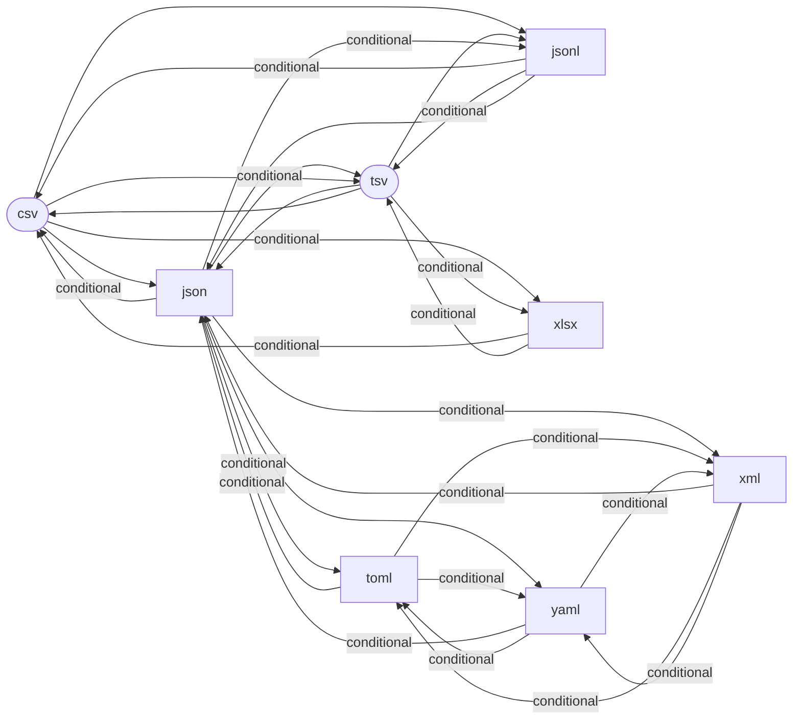
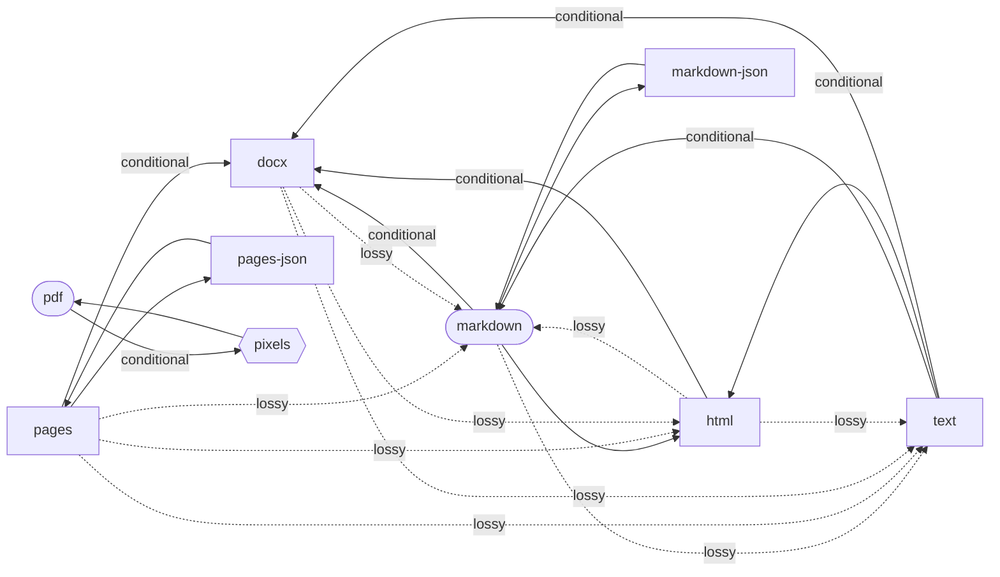
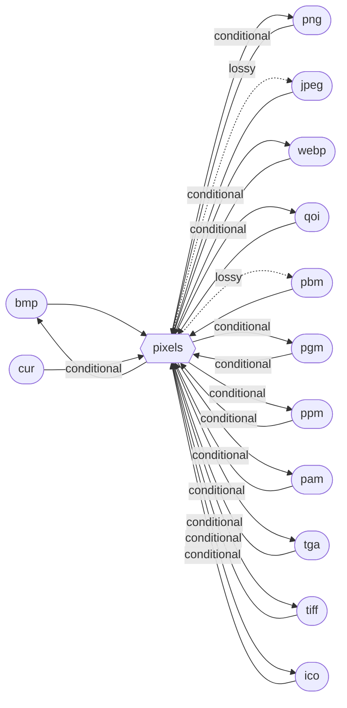
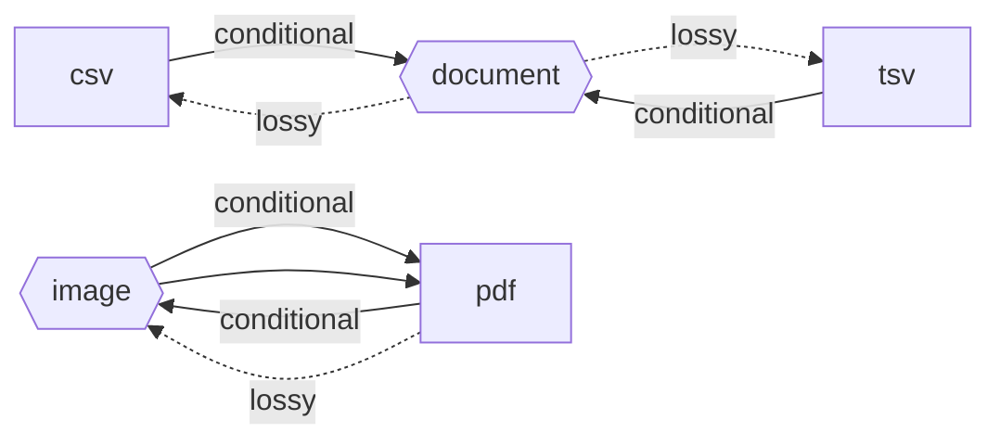

# Formats and Conversion Paths

Generated by `sublime paths --markdown`. Do not edit by hand. CI fails if this file is stale.

## Formats

| Category | Id | Name | Extensions | Produced by | Consumed by |
|---|---|---|---|---|---|
| data | csv | Comma-Separated Values | csv | json-to-csv, jsonl-to-csv, tsv-to-csv, xlsx-to-csv, markdown-to-csv | csv-to-json, csv-to-jsonl, csv-to-tsv, csv-to-xlsx, csv-to-markdown |
| data | json | JSON | json | csv-to-json, toml-to-json, yaml-to-json, xml-to-json, tsv-to-json, jsonl-to-json | json-to-csv, json-to-toml, json-to-yaml, json-to-xml, json-to-tsv, json-to-jsonl |
| data | jsonl | JSON Lines | jsonl, ndjson | csv-to-jsonl, tsv-to-jsonl, json-to-jsonl | jsonl-to-csv, jsonl-to-tsv, jsonl-to-json |
| data | toml | TOML | toml | json-to-toml, yaml-to-toml, xml-to-toml | toml-to-json, toml-to-yaml, toml-to-xml |
| data | tsv | Tab-Separated Values | tsv, tab | json-to-tsv, jsonl-to-tsv, csv-to-tsv, xlsx-to-tsv, markdown-to-tsv | tsv-to-json, tsv-to-jsonl, tsv-to-csv, tsv-to-xlsx, tsv-to-markdown |
| data | xlsx | Excel Workbook | xlsx | csv-to-xlsx, tsv-to-xlsx | xlsx-to-csv, xlsx-to-tsv |
| data | xml | XML | xml | json-to-xml, toml-to-xml, yaml-to-xml | xml-to-json, xml-to-toml, xml-to-yaml |
| data | yaml | YAML | yaml, yml | json-to-yaml, toml-to-yaml, xml-to-yaml | yaml-to-json, yaml-to-toml, yaml-to-xml |
| document | docx | Word document | docx | pages-to-docx, markdown-to-docx, html-to-docx, text-to-docx | docx-to-markdown, docx-to-html, docx-to-text |
| document | html | HTML | html, htm | markdown-to-html, pages-to-html, docx-to-html, text-to-html | html-to-markdown, html-to-text, html-to-docx |
| document | markdown | Markdown | md, markdown | markdown-json-to-markdown, pages-to-markdown, docx-to-markdown, html-to-markdown, text-to-markdown, csv-to-markdown, tsv-to-markdown | markdown-to-html, markdown-to-text, markdown-to-json, markdown-to-docx, markdown-to-csv, markdown-to-tsv |
| document | markdown-json | Markdown events as JSON |  | markdown-to-json | markdown-json-to-markdown |
| document | pages | Apple Pages | pages | json-to-pages | pages-to-json, pages-to-docx, pages-to-markdown, pages-to-html, pages-to-text |
| document | pages-json | Apple Pages package as JSON |  | pages-to-json | json-to-pages |
| document | pdf | PDF document | pdf | png-to-pdf, bmp-to-pdf, jpeg-to-pdf, webp-to-pdf, qoi-to-pdf, pbm-to-pdf, pgm-to-pdf, ppm-to-pdf, pam-to-pdf, tga-to-pdf, tiff-to-pdf, ico-to-pdf, cur-to-pdf | pdf-to-png, pdf-to-bmp, pdf-to-jpeg, pdf-to-webp, pdf-to-qoi, pdf-to-pbm, pdf-to-pgm, pdf-to-ppm, pdf-to-pam, pdf-to-tga, pdf-to-tiff, pdf-to-ico |
| document | text | Plain text | txt | markdown-to-text, pages-to-text, docx-to-text, html-to-text | text-to-markdown, text-to-html, text-to-docx |
| image | bmp | Windows bitmap | bmp, dib | png-to-bmp, jpeg-to-bmp, webp-to-bmp, qoi-to-bmp, pbm-to-bmp, pgm-to-bmp, ppm-to-bmp, pam-to-bmp, tga-to-bmp, tiff-to-bmp, ico-to-bmp, pdf-to-bmp, cur-to-bmp | bmp-to-png, bmp-to-jpeg, bmp-to-webp, bmp-to-qoi, bmp-to-pbm, bmp-to-pgm, bmp-to-ppm, bmp-to-pam, bmp-to-tga, bmp-to-tiff, bmp-to-ico, bmp-to-pdf |
| image | cur | Windows cursor | cur | - | cur-to-png, cur-to-bmp, cur-to-jpeg, cur-to-webp, cur-to-qoi, cur-to-pbm, cur-to-pgm, cur-to-ppm, cur-to-pam, cur-to-tga, cur-to-tiff, cur-to-ico, cur-to-pdf |
| image | ico | Windows icon | ico | png-to-ico, bmp-to-ico, jpeg-to-ico, webp-to-ico, qoi-to-ico, pbm-to-ico, pgm-to-ico, ppm-to-ico, pam-to-ico, tga-to-ico, tiff-to-ico, pdf-to-ico, cur-to-ico | ico-to-png, ico-to-bmp, ico-to-jpeg, ico-to-webp, ico-to-qoi, ico-to-pbm, ico-to-pgm, ico-to-ppm, ico-to-pam, ico-to-tga, ico-to-tiff, ico-to-pdf |
| image | jpeg | JPEG image | jpg, jpeg, jpe | png-to-jpeg, bmp-to-jpeg, webp-to-jpeg, qoi-to-jpeg, pbm-to-jpeg, pgm-to-jpeg, ppm-to-jpeg, pam-to-jpeg, tga-to-jpeg, tiff-to-jpeg, ico-to-jpeg, pdf-to-jpeg, cur-to-jpeg | jpeg-to-png, jpeg-to-bmp, jpeg-to-webp, jpeg-to-qoi, jpeg-to-pbm, jpeg-to-pgm, jpeg-to-ppm, jpeg-to-pam, jpeg-to-tga, jpeg-to-tiff, jpeg-to-ico, jpeg-to-pdf |
| image | pam | Netpbm arbitrary map (PAM) | pam | png-to-pam, bmp-to-pam, jpeg-to-pam, webp-to-pam, qoi-to-pam, pbm-to-pam, pgm-to-pam, ppm-to-pam, tga-to-pam, tiff-to-pam, ico-to-pam, pdf-to-pam, cur-to-pam | pam-to-png, pam-to-bmp, pam-to-jpeg, pam-to-webp, pam-to-qoi, pam-to-pbm, pam-to-pgm, pam-to-ppm, pam-to-tga, pam-to-tiff, pam-to-ico, pam-to-pdf |
| image | pbm | Netpbm bitmap (PBM) | pbm | png-to-pbm, bmp-to-pbm, jpeg-to-pbm, webp-to-pbm, qoi-to-pbm, pgm-to-pbm, ppm-to-pbm, pam-to-pbm, tga-to-pbm, tiff-to-pbm, ico-to-pbm, pdf-to-pbm, cur-to-pbm | pbm-to-png, pbm-to-bmp, pbm-to-jpeg, pbm-to-webp, pbm-to-qoi, pbm-to-pgm, pbm-to-ppm, pbm-to-pam, pbm-to-tga, pbm-to-tiff, pbm-to-ico, pbm-to-pdf |
| image | pgm | Netpbm graymap (PGM) | pgm | png-to-pgm, bmp-to-pgm, jpeg-to-pgm, webp-to-pgm, qoi-to-pgm, pbm-to-pgm, ppm-to-pgm, pam-to-pgm, tga-to-pgm, tiff-to-pgm, ico-to-pgm, pdf-to-pgm, cur-to-pgm | pgm-to-png, pgm-to-bmp, pgm-to-jpeg, pgm-to-webp, pgm-to-qoi, pgm-to-pbm, pgm-to-ppm, pgm-to-pam, pgm-to-tga, pgm-to-tiff, pgm-to-ico, pgm-to-pdf |
| image | png | PNG image | png | bmp-to-png, jpeg-to-png, webp-to-png, qoi-to-png, pbm-to-png, pgm-to-png, ppm-to-png, pam-to-png, tga-to-png, tiff-to-png, ico-to-png, pdf-to-png, cur-to-png | png-to-bmp, png-to-jpeg, png-to-webp, png-to-qoi, png-to-pbm, png-to-pgm, png-to-ppm, png-to-pam, png-to-tga, png-to-tiff, png-to-ico, png-to-pdf |
| image | ppm | Netpbm pixmap (PPM) | ppm, pnm | png-to-ppm, bmp-to-ppm, jpeg-to-ppm, webp-to-ppm, qoi-to-ppm, pbm-to-ppm, pgm-to-ppm, pam-to-ppm, tga-to-ppm, tiff-to-ppm, ico-to-ppm, pdf-to-ppm, cur-to-ppm | ppm-to-png, ppm-to-bmp, ppm-to-jpeg, ppm-to-webp, ppm-to-qoi, ppm-to-pbm, ppm-to-pgm, ppm-to-pam, ppm-to-tga, ppm-to-tiff, ppm-to-ico, ppm-to-pdf |
| image | qoi | QOI image | qoi | png-to-qoi, bmp-to-qoi, jpeg-to-qoi, webp-to-qoi, pbm-to-qoi, pgm-to-qoi, ppm-to-qoi, pam-to-qoi, tga-to-qoi, tiff-to-qoi, ico-to-qoi, pdf-to-qoi, cur-to-qoi | qoi-to-png, qoi-to-bmp, qoi-to-jpeg, qoi-to-webp, qoi-to-pbm, qoi-to-pgm, qoi-to-ppm, qoi-to-pam, qoi-to-tga, qoi-to-tiff, qoi-to-ico, qoi-to-pdf |
| image | tga | Truevision TGA image | tga, icb, vda, vst | png-to-tga, bmp-to-tga, jpeg-to-tga, webp-to-tga, qoi-to-tga, pbm-to-tga, pgm-to-tga, ppm-to-tga, pam-to-tga, tiff-to-tga, ico-to-tga, pdf-to-tga, cur-to-tga | tga-to-png, tga-to-bmp, tga-to-jpeg, tga-to-webp, tga-to-qoi, tga-to-pbm, tga-to-pgm, tga-to-ppm, tga-to-pam, tga-to-tiff, tga-to-ico, tga-to-pdf |
| image | tiff | TIFF image | tif, tiff | png-to-tiff, bmp-to-tiff, jpeg-to-tiff, webp-to-tiff, qoi-to-tiff, pbm-to-tiff, pgm-to-tiff, ppm-to-tiff, pam-to-tiff, tga-to-tiff, ico-to-tiff, pdf-to-tiff, cur-to-tiff | tiff-to-png, tiff-to-bmp, tiff-to-jpeg, tiff-to-webp, tiff-to-qoi, tiff-to-pbm, tiff-to-pgm, tiff-to-ppm, tiff-to-pam, tiff-to-tga, tiff-to-ico, tiff-to-pdf |
| image | webp | WebP image | webp | png-to-webp, bmp-to-webp, jpeg-to-webp, qoi-to-webp, pbm-to-webp, pgm-to-webp, ppm-to-webp, pam-to-webp, tga-to-webp, tiff-to-webp, ico-to-webp, pdf-to-webp, cur-to-webp | webp-to-png, webp-to-bmp, webp-to-jpeg, webp-to-qoi, webp-to-pbm, webp-to-pgm, webp-to-ppm, webp-to-pam, webp-to-tga, webp-to-tiff, webp-to-ico, webp-to-pdf |

## Converters

| Name | From | To | Tier | Fidelity | Notes |
|---|---|---|---|---|---|
| csv-to-json | csv | json | native | lossless |  |
| json-to-csv | json | csv | native | conditional | nested values are written as JSON text, non-string scalars are written as their JSON text, null becomes an empty cell, and objects with differing key sets get empty cells for missing keys |
| markdown-to-html | markdown | html | native | lossless |  |
| markdown-to-text | markdown | text | native | lossy | markup, raw HTML, and image sources are dropped |
| markdown-to-json | markdown | markdown-json | native | lossless |  |
| markdown-json-to-markdown | markdown-json | markdown | native | lossless |  |
| pages-to-json | pages | pages-json | native | lossless |  |
| json-to-pages | pages-json | pages | native | lossless |  |
| pages-to-docx | pages | docx | native | conditional | lossless for text, styles, lists, links, footnotes, and tables; shapes and charts are dropped |
| pages-to-markdown | pages | markdown | native | lossy | page layout, headers and footers, fonts, sizes, and colors are dropped; text boxes follow the body |
| pages-to-html | pages | html | native | lossy | page layout, headers and footers, fonts, sizes, and colors are dropped; text boxes follow the body |
| pages-to-text | pages | text | native | lossy | formatting, images, page layout, headers and footers are dropped; text boxes follow the body |
| docx-to-markdown | docx | markdown | native | lossy | page layout, headers and footers, fonts, sizes, and colors are dropped; text boxes follow the body |
| docx-to-html | docx | html | native | lossy | page layout, headers and footers, fonts, sizes, and colors are dropped; text boxes follow the body |
| docx-to-text | docx | text | native | lossy | formatting, images, page layout, headers and footers are dropped; text boxes follow the body |
| markdown-to-docx | markdown | docx | native | conditional | lossless for headings, paragraphs, lists, quotes, code, tables, links, footnotes, and images given as data URIs; raw HTML is dropped, other images become links, and loose lists come out tight |
| html-to-markdown | html | markdown | native | lossy | scripts, styles, forms, and layout are dropped; elements without a Markdown form keep their text |
| html-to-text | html | text | native | lossy | markup, scripts, styles, and image sources are dropped |
| html-to-docx | html | docx | native | conditional | lossless for headings, paragraphs, lists, quotes, code, tables, links, footnotes, and images given as data URIs; scripts, styles, forms, and layout are dropped, and other images become links |
| text-to-markdown | text | markdown | native | conditional | paragraphs are runs of lines separated by blank lines; text that looks like Markdown is escaped so it reads as written |
| text-to-html | text | html | native | conditional | paragraphs are runs of lines separated by blank lines; the text itself is kept exactly |
| text-to-docx | text | docx | native | conditional | paragraphs are runs of lines separated by blank lines; line breaks inside a paragraph become spaces |
| toml-to-json | toml | json | native | conditional | dates, times, infinities, and NaN become strings |
| json-to-toml | json | toml | native | conditional | the root must be an object; nulls are dropped; integers beyond 64 bits become floats |
| yaml-to-json | yaml | json | native | conditional | anchors are expanded, tags outside the core schema are dropped, keys become strings, infinities and NaN become strings, a multi-document stream becomes an array |
| json-to-yaml | json | yaml | native | lossless |  |
| xml-to-json | xml | json | native | conditional | attributes become @-keys, text #text, repeated elements arrays, every value a string; comments, processing instructions, the doctype, and the order of text against elements in mixed content are dropped |
| json-to-xml | json | xml | native | conditional | @-keys become attributes, #text the text, arrays repeated elements; the root object must have one member, otherwise it is wrapped in <root>; numbers, booleans, and nulls become text |
| toml-to-yaml | toml | yaml | native | conditional | dates and times become strings |
| yaml-to-toml | yaml | toml | native | conditional | anchors are expanded, tags outside the core schema are dropped, keys become strings; the document must be a mapping and nulls are dropped |
| toml-to-xml | toml | xml | native | conditional | a document without one root member is wrapped in <root>, and numbers, booleans, and dates become text |
| xml-to-toml | xml | toml | native | conditional | attributes become @-keys, text #text, repeated elements arrays, every value a string; comments, processing instructions, the doctype, and mixed-content order are dropped; empty elements are dropped |
| yaml-to-xml | yaml | xml | native | conditional | anchors are expanded, tags outside the core schema are dropped, keys become strings; a document without one root member is wrapped in <root>, and numbers, booleans, and nulls become text |
| xml-to-yaml | xml | yaml | native | conditional | attributes become @-keys, text #text, repeated elements arrays, every value a string; comments, processing instructions, the doctype, and the order of text against elements in mixed content are dropped |
| tsv-to-json | tsv | json | native | lossless |  |
| csv-to-jsonl | csv | jsonl | native | lossless |  |
| tsv-to-jsonl | tsv | jsonl | native | lossless |  |
| json-to-tsv | json | tsv | native | conditional | nested values are written as JSON text, non-string scalars are written as their JSON text, null becomes an empty cell, and objects with differing key sets get empty cells for missing keys |
| jsonl-to-csv | jsonl | csv | native | conditional | nested values are written as JSON text, non-string scalars are written as their JSON text, null becomes an empty cell, and objects with differing key sets get empty cells for missing keys |
| jsonl-to-tsv | jsonl | tsv | native | conditional | nested values are written as JSON text, non-string scalars are written as their JSON text, null becomes an empty cell, and objects with differing key sets get empty cells for missing keys |
| csv-to-tsv | csv | tsv | native | lossless |  |
| tsv-to-csv | tsv | csv | native | lossless |  |
| jsonl-to-json | jsonl | json | native | lossless |  |
| json-to-jsonl | json | jsonl | native | conditional | an array becomes one line per element; any other root becomes one line |
| xlsx-to-csv | xlsx | csv | native | conditional | one sheet (the first, or --sheet); numbers as stored, dates as ISO 8601, booleans as TRUE and FALSE, formulas as their last value; formatting is dropped |
| xlsx-to-tsv | xlsx | tsv | native | conditional | one sheet (the first, or --sheet); numbers as stored, dates as ISO 8601, booleans as TRUE and FALSE, formulas as their last value; formatting is dropped |
| csv-to-xlsx | csv | xlsx | native | conditional | cells that are plain decimals of up to fifteen digits become numbers, everything else stays text; one sheet named Sheet1 |
| tsv-to-xlsx | tsv | xlsx | native | conditional | cells that are plain decimals of up to fifteen digits become numbers, everything else stays text; one sheet named Sheet1 |
| csv-to-markdown | csv | markdown | native | conditional | one table with the first row as the header; rows are padded or cut to the header's width and line breaks inside cells become spaces |
| tsv-to-markdown | tsv | markdown | native | conditional | one table with the first row as the header; rows are padded or cut to the header's width and line breaks inside cells become spaces |
| markdown-to-csv | markdown | csv | native | lossy | only the document's first table, its inline formatting flattened to text; everything else in the document is dropped |
| markdown-to-tsv | markdown | tsv | native | lossy | only the document's first table, its inline formatting flattened to text; everything else in the document is dropped |
| png-to-bmp | png | bmp | native | conditional | 16-bit samples become 8-bit, and metadata (gamma, color profile, text) is dropped |
| png-to-jpeg | png | jpeg | native | lossy | 16-bit samples become 8-bit, and metadata (gamma, color profile, text) is dropped; JPEG is lossy: the image is re-encoded at the quality given (85 by default, 4:2:0 chroma below 90) and alpha is flattened onto white |
| png-to-webp | png | webp | native | conditional | 16-bit samples become 8-bit, and metadata (gamma, color profile, text) is dropped |
| png-to-qoi | png | qoi | native | conditional | 16-bit samples become 8-bit, and metadata (gamma, color profile, text) is dropped |
| png-to-pbm | png | pbm | native | lossy | 16-bit samples become 8-bit, and metadata (gamma, color profile, text) is dropped; black and white: color becomes luma, alpha is flattened onto white, and gray below half is black |
| png-to-pgm | png | pgm | native | conditional | 16-bit samples become 8-bit, and metadata (gamma, color profile, text) is dropped; color becomes luma and alpha is flattened onto white |
| png-to-ppm | png | ppm | native | conditional | 16-bit samples become 8-bit, and metadata (gamma, color profile, text) is dropped; alpha is flattened onto white |
| png-to-pam | png | pam | native | conditional | 16-bit samples become 8-bit, and metadata (gamma, color profile, text) is dropped |
| png-to-tga | png | tga | native | conditional | 16-bit samples become 8-bit, and metadata (gamma, color profile, text) is dropped |
| png-to-tiff | png | tiff | native | conditional | 16-bit samples become 8-bit, and metadata (gamma, color profile, text) is dropped |
| png-to-ico | png | ico | native | conditional | 16-bit samples become 8-bit, and metadata (gamma, color profile, text) is dropped; the image is the icon's largest size (scaled down to 256 pixels if larger), with the standard smaller sizes added, scaled by area averaging |
| png-to-pdf | png | pdf | native | conditional | 16-bit samples become 8-bit, and metadata (gamma, color profile, text) is dropped |
| bmp-to-png | bmp | png | native | lossless |  |
| bmp-to-jpeg | bmp | jpeg | native | lossy | JPEG is lossy: the image is re-encoded at the quality given (85 by default, 4:2:0 chroma below 90) and alpha is flattened onto white |
| bmp-to-webp | bmp | webp | native | lossless |  |
| bmp-to-qoi | bmp | qoi | native | lossless |  |
| bmp-to-pbm | bmp | pbm | native | lossy | black and white: color becomes luma, alpha is flattened onto white, and gray below half is black |
| bmp-to-pgm | bmp | pgm | native | conditional | color becomes luma and alpha is flattened onto white |
| bmp-to-ppm | bmp | ppm | native | conditional | alpha is flattened onto white |
| bmp-to-pam | bmp | pam | native | lossless |  |
| bmp-to-tga | bmp | tga | native | lossless |  |
| bmp-to-tiff | bmp | tiff | native | lossless |  |
| bmp-to-ico | bmp | ico | native | conditional | the image is the icon's largest size (scaled down to 256 pixels if larger), with the standard smaller sizes added, scaled by area averaging |
| bmp-to-pdf | bmp | pdf | native | lossless |  |
| jpeg-to-png | jpeg | png | native | conditional | pixels as decoded (Exif orientation is reported, not applied); metadata (Exif, ICC, comments) is dropped |
| jpeg-to-bmp | jpeg | bmp | native | conditional | pixels as decoded (Exif orientation is reported, not applied); metadata (Exif, ICC, comments) is dropped |
| jpeg-to-webp | jpeg | webp | native | conditional | pixels as decoded (Exif orientation is reported, not applied); metadata (Exif, ICC, comments) is dropped |
| jpeg-to-qoi | jpeg | qoi | native | conditional | pixels as decoded (Exif orientation is reported, not applied); metadata (Exif, ICC, comments) is dropped |
| jpeg-to-pbm | jpeg | pbm | native | lossy | pixels as decoded (Exif orientation is reported, not applied); metadata (Exif, ICC, comments) is dropped; black and white: color becomes luma, alpha is flattened onto white, and gray below half is black |
| jpeg-to-pgm | jpeg | pgm | native | conditional | pixels as decoded (Exif orientation is reported, not applied); metadata (Exif, ICC, comments) is dropped; color becomes luma and alpha is flattened onto white |
| jpeg-to-ppm | jpeg | ppm | native | conditional | pixels as decoded (Exif orientation is reported, not applied); metadata (Exif, ICC, comments) is dropped; alpha is flattened onto white |
| jpeg-to-pam | jpeg | pam | native | conditional | pixels as decoded (Exif orientation is reported, not applied); metadata (Exif, ICC, comments) is dropped |
| jpeg-to-tga | jpeg | tga | native | conditional | pixels as decoded (Exif orientation is reported, not applied); metadata (Exif, ICC, comments) is dropped |
| jpeg-to-tiff | jpeg | tiff | native | conditional | pixels as decoded (Exif orientation is reported, not applied); metadata (Exif, ICC, comments) is dropped |
| jpeg-to-ico | jpeg | ico | native | conditional | pixels as decoded (Exif orientation is reported, not applied); metadata (Exif, ICC, comments) is dropped; the image is the icon's largest size (scaled down to 256 pixels if larger), with the standard smaller sizes added, scaled by area averaging |
| jpeg-to-pdf | jpeg | pdf | native | lossless |  |
| webp-to-png | webp | png | native | conditional | pixels as decoded (a lossy WebP decodes exactly as libwebp does); an animation keeps its first frame; metadata (ICC, Exif, XMP) is dropped |
| webp-to-bmp | webp | bmp | native | conditional | pixels as decoded (a lossy WebP decodes exactly as libwebp does); an animation keeps its first frame; metadata (ICC, Exif, XMP) is dropped |
| webp-to-jpeg | webp | jpeg | native | lossy | pixels as decoded (a lossy WebP decodes exactly as libwebp does); an animation keeps its first frame; metadata (ICC, Exif, XMP) is dropped; JPEG is lossy: the image is re-encoded at the quality given (85 by default, 4:2:0 chroma below 90) and alpha is flattened onto white |
| webp-to-qoi | webp | qoi | native | conditional | pixels as decoded (a lossy WebP decodes exactly as libwebp does); an animation keeps its first frame; metadata (ICC, Exif, XMP) is dropped |
| webp-to-pbm | webp | pbm | native | lossy | pixels as decoded (a lossy WebP decodes exactly as libwebp does); an animation keeps its first frame; metadata (ICC, Exif, XMP) is dropped; black and white: color becomes luma, alpha is flattened onto white, and gray below half is black |
| webp-to-pgm | webp | pgm | native | conditional | pixels as decoded (a lossy WebP decodes exactly as libwebp does); an animation keeps its first frame; metadata (ICC, Exif, XMP) is dropped; color becomes luma and alpha is flattened onto white |
| webp-to-ppm | webp | ppm | native | conditional | pixels as decoded (a lossy WebP decodes exactly as libwebp does); an animation keeps its first frame; metadata (ICC, Exif, XMP) is dropped; alpha is flattened onto white |
| webp-to-pam | webp | pam | native | conditional | pixels as decoded (a lossy WebP decodes exactly as libwebp does); an animation keeps its first frame; metadata (ICC, Exif, XMP) is dropped |
| webp-to-tga | webp | tga | native | conditional | pixels as decoded (a lossy WebP decodes exactly as libwebp does); an animation keeps its first frame; metadata (ICC, Exif, XMP) is dropped |
| webp-to-tiff | webp | tiff | native | conditional | pixels as decoded (a lossy WebP decodes exactly as libwebp does); an animation keeps its first frame; metadata (ICC, Exif, XMP) is dropped |
| webp-to-ico | webp | ico | native | conditional | pixels as decoded (a lossy WebP decodes exactly as libwebp does); an animation keeps its first frame; metadata (ICC, Exif, XMP) is dropped; the image is the icon's largest size (scaled down to 256 pixels if larger), with the standard smaller sizes added, scaled by area averaging |
| webp-to-pdf | webp | pdf | native | conditional | pixels as decoded (a lossy WebP decodes exactly as libwebp does); an animation keeps its first frame; metadata (ICC, Exif, XMP) is dropped |
| qoi-to-png | qoi | png | native | lossless |  |
| qoi-to-bmp | qoi | bmp | native | lossless |  |
| qoi-to-jpeg | qoi | jpeg | native | lossy | JPEG is lossy: the image is re-encoded at the quality given (85 by default, 4:2:0 chroma below 90) and alpha is flattened onto white |
| qoi-to-webp | qoi | webp | native | lossless |  |
| qoi-to-pbm | qoi | pbm | native | lossy | black and white: color becomes luma, alpha is flattened onto white, and gray below half is black |
| qoi-to-pgm | qoi | pgm | native | conditional | color becomes luma and alpha is flattened onto white |
| qoi-to-ppm | qoi | ppm | native | conditional | alpha is flattened onto white |
| qoi-to-pam | qoi | pam | native | lossless |  |
| qoi-to-tga | qoi | tga | native | lossless |  |
| qoi-to-tiff | qoi | tiff | native | lossless |  |
| qoi-to-ico | qoi | ico | native | conditional | the image is the icon's largest size (scaled down to 256 pixels if larger), with the standard smaller sizes added, scaled by area averaging |
| qoi-to-pdf | qoi | pdf | native | lossless |  |
| pbm-to-png | pbm | png | native | lossless |  |
| pbm-to-bmp | pbm | bmp | native | lossless |  |
| pbm-to-jpeg | pbm | jpeg | native | lossy | JPEG is lossy: the image is re-encoded at the quality given (85 by default, 4:2:0 chroma below 90) and alpha is flattened onto white |
| pbm-to-webp | pbm | webp | native | lossless |  |
| pbm-to-qoi | pbm | qoi | native | lossless |  |
| pbm-to-pgm | pbm | pgm | native | conditional | color becomes luma and alpha is flattened onto white |
| pbm-to-ppm | pbm | ppm | native | conditional | alpha is flattened onto white |
| pbm-to-pam | pbm | pam | native | lossless |  |
| pbm-to-tga | pbm | tga | native | lossless |  |
| pbm-to-tiff | pbm | tiff | native | lossless |  |
| pbm-to-ico | pbm | ico | native | conditional | the image is the icon's largest size (scaled down to 256 pixels if larger), with the standard smaller sizes added, scaled by area averaging |
| pbm-to-pdf | pbm | pdf | native | lossless |  |
| pgm-to-png | pgm | png | native | conditional | samples wider than 8 bits (maxval over 255) are scaled to 8 bits |
| pgm-to-bmp | pgm | bmp | native | conditional | samples wider than 8 bits (maxval over 255) are scaled to 8 bits |
| pgm-to-jpeg | pgm | jpeg | native | lossy | samples wider than 8 bits (maxval over 255) are scaled to 8 bits; JPEG is lossy: the image is re-encoded at the quality given (85 by default, 4:2:0 chroma below 90) and alpha is flattened onto white |
| pgm-to-webp | pgm | webp | native | conditional | samples wider than 8 bits (maxval over 255) are scaled to 8 bits |
| pgm-to-qoi | pgm | qoi | native | conditional | samples wider than 8 bits (maxval over 255) are scaled to 8 bits |
| pgm-to-pbm | pgm | pbm | native | lossy | samples wider than 8 bits (maxval over 255) are scaled to 8 bits; black and white: color becomes luma, alpha is flattened onto white, and gray below half is black |
| pgm-to-ppm | pgm | ppm | native | conditional | samples wider than 8 bits (maxval over 255) are scaled to 8 bits; alpha is flattened onto white |
| pgm-to-pam | pgm | pam | native | conditional | samples wider than 8 bits (maxval over 255) are scaled to 8 bits |
| pgm-to-tga | pgm | tga | native | conditional | samples wider than 8 bits (maxval over 255) are scaled to 8 bits |
| pgm-to-tiff | pgm | tiff | native | conditional | samples wider than 8 bits (maxval over 255) are scaled to 8 bits |
| pgm-to-ico | pgm | ico | native | conditional | samples wider than 8 bits (maxval over 255) are scaled to 8 bits; the image is the icon's largest size (scaled down to 256 pixels if larger), with the standard smaller sizes added, scaled by area averaging |
| pgm-to-pdf | pgm | pdf | native | conditional | samples wider than 8 bits (maxval over 255) are scaled to 8 bits |
| ppm-to-png | ppm | png | native | conditional | samples wider than 8 bits (maxval over 255) are scaled to 8 bits |
| ppm-to-bmp | ppm | bmp | native | conditional | samples wider than 8 bits (maxval over 255) are scaled to 8 bits |
| ppm-to-jpeg | ppm | jpeg | native | lossy | samples wider than 8 bits (maxval over 255) are scaled to 8 bits; JPEG is lossy: the image is re-encoded at the quality given (85 by default, 4:2:0 chroma below 90) and alpha is flattened onto white |
| ppm-to-webp | ppm | webp | native | conditional | samples wider than 8 bits (maxval over 255) are scaled to 8 bits |
| ppm-to-qoi | ppm | qoi | native | conditional | samples wider than 8 bits (maxval over 255) are scaled to 8 bits |
| ppm-to-pbm | ppm | pbm | native | lossy | samples wider than 8 bits (maxval over 255) are scaled to 8 bits; black and white: color becomes luma, alpha is flattened onto white, and gray below half is black |
| ppm-to-pgm | ppm | pgm | native | conditional | samples wider than 8 bits (maxval over 255) are scaled to 8 bits; color becomes luma and alpha is flattened onto white |
| ppm-to-pam | ppm | pam | native | conditional | samples wider than 8 bits (maxval over 255) are scaled to 8 bits |
| ppm-to-tga | ppm | tga | native | conditional | samples wider than 8 bits (maxval over 255) are scaled to 8 bits |
| ppm-to-tiff | ppm | tiff | native | conditional | samples wider than 8 bits (maxval over 255) are scaled to 8 bits |
| ppm-to-ico | ppm | ico | native | conditional | samples wider than 8 bits (maxval over 255) are scaled to 8 bits; the image is the icon's largest size (scaled down to 256 pixels if larger), with the standard smaller sizes added, scaled by area averaging |
| ppm-to-pdf | ppm | pdf | native | conditional | samples wider than 8 bits (maxval over 255) are scaled to 8 bits |
| pam-to-png | pam | png | native | conditional | samples wider than 8 bits (maxval over 255) are scaled to 8 bits |
| pam-to-bmp | pam | bmp | native | conditional | samples wider than 8 bits (maxval over 255) are scaled to 8 bits |
| pam-to-jpeg | pam | jpeg | native | lossy | samples wider than 8 bits (maxval over 255) are scaled to 8 bits; JPEG is lossy: the image is re-encoded at the quality given (85 by default, 4:2:0 chroma below 90) and alpha is flattened onto white |
| pam-to-webp | pam | webp | native | conditional | samples wider than 8 bits (maxval over 255) are scaled to 8 bits |
| pam-to-qoi | pam | qoi | native | conditional | samples wider than 8 bits (maxval over 255) are scaled to 8 bits |
| pam-to-pbm | pam | pbm | native | lossy | samples wider than 8 bits (maxval over 255) are scaled to 8 bits; black and white: color becomes luma, alpha is flattened onto white, and gray below half is black |
| pam-to-pgm | pam | pgm | native | conditional | samples wider than 8 bits (maxval over 255) are scaled to 8 bits; color becomes luma and alpha is flattened onto white |
| pam-to-ppm | pam | ppm | native | conditional | samples wider than 8 bits (maxval over 255) are scaled to 8 bits; alpha is flattened onto white |
| pam-to-tga | pam | tga | native | conditional | samples wider than 8 bits (maxval over 255) are scaled to 8 bits |
| pam-to-tiff | pam | tiff | native | conditional | samples wider than 8 bits (maxval over 255) are scaled to 8 bits |
| pam-to-ico | pam | ico | native | conditional | samples wider than 8 bits (maxval over 255) are scaled to 8 bits; the image is the icon's largest size (scaled down to 256 pixels if larger), with the standard smaller sizes added, scaled by area averaging |
| pam-to-pdf | pam | pdf | native | conditional | samples wider than 8 bits (maxval over 255) are scaled to 8 bits |
| tga-to-png | tga | png | native | conditional | the ID field and any TGA 2.0 extension area (thumbnail, author, dates) are dropped |
| tga-to-bmp | tga | bmp | native | conditional | the ID field and any TGA 2.0 extension area (thumbnail, author, dates) are dropped |
| tga-to-jpeg | tga | jpeg | native | lossy | the ID field and any TGA 2.0 extension area (thumbnail, author, dates) are dropped; JPEG is lossy: the image is re-encoded at the quality given (85 by default, 4:2:0 chroma below 90) and alpha is flattened onto white |
| tga-to-webp | tga | webp | native | conditional | the ID field and any TGA 2.0 extension area (thumbnail, author, dates) are dropped |
| tga-to-qoi | tga | qoi | native | conditional | the ID field and any TGA 2.0 extension area (thumbnail, author, dates) are dropped |
| tga-to-pbm | tga | pbm | native | lossy | the ID field and any TGA 2.0 extension area (thumbnail, author, dates) are dropped; black and white: color becomes luma, alpha is flattened onto white, and gray below half is black |
| tga-to-pgm | tga | pgm | native | conditional | the ID field and any TGA 2.0 extension area (thumbnail, author, dates) are dropped; color becomes luma and alpha is flattened onto white |
| tga-to-ppm | tga | ppm | native | conditional | the ID field and any TGA 2.0 extension area (thumbnail, author, dates) are dropped; alpha is flattened onto white |
| tga-to-pam | tga | pam | native | conditional | the ID field and any TGA 2.0 extension area (thumbnail, author, dates) are dropped |
| tga-to-tiff | tga | tiff | native | conditional | the ID field and any TGA 2.0 extension area (thumbnail, author, dates) are dropped |
| tga-to-ico | tga | ico | native | conditional | the ID field and any TGA 2.0 extension area (thumbnail, author, dates) are dropped; the image is the icon's largest size (scaled down to 256 pixels if larger), with the standard smaller sizes added, scaled by area averaging |
| tga-to-pdf | tga | pdf | native | conditional | the ID field and any TGA 2.0 extension area (thumbnail, author, dates) are dropped |
| tiff-to-png | tiff | png | native | conditional | the first page is read; 16-bit samples become 8-bit, CMYK becomes RGB, and metadata (resolution, EXIF, ICC, XMP) is dropped |
| tiff-to-bmp | tiff | bmp | native | conditional | the first page is read; 16-bit samples become 8-bit, CMYK becomes RGB, and metadata (resolution, EXIF, ICC, XMP) is dropped |
| tiff-to-jpeg | tiff | jpeg | native | lossy | the first page is read; 16-bit samples become 8-bit, CMYK becomes RGB, and metadata (resolution, EXIF, ICC, XMP) is dropped; JPEG is lossy: the image is re-encoded at the quality given (85 by default, 4:2:0 chroma below 90) and alpha is flattened onto white |
| tiff-to-webp | tiff | webp | native | conditional | the first page is read; 16-bit samples become 8-bit, CMYK becomes RGB, and metadata (resolution, EXIF, ICC, XMP) is dropped |
| tiff-to-qoi | tiff | qoi | native | conditional | the first page is read; 16-bit samples become 8-bit, CMYK becomes RGB, and metadata (resolution, EXIF, ICC, XMP) is dropped |
| tiff-to-pbm | tiff | pbm | native | lossy | the first page is read; 16-bit samples become 8-bit, CMYK becomes RGB, and metadata (resolution, EXIF, ICC, XMP) is dropped; black and white: color becomes luma, alpha is flattened onto white, and gray below half is black |
| tiff-to-pgm | tiff | pgm | native | conditional | the first page is read; 16-bit samples become 8-bit, CMYK becomes RGB, and metadata (resolution, EXIF, ICC, XMP) is dropped; color becomes luma and alpha is flattened onto white |
| tiff-to-ppm | tiff | ppm | native | conditional | the first page is read; 16-bit samples become 8-bit, CMYK becomes RGB, and metadata (resolution, EXIF, ICC, XMP) is dropped; alpha is flattened onto white |
| tiff-to-pam | tiff | pam | native | conditional | the first page is read; 16-bit samples become 8-bit, CMYK becomes RGB, and metadata (resolution, EXIF, ICC, XMP) is dropped |
| tiff-to-tga | tiff | tga | native | conditional | the first page is read; 16-bit samples become 8-bit, CMYK becomes RGB, and metadata (resolution, EXIF, ICC, XMP) is dropped |
| tiff-to-ico | tiff | ico | native | conditional | the first page is read; 16-bit samples become 8-bit, CMYK becomes RGB, and metadata (resolution, EXIF, ICC, XMP) is dropped; the image is the icon's largest size (scaled down to 256 pixels if larger), with the standard smaller sizes added, scaled by area averaging |
| tiff-to-pdf | tiff | pdf | native | conditional | the first page is read; 16-bit samples become 8-bit, CMYK becomes RGB, and metadata (resolution, EXIF, ICC, XMP) is dropped |
| ico-to-png | ico | png | native | conditional | the largest image is read and the icon's other sizes are dropped |
| ico-to-bmp | ico | bmp | native | conditional | the largest image is read and the icon's other sizes are dropped |
| ico-to-jpeg | ico | jpeg | native | lossy | the largest image is read and the icon's other sizes are dropped; JPEG is lossy: the image is re-encoded at the quality given (85 by default, 4:2:0 chroma below 90) and alpha is flattened onto white |
| ico-to-webp | ico | webp | native | conditional | the largest image is read and the icon's other sizes are dropped |
| ico-to-qoi | ico | qoi | native | conditional | the largest image is read and the icon's other sizes are dropped |
| ico-to-pbm | ico | pbm | native | lossy | the largest image is read and the icon's other sizes are dropped; black and white: color becomes luma, alpha is flattened onto white, and gray below half is black |
| ico-to-pgm | ico | pgm | native | conditional | the largest image is read and the icon's other sizes are dropped; color becomes luma and alpha is flattened onto white |
| ico-to-ppm | ico | ppm | native | conditional | the largest image is read and the icon's other sizes are dropped; alpha is flattened onto white |
| ico-to-pam | ico | pam | native | conditional | the largest image is read and the icon's other sizes are dropped |
| ico-to-tga | ico | tga | native | conditional | the largest image is read and the icon's other sizes are dropped |
| ico-to-tiff | ico | tiff | native | conditional | the largest image is read and the icon's other sizes are dropped |
| ico-to-pdf | ico | pdf | native | conditional | the largest image is read and the icon's other sizes are dropped |
| pdf-to-png | pdf | png | native | conditional | the chosen page's largest image is read (--page, the first by default); a page's vector content is not rendered, and other pages and images are dropped |
| pdf-to-bmp | pdf | bmp | native | conditional | the chosen page's largest image is read (--page, the first by default); a page's vector content is not rendered, and other pages and images are dropped |
| pdf-to-jpeg | pdf | jpeg | native | lossy | the chosen page's largest image is read (--page, the first by default); a page's vector content is not rendered, and other pages and images are dropped; JPEG is lossy: the image is re-encoded at the quality given (85 by default, 4:2:0 chroma below 90) and alpha is flattened onto white |
| pdf-to-webp | pdf | webp | native | conditional | the chosen page's largest image is read (--page, the first by default); a page's vector content is not rendered, and other pages and images are dropped |
| pdf-to-qoi | pdf | qoi | native | conditional | the chosen page's largest image is read (--page, the first by default); a page's vector content is not rendered, and other pages and images are dropped |
| pdf-to-pbm | pdf | pbm | native | lossy | the chosen page's largest image is read (--page, the first by default); a page's vector content is not rendered, and other pages and images are dropped; black and white: color becomes luma, alpha is flattened onto white, and gray below half is black |
| pdf-to-pgm | pdf | pgm | native | conditional | the chosen page's largest image is read (--page, the first by default); a page's vector content is not rendered, and other pages and images are dropped; color becomes luma and alpha is flattened onto white |
| pdf-to-ppm | pdf | ppm | native | conditional | the chosen page's largest image is read (--page, the first by default); a page's vector content is not rendered, and other pages and images are dropped; alpha is flattened onto white |
| pdf-to-pam | pdf | pam | native | conditional | the chosen page's largest image is read (--page, the first by default); a page's vector content is not rendered, and other pages and images are dropped |
| pdf-to-tga | pdf | tga | native | conditional | the chosen page's largest image is read (--page, the first by default); a page's vector content is not rendered, and other pages and images are dropped |
| pdf-to-tiff | pdf | tiff | native | conditional | the chosen page's largest image is read (--page, the first by default); a page's vector content is not rendered, and other pages and images are dropped |
| pdf-to-ico | pdf | ico | native | conditional | the chosen page's largest image is read (--page, the first by default); a page's vector content is not rendered, and other pages and images are dropped; the image is the icon's largest size (scaled down to 256 pixels if larger), with the standard smaller sizes added, scaled by area averaging |
| cur-to-png | cur | png | native | conditional | the largest image is read; the cursor's other sizes and its hotspot are dropped |
| cur-to-bmp | cur | bmp | native | conditional | the largest image is read; the cursor's other sizes and its hotspot are dropped |
| cur-to-jpeg | cur | jpeg | native | lossy | the largest image is read; the cursor's other sizes and its hotspot are dropped; JPEG is lossy: the image is re-encoded at the quality given (85 by default, 4:2:0 chroma below 90) and alpha is flattened onto white |
| cur-to-webp | cur | webp | native | conditional | the largest image is read; the cursor's other sizes and its hotspot are dropped |
| cur-to-qoi | cur | qoi | native | conditional | the largest image is read; the cursor's other sizes and its hotspot are dropped |
| cur-to-pbm | cur | pbm | native | lossy | the largest image is read; the cursor's other sizes and its hotspot are dropped; black and white: color becomes luma, alpha is flattened onto white, and gray below half is black |
| cur-to-pgm | cur | pgm | native | conditional | the largest image is read; the cursor's other sizes and its hotspot are dropped; color becomes luma and alpha is flattened onto white |
| cur-to-ppm | cur | ppm | native | conditional | the largest image is read; the cursor's other sizes and its hotspot are dropped; alpha is flattened onto white |
| cur-to-pam | cur | pam | native | conditional | the largest image is read; the cursor's other sizes and its hotspot are dropped |
| cur-to-tga | cur | tga | native | conditional | the largest image is read; the cursor's other sizes and its hotspot are dropped |
| cur-to-tiff | cur | tiff | native | conditional | the largest image is read; the cursor's other sizes and its hotspot are dropped |
| cur-to-ico | cur | ico | native | conditional | the largest image is read; the cursor's other sizes and its hotspot are dropped; the image is the icon's largest size (scaled down to 256 pixels if larger), with the standard smaller sizes added, scaled by area averaging |
| cur-to-pdf | cur | pdf | native | conditional | the largest image is read; the cursor's other sizes and its hotspot are dropped |

## Paths

| From | To | Fidelity | Path | Notes |
|---|---|---|---|---|
| bmp | ico | conditional | bmp-to-ico | the image is the icon's largest size (scaled down to 256 pixels if larger), with the standard smaller sizes added, scaled by area averaging |
| bmp | jpeg | lossy | bmp-to-jpeg | JPEG is lossy: the image is re-encoded at the quality given (85 by default, 4:2:0 chroma below 90) and alpha is flattened onto white |
| bmp | pam | lossless | bmp-to-pam |  |
| bmp | pbm | lossy | bmp-to-pbm | black and white: color becomes luma, alpha is flattened onto white, and gray below half is black |
| bmp | pdf | lossless | bmp-to-pdf |  |
| bmp | pgm | conditional | bmp-to-pgm | color becomes luma and alpha is flattened onto white |
| bmp | png | lossless | bmp-to-png |  |
| bmp | ppm | conditional | bmp-to-ppm | alpha is flattened onto white |
| bmp | qoi | lossless | bmp-to-qoi |  |
| bmp | tga | lossless | bmp-to-tga |  |
| bmp | tiff | lossless | bmp-to-tiff |  |
| bmp | webp | lossless | bmp-to-webp |  |
| csv | docx | conditional | csv-to-markdown -> markdown-to-docx | one table with the first row as the header; rows are padded or cut to the header's width and line breaks inside cells become spaces; lossless for headings, paragraphs, lists, quotes, code, tables, links, footnotes, and images given as data URIs; raw HTML is dropped, other images become links, and loose lists come out tight |
| csv | html | conditional | csv-to-markdown -> markdown-to-html | one table with the first row as the header; rows are padded or cut to the header's width and line breaks inside cells become spaces |
| csv | json | lossless | csv-to-json |  |
| csv | jsonl | lossless | csv-to-jsonl |  |
| csv | markdown | conditional | csv-to-markdown | one table with the first row as the header; rows are padded or cut to the header's width and line breaks inside cells become spaces |
| csv | markdown-json | conditional | csv-to-markdown -> markdown-to-json | one table with the first row as the header; rows are padded or cut to the header's width and line breaks inside cells become spaces |
| csv | text | lossy | csv-to-markdown -> markdown-to-text | one table with the first row as the header; rows are padded or cut to the header's width and line breaks inside cells become spaces; markup, raw HTML, and image sources are dropped |
| csv | toml | conditional | csv-to-json -> json-to-toml | the root must be an object; nulls are dropped; integers beyond 64 bits become floats |
| csv | tsv | lossless | csv-to-tsv |  |
| csv | xlsx | conditional | csv-to-xlsx | cells that are plain decimals of up to fifteen digits become numbers, everything else stays text; one sheet named Sheet1 |
| csv | xml | conditional | csv-to-json -> json-to-xml | @-keys become attributes, #text the text, arrays repeated elements; the root object must have one member, otherwise it is wrapped in <root>; numbers, booleans, and nulls become text |
| csv | yaml | lossless | csv-to-json -> json-to-yaml |  |
| cur | bmp | conditional | cur-to-bmp | the largest image is read; the cursor's other sizes and its hotspot are dropped |
| cur | ico | conditional | cur-to-ico | the largest image is read; the cursor's other sizes and its hotspot are dropped; the image is the icon's largest size (scaled down to 256 pixels if larger), with the standard smaller sizes added, scaled by area averaging |
| cur | jpeg | lossy | cur-to-jpeg | the largest image is read; the cursor's other sizes and its hotspot are dropped; JPEG is lossy: the image is re-encoded at the quality given (85 by default, 4:2:0 chroma below 90) and alpha is flattened onto white |
| cur | pam | conditional | cur-to-pam | the largest image is read; the cursor's other sizes and its hotspot are dropped |
| cur | pbm | lossy | cur-to-pbm | the largest image is read; the cursor's other sizes and its hotspot are dropped; black and white: color becomes luma, alpha is flattened onto white, and gray below half is black |
| cur | pdf | conditional | cur-to-pdf | the largest image is read; the cursor's other sizes and its hotspot are dropped |
| cur | pgm | conditional | cur-to-pgm | the largest image is read; the cursor's other sizes and its hotspot are dropped; color becomes luma and alpha is flattened onto white |
| cur | png | conditional | cur-to-png | the largest image is read; the cursor's other sizes and its hotspot are dropped |
| cur | ppm | conditional | cur-to-ppm | the largest image is read; the cursor's other sizes and its hotspot are dropped; alpha is flattened onto white |
| cur | qoi | conditional | cur-to-qoi | the largest image is read; the cursor's other sizes and its hotspot are dropped |
| cur | tga | conditional | cur-to-tga | the largest image is read; the cursor's other sizes and its hotspot are dropped |
| cur | tiff | conditional | cur-to-tiff | the largest image is read; the cursor's other sizes and its hotspot are dropped |
| cur | webp | conditional | cur-to-webp | the largest image is read; the cursor's other sizes and its hotspot are dropped |
| docx | csv | lossy | docx-to-markdown -> markdown-to-csv | page layout, headers and footers, fonts, sizes, and colors are dropped; text boxes follow the body; only the document's first table, its inline formatting flattened to text; everything else in the document is dropped |
| docx | html | lossy | docx-to-html | page layout, headers and footers, fonts, sizes, and colors are dropped; text boxes follow the body |
| docx | json | lossy | docx-to-markdown -> markdown-to-csv -> csv-to-json | page layout, headers and footers, fonts, sizes, and colors are dropped; text boxes follow the body; only the document's first table, its inline formatting flattened to text; everything else in the document is dropped |
| docx | jsonl | lossy | docx-to-markdown -> markdown-to-csv -> csv-to-jsonl | page layout, headers and footers, fonts, sizes, and colors are dropped; text boxes follow the body; only the document's first table, its inline formatting flattened to text; everything else in the document is dropped |
| docx | markdown | lossy | docx-to-markdown | page layout, headers and footers, fonts, sizes, and colors are dropped; text boxes follow the body |
| docx | markdown-json | lossy | docx-to-markdown -> markdown-to-json | page layout, headers and footers, fonts, sizes, and colors are dropped; text boxes follow the body |
| docx | text | lossy | docx-to-text | formatting, images, page layout, headers and footers are dropped; text boxes follow the body |
| docx | toml | lossy | docx-to-markdown -> markdown-to-csv -> csv-to-json -> json-to-toml | page layout, headers and footers, fonts, sizes, and colors are dropped; text boxes follow the body; only the document's first table, its inline formatting flattened to text; everything else in the document is dropped; the root must be an object; nulls are dropped; integers beyond 64 bits become floats |
| docx | tsv | lossy | docx-to-markdown -> markdown-to-tsv | page layout, headers and footers, fonts, sizes, and colors are dropped; text boxes follow the body; only the document's first table, its inline formatting flattened to text; everything else in the document is dropped |
| docx | xlsx | lossy | docx-to-markdown -> markdown-to-csv -> csv-to-xlsx | page layout, headers and footers, fonts, sizes, and colors are dropped; text boxes follow the body; only the document's first table, its inline formatting flattened to text; everything else in the document is dropped; cells that are plain decimals of up to fifteen digits become numbers, everything else stays text; one sheet named Sheet1 |
| docx | xml | lossy | docx-to-markdown -> markdown-to-csv -> csv-to-json -> json-to-xml | page layout, headers and footers, fonts, sizes, and colors are dropped; text boxes follow the body; only the document's first table, its inline formatting flattened to text; everything else in the document is dropped; @-keys become attributes, #text the text, arrays repeated elements; the root object must have one member, otherwise it is wrapped in <root>; numbers, booleans, and nulls become text |
| docx | yaml | lossy | docx-to-markdown -> markdown-to-csv -> csv-to-json -> json-to-yaml | page layout, headers and footers, fonts, sizes, and colors are dropped; text boxes follow the body; only the document's first table, its inline formatting flattened to text; everything else in the document is dropped |
| html | csv | lossy | html-to-markdown -> markdown-to-csv | scripts, styles, forms, and layout are dropped; elements without a Markdown form keep their text; only the document's first table, its inline formatting flattened to text; everything else in the document is dropped |
| html | docx | conditional | html-to-docx | lossless for headings, paragraphs, lists, quotes, code, tables, links, footnotes, and images given as data URIs; scripts, styles, forms, and layout are dropped, and other images become links |
| html | json | lossy | html-to-markdown -> markdown-to-csv -> csv-to-json | scripts, styles, forms, and layout are dropped; elements without a Markdown form keep their text; only the document's first table, its inline formatting flattened to text; everything else in the document is dropped |
| html | jsonl | lossy | html-to-markdown -> markdown-to-csv -> csv-to-jsonl | scripts, styles, forms, and layout are dropped; elements without a Markdown form keep their text; only the document's first table, its inline formatting flattened to text; everything else in the document is dropped |
| html | markdown | lossy | html-to-markdown | scripts, styles, forms, and layout are dropped; elements without a Markdown form keep their text |
| html | markdown-json | lossy | html-to-markdown -> markdown-to-json | scripts, styles, forms, and layout are dropped; elements without a Markdown form keep their text |
| html | text | lossy | html-to-text | markup, scripts, styles, and image sources are dropped |
| html | toml | lossy | html-to-markdown -> markdown-to-csv -> csv-to-json -> json-to-toml | scripts, styles, forms, and layout are dropped; elements without a Markdown form keep their text; only the document's first table, its inline formatting flattened to text; everything else in the document is dropped; the root must be an object; nulls are dropped; integers beyond 64 bits become floats |
| html | tsv | lossy | html-to-markdown -> markdown-to-tsv | scripts, styles, forms, and layout are dropped; elements without a Markdown form keep their text; only the document's first table, its inline formatting flattened to text; everything else in the document is dropped |
| html | xlsx | lossy | html-to-markdown -> markdown-to-csv -> csv-to-xlsx | scripts, styles, forms, and layout are dropped; elements without a Markdown form keep their text; only the document's first table, its inline formatting flattened to text; everything else in the document is dropped; cells that are plain decimals of up to fifteen digits become numbers, everything else stays text; one sheet named Sheet1 |
| html | xml | lossy | html-to-markdown -> markdown-to-csv -> csv-to-json -> json-to-xml | scripts, styles, forms, and layout are dropped; elements without a Markdown form keep their text; only the document's first table, its inline formatting flattened to text; everything else in the document is dropped; @-keys become attributes, #text the text, arrays repeated elements; the root object must have one member, otherwise it is wrapped in <root>; numbers, booleans, and nulls become text |
| html | yaml | lossy | html-to-markdown -> markdown-to-csv -> csv-to-json -> json-to-yaml | scripts, styles, forms, and layout are dropped; elements without a Markdown form keep their text; only the document's first table, its inline formatting flattened to text; everything else in the document is dropped |
| ico | bmp | conditional | ico-to-bmp | the largest image is read and the icon's other sizes are dropped |
| ico | jpeg | lossy | ico-to-jpeg | the largest image is read and the icon's other sizes are dropped; JPEG is lossy: the image is re-encoded at the quality given (85 by default, 4:2:0 chroma below 90) and alpha is flattened onto white |
| ico | pam | conditional | ico-to-pam | the largest image is read and the icon's other sizes are dropped |
| ico | pbm | lossy | ico-to-pbm | the largest image is read and the icon's other sizes are dropped; black and white: color becomes luma, alpha is flattened onto white, and gray below half is black |
| ico | pdf | conditional | ico-to-pdf | the largest image is read and the icon's other sizes are dropped |
| ico | pgm | conditional | ico-to-pgm | the largest image is read and the icon's other sizes are dropped; color becomes luma and alpha is flattened onto white |
| ico | png | conditional | ico-to-png | the largest image is read and the icon's other sizes are dropped |
| ico | ppm | conditional | ico-to-ppm | the largest image is read and the icon's other sizes are dropped; alpha is flattened onto white |
| ico | qoi | conditional | ico-to-qoi | the largest image is read and the icon's other sizes are dropped |
| ico | tga | conditional | ico-to-tga | the largest image is read and the icon's other sizes are dropped |
| ico | tiff | conditional | ico-to-tiff | the largest image is read and the icon's other sizes are dropped |
| ico | webp | conditional | ico-to-webp | the largest image is read and the icon's other sizes are dropped |
| jpeg | bmp | conditional | jpeg-to-bmp | pixels as decoded (Exif orientation is reported, not applied); metadata (Exif, ICC, comments) is dropped |
| jpeg | ico | conditional | jpeg-to-ico | pixels as decoded (Exif orientation is reported, not applied); metadata (Exif, ICC, comments) is dropped; the image is the icon's largest size (scaled down to 256 pixels if larger), with the standard smaller sizes added, scaled by area averaging |
| jpeg | pam | conditional | jpeg-to-pam | pixels as decoded (Exif orientation is reported, not applied); metadata (Exif, ICC, comments) is dropped |
| jpeg | pbm | lossy | jpeg-to-pbm | pixels as decoded (Exif orientation is reported, not applied); metadata (Exif, ICC, comments) is dropped; black and white: color becomes luma, alpha is flattened onto white, and gray below half is black |
| jpeg | pdf | lossless | jpeg-to-pdf |  |
| jpeg | pgm | conditional | jpeg-to-pgm | pixels as decoded (Exif orientation is reported, not applied); metadata (Exif, ICC, comments) is dropped; color becomes luma and alpha is flattened onto white |
| jpeg | png | conditional | jpeg-to-png | pixels as decoded (Exif orientation is reported, not applied); metadata (Exif, ICC, comments) is dropped |
| jpeg | ppm | conditional | jpeg-to-ppm | pixels as decoded (Exif orientation is reported, not applied); metadata (Exif, ICC, comments) is dropped; alpha is flattened onto white |
| jpeg | qoi | conditional | jpeg-to-qoi | pixels as decoded (Exif orientation is reported, not applied); metadata (Exif, ICC, comments) is dropped |
| jpeg | tga | conditional | jpeg-to-tga | pixels as decoded (Exif orientation is reported, not applied); metadata (Exif, ICC, comments) is dropped |
| jpeg | tiff | conditional | jpeg-to-tiff | pixels as decoded (Exif orientation is reported, not applied); metadata (Exif, ICC, comments) is dropped |
| jpeg | webp | conditional | jpeg-to-webp | pixels as decoded (Exif orientation is reported, not applied); metadata (Exif, ICC, comments) is dropped |
| json | csv | conditional | json-to-csv | nested values are written as JSON text, non-string scalars are written as their JSON text, null becomes an empty cell, and objects with differing key sets get empty cells for missing keys |
| json | docx | conditional | json-to-csv -> csv-to-markdown -> markdown-to-docx | nested values are written as JSON text, non-string scalars are written as their JSON text, null becomes an empty cell, and objects with differing key sets get empty cells for missing keys; one table with the first row as the header; rows are padded or cut to the header's width and line breaks inside cells become spaces; lossless for headings, paragraphs, lists, quotes, code, tables, links, footnotes, and images given as data URIs; raw HTML is dropped, other images become links, and loose lists come out tight |
| json | html | conditional | json-to-csv -> csv-to-markdown -> markdown-to-html | nested values are written as JSON text, non-string scalars are written as their JSON text, null becomes an empty cell, and objects with differing key sets get empty cells for missing keys; one table with the first row as the header; rows are padded or cut to the header's width and line breaks inside cells become spaces |
| json | jsonl | conditional | json-to-jsonl | an array becomes one line per element; any other root becomes one line |
| json | markdown | conditional | json-to-csv -> csv-to-markdown | nested values are written as JSON text, non-string scalars are written as their JSON text, null becomes an empty cell, and objects with differing key sets get empty cells for missing keys; one table with the first row as the header; rows are padded or cut to the header's width and line breaks inside cells become spaces |
| json | markdown-json | conditional | json-to-csv -> csv-to-markdown -> markdown-to-json | nested values are written as JSON text, non-string scalars are written as their JSON text, null becomes an empty cell, and objects with differing key sets get empty cells for missing keys; one table with the first row as the header; rows are padded or cut to the header's width and line breaks inside cells become spaces |
| json | text | lossy | json-to-csv -> csv-to-markdown -> markdown-to-text | nested values are written as JSON text, non-string scalars are written as their JSON text, null becomes an empty cell, and objects with differing key sets get empty cells for missing keys; one table with the first row as the header; rows are padded or cut to the header's width and line breaks inside cells become spaces; markup, raw HTML, and image sources are dropped |
| json | toml | conditional | json-to-toml | the root must be an object; nulls are dropped; integers beyond 64 bits become floats |
| json | tsv | conditional | json-to-tsv | nested values are written as JSON text, non-string scalars are written as their JSON text, null becomes an empty cell, and objects with differing key sets get empty cells for missing keys |
| json | xlsx | conditional | json-to-csv -> csv-to-xlsx | nested values are written as JSON text, non-string scalars are written as their JSON text, null becomes an empty cell, and objects with differing key sets get empty cells for missing keys; cells that are plain decimals of up to fifteen digits become numbers, everything else stays text; one sheet named Sheet1 |
| json | xml | conditional | json-to-xml | @-keys become attributes, #text the text, arrays repeated elements; the root object must have one member, otherwise it is wrapped in <root>; numbers, booleans, and nulls become text |
| json | yaml | lossless | json-to-yaml |  |
| jsonl | csv | conditional | jsonl-to-csv | nested values are written as JSON text, non-string scalars are written as their JSON text, null becomes an empty cell, and objects with differing key sets get empty cells for missing keys |
| jsonl | docx | conditional | jsonl-to-csv -> csv-to-markdown -> markdown-to-docx | nested values are written as JSON text, non-string scalars are written as their JSON text, null becomes an empty cell, and objects with differing key sets get empty cells for missing keys; one table with the first row as the header; rows are padded or cut to the header's width and line breaks inside cells become spaces; lossless for headings, paragraphs, lists, quotes, code, tables, links, footnotes, and images given as data URIs; raw HTML is dropped, other images become links, and loose lists come out tight |
| jsonl | html | conditional | jsonl-to-csv -> csv-to-markdown -> markdown-to-html | nested values are written as JSON text, non-string scalars are written as their JSON text, null becomes an empty cell, and objects with differing key sets get empty cells for missing keys; one table with the first row as the header; rows are padded or cut to the header's width and line breaks inside cells become spaces |
| jsonl | json | lossless | jsonl-to-json |  |
| jsonl | markdown | conditional | jsonl-to-csv -> csv-to-markdown | nested values are written as JSON text, non-string scalars are written as their JSON text, null becomes an empty cell, and objects with differing key sets get empty cells for missing keys; one table with the first row as the header; rows are padded or cut to the header's width and line breaks inside cells become spaces |
| jsonl | markdown-json | conditional | jsonl-to-csv -> csv-to-markdown -> markdown-to-json | nested values are written as JSON text, non-string scalars are written as their JSON text, null becomes an empty cell, and objects with differing key sets get empty cells for missing keys; one table with the first row as the header; rows are padded or cut to the header's width and line breaks inside cells become spaces |
| jsonl | text | lossy | jsonl-to-csv -> csv-to-markdown -> markdown-to-text | nested values are written as JSON text, non-string scalars are written as their JSON text, null becomes an empty cell, and objects with differing key sets get empty cells for missing keys; one table with the first row as the header; rows are padded or cut to the header's width and line breaks inside cells become spaces; markup, raw HTML, and image sources are dropped |
| jsonl | toml | conditional | jsonl-to-json -> json-to-toml | the root must be an object; nulls are dropped; integers beyond 64 bits become floats |
| jsonl | tsv | conditional | jsonl-to-tsv | nested values are written as JSON text, non-string scalars are written as their JSON text, null becomes an empty cell, and objects with differing key sets get empty cells for missing keys |
| jsonl | xlsx | conditional | jsonl-to-csv -> csv-to-xlsx | nested values are written as JSON text, non-string scalars are written as their JSON text, null becomes an empty cell, and objects with differing key sets get empty cells for missing keys; cells that are plain decimals of up to fifteen digits become numbers, everything else stays text; one sheet named Sheet1 |
| jsonl | xml | conditional | jsonl-to-json -> json-to-xml | @-keys become attributes, #text the text, arrays repeated elements; the root object must have one member, otherwise it is wrapped in <root>; numbers, booleans, and nulls become text |
| jsonl | yaml | lossless | jsonl-to-json -> json-to-yaml |  |
| markdown | csv | lossy | markdown-to-csv | only the document's first table, its inline formatting flattened to text; everything else in the document is dropped |
| markdown | docx | conditional | markdown-to-docx | lossless for headings, paragraphs, lists, quotes, code, tables, links, footnotes, and images given as data URIs; raw HTML is dropped, other images become links, and loose lists come out tight |
| markdown | html | lossless | markdown-to-html |  |
| markdown | json | lossy | markdown-to-csv -> csv-to-json | only the document's first table, its inline formatting flattened to text; everything else in the document is dropped |
| markdown | jsonl | lossy | markdown-to-csv -> csv-to-jsonl | only the document's first table, its inline formatting flattened to text; everything else in the document is dropped |
| markdown | markdown-json | lossless | markdown-to-json |  |
| markdown | text | lossy | markdown-to-text | markup, raw HTML, and image sources are dropped |
| markdown | toml | lossy | markdown-to-csv -> csv-to-json -> json-to-toml | only the document's first table, its inline formatting flattened to text; everything else in the document is dropped; the root must be an object; nulls are dropped; integers beyond 64 bits become floats |
| markdown | tsv | lossy | markdown-to-tsv | only the document's first table, its inline formatting flattened to text; everything else in the document is dropped |
| markdown | xlsx | lossy | markdown-to-csv -> csv-to-xlsx | only the document's first table, its inline formatting flattened to text; everything else in the document is dropped; cells that are plain decimals of up to fifteen digits become numbers, everything else stays text; one sheet named Sheet1 |
| markdown | xml | lossy | markdown-to-csv -> csv-to-json -> json-to-xml | only the document's first table, its inline formatting flattened to text; everything else in the document is dropped; @-keys become attributes, #text the text, arrays repeated elements; the root object must have one member, otherwise it is wrapped in <root>; numbers, booleans, and nulls become text |
| markdown | yaml | lossy | markdown-to-csv -> csv-to-json -> json-to-yaml | only the document's first table, its inline formatting flattened to text; everything else in the document is dropped |
| markdown-json | csv | lossy | markdown-json-to-markdown -> markdown-to-csv | only the document's first table, its inline formatting flattened to text; everything else in the document is dropped |
| markdown-json | docx | conditional | markdown-json-to-markdown -> markdown-to-docx | lossless for headings, paragraphs, lists, quotes, code, tables, links, footnotes, and images given as data URIs; raw HTML is dropped, other images become links, and loose lists come out tight |
| markdown-json | html | lossless | markdown-json-to-markdown -> markdown-to-html |  |
| markdown-json | json | lossy | markdown-json-to-markdown -> markdown-to-csv -> csv-to-json | only the document's first table, its inline formatting flattened to text; everything else in the document is dropped |
| markdown-json | jsonl | lossy | markdown-json-to-markdown -> markdown-to-csv -> csv-to-jsonl | only the document's first table, its inline formatting flattened to text; everything else in the document is dropped |
| markdown-json | markdown | lossless | markdown-json-to-markdown |  |
| markdown-json | text | lossy | markdown-json-to-markdown -> markdown-to-text | markup, raw HTML, and image sources are dropped |
| markdown-json | toml | lossy | markdown-json-to-markdown -> markdown-to-csv -> csv-to-json -> json-to-toml | only the document's first table, its inline formatting flattened to text; everything else in the document is dropped; the root must be an object; nulls are dropped; integers beyond 64 bits become floats |
| markdown-json | tsv | lossy | markdown-json-to-markdown -> markdown-to-tsv | only the document's first table, its inline formatting flattened to text; everything else in the document is dropped |
| markdown-json | xlsx | lossy | markdown-json-to-markdown -> markdown-to-csv -> csv-to-xlsx | only the document's first table, its inline formatting flattened to text; everything else in the document is dropped; cells that are plain decimals of up to fifteen digits become numbers, everything else stays text; one sheet named Sheet1 |
| markdown-json | xml | lossy | markdown-json-to-markdown -> markdown-to-csv -> csv-to-json -> json-to-xml | only the document's first table, its inline formatting flattened to text; everything else in the document is dropped; @-keys become attributes, #text the text, arrays repeated elements; the root object must have one member, otherwise it is wrapped in <root>; numbers, booleans, and nulls become text |
| markdown-json | yaml | lossy | markdown-json-to-markdown -> markdown-to-csv -> csv-to-json -> json-to-yaml | only the document's first table, its inline formatting flattened to text; everything else in the document is dropped |
| pages | csv | lossy | pages-to-markdown -> markdown-to-csv | page layout, headers and footers, fonts, sizes, and colors are dropped; text boxes follow the body; only the document's first table, its inline formatting flattened to text; everything else in the document is dropped |
| pages | docx | conditional | pages-to-docx | lossless for text, styles, lists, links, footnotes, and tables; shapes and charts are dropped |
| pages | html | lossy | pages-to-html | page layout, headers and footers, fonts, sizes, and colors are dropped; text boxes follow the body |
| pages | json | lossy | pages-to-markdown -> markdown-to-csv -> csv-to-json | page layout, headers and footers, fonts, sizes, and colors are dropped; text boxes follow the body; only the document's first table, its inline formatting flattened to text; everything else in the document is dropped |
| pages | jsonl | lossy | pages-to-markdown -> markdown-to-csv -> csv-to-jsonl | page layout, headers and footers, fonts, sizes, and colors are dropped; text boxes follow the body; only the document's first table, its inline formatting flattened to text; everything else in the document is dropped |
| pages | markdown | lossy | pages-to-markdown | page layout, headers and footers, fonts, sizes, and colors are dropped; text boxes follow the body |
| pages | markdown-json | lossy | pages-to-markdown -> markdown-to-json | page layout, headers and footers, fonts, sizes, and colors are dropped; text boxes follow the body |
| pages | pages-json | lossless | pages-to-json |  |
| pages | text | lossy | pages-to-text | formatting, images, page layout, headers and footers are dropped; text boxes follow the body |
| pages | toml | lossy | pages-to-markdown -> markdown-to-csv -> csv-to-json -> json-to-toml | page layout, headers and footers, fonts, sizes, and colors are dropped; text boxes follow the body; only the document's first table, its inline formatting flattened to text; everything else in the document is dropped; the root must be an object; nulls are dropped; integers beyond 64 bits become floats |
| pages | tsv | lossy | pages-to-markdown -> markdown-to-tsv | page layout, headers and footers, fonts, sizes, and colors are dropped; text boxes follow the body; only the document's first table, its inline formatting flattened to text; everything else in the document is dropped |
| pages | xlsx | lossy | pages-to-markdown -> markdown-to-csv -> csv-to-xlsx | page layout, headers and footers, fonts, sizes, and colors are dropped; text boxes follow the body; only the document's first table, its inline formatting flattened to text; everything else in the document is dropped; cells that are plain decimals of up to fifteen digits become numbers, everything else stays text; one sheet named Sheet1 |
| pages | xml | lossy | pages-to-markdown -> markdown-to-csv -> csv-to-json -> json-to-xml | page layout, headers and footers, fonts, sizes, and colors are dropped; text boxes follow the body; only the document's first table, its inline formatting flattened to text; everything else in the document is dropped; @-keys become attributes, #text the text, arrays repeated elements; the root object must have one member, otherwise it is wrapped in <root>; numbers, booleans, and nulls become text |
| pages | yaml | lossy | pages-to-markdown -> markdown-to-csv -> csv-to-json -> json-to-yaml | page layout, headers and footers, fonts, sizes, and colors are dropped; text boxes follow the body; only the document's first table, its inline formatting flattened to text; everything else in the document is dropped |
| pages-json | csv | lossy | json-to-pages -> pages-to-markdown -> markdown-to-csv | page layout, headers and footers, fonts, sizes, and colors are dropped; text boxes follow the body; only the document's first table, its inline formatting flattened to text; everything else in the document is dropped |
| pages-json | docx | conditional | json-to-pages -> pages-to-docx | lossless for text, styles, lists, links, footnotes, and tables; shapes and charts are dropped |
| pages-json | html | lossy | json-to-pages -> pages-to-html | page layout, headers and footers, fonts, sizes, and colors are dropped; text boxes follow the body |
| pages-json | json | lossy | json-to-pages -> pages-to-markdown -> markdown-to-csv -> csv-to-json | page layout, headers and footers, fonts, sizes, and colors are dropped; text boxes follow the body; only the document's first table, its inline formatting flattened to text; everything else in the document is dropped |
| pages-json | jsonl | lossy | json-to-pages -> pages-to-markdown -> markdown-to-csv -> csv-to-jsonl | page layout, headers and footers, fonts, sizes, and colors are dropped; text boxes follow the body; only the document's first table, its inline formatting flattened to text; everything else in the document is dropped |
| pages-json | markdown | lossy | json-to-pages -> pages-to-markdown | page layout, headers and footers, fonts, sizes, and colors are dropped; text boxes follow the body |
| pages-json | markdown-json | lossy | json-to-pages -> pages-to-markdown -> markdown-to-json | page layout, headers and footers, fonts, sizes, and colors are dropped; text boxes follow the body |
| pages-json | pages | lossless | json-to-pages |  |
| pages-json | text | lossy | json-to-pages -> pages-to-text | formatting, images, page layout, headers and footers are dropped; text boxes follow the body |
| pages-json | toml | lossy | json-to-pages -> pages-to-markdown -> markdown-to-csv -> csv-to-json -> json-to-toml | page layout, headers and footers, fonts, sizes, and colors are dropped; text boxes follow the body; only the document's first table, its inline formatting flattened to text; everything else in the document is dropped; the root must be an object; nulls are dropped; integers beyond 64 bits become floats |
| pages-json | tsv | lossy | json-to-pages -> pages-to-markdown -> markdown-to-tsv | page layout, headers and footers, fonts, sizes, and colors are dropped; text boxes follow the body; only the document's first table, its inline formatting flattened to text; everything else in the document is dropped |
| pages-json | xlsx | lossy | json-to-pages -> pages-to-markdown -> markdown-to-csv -> csv-to-xlsx | page layout, headers and footers, fonts, sizes, and colors are dropped; text boxes follow the body; only the document's first table, its inline formatting flattened to text; everything else in the document is dropped; cells that are plain decimals of up to fifteen digits become numbers, everything else stays text; one sheet named Sheet1 |
| pages-json | xml | lossy | json-to-pages -> pages-to-markdown -> markdown-to-csv -> csv-to-json -> json-to-xml | page layout, headers and footers, fonts, sizes, and colors are dropped; text boxes follow the body; only the document's first table, its inline formatting flattened to text; everything else in the document is dropped; @-keys become attributes, #text the text, arrays repeated elements; the root object must have one member, otherwise it is wrapped in <root>; numbers, booleans, and nulls become text |
| pages-json | yaml | lossy | json-to-pages -> pages-to-markdown -> markdown-to-csv -> csv-to-json -> json-to-yaml | page layout, headers and footers, fonts, sizes, and colors are dropped; text boxes follow the body; only the document's first table, its inline formatting flattened to text; everything else in the document is dropped |
| pam | bmp | conditional | pam-to-bmp | samples wider than 8 bits (maxval over 255) are scaled to 8 bits |
| pam | ico | conditional | pam-to-ico | samples wider than 8 bits (maxval over 255) are scaled to 8 bits; the image is the icon's largest size (scaled down to 256 pixels if larger), with the standard smaller sizes added, scaled by area averaging |
| pam | jpeg | lossy | pam-to-jpeg | samples wider than 8 bits (maxval over 255) are scaled to 8 bits; JPEG is lossy: the image is re-encoded at the quality given (85 by default, 4:2:0 chroma below 90) and alpha is flattened onto white |
| pam | pbm | lossy | pam-to-pbm | samples wider than 8 bits (maxval over 255) are scaled to 8 bits; black and white: color becomes luma, alpha is flattened onto white, and gray below half is black |
| pam | pdf | conditional | pam-to-pdf | samples wider than 8 bits (maxval over 255) are scaled to 8 bits |
| pam | pgm | conditional | pam-to-pgm | samples wider than 8 bits (maxval over 255) are scaled to 8 bits; color becomes luma and alpha is flattened onto white |
| pam | png | conditional | pam-to-png | samples wider than 8 bits (maxval over 255) are scaled to 8 bits |
| pam | ppm | conditional | pam-to-ppm | samples wider than 8 bits (maxval over 255) are scaled to 8 bits; alpha is flattened onto white |
| pam | qoi | conditional | pam-to-qoi | samples wider than 8 bits (maxval over 255) are scaled to 8 bits |
| pam | tga | conditional | pam-to-tga | samples wider than 8 bits (maxval over 255) are scaled to 8 bits |
| pam | tiff | conditional | pam-to-tiff | samples wider than 8 bits (maxval over 255) are scaled to 8 bits |
| pam | webp | conditional | pam-to-webp | samples wider than 8 bits (maxval over 255) are scaled to 8 bits |
| pbm | bmp | lossless | pbm-to-bmp |  |
| pbm | ico | conditional | pbm-to-ico | the image is the icon's largest size (scaled down to 256 pixels if larger), with the standard smaller sizes added, scaled by area averaging |
| pbm | jpeg | lossy | pbm-to-jpeg | JPEG is lossy: the image is re-encoded at the quality given (85 by default, 4:2:0 chroma below 90) and alpha is flattened onto white |
| pbm | pam | lossless | pbm-to-pam |  |
| pbm | pdf | lossless | pbm-to-pdf |  |
| pbm | pgm | conditional | pbm-to-pgm | color becomes luma and alpha is flattened onto white |
| pbm | png | lossless | pbm-to-png |  |
| pbm | ppm | conditional | pbm-to-ppm | alpha is flattened onto white |
| pbm | qoi | lossless | pbm-to-qoi |  |
| pbm | tga | lossless | pbm-to-tga |  |
| pbm | tiff | lossless | pbm-to-tiff |  |
| pbm | webp | lossless | pbm-to-webp |  |
| pdf | bmp | conditional | pdf-to-bmp | the chosen page's largest image is read (--page, the first by default); a page's vector content is not rendered, and other pages and images are dropped |
| pdf | ico | conditional | pdf-to-ico | the chosen page's largest image is read (--page, the first by default); a page's vector content is not rendered, and other pages and images are dropped; the image is the icon's largest size (scaled down to 256 pixels if larger), with the standard smaller sizes added, scaled by area averaging |
| pdf | jpeg | lossy | pdf-to-jpeg | the chosen page's largest image is read (--page, the first by default); a page's vector content is not rendered, and other pages and images are dropped; JPEG is lossy: the image is re-encoded at the quality given (85 by default, 4:2:0 chroma below 90) and alpha is flattened onto white |
| pdf | pam | conditional | pdf-to-pam | the chosen page's largest image is read (--page, the first by default); a page's vector content is not rendered, and other pages and images are dropped |
| pdf | pbm | lossy | pdf-to-pbm | the chosen page's largest image is read (--page, the first by default); a page's vector content is not rendered, and other pages and images are dropped; black and white: color becomes luma, alpha is flattened onto white, and gray below half is black |
| pdf | pgm | conditional | pdf-to-pgm | the chosen page's largest image is read (--page, the first by default); a page's vector content is not rendered, and other pages and images are dropped; color becomes luma and alpha is flattened onto white |
| pdf | png | conditional | pdf-to-png | the chosen page's largest image is read (--page, the first by default); a page's vector content is not rendered, and other pages and images are dropped |
| pdf | ppm | conditional | pdf-to-ppm | the chosen page's largest image is read (--page, the first by default); a page's vector content is not rendered, and other pages and images are dropped; alpha is flattened onto white |
| pdf | qoi | conditional | pdf-to-qoi | the chosen page's largest image is read (--page, the first by default); a page's vector content is not rendered, and other pages and images are dropped |
| pdf | tga | conditional | pdf-to-tga | the chosen page's largest image is read (--page, the first by default); a page's vector content is not rendered, and other pages and images are dropped |
| pdf | tiff | conditional | pdf-to-tiff | the chosen page's largest image is read (--page, the first by default); a page's vector content is not rendered, and other pages and images are dropped |
| pdf | webp | conditional | pdf-to-webp | the chosen page's largest image is read (--page, the first by default); a page's vector content is not rendered, and other pages and images are dropped |
| pgm | bmp | conditional | pgm-to-bmp | samples wider than 8 bits (maxval over 255) are scaled to 8 bits |
| pgm | ico | conditional | pgm-to-ico | samples wider than 8 bits (maxval over 255) are scaled to 8 bits; the image is the icon's largest size (scaled down to 256 pixels if larger), with the standard smaller sizes added, scaled by area averaging |
| pgm | jpeg | lossy | pgm-to-jpeg | samples wider than 8 bits (maxval over 255) are scaled to 8 bits; JPEG is lossy: the image is re-encoded at the quality given (85 by default, 4:2:0 chroma below 90) and alpha is flattened onto white |
| pgm | pam | conditional | pgm-to-pam | samples wider than 8 bits (maxval over 255) are scaled to 8 bits |
| pgm | pbm | lossy | pgm-to-pbm | samples wider than 8 bits (maxval over 255) are scaled to 8 bits; black and white: color becomes luma, alpha is flattened onto white, and gray below half is black |
| pgm | pdf | conditional | pgm-to-pdf | samples wider than 8 bits (maxval over 255) are scaled to 8 bits |
| pgm | png | conditional | pgm-to-png | samples wider than 8 bits (maxval over 255) are scaled to 8 bits |
| pgm | ppm | conditional | pgm-to-ppm | samples wider than 8 bits (maxval over 255) are scaled to 8 bits; alpha is flattened onto white |
| pgm | qoi | conditional | pgm-to-qoi | samples wider than 8 bits (maxval over 255) are scaled to 8 bits |
| pgm | tga | conditional | pgm-to-tga | samples wider than 8 bits (maxval over 255) are scaled to 8 bits |
| pgm | tiff | conditional | pgm-to-tiff | samples wider than 8 bits (maxval over 255) are scaled to 8 bits |
| pgm | webp | conditional | pgm-to-webp | samples wider than 8 bits (maxval over 255) are scaled to 8 bits |
| png | bmp | conditional | png-to-bmp | 16-bit samples become 8-bit, and metadata (gamma, color profile, text) is dropped |
| png | ico | conditional | png-to-ico | 16-bit samples become 8-bit, and metadata (gamma, color profile, text) is dropped; the image is the icon's largest size (scaled down to 256 pixels if larger), with the standard smaller sizes added, scaled by area averaging |
| png | jpeg | lossy | png-to-jpeg | 16-bit samples become 8-bit, and metadata (gamma, color profile, text) is dropped; JPEG is lossy: the image is re-encoded at the quality given (85 by default, 4:2:0 chroma below 90) and alpha is flattened onto white |
| png | pam | conditional | png-to-pam | 16-bit samples become 8-bit, and metadata (gamma, color profile, text) is dropped |
| png | pbm | lossy | png-to-pbm | 16-bit samples become 8-bit, and metadata (gamma, color profile, text) is dropped; black and white: color becomes luma, alpha is flattened onto white, and gray below half is black |
| png | pdf | conditional | png-to-pdf | 16-bit samples become 8-bit, and metadata (gamma, color profile, text) is dropped |
| png | pgm | conditional | png-to-pgm | 16-bit samples become 8-bit, and metadata (gamma, color profile, text) is dropped; color becomes luma and alpha is flattened onto white |
| png | ppm | conditional | png-to-ppm | 16-bit samples become 8-bit, and metadata (gamma, color profile, text) is dropped; alpha is flattened onto white |
| png | qoi | conditional | png-to-qoi | 16-bit samples become 8-bit, and metadata (gamma, color profile, text) is dropped |
| png | tga | conditional | png-to-tga | 16-bit samples become 8-bit, and metadata (gamma, color profile, text) is dropped |
| png | tiff | conditional | png-to-tiff | 16-bit samples become 8-bit, and metadata (gamma, color profile, text) is dropped |
| png | webp | conditional | png-to-webp | 16-bit samples become 8-bit, and metadata (gamma, color profile, text) is dropped |
| ppm | bmp | conditional | ppm-to-bmp | samples wider than 8 bits (maxval over 255) are scaled to 8 bits |
| ppm | ico | conditional | ppm-to-ico | samples wider than 8 bits (maxval over 255) are scaled to 8 bits; the image is the icon's largest size (scaled down to 256 pixels if larger), with the standard smaller sizes added, scaled by area averaging |
| ppm | jpeg | lossy | ppm-to-jpeg | samples wider than 8 bits (maxval over 255) are scaled to 8 bits; JPEG is lossy: the image is re-encoded at the quality given (85 by default, 4:2:0 chroma below 90) and alpha is flattened onto white |
| ppm | pam | conditional | ppm-to-pam | samples wider than 8 bits (maxval over 255) are scaled to 8 bits |
| ppm | pbm | lossy | ppm-to-pbm | samples wider than 8 bits (maxval over 255) are scaled to 8 bits; black and white: color becomes luma, alpha is flattened onto white, and gray below half is black |
| ppm | pdf | conditional | ppm-to-pdf | samples wider than 8 bits (maxval over 255) are scaled to 8 bits |
| ppm | pgm | conditional | ppm-to-pgm | samples wider than 8 bits (maxval over 255) are scaled to 8 bits; color becomes luma and alpha is flattened onto white |
| ppm | png | conditional | ppm-to-png | samples wider than 8 bits (maxval over 255) are scaled to 8 bits |
| ppm | qoi | conditional | ppm-to-qoi | samples wider than 8 bits (maxval over 255) are scaled to 8 bits |
| ppm | tga | conditional | ppm-to-tga | samples wider than 8 bits (maxval over 255) are scaled to 8 bits |
| ppm | tiff | conditional | ppm-to-tiff | samples wider than 8 bits (maxval over 255) are scaled to 8 bits |
| ppm | webp | conditional | ppm-to-webp | samples wider than 8 bits (maxval over 255) are scaled to 8 bits |
| qoi | bmp | lossless | qoi-to-bmp |  |
| qoi | ico | conditional | qoi-to-ico | the image is the icon's largest size (scaled down to 256 pixels if larger), with the standard smaller sizes added, scaled by area averaging |
| qoi | jpeg | lossy | qoi-to-jpeg | JPEG is lossy: the image is re-encoded at the quality given (85 by default, 4:2:0 chroma below 90) and alpha is flattened onto white |
| qoi | pam | lossless | qoi-to-pam |  |
| qoi | pbm | lossy | qoi-to-pbm | black and white: color becomes luma, alpha is flattened onto white, and gray below half is black |
| qoi | pdf | lossless | qoi-to-pdf |  |
| qoi | pgm | conditional | qoi-to-pgm | color becomes luma and alpha is flattened onto white |
| qoi | png | lossless | qoi-to-png |  |
| qoi | ppm | conditional | qoi-to-ppm | alpha is flattened onto white |
| qoi | tga | lossless | qoi-to-tga |  |
| qoi | tiff | lossless | qoi-to-tiff |  |
| qoi | webp | lossless | qoi-to-webp |  |
| text | csv | lossy | text-to-markdown -> markdown-to-csv | paragraphs are runs of lines separated by blank lines; text that looks like Markdown is escaped so it reads as written; only the document's first table, its inline formatting flattened to text; everything else in the document is dropped |
| text | docx | conditional | text-to-docx | paragraphs are runs of lines separated by blank lines; line breaks inside a paragraph become spaces |
| text | html | conditional | text-to-html | paragraphs are runs of lines separated by blank lines; the text itself is kept exactly |
| text | json | lossy | text-to-markdown -> markdown-to-csv -> csv-to-json | paragraphs are runs of lines separated by blank lines; text that looks like Markdown is escaped so it reads as written; only the document's first table, its inline formatting flattened to text; everything else in the document is dropped |
| text | jsonl | lossy | text-to-markdown -> markdown-to-csv -> csv-to-jsonl | paragraphs are runs of lines separated by blank lines; text that looks like Markdown is escaped so it reads as written; only the document's first table, its inline formatting flattened to text; everything else in the document is dropped |
| text | markdown | conditional | text-to-markdown | paragraphs are runs of lines separated by blank lines; text that looks like Markdown is escaped so it reads as written |
| text | markdown-json | conditional | text-to-markdown -> markdown-to-json | paragraphs are runs of lines separated by blank lines; text that looks like Markdown is escaped so it reads as written |
| text | toml | lossy | text-to-markdown -> markdown-to-csv -> csv-to-json -> json-to-toml | paragraphs are runs of lines separated by blank lines; text that looks like Markdown is escaped so it reads as written; only the document's first table, its inline formatting flattened to text; everything else in the document is dropped; the root must be an object; nulls are dropped; integers beyond 64 bits become floats |
| text | tsv | lossy | text-to-markdown -> markdown-to-tsv | paragraphs are runs of lines separated by blank lines; text that looks like Markdown is escaped so it reads as written; only the document's first table, its inline formatting flattened to text; everything else in the document is dropped |
| text | xlsx | lossy | text-to-markdown -> markdown-to-csv -> csv-to-xlsx | paragraphs are runs of lines separated by blank lines; text that looks like Markdown is escaped so it reads as written; only the document's first table, its inline formatting flattened to text; everything else in the document is dropped; cells that are plain decimals of up to fifteen digits become numbers, everything else stays text; one sheet named Sheet1 |
| text | xml | lossy | text-to-markdown -> markdown-to-csv -> csv-to-json -> json-to-xml | paragraphs are runs of lines separated by blank lines; text that looks like Markdown is escaped so it reads as written; only the document's first table, its inline formatting flattened to text; everything else in the document is dropped; @-keys become attributes, #text the text, arrays repeated elements; the root object must have one member, otherwise it is wrapped in <root>; numbers, booleans, and nulls become text |
| text | yaml | lossy | text-to-markdown -> markdown-to-csv -> csv-to-json -> json-to-yaml | paragraphs are runs of lines separated by blank lines; text that looks like Markdown is escaped so it reads as written; only the document's first table, its inline formatting flattened to text; everything else in the document is dropped |
| tga | bmp | conditional | tga-to-bmp | the ID field and any TGA 2.0 extension area (thumbnail, author, dates) are dropped |
| tga | ico | conditional | tga-to-ico | the ID field and any TGA 2.0 extension area (thumbnail, author, dates) are dropped; the image is the icon's largest size (scaled down to 256 pixels if larger), with the standard smaller sizes added, scaled by area averaging |
| tga | jpeg | lossy | tga-to-jpeg | the ID field and any TGA 2.0 extension area (thumbnail, author, dates) are dropped; JPEG is lossy: the image is re-encoded at the quality given (85 by default, 4:2:0 chroma below 90) and alpha is flattened onto white |
| tga | pam | conditional | tga-to-pam | the ID field and any TGA 2.0 extension area (thumbnail, author, dates) are dropped |
| tga | pbm | lossy | tga-to-pbm | the ID field and any TGA 2.0 extension area (thumbnail, author, dates) are dropped; black and white: color becomes luma, alpha is flattened onto white, and gray below half is black |
| tga | pdf | conditional | tga-to-pdf | the ID field and any TGA 2.0 extension area (thumbnail, author, dates) are dropped |
| tga | pgm | conditional | tga-to-pgm | the ID field and any TGA 2.0 extension area (thumbnail, author, dates) are dropped; color becomes luma and alpha is flattened onto white |
| tga | png | conditional | tga-to-png | the ID field and any TGA 2.0 extension area (thumbnail, author, dates) are dropped |
| tga | ppm | conditional | tga-to-ppm | the ID field and any TGA 2.0 extension area (thumbnail, author, dates) are dropped; alpha is flattened onto white |
| tga | qoi | conditional | tga-to-qoi | the ID field and any TGA 2.0 extension area (thumbnail, author, dates) are dropped |
| tga | tiff | conditional | tga-to-tiff | the ID field and any TGA 2.0 extension area (thumbnail, author, dates) are dropped |
| tga | webp | conditional | tga-to-webp | the ID field and any TGA 2.0 extension area (thumbnail, author, dates) are dropped |
| tiff | bmp | conditional | tiff-to-bmp | the first page is read; 16-bit samples become 8-bit, CMYK becomes RGB, and metadata (resolution, EXIF, ICC, XMP) is dropped |
| tiff | ico | conditional | tiff-to-ico | the first page is read; 16-bit samples become 8-bit, CMYK becomes RGB, and metadata (resolution, EXIF, ICC, XMP) is dropped; the image is the icon's largest size (scaled down to 256 pixels if larger), with the standard smaller sizes added, scaled by area averaging |
| tiff | jpeg | lossy | tiff-to-jpeg | the first page is read; 16-bit samples become 8-bit, CMYK becomes RGB, and metadata (resolution, EXIF, ICC, XMP) is dropped; JPEG is lossy: the image is re-encoded at the quality given (85 by default, 4:2:0 chroma below 90) and alpha is flattened onto white |
| tiff | pam | conditional | tiff-to-pam | the first page is read; 16-bit samples become 8-bit, CMYK becomes RGB, and metadata (resolution, EXIF, ICC, XMP) is dropped |
| tiff | pbm | lossy | tiff-to-pbm | the first page is read; 16-bit samples become 8-bit, CMYK becomes RGB, and metadata (resolution, EXIF, ICC, XMP) is dropped; black and white: color becomes luma, alpha is flattened onto white, and gray below half is black |
| tiff | pdf | conditional | tiff-to-pdf | the first page is read; 16-bit samples become 8-bit, CMYK becomes RGB, and metadata (resolution, EXIF, ICC, XMP) is dropped |
| tiff | pgm | conditional | tiff-to-pgm | the first page is read; 16-bit samples become 8-bit, CMYK becomes RGB, and metadata (resolution, EXIF, ICC, XMP) is dropped; color becomes luma and alpha is flattened onto white |
| tiff | png | conditional | tiff-to-png | the first page is read; 16-bit samples become 8-bit, CMYK becomes RGB, and metadata (resolution, EXIF, ICC, XMP) is dropped |
| tiff | ppm | conditional | tiff-to-ppm | the first page is read; 16-bit samples become 8-bit, CMYK becomes RGB, and metadata (resolution, EXIF, ICC, XMP) is dropped; alpha is flattened onto white |
| tiff | qoi | conditional | tiff-to-qoi | the first page is read; 16-bit samples become 8-bit, CMYK becomes RGB, and metadata (resolution, EXIF, ICC, XMP) is dropped |
| tiff | tga | conditional | tiff-to-tga | the first page is read; 16-bit samples become 8-bit, CMYK becomes RGB, and metadata (resolution, EXIF, ICC, XMP) is dropped |
| tiff | webp | conditional | tiff-to-webp | the first page is read; 16-bit samples become 8-bit, CMYK becomes RGB, and metadata (resolution, EXIF, ICC, XMP) is dropped |
| toml | csv | conditional | toml-to-json -> json-to-csv | dates, times, infinities, and NaN become strings; nested values are written as JSON text, non-string scalars are written as their JSON text, null becomes an empty cell, and objects with differing key sets get empty cells for missing keys |
| toml | docx | conditional | toml-to-json -> json-to-csv -> csv-to-markdown -> markdown-to-docx | dates, times, infinities, and NaN become strings; nested values are written as JSON text, non-string scalars are written as their JSON text, null becomes an empty cell, and objects with differing key sets get empty cells for missing keys; one table with the first row as the header; rows are padded or cut to the header's width and line breaks inside cells become spaces; lossless for headings, paragraphs, lists, quotes, code, tables, links, footnotes, and images given as data URIs; raw HTML is dropped, other images become links, and loose lists come out tight |
| toml | html | conditional | toml-to-json -> json-to-csv -> csv-to-markdown -> markdown-to-html | dates, times, infinities, and NaN become strings; nested values are written as JSON text, non-string scalars are written as their JSON text, null becomes an empty cell, and objects with differing key sets get empty cells for missing keys; one table with the first row as the header; rows are padded or cut to the header's width and line breaks inside cells become spaces |
| toml | json | conditional | toml-to-json | dates, times, infinities, and NaN become strings |
| toml | jsonl | conditional | toml-to-json -> json-to-jsonl | dates, times, infinities, and NaN become strings; an array becomes one line per element; any other root becomes one line |
| toml | markdown | conditional | toml-to-json -> json-to-csv -> csv-to-markdown | dates, times, infinities, and NaN become strings; nested values are written as JSON text, non-string scalars are written as their JSON text, null becomes an empty cell, and objects with differing key sets get empty cells for missing keys; one table with the first row as the header; rows are padded or cut to the header's width and line breaks inside cells become spaces |
| toml | markdown-json | conditional | toml-to-json -> json-to-csv -> csv-to-markdown -> markdown-to-json | dates, times, infinities, and NaN become strings; nested values are written as JSON text, non-string scalars are written as their JSON text, null becomes an empty cell, and objects with differing key sets get empty cells for missing keys; one table with the first row as the header; rows are padded or cut to the header's width and line breaks inside cells become spaces |
| toml | text | lossy | toml-to-json -> json-to-csv -> csv-to-markdown -> markdown-to-text | dates, times, infinities, and NaN become strings; nested values are written as JSON text, non-string scalars are written as their JSON text, null becomes an empty cell, and objects with differing key sets get empty cells for missing keys; one table with the first row as the header; rows are padded or cut to the header's width and line breaks inside cells become spaces; markup, raw HTML, and image sources are dropped |
| toml | tsv | conditional | toml-to-json -> json-to-tsv | dates, times, infinities, and NaN become strings; nested values are written as JSON text, non-string scalars are written as their JSON text, null becomes an empty cell, and objects with differing key sets get empty cells for missing keys |
| toml | xlsx | conditional | toml-to-json -> json-to-csv -> csv-to-xlsx | dates, times, infinities, and NaN become strings; nested values are written as JSON text, non-string scalars are written as their JSON text, null becomes an empty cell, and objects with differing key sets get empty cells for missing keys; cells that are plain decimals of up to fifteen digits become numbers, everything else stays text; one sheet named Sheet1 |
| toml | xml | conditional | toml-to-xml | a document without one root member is wrapped in <root>, and numbers, booleans, and dates become text |
| toml | yaml | conditional | toml-to-yaml | dates and times become strings |
| tsv | csv | lossless | tsv-to-csv |  |
| tsv | docx | conditional | tsv-to-markdown -> markdown-to-docx | one table with the first row as the header; rows are padded or cut to the header's width and line breaks inside cells become spaces; lossless for headings, paragraphs, lists, quotes, code, tables, links, footnotes, and images given as data URIs; raw HTML is dropped, other images become links, and loose lists come out tight |
| tsv | html | conditional | tsv-to-markdown -> markdown-to-html | one table with the first row as the header; rows are padded or cut to the header's width and line breaks inside cells become spaces |
| tsv | json | lossless | tsv-to-json |  |
| tsv | jsonl | lossless | tsv-to-jsonl |  |
| tsv | markdown | conditional | tsv-to-markdown | one table with the first row as the header; rows are padded or cut to the header's width and line breaks inside cells become spaces |
| tsv | markdown-json | conditional | tsv-to-markdown -> markdown-to-json | one table with the first row as the header; rows are padded or cut to the header's width and line breaks inside cells become spaces |
| tsv | text | lossy | tsv-to-markdown -> markdown-to-text | one table with the first row as the header; rows are padded or cut to the header's width and line breaks inside cells become spaces; markup, raw HTML, and image sources are dropped |
| tsv | toml | conditional | tsv-to-json -> json-to-toml | the root must be an object; nulls are dropped; integers beyond 64 bits become floats |
| tsv | xlsx | conditional | tsv-to-xlsx | cells that are plain decimals of up to fifteen digits become numbers, everything else stays text; one sheet named Sheet1 |
| tsv | xml | conditional | tsv-to-json -> json-to-xml | @-keys become attributes, #text the text, arrays repeated elements; the root object must have one member, otherwise it is wrapped in <root>; numbers, booleans, and nulls become text |
| tsv | yaml | lossless | tsv-to-json -> json-to-yaml |  |
| webp | bmp | conditional | webp-to-bmp | pixels as decoded (a lossy WebP decodes exactly as libwebp does); an animation keeps its first frame; metadata (ICC, Exif, XMP) is dropped |
| webp | ico | conditional | webp-to-ico | pixels as decoded (a lossy WebP decodes exactly as libwebp does); an animation keeps its first frame; metadata (ICC, Exif, XMP) is dropped; the image is the icon's largest size (scaled down to 256 pixels if larger), with the standard smaller sizes added, scaled by area averaging |
| webp | jpeg | lossy | webp-to-jpeg | pixels as decoded (a lossy WebP decodes exactly as libwebp does); an animation keeps its first frame; metadata (ICC, Exif, XMP) is dropped; JPEG is lossy: the image is re-encoded at the quality given (85 by default, 4:2:0 chroma below 90) and alpha is flattened onto white |
| webp | pam | conditional | webp-to-pam | pixels as decoded (a lossy WebP decodes exactly as libwebp does); an animation keeps its first frame; metadata (ICC, Exif, XMP) is dropped |
| webp | pbm | lossy | webp-to-pbm | pixels as decoded (a lossy WebP decodes exactly as libwebp does); an animation keeps its first frame; metadata (ICC, Exif, XMP) is dropped; black and white: color becomes luma, alpha is flattened onto white, and gray below half is black |
| webp | pdf | conditional | webp-to-pdf | pixels as decoded (a lossy WebP decodes exactly as libwebp does); an animation keeps its first frame; metadata (ICC, Exif, XMP) is dropped |
| webp | pgm | conditional | webp-to-pgm | pixels as decoded (a lossy WebP decodes exactly as libwebp does); an animation keeps its first frame; metadata (ICC, Exif, XMP) is dropped; color becomes luma and alpha is flattened onto white |
| webp | png | conditional | webp-to-png | pixels as decoded (a lossy WebP decodes exactly as libwebp does); an animation keeps its first frame; metadata (ICC, Exif, XMP) is dropped |
| webp | ppm | conditional | webp-to-ppm | pixels as decoded (a lossy WebP decodes exactly as libwebp does); an animation keeps its first frame; metadata (ICC, Exif, XMP) is dropped; alpha is flattened onto white |
| webp | qoi | conditional | webp-to-qoi | pixels as decoded (a lossy WebP decodes exactly as libwebp does); an animation keeps its first frame; metadata (ICC, Exif, XMP) is dropped |
| webp | tga | conditional | webp-to-tga | pixels as decoded (a lossy WebP decodes exactly as libwebp does); an animation keeps its first frame; metadata (ICC, Exif, XMP) is dropped |
| webp | tiff | conditional | webp-to-tiff | pixels as decoded (a lossy WebP decodes exactly as libwebp does); an animation keeps its first frame; metadata (ICC, Exif, XMP) is dropped |
| xlsx | csv | conditional | xlsx-to-csv | one sheet (the first, or --sheet); numbers as stored, dates as ISO 8601, booleans as TRUE and FALSE, formulas as their last value; formatting is dropped |
| xlsx | docx | conditional | xlsx-to-csv -> csv-to-markdown -> markdown-to-docx | one sheet (the first, or --sheet); numbers as stored, dates as ISO 8601, booleans as TRUE and FALSE, formulas as their last value; formatting is dropped; one table with the first row as the header; rows are padded or cut to the header's width and line breaks inside cells become spaces; lossless for headings, paragraphs, lists, quotes, code, tables, links, footnotes, and images given as data URIs; raw HTML is dropped, other images become links, and loose lists come out tight |
| xlsx | html | conditional | xlsx-to-csv -> csv-to-markdown -> markdown-to-html | one sheet (the first, or --sheet); numbers as stored, dates as ISO 8601, booleans as TRUE and FALSE, formulas as their last value; formatting is dropped; one table with the first row as the header; rows are padded or cut to the header's width and line breaks inside cells become spaces |
| xlsx | json | conditional | xlsx-to-csv -> csv-to-json | one sheet (the first, or --sheet); numbers as stored, dates as ISO 8601, booleans as TRUE and FALSE, formulas as their last value; formatting is dropped |
| xlsx | jsonl | conditional | xlsx-to-csv -> csv-to-jsonl | one sheet (the first, or --sheet); numbers as stored, dates as ISO 8601, booleans as TRUE and FALSE, formulas as their last value; formatting is dropped |
| xlsx | markdown | conditional | xlsx-to-csv -> csv-to-markdown | one sheet (the first, or --sheet); numbers as stored, dates as ISO 8601, booleans as TRUE and FALSE, formulas as their last value; formatting is dropped; one table with the first row as the header; rows are padded or cut to the header's width and line breaks inside cells become spaces |
| xlsx | markdown-json | conditional | xlsx-to-csv -> csv-to-markdown -> markdown-to-json | one sheet (the first, or --sheet); numbers as stored, dates as ISO 8601, booleans as TRUE and FALSE, formulas as their last value; formatting is dropped; one table with the first row as the header; rows are padded or cut to the header's width and line breaks inside cells become spaces |
| xlsx | text | lossy | xlsx-to-csv -> csv-to-markdown -> markdown-to-text | one sheet (the first, or --sheet); numbers as stored, dates as ISO 8601, booleans as TRUE and FALSE, formulas as their last value; formatting is dropped; one table with the first row as the header; rows are padded or cut to the header's width and line breaks inside cells become spaces; markup, raw HTML, and image sources are dropped |
| xlsx | toml | conditional | xlsx-to-csv -> csv-to-json -> json-to-toml | one sheet (the first, or --sheet); numbers as stored, dates as ISO 8601, booleans as TRUE and FALSE, formulas as their last value; formatting is dropped; the root must be an object; nulls are dropped; integers beyond 64 bits become floats |
| xlsx | tsv | conditional | xlsx-to-tsv | one sheet (the first, or --sheet); numbers as stored, dates as ISO 8601, booleans as TRUE and FALSE, formulas as their last value; formatting is dropped |
| xlsx | xml | conditional | xlsx-to-csv -> csv-to-json -> json-to-xml | one sheet (the first, or --sheet); numbers as stored, dates as ISO 8601, booleans as TRUE and FALSE, formulas as their last value; formatting is dropped; @-keys become attributes, #text the text, arrays repeated elements; the root object must have one member, otherwise it is wrapped in <root>; numbers, booleans, and nulls become text |
| xlsx | yaml | conditional | xlsx-to-csv -> csv-to-json -> json-to-yaml | one sheet (the first, or --sheet); numbers as stored, dates as ISO 8601, booleans as TRUE and FALSE, formulas as their last value; formatting is dropped |
| xml | csv | conditional | xml-to-json -> json-to-csv | attributes become @-keys, text #text, repeated elements arrays, every value a string; comments, processing instructions, the doctype, and the order of text against elements in mixed content are dropped; nested values are written as JSON text, non-string scalars are written as their JSON text, null becomes an empty cell, and objects with differing key sets get empty cells for missing keys |
| xml | docx | conditional | xml-to-json -> json-to-csv -> csv-to-markdown -> markdown-to-docx | attributes become @-keys, text #text, repeated elements arrays, every value a string; comments, processing instructions, the doctype, and the order of text against elements in mixed content are dropped; nested values are written as JSON text, non-string scalars are written as their JSON text, null becomes an empty cell, and objects with differing key sets get empty cells for missing keys; one table with the first row as the header; rows are padded or cut to the header's width and line breaks inside cells become spaces; lossless for headings, paragraphs, lists, quotes, code, tables, links, footnotes, and images given as data URIs; raw HTML is dropped, other images become links, and loose lists come out tight |
| xml | html | conditional | xml-to-json -> json-to-csv -> csv-to-markdown -> markdown-to-html | attributes become @-keys, text #text, repeated elements arrays, every value a string; comments, processing instructions, the doctype, and the order of text against elements in mixed content are dropped; nested values are written as JSON text, non-string scalars are written as their JSON text, null becomes an empty cell, and objects with differing key sets get empty cells for missing keys; one table with the first row as the header; rows are padded or cut to the header's width and line breaks inside cells become spaces |
| xml | json | conditional | xml-to-json | attributes become @-keys, text #text, repeated elements arrays, every value a string; comments, processing instructions, the doctype, and the order of text against elements in mixed content are dropped |
| xml | jsonl | conditional | xml-to-json -> json-to-jsonl | attributes become @-keys, text #text, repeated elements arrays, every value a string; comments, processing instructions, the doctype, and the order of text against elements in mixed content are dropped; an array becomes one line per element; any other root becomes one line |
| xml | markdown | conditional | xml-to-json -> json-to-csv -> csv-to-markdown | attributes become @-keys, text #text, repeated elements arrays, every value a string; comments, processing instructions, the doctype, and the order of text against elements in mixed content are dropped; nested values are written as JSON text, non-string scalars are written as their JSON text, null becomes an empty cell, and objects with differing key sets get empty cells for missing keys; one table with the first row as the header; rows are padded or cut to the header's width and line breaks inside cells become spaces |
| xml | markdown-json | conditional | xml-to-json -> json-to-csv -> csv-to-markdown -> markdown-to-json | attributes become @-keys, text #text, repeated elements arrays, every value a string; comments, processing instructions, the doctype, and the order of text against elements in mixed content are dropped; nested values are written as JSON text, non-string scalars are written as their JSON text, null becomes an empty cell, and objects with differing key sets get empty cells for missing keys; one table with the first row as the header; rows are padded or cut to the header's width and line breaks inside cells become spaces |
| xml | text | lossy | xml-to-json -> json-to-csv -> csv-to-markdown -> markdown-to-text | attributes become @-keys, text #text, repeated elements arrays, every value a string; comments, processing instructions, the doctype, and the order of text against elements in mixed content are dropped; nested values are written as JSON text, non-string scalars are written as their JSON text, null becomes an empty cell, and objects with differing key sets get empty cells for missing keys; one table with the first row as the header; rows are padded or cut to the header's width and line breaks inside cells become spaces; markup, raw HTML, and image sources are dropped |
| xml | toml | conditional | xml-to-toml | attributes become @-keys, text #text, repeated elements arrays, every value a string; comments, processing instructions, the doctype, and mixed-content order are dropped; empty elements are dropped |
| xml | tsv | conditional | xml-to-json -> json-to-tsv | attributes become @-keys, text #text, repeated elements arrays, every value a string; comments, processing instructions, the doctype, and the order of text against elements in mixed content are dropped; nested values are written as JSON text, non-string scalars are written as their JSON text, null becomes an empty cell, and objects with differing key sets get empty cells for missing keys |
| xml | xlsx | conditional | xml-to-json -> json-to-csv -> csv-to-xlsx | attributes become @-keys, text #text, repeated elements arrays, every value a string; comments, processing instructions, the doctype, and the order of text against elements in mixed content are dropped; nested values are written as JSON text, non-string scalars are written as their JSON text, null becomes an empty cell, and objects with differing key sets get empty cells for missing keys; cells that are plain decimals of up to fifteen digits become numbers, everything else stays text; one sheet named Sheet1 |
| xml | yaml | conditional | xml-to-yaml | attributes become @-keys, text #text, repeated elements arrays, every value a string; comments, processing instructions, the doctype, and the order of text against elements in mixed content are dropped |
| yaml | csv | conditional | yaml-to-json -> json-to-csv | anchors are expanded, tags outside the core schema are dropped, keys become strings, infinities and NaN become strings, a multi-document stream becomes an array; nested values are written as JSON text, non-string scalars are written as their JSON text, null becomes an empty cell, and objects with differing key sets get empty cells for missing keys |
| yaml | docx | conditional | yaml-to-json -> json-to-csv -> csv-to-markdown -> markdown-to-docx | anchors are expanded, tags outside the core schema are dropped, keys become strings, infinities and NaN become strings, a multi-document stream becomes an array; nested values are written as JSON text, non-string scalars are written as their JSON text, null becomes an empty cell, and objects with differing key sets get empty cells for missing keys; one table with the first row as the header; rows are padded or cut to the header's width and line breaks inside cells become spaces; lossless for headings, paragraphs, lists, quotes, code, tables, links, footnotes, and images given as data URIs; raw HTML is dropped, other images become links, and loose lists come out tight |
| yaml | html | conditional | yaml-to-json -> json-to-csv -> csv-to-markdown -> markdown-to-html | anchors are expanded, tags outside the core schema are dropped, keys become strings, infinities and NaN become strings, a multi-document stream becomes an array; nested values are written as JSON text, non-string scalars are written as their JSON text, null becomes an empty cell, and objects with differing key sets get empty cells for missing keys; one table with the first row as the header; rows are padded or cut to the header's width and line breaks inside cells become spaces |
| yaml | json | conditional | yaml-to-json | anchors are expanded, tags outside the core schema are dropped, keys become strings, infinities and NaN become strings, a multi-document stream becomes an array |
| yaml | jsonl | conditional | yaml-to-json -> json-to-jsonl | anchors are expanded, tags outside the core schema are dropped, keys become strings, infinities and NaN become strings, a multi-document stream becomes an array; an array becomes one line per element; any other root becomes one line |
| yaml | markdown | conditional | yaml-to-json -> json-to-csv -> csv-to-markdown | anchors are expanded, tags outside the core schema are dropped, keys become strings, infinities and NaN become strings, a multi-document stream becomes an array; nested values are written as JSON text, non-string scalars are written as their JSON text, null becomes an empty cell, and objects with differing key sets get empty cells for missing keys; one table with the first row as the header; rows are padded or cut to the header's width and line breaks inside cells become spaces |
| yaml | markdown-json | conditional | yaml-to-json -> json-to-csv -> csv-to-markdown -> markdown-to-json | anchors are expanded, tags outside the core schema are dropped, keys become strings, infinities and NaN become strings, a multi-document stream becomes an array; nested values are written as JSON text, non-string scalars are written as their JSON text, null becomes an empty cell, and objects with differing key sets get empty cells for missing keys; one table with the first row as the header; rows are padded or cut to the header's width and line breaks inside cells become spaces |
| yaml | text | lossy | yaml-to-json -> json-to-csv -> csv-to-markdown -> markdown-to-text | anchors are expanded, tags outside the core schema are dropped, keys become strings, infinities and NaN become strings, a multi-document stream becomes an array; nested values are written as JSON text, non-string scalars are written as their JSON text, null becomes an empty cell, and objects with differing key sets get empty cells for missing keys; one table with the first row as the header; rows are padded or cut to the header's width and line breaks inside cells become spaces; markup, raw HTML, and image sources are dropped |
| yaml | toml | conditional | yaml-to-toml | anchors are expanded, tags outside the core schema are dropped, keys become strings; the document must be a mapping and nulls are dropped |
| yaml | tsv | conditional | yaml-to-json -> json-to-tsv | anchors are expanded, tags outside the core schema are dropped, keys become strings, infinities and NaN become strings, a multi-document stream becomes an array; nested values are written as JSON text, non-string scalars are written as their JSON text, null becomes an empty cell, and objects with differing key sets get empty cells for missing keys |
| yaml | xlsx | conditional | yaml-to-json -> json-to-csv -> csv-to-xlsx | anchors are expanded, tags outside the core schema are dropped, keys become strings, infinities and NaN become strings, a multi-document stream becomes an array; nested values are written as JSON text, non-string scalars are written as their JSON text, null becomes an empty cell, and objects with differing key sets get empty cells for missing keys; cells that are plain decimals of up to fifteen digits become numbers, everything else stays text; one sheet named Sheet1 |
| yaml | xml | conditional | yaml-to-xml | anchors are expanded, tags outside the core schema are dropped, keys become strings; a document without one root member is wrapped in <root>, and numbers, booleans, and nulls become text |

## Map

One graph per category and one for the crossings between them. One arrow per converter: solid for lossless, labeled for conditional, dotted for lossy; longer paths chain them. A stadium-shaped format has a converter into another category. A category whose pairs all go through a hub (image: every reader decodes to pixels, every writer encodes from them) draws the hub instead of every pair: an arrow in for each reader and out for each writer, styled by what that side loses. Under each graph, a grid gives every pair at a glance: ● lossless, ◐ conditional, ○ lossy, blank for no path, over one hop or several (the Paths table above has the notes).

### data

```mermaid
graph LR
  csv(["csv"])
  json["json"]
  jsonl["jsonl"]
  toml["toml"]
  tsv(["tsv"])
  xlsx["xlsx"]
  xml["xml"]
  yaml["yaml"]
  csv --> json
  json -- conditional --> csv
  toml -- conditional --> json
  json -- conditional --> toml
  yaml -- conditional --> json
  json --> yaml
  xml -- conditional --> json
  json -- conditional --> xml
  toml -- conditional --> yaml
  yaml -- conditional --> toml
  toml -- conditional --> xml
  xml -- conditional --> toml
  yaml -- conditional --> xml
  xml -- conditional --> yaml
  tsv --> json
  csv --> jsonl
  tsv --> jsonl
  json -- conditional --> tsv
  jsonl -- conditional --> csv
  jsonl -- conditional --> tsv
  csv --> tsv
  tsv --> csv
  jsonl --> json
  json -- conditional --> jsonl
  xlsx -- conditional --> csv
  xlsx -- conditional --> tsv
  csv -- conditional --> xlsx
  tsv -- conditional --> xlsx
```

| from \ to | csv | json | jsonl | toml | tsv | xlsx | xml | yaml |
|---|:-:|:-:|:-:|:-:|:-:|:-:|:-:|:-:|
| **csv** | · | ● | ● | ◐ | ● | ◐ | ◐ | ● |
| **json** | ◐ | · | ◐ | ◐ | ◐ | ◐ | ◐ | ● |
| **jsonl** | ◐ | ● | · | ◐ | ◐ | ◐ | ◐ | ● |
| **toml** | ◐ | ◐ | ◐ | · | ◐ | ◐ | ◐ | ◐ |
| **tsv** | ● | ● | ● | ◐ | · | ◐ | ◐ | ● |
| **xlsx** | ◐ | ◐ | ◐ | ◐ | ◐ | · | ◐ | ◐ |
| **xml** | ◐ | ◐ | ◐ | ◐ | ◐ | ◐ | · | ◐ |
| **yaml** | ◐ | ◐ | ◐ | ◐ | ◐ | ◐ | ◐ | · |

### document

```mermaid
graph LR
  docx["docx"]
  html["html"]
  markdown(["markdown"])
  markdown_json["markdown-json"]
  pages["pages"]
  pages_json["pages-json"]
  pdf(["pdf"])
  text["text"]
  pixels{{pixels}}
  pdf -- conditional --> pixels
  pixels --> pdf
  markdown --> html
  markdown -. lossy .-> text
  markdown --> markdown_json
  markdown_json --> markdown
  pages --> pages_json
  pages_json --> pages
  pages -- conditional --> docx
  pages -. lossy .-> markdown
  pages -. lossy .-> html
  pages -. lossy .-> text
  docx -. lossy .-> markdown
  docx -. lossy .-> html
  docx -. lossy .-> text
  markdown -- conditional --> docx
  html -. lossy .-> markdown
  html -. lossy .-> text
  html -- conditional --> docx
  text -- conditional --> markdown
  text -- conditional --> html
  text -- conditional --> docx
```

| from \ to | docx | html | markdown | markdown-json | pages | pages-json | pdf | text |
|---|:-:|:-:|:-:|:-:|:-:|:-:|:-:|:-:|
| **docx** | · | ○ | ○ | ○ |  |  |  | ○ |
| **html** | ◐ | · | ○ | ○ |  |  |  | ○ |
| **markdown** | ◐ | ● | · | ● |  |  |  | ○ |
| **markdown-json** | ◐ | ● | ● | · |  |  |  | ○ |
| **pages** | ◐ | ○ | ○ | ○ | · | ● |  | ○ |
| **pages-json** | ◐ | ○ | ○ | ○ | ● | · |  | ○ |
| **pdf** |  |  |  |  |  |  | · |  |
| **text** | ◐ | ◐ | ◐ | ◐ |  |  |  | · |

### image

```mermaid
graph LR
  bmp(["bmp"])
  cur(["cur"])
  ico(["ico"])
  jpeg(["jpeg"])
  pam(["pam"])
  pbm(["pbm"])
  pgm(["pgm"])
  png(["png"])
  ppm(["ppm"])
  qoi(["qoi"])
  tga(["tga"])
  tiff(["tiff"])
  webp(["webp"])
  pixels{{pixels}}
  png -- conditional --> pixels
  pixels --> png
  bmp --> pixels
  pixels --> bmp
  jpeg -- conditional --> pixels
  pixels -. lossy .-> jpeg
  webp -- conditional --> pixels
  pixels --> webp
  qoi --> pixels
  pixels --> qoi
  pbm --> pixels
  pixels -. lossy .-> pbm
  pgm -- conditional --> pixels
  pixels -- conditional --> pgm
  ppm -- conditional --> pixels
  pixels -- conditional --> ppm
  pam -- conditional --> pixels
  pixels --> pam
  tga -- conditional --> pixels
  pixels --> tga
  tiff -- conditional --> pixels
  pixels --> tiff
  ico -- conditional --> pixels
  pixels -- conditional --> ico
  cur -- conditional --> pixels
```

| from \ to | bmp | cur | ico | jpeg | pam | pbm | pgm | png | ppm | qoi | tga | tiff | webp |
|---|:-:|:-:|:-:|:-:|:-:|:-:|:-:|:-:|:-:|:-:|:-:|:-:|:-:|
| **bmp** | · |  | ◐ | ○ | ● | ○ | ◐ | ● | ◐ | ● | ● | ● | ● |
| **cur** | ◐ | · | ◐ | ○ | ◐ | ○ | ◐ | ◐ | ◐ | ◐ | ◐ | ◐ | ◐ |
| **ico** | ◐ |  | · | ○ | ◐ | ○ | ◐ | ◐ | ◐ | ◐ | ◐ | ◐ | ◐ |
| **jpeg** | ◐ |  | ◐ | · | ◐ | ○ | ◐ | ◐ | ◐ | ◐ | ◐ | ◐ | ◐ |
| **pam** | ◐ |  | ◐ | ○ | · | ○ | ◐ | ◐ | ◐ | ◐ | ◐ | ◐ | ◐ |
| **pbm** | ● |  | ◐ | ○ | ● | · | ◐ | ● | ◐ | ● | ● | ● | ● |
| **pgm** | ◐ |  | ◐ | ○ | ◐ | ○ | · | ◐ | ◐ | ◐ | ◐ | ◐ | ◐ |
| **png** | ◐ |  | ◐ | ○ | ◐ | ○ | ◐ | · | ◐ | ◐ | ◐ | ◐ | ◐ |
| **ppm** | ◐ |  | ◐ | ○ | ◐ | ○ | ◐ | ◐ | · | ◐ | ◐ | ◐ | ◐ |
| **qoi** | ● |  | ◐ | ○ | ● | ○ | ◐ | ● | ◐ | · | ● | ● | ● |
| **tga** | ◐ |  | ◐ | ○ | ◐ | ○ | ◐ | ◐ | ◐ | ◐ | · | ◐ | ◐ |
| **tiff** | ◐ |  | ◐ | ○ | ◐ | ○ | ◐ | ◐ | ◐ | ◐ | ◐ | · | ◐ |
| **webp** | ◐ |  | ◐ | ○ | ◐ | ○ | ◐ | ◐ | ◐ | ◐ | ◐ | ◐ | · |

### Between categories

A format's converter into another category opens every path that category already has, so the other side is drawn as the category itself.

```mermaid
graph LR
  csv -- conditional --> document{{document}}
  tsv -- conditional --> document{{document}}
  document{{document}} -. lossy .-> csv
  document{{document}} -. lossy .-> tsv
  image{{image}} -- conditional --> pdf
  image{{image}} --> pdf
  pdf -- conditional --> image{{image}}
  pdf -. lossy .-> image{{image}}
```
