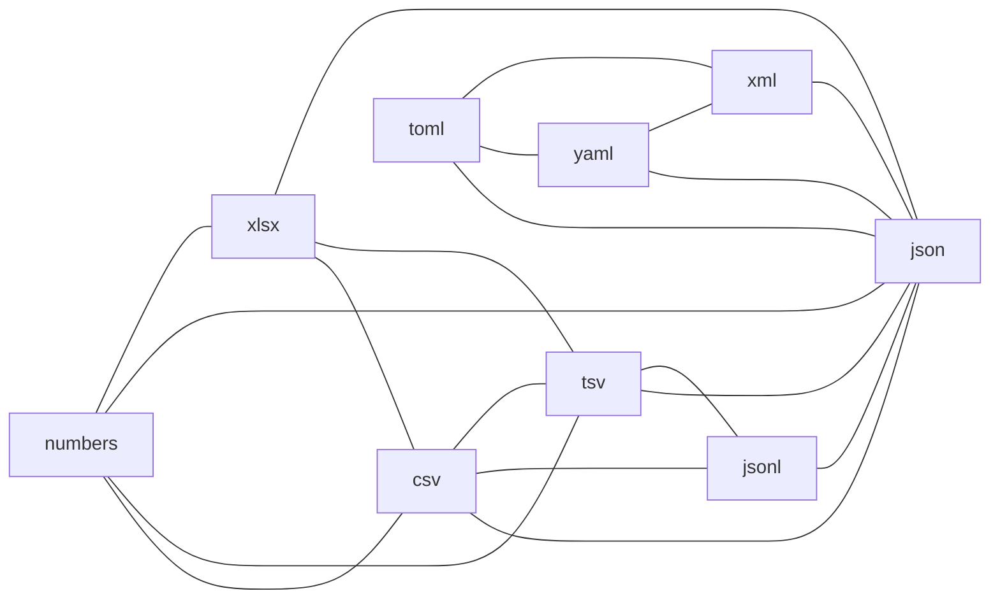
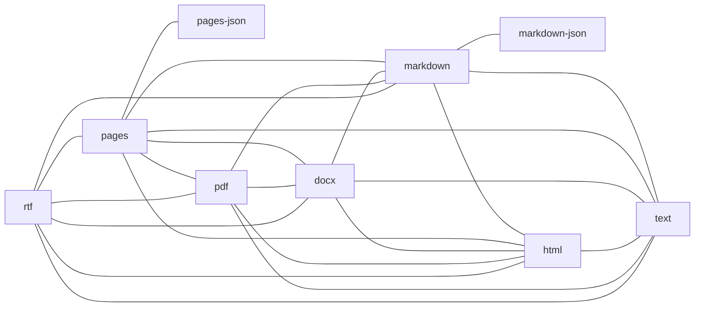
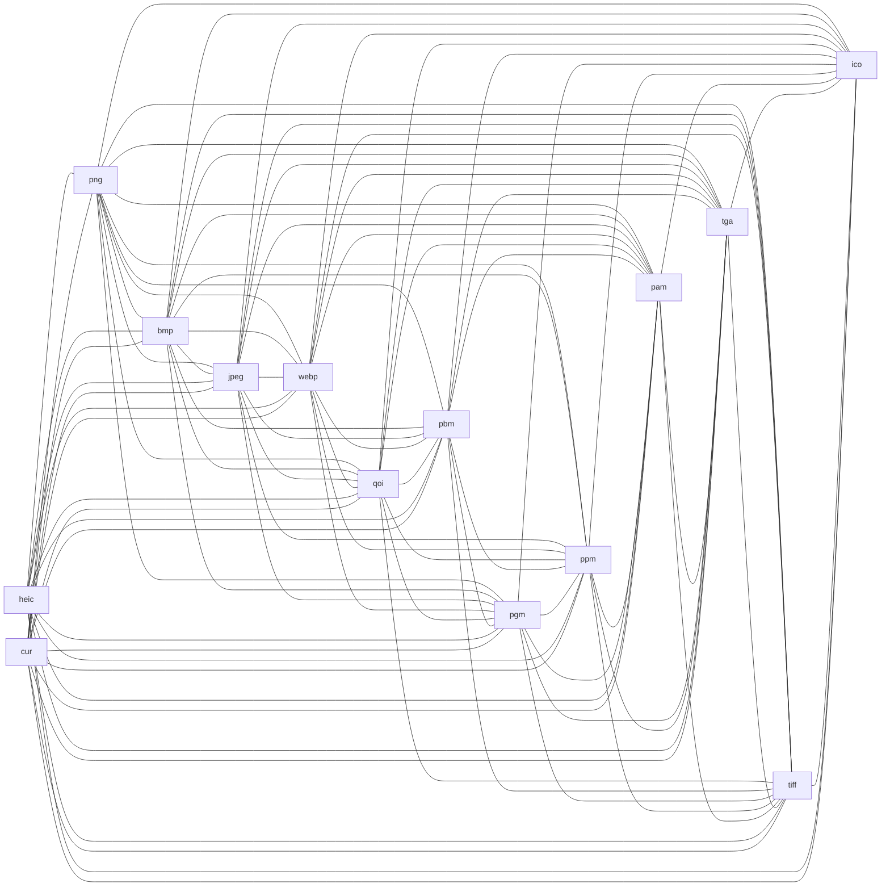
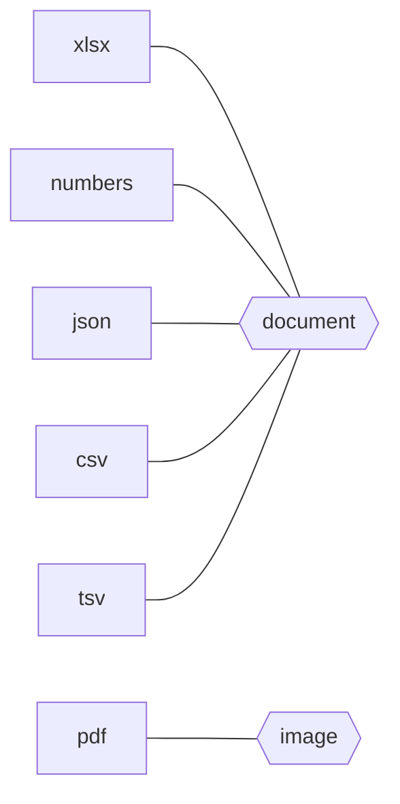

# Formats

Generated by `sublime paths --markdown`. Do not edit by hand. CI fails if this file is stale.

Every converter and every conversion path, with what each loses, are in [CONVERSIONS.md](CONVERSIONS.md).

## Map

One graph per category and one for the crossings between them. A line joins two formats with a direct converter between them, in either direction. The grid under each graph gives every pair (rows from, columns to):  lossless,  conditional,  lossy, with the number of steps (1 is a direct converter), blank for no path. [CONVERSIONS.md](CONVERSIONS.md) has each path and what it loses.

### data

```mermaid
graph LR
  csv --- json
  toml --- json
  yaml --- json
  xml --- json
  toml --- yaml
  toml --- xml
  yaml --- xml
  tsv --- json
  csv --- jsonl
  tsv --- jsonl
  csv --- tsv
  jsonl --- json
  xlsx --- csv
  xlsx --- tsv
  xlsx --- json
  numbers --- csv
  numbers --- tsv
  numbers --- json
  numbers --- xlsx
```

| from \ to | csv | json | jsonl | numbers | toml | tsv | xlsx | xml | yaml |
|---|:-:|:-:|:-:|:-:|:-:|:-:|:-:|:-:|:-:|
| **csv** | · |  1 |  1 |  1 |  2 |  1 |  1 |  2 |  2 |
| **json** |  1 | · |  1 |  1 |  1 |  1 |  1 |  1 |  1 |
| **jsonl** |  1 |  1 | · |  2 |  2 |  1 |  2 |  2 |  2 |
| **numbers** |  1 |  1 |  2 | · |  2 |  1 |  1 |  2 |  2 |
| **toml** |  2 |  1 |  2 |  2 | · |  2 |  2 |  1 |  1 |
| **tsv** |  1 |  1 |  1 |  1 |  2 | · |  1 |  2 |  2 |
| **xlsx** |  1 |  1 |  2 |  1 |  2 |  1 | · |  2 |  2 |
| **xml** |  2 |  1 |  2 |  2 |  1 |  2 |  2 | · |  1 |
| **yaml** |  2 |  1 |  2 |  2 |  1 |  2 |  2 |  1 | · |

### document

```mermaid
graph LR
  markdown_json["markdown-json"]
  pages_json["pages-json"]
  markdown --- html
  markdown --- text
  markdown --- markdown_json
  pages --- pages_json
  pages --- docx
  pages --- markdown
  pages --- html
  pages --- text
  docx --- markdown
  docx --- html
  docx --- text
  html --- text
  pdf --- text
  pdf --- markdown
  pdf --- html
  pdf --- docx
  pages --- pdf
  rtf --- pdf
  rtf --- docx
  rtf --- pages
  rtf --- markdown
  rtf --- html
  rtf --- text
```

| from \ to | docx | html | markdown | markdown-json | pages | pages-json | pdf | rtf | text |
|---|:-:|:-:|:-:|:-:|:-:|:-:|:-:|:-:|:-:|
| **docx** | · |  1 |  1 |  2 |  1 |  2 |  1 |  1 |  1 |
| **html** |  1 | · |  1 |  2 |  1 |  2 |  1 |  1 |  1 |
| **markdown** |  1 |  1 | · |  1 |  1 |  2 |  1 |  1 |  1 |
| **markdown-json** |  2 |  2 |  1 | · |  2 |  3 |  2 |  2 |  2 |
| **pages** |  1 |  1 |  1 |  2 | · |  1 |  1 |  1 |  1 |
| **pages-json** |  2 |  2 |  2 |  3 |  1 | · |  2 |  2 |  2 |
| **pdf** |  1 |  1 |  1 |  2 |  2 |  3 | · |  2 |  1 |
| **rtf** |  1 |  1 |  1 |  2 |  1 |  2 |  1 | · |  1 |
| **text** |  1 |  1 |  1 |  2 |  1 |  2 |  1 |  1 | · |

### image

```mermaid
graph LR
  png --- bmp
  png --- jpeg
  png --- webp
  png --- qoi
  png --- pbm
  png --- pgm
  png --- ppm
  png --- pam
  png --- tga
  png --- tiff
  png --- ico
  bmp --- jpeg
  bmp --- webp
  bmp --- qoi
  bmp --- pbm
  bmp --- pgm
  bmp --- ppm
  bmp --- pam
  bmp --- tga
  bmp --- tiff
  bmp --- ico
  jpeg --- webp
  jpeg --- qoi
  jpeg --- pbm
  jpeg --- pgm
  jpeg --- ppm
  jpeg --- pam
  jpeg --- tga
  jpeg --- tiff
  jpeg --- ico
  webp --- qoi
  webp --- pbm
  webp --- pgm
  webp --- ppm
  webp --- pam
  webp --- tga
  webp --- tiff
  webp --- ico
  qoi --- pbm
  qoi --- pgm
  qoi --- ppm
  qoi --- pam
  qoi --- tga
  qoi --- tiff
  qoi --- ico
  pbm --- pgm
  pbm --- ppm
  pbm --- pam
  pbm --- tga
  pbm --- tiff
  pbm --- ico
  pgm --- ppm
  pgm --- pam
  pgm --- tga
  pgm --- tiff
  pgm --- ico
  ppm --- pam
  ppm --- tga
  ppm --- tiff
  ppm --- ico
  pam --- tga
  pam --- tiff
  pam --- ico
  tga --- tiff
  tga --- ico
  tiff --- ico
  heic --- png
  heic --- bmp
  heic --- jpeg
  heic --- webp
  heic --- qoi
  heic --- pbm
  heic --- pgm
  heic --- ppm
  heic --- pam
  heic --- tga
  heic --- tiff
  heic --- ico
  cur --- png
  cur --- bmp
  cur --- jpeg
  cur --- webp
  cur --- qoi
  cur --- pbm
  cur --- pgm
  cur --- ppm
  cur --- pam
  cur --- tga
  cur --- tiff
  cur --- ico
```

| from \ to | bmp | cur | heic | ico | jpeg | pam | pbm | pgm | png | ppm | qoi | tga | tiff | webp |
|---|:-:|:-:|:-:|:-:|:-:|:-:|:-:|:-:|:-:|:-:|:-:|:-:|:-:|:-:|
| **bmp** | · |  |  |  1 |  1 |  1 |  1 |  1 |  1 |  1 |  1 |  1 |  1 |  1 |
| **cur** |  1 | · |  |  1 |  1 |  1 |  1 |  1 |  1 |  1 |  1 |  1 |  1 |  1 |
| **heic** |  1 |  | · |  1 |  1 |  1 |  1 |  1 |  1 |  1 |  1 |  1 |  1 |  1 |
| **ico** |  1 |  |  | · |  1 |  1 |  1 |  1 |  1 |  1 |  1 |  1 |  1 |  1 |
| **jpeg** |  1 |  |  |  1 | · |  1 |  1 |  1 |  1 |  1 |  1 |  1 |  1 |  1 |
| **pam** |  1 |  |  |  1 |  1 | · |  1 |  1 |  1 |  1 |  1 |  1 |  1 |  1 |
| **pbm** |  1 |  |  |  1 |  1 |  1 | · |  1 |  1 |  1 |  1 |  1 |  1 |  1 |
| **pgm** |  1 |  |  |  1 |  1 |  1 |  1 | · |  1 |  1 |  1 |  1 |  1 |  1 |
| **png** |  1 |  |  |  1 |  1 |  1 |  1 |  1 | · |  1 |  1 |  1 |  1 |  1 |
| **ppm** |  1 |  |  |  1 |  1 |  1 |  1 |  1 |  1 | · |  1 |  1 |  1 |  1 |
| **qoi** |  1 |  |  |  1 |  1 |  1 |  1 |  1 |  1 |  1 | · |  1 |  1 |  1 |
| **tga** |  1 |  |  |  1 |  1 |  1 |  1 |  1 |  1 |  1 |  1 | · |  1 |  1 |
| **tiff** |  1 |  |  |  1 |  1 |  1 |  1 |  1 |  1 |  1 |  1 |  1 | · |  1 |
| **webp** |  1 |  |  |  1 |  1 |  1 |  1 |  1 |  1 |  1 |  1 |  1 |  1 | · |

### Between categories

A format's converter into another category opens every path that category already has, so the other side is drawn as the category itself.

```mermaid
graph LR
  xlsx --- document{{document}}
  numbers --- document{{document}}
  json --- document{{document}}
  csv --- document{{document}}
  tsv --- document{{document}}
  pdf --- image{{image}}
```

## Formats

### data formats

| Id | Name | Extensions | Produced by | Consumed by |
|---|---|---|---|---|
| csv | Comma-Separated Values | csv | json-to-csv, jsonl-to-csv, tsv-to-csv, xlsx-to-csv, numbers-to-csv, markdown-to-csv | csv-to-json, csv-to-jsonl, csv-to-tsv, csv-to-numbers, csv-to-xlsx, csv-to-markdown |
| json | JSON | json | csv-to-json, toml-to-json, yaml-to-json, xml-to-json, tsv-to-json, jsonl-to-json, xlsx-to-json, numbers-to-json, markdown-tables-to-json | json-to-csv, json-to-toml, json-to-yaml, json-to-xml, json-to-tsv, json-to-jsonl, json-to-numbers, json-to-xlsx, json-to-markdown |
| jsonl | JSON Lines | jsonl, ndjson | csv-to-jsonl, tsv-to-jsonl, json-to-jsonl | jsonl-to-csv, jsonl-to-tsv, jsonl-to-json |
| numbers | Apple Numbers | numbers | csv-to-numbers, tsv-to-numbers, xlsx-to-numbers, json-to-numbers, markdown-to-numbers | numbers-to-csv, numbers-to-tsv, numbers-to-json, numbers-to-markdown, numbers-to-xlsx |
| toml | TOML | toml | json-to-toml, yaml-to-toml, xml-to-toml | toml-to-json, toml-to-yaml, toml-to-xml |
| tsv | Tab-Separated Values | tsv, tab | json-to-tsv, jsonl-to-tsv, csv-to-tsv, xlsx-to-tsv, numbers-to-tsv, markdown-to-tsv | tsv-to-json, tsv-to-jsonl, tsv-to-csv, tsv-to-numbers, tsv-to-xlsx, tsv-to-markdown |
| xlsx | Excel Workbook | xlsx | numbers-to-xlsx, markdown-to-xlsx, json-to-xlsx, csv-to-xlsx, tsv-to-xlsx | xlsx-to-csv, xlsx-to-tsv, xlsx-to-json, xlsx-to-markdown, xlsx-to-numbers |
| xml | XML | xml | json-to-xml, toml-to-xml, yaml-to-xml | xml-to-json, xml-to-toml, xml-to-yaml |
| yaml | YAML | yaml, yml | json-to-yaml, toml-to-yaml, xml-to-yaml | yaml-to-json, yaml-to-toml, yaml-to-xml |

### document formats

| Id | Name | Extensions | Produced by | Consumed by |
|---|---|---|---|---|
| docx | Word document | docx | pages-to-docx, markdown-to-docx, html-to-docx, text-to-docx, pdf-to-docx, rtf-to-docx | docx-to-markdown, docx-to-html, docx-to-text, docx-to-pages, docx-to-pdf, docx-to-rtf |
| html | HTML | html, htm | markdown-to-html, pages-to-html, docx-to-html, text-to-html, pdf-to-html, rtf-to-html | html-to-pages, html-to-markdown, html-to-text, html-to-docx, html-to-pdf, html-to-rtf |
| markdown | Markdown | md, markdown | markdown-json-to-markdown, pages-to-markdown, docx-to-markdown, html-to-markdown, text-to-markdown, pdf-to-markdown, rtf-to-markdown, xlsx-to-markdown, numbers-to-markdown, json-to-markdown, csv-to-markdown, tsv-to-markdown | markdown-to-html, markdown-to-text, markdown-to-json, markdown-to-docx, markdown-to-pages, markdown-to-pdf, markdown-to-rtf, markdown-to-numbers, markdown-to-xlsx, markdown-tables-to-json, markdown-to-csv, markdown-to-tsv |
| markdown-json | Markdown events as JSON |  | markdown-to-json | markdown-json-to-markdown |
| pages | Apple Pages | pages | json-to-pages, markdown-to-pages, text-to-pages, html-to-pages, docx-to-pages, rtf-to-pages | pages-to-json, pages-to-docx, pages-to-markdown, pages-to-html, pages-to-text, pages-to-pdf, pages-to-rtf |
| pages-json | Apple Pages package as JSON |  | pages-to-json | json-to-pages |
| pdf | PDF document | pdf | markdown-to-pdf, html-to-pdf, text-to-pdf, docx-to-pdf, pages-to-pdf, rtf-to-pdf, png-to-pdf, bmp-to-pdf, jpeg-to-pdf, webp-to-pdf, qoi-to-pdf, pbm-to-pdf, pgm-to-pdf, ppm-to-pdf, pam-to-pdf, tga-to-pdf, tiff-to-pdf, ico-to-pdf, heic-to-pdf, cur-to-pdf | pdf-to-text, pdf-to-markdown, pdf-to-html, pdf-to-docx, pdf-to-png, pdf-to-bmp, pdf-to-jpeg, pdf-to-webp, pdf-to-qoi, pdf-to-pbm, pdf-to-pgm, pdf-to-ppm, pdf-to-pam, pdf-to-tga, pdf-to-tiff, pdf-to-ico |
| rtf | Rich Text Format | rtf | docx-to-rtf, pages-to-rtf, markdown-to-rtf, html-to-rtf, text-to-rtf | rtf-to-pdf, rtf-to-docx, rtf-to-pages, rtf-to-markdown, rtf-to-html, rtf-to-text |
| text | Plain text | txt | markdown-to-text, pages-to-text, docx-to-text, html-to-text, pdf-to-text, rtf-to-text | text-to-pages, text-to-markdown, text-to-html, text-to-docx, text-to-pdf, text-to-rtf |

### image formats

| Id | Name | Extensions | Produced by | Consumed by |
|---|---|---|---|---|
| bmp | Windows bitmap | bmp, dib | png-to-bmp, jpeg-to-bmp, webp-to-bmp, qoi-to-bmp, pbm-to-bmp, pgm-to-bmp, ppm-to-bmp, pam-to-bmp, tga-to-bmp, tiff-to-bmp, ico-to-bmp, pdf-to-bmp, heic-to-bmp, cur-to-bmp | bmp-to-png, bmp-to-jpeg, bmp-to-webp, bmp-to-qoi, bmp-to-pbm, bmp-to-pgm, bmp-to-ppm, bmp-to-pam, bmp-to-tga, bmp-to-tiff, bmp-to-ico, bmp-to-pdf |
| cur | Windows cursor | cur | - | cur-to-png, cur-to-bmp, cur-to-jpeg, cur-to-webp, cur-to-qoi, cur-to-pbm, cur-to-pgm, cur-to-ppm, cur-to-pam, cur-to-tga, cur-to-tiff, cur-to-ico, cur-to-pdf |
| heic | HEIC image | heic, heif, hif | - | heic-to-png, heic-to-bmp, heic-to-jpeg, heic-to-webp, heic-to-qoi, heic-to-pbm, heic-to-pgm, heic-to-ppm, heic-to-pam, heic-to-tga, heic-to-tiff, heic-to-ico, heic-to-pdf |
| ico | Windows icon | ico | png-to-ico, bmp-to-ico, jpeg-to-ico, webp-to-ico, qoi-to-ico, pbm-to-ico, pgm-to-ico, ppm-to-ico, pam-to-ico, tga-to-ico, tiff-to-ico, pdf-to-ico, heic-to-ico, cur-to-ico | ico-to-png, ico-to-bmp, ico-to-jpeg, ico-to-webp, ico-to-qoi, ico-to-pbm, ico-to-pgm, ico-to-ppm, ico-to-pam, ico-to-tga, ico-to-tiff, ico-to-pdf |
| jpeg | JPEG image | jpg, jpeg, jpe | png-to-jpeg, bmp-to-jpeg, webp-to-jpeg, qoi-to-jpeg, pbm-to-jpeg, pgm-to-jpeg, ppm-to-jpeg, pam-to-jpeg, tga-to-jpeg, tiff-to-jpeg, ico-to-jpeg, pdf-to-jpeg, heic-to-jpeg, cur-to-jpeg | jpeg-to-png, jpeg-to-bmp, jpeg-to-webp, jpeg-to-qoi, jpeg-to-pbm, jpeg-to-pgm, jpeg-to-ppm, jpeg-to-pam, jpeg-to-tga, jpeg-to-tiff, jpeg-to-ico, jpeg-to-pdf |
| pam | Netpbm arbitrary map (PAM) | pam | png-to-pam, bmp-to-pam, jpeg-to-pam, webp-to-pam, qoi-to-pam, pbm-to-pam, pgm-to-pam, ppm-to-pam, tga-to-pam, tiff-to-pam, ico-to-pam, pdf-to-pam, heic-to-pam, cur-to-pam | pam-to-png, pam-to-bmp, pam-to-jpeg, pam-to-webp, pam-to-qoi, pam-to-pbm, pam-to-pgm, pam-to-ppm, pam-to-tga, pam-to-tiff, pam-to-ico, pam-to-pdf |
| pbm | Netpbm bitmap (PBM) | pbm | png-to-pbm, bmp-to-pbm, jpeg-to-pbm, webp-to-pbm, qoi-to-pbm, pgm-to-pbm, ppm-to-pbm, pam-to-pbm, tga-to-pbm, tiff-to-pbm, ico-to-pbm, pdf-to-pbm, heic-to-pbm, cur-to-pbm | pbm-to-png, pbm-to-bmp, pbm-to-jpeg, pbm-to-webp, pbm-to-qoi, pbm-to-pgm, pbm-to-ppm, pbm-to-pam, pbm-to-tga, pbm-to-tiff, pbm-to-ico, pbm-to-pdf |
| pgm | Netpbm graymap (PGM) | pgm | png-to-pgm, bmp-to-pgm, jpeg-to-pgm, webp-to-pgm, qoi-to-pgm, pbm-to-pgm, ppm-to-pgm, pam-to-pgm, tga-to-pgm, tiff-to-pgm, ico-to-pgm, pdf-to-pgm, heic-to-pgm, cur-to-pgm | pgm-to-png, pgm-to-bmp, pgm-to-jpeg, pgm-to-webp, pgm-to-qoi, pgm-to-pbm, pgm-to-ppm, pgm-to-pam, pgm-to-tga, pgm-to-tiff, pgm-to-ico, pgm-to-pdf |
| png | PNG image | png | bmp-to-png, jpeg-to-png, webp-to-png, qoi-to-png, pbm-to-png, pgm-to-png, ppm-to-png, pam-to-png, tga-to-png, tiff-to-png, ico-to-png, pdf-to-png, heic-to-png, cur-to-png | png-to-bmp, png-to-jpeg, png-to-webp, png-to-qoi, png-to-pbm, png-to-pgm, png-to-ppm, png-to-pam, png-to-tga, png-to-tiff, png-to-ico, png-to-pdf |
| ppm | Netpbm pixmap (PPM) | ppm, pnm | png-to-ppm, bmp-to-ppm, jpeg-to-ppm, webp-to-ppm, qoi-to-ppm, pbm-to-ppm, pgm-to-ppm, pam-to-ppm, tga-to-ppm, tiff-to-ppm, ico-to-ppm, pdf-to-ppm, heic-to-ppm, cur-to-ppm | ppm-to-png, ppm-to-bmp, ppm-to-jpeg, ppm-to-webp, ppm-to-qoi, ppm-to-pbm, ppm-to-pgm, ppm-to-pam, ppm-to-tga, ppm-to-tiff, ppm-to-ico, ppm-to-pdf |
| qoi | QOI image | qoi | png-to-qoi, bmp-to-qoi, jpeg-to-qoi, webp-to-qoi, pbm-to-qoi, pgm-to-qoi, ppm-to-qoi, pam-to-qoi, tga-to-qoi, tiff-to-qoi, ico-to-qoi, pdf-to-qoi, heic-to-qoi, cur-to-qoi | qoi-to-png, qoi-to-bmp, qoi-to-jpeg, qoi-to-webp, qoi-to-pbm, qoi-to-pgm, qoi-to-ppm, qoi-to-pam, qoi-to-tga, qoi-to-tiff, qoi-to-ico, qoi-to-pdf |
| tga | Truevision TGA image | tga, icb, vda, vst | png-to-tga, bmp-to-tga, jpeg-to-tga, webp-to-tga, qoi-to-tga, pbm-to-tga, pgm-to-tga, ppm-to-tga, pam-to-tga, tiff-to-tga, ico-to-tga, pdf-to-tga, heic-to-tga, cur-to-tga | tga-to-png, tga-to-bmp, tga-to-jpeg, tga-to-webp, tga-to-qoi, tga-to-pbm, tga-to-pgm, tga-to-ppm, tga-to-pam, tga-to-tiff, tga-to-ico, tga-to-pdf |
| tiff | TIFF image | tif, tiff | png-to-tiff, bmp-to-tiff, jpeg-to-tiff, webp-to-tiff, qoi-to-tiff, pbm-to-tiff, pgm-to-tiff, ppm-to-tiff, pam-to-tiff, tga-to-tiff, ico-to-tiff, pdf-to-tiff, heic-to-tiff, cur-to-tiff | tiff-to-png, tiff-to-bmp, tiff-to-jpeg, tiff-to-webp, tiff-to-qoi, tiff-to-pbm, tiff-to-pgm, tiff-to-ppm, tiff-to-pam, tiff-to-tga, tiff-to-ico, tiff-to-pdf |
| webp | WebP image | webp | png-to-webp, bmp-to-webp, jpeg-to-webp, qoi-to-webp, pbm-to-webp, pgm-to-webp, ppm-to-webp, pam-to-webp, tga-to-webp, tiff-to-webp, ico-to-webp, pdf-to-webp, heic-to-webp, cur-to-webp | webp-to-png, webp-to-bmp, webp-to-jpeg, webp-to-qoi, webp-to-pbm, webp-to-pgm, webp-to-ppm, webp-to-pam, webp-to-tga, webp-to-tiff, webp-to-ico, webp-to-pdf |
